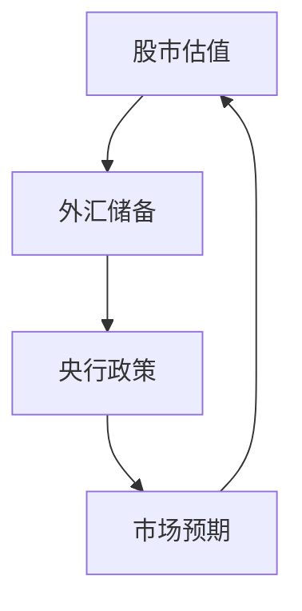
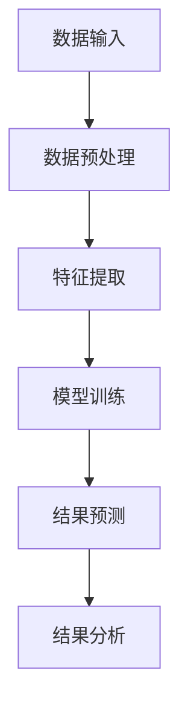
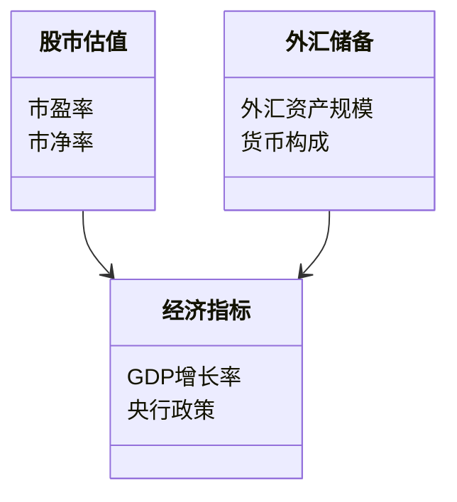
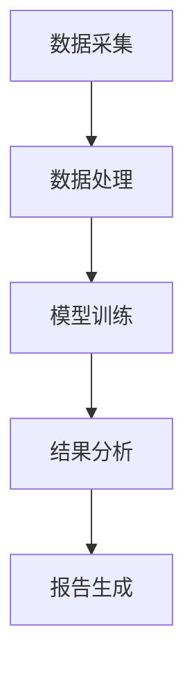
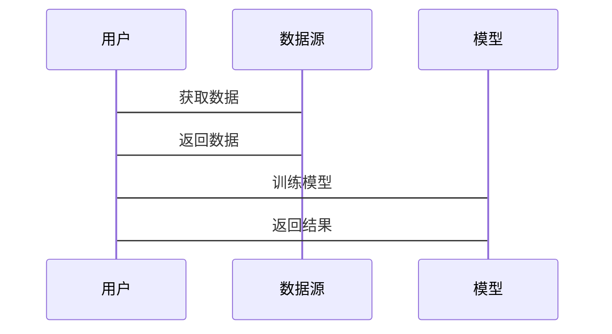

                 


# 新兴市场股市估值与外汇储备的关联

## 关键词：新兴市场，股市估值，外汇储备，经济波动，机器学习模型

## 摘要：本文探讨新兴市场股市估值与外汇储备之间的动态关系，分析影响股市估值与外汇储备的主要因素，构建回归模型和机器学习模型，实证分析两者之间的关联性，并深入探讨其互动机制和传导路径。

---

## 第1章: 背景介绍

### 1.1 问题背景

#### 1.1.1 新兴市场的定义与特点
新兴市场通常指那些经济增长迅速、金融市场逐步完善的国家，如中国、印度、巴西等。这些市场具有较高的波动性和不确定性，但也蕴含着较大的投资机会。

#### 1.1.2 股市估值与外汇储备的基本概念
- 股市估值：通过市盈率、市净率等指标衡量股市的整体价值。
- 外汇储备：一国持有的外汇资产，用于维持汇率稳定和应对国际支付需求。

#### 1.1.3 问题的提出与研究意义
研究新兴市场股市估值与外汇储备的关联性，有助于理解两者如何相互影响，为投资者和政策制定者提供参考。

### 1.2 核心概念

#### 1.2.1 股市估值的定义与计算方法
- 定义：衡量股市整体价值的指标，如市盈率（P/E）和市净率（P/B）。
- 计算方法：以指数点位为基础，结合成交量和资金流向等因素。

#### 1.2.2 外汇储备的定义与作用
- 定义：一国持有的外汇资产，包括美元、欧元等。
- 作用：维护汇率稳定，应对国际支付需求。

#### 1.2.3 两者之间的关系
新兴市场股市波动可能会影响外汇储备的价值，反之，外汇储备的变化也会影响股市的稳定性。

### 1.3 问题描述

#### 1.3.1 新兴市场股市估值与外汇储备的动态关系
股市估值的波动可能引发外汇储备的变化，反之亦然。

#### 1.3.2 影响股市估值与外汇储备的主要因素
- 经济增长、政策变化、国际环境等。

#### 1.3.3 研究的边界与外延
研究范围限定在新兴市场，不考虑发达市场。

---

## 第2章: 核心概念与联系

### 2.1 核心概念原理

#### 2.1.1 股市估值的核心要素
- 市盈率、市净率、股息率等。

#### 2.1.2 外汇储备的核心要素
- 外汇资产规模、货币构成、储备管理策略。

#### 2.1.3 互动机制
股市波动可能导致资本流动变化，进而影响外汇储备。

### 2.2 核心概念属性特征对比

| 属性       | 股市估值             | 外汇储备             |
|------------|---------------------|----------------------|
| 测量指标    | 市盈率、市净率       | 外汇资产规模         |
| 变化因素    | 经济增长、政策变化   | 外汇市场波动、央行政策 |
| 影响对象    | 投资者信心、资金流动 | 汇率稳定性、国际支付能力 |

### 2.3 ER实体关系图



---

## 第3章: 算法原理讲解

### 3.1 算法原理

#### 3.1.1 时间序列分析
- 方法：ARIMA模型。
- 用途：预测股市和外汇储备的未来走势。

#### 3.1.2 回归分析
- 方法：多元线性回归。
- 用途：分析变量之间的因果关系。

#### 3.1.3 机器学习模型
- 方法：随机森林、神经网络。
- 用途：非线性关系建模。

### 3.2 算法流程图



### 3.3 数学模型与公式

#### 3.3.1 多元线性回归模型
$$ Y = \beta_0 + \beta_1X_1 + \beta_2X_2 + \cdots + \beta_nX_n + \epsilon $$
- $Y$：股市估值
- $X_i$：自变量（如GDP增长率）
- $\beta_i$：回归系数
- $\epsilon$：误差项

---

## 第4章: 系统分析与架构设计方案

### 4.1 问题场景介绍

#### 4.1.1 问题描述
分析新兴市场股市估值与外汇储备的动态关系。

### 4.2 系统功能设计

#### 4.2.1 领域模型



#### 4.2.2 系统架构设计



#### 4.2.3 系统接口设计
- 数据接口：API接口获取股市和外汇数据。
- 模型接口：API调用机器学习模型。

#### 4.2.4 系统交互流程



---

## 第5章: 项目实战

### 5.1 环境安装

#### 5.1.1 安装Python
```bash
python --version
pip install --upgrade pip
```

#### 5.1.2 安装相关库
```bash
pip install pandas numpy scikit-learn
```

### 5.2 系统核心实现

#### 5.2.1 数据预处理
```python
import pandas as pd
data = pd.read_csv('data.csv')
data.dropna(inplace=True)
```

#### 5.2.2 特征工程
```python
from sklearn.preprocessing import StandardScaler
scaler = StandardScaler()
X_scaled = scaler.fit_transform(X)
```

#### 5.2.3 模型训练
```python
from sklearn.ensemble import RandomForestRegressor
model = RandomForestRegressor()
model.fit(X_scaled, y)
```

#### 5.2.4 模型预测
```python
y_pred = model.predict(X_test_scaled)
```

### 5.3 实际案例分析
- 数据来源：新兴市场股市指数和外汇储备数据。
- 模型应用：预测股市估值与外汇储备的关系。

### 5.4 代码实现与解读
- 提供完整的代码实现，解读每一步的功能。

---

## 第6章: 小结

### 6.1 最佳实践 Tips

#### 6.1.1 数据处理注意事项
- 数据清洗、特征选择的重要性。

#### 6.1.2 模型选择建议
- 根据数据特点选择合适模型。

### 6.2 注意事项

#### 6.2.1 数据质量
- 数据的准确性和完整性。

#### 6.2.2 模型局限性
- 机器学习模型的解释性问题。

### 6.3 拓展阅读

#### 6.3.1 相关文献
- 推荐阅读相关领域的学术论文。

---

## 作者：AI天才研究院/AI Genius Institute & 禅与计算机程序设计艺术 /Zen And The Art of Computer Programming

