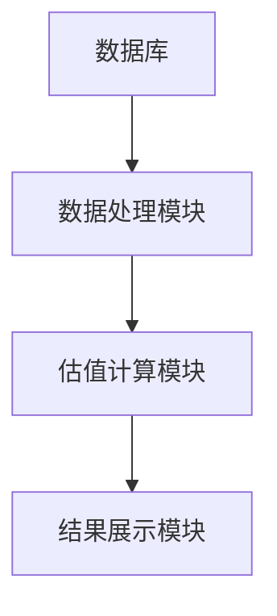

                 


# 目录大纲：《新兴市场股市估值与数字化转型的互动》

---

## 第一部分：引言

### 第1章：引言

#### 1.1 研究背景与意义  
##### 1.1.1 新兴市场股市的崛起  
##### 1.1.2 数字化转型的全球趋势  
##### 1.1.3 两者互动的研究价值  

#### 1.2 研究目标与方法  
##### 1.2.1 研究目标  
##### 1.2.2 研究方法与框架  

#### 1.3 本书结构与内容概述  
##### 1.3.1 各章节内容简要说明  
##### 1.3.2 读者对象与适用场景  

---

## 第二部分：股市估值理论与方法

### 第2章：股市估值的理论基础

#### 2.1 股市估值的核心概念  
##### 2.1.1 股票价值的定义与分类  
##### 2.1.2 股市估值的基本原理  
##### 2.1.3 估值与市场波动的关系  

#### 2.2 主流估值方法解析  
##### 2.2.1 市盈率（P/E）法  
##### 2.2.2 市净率（P/B）法  
##### 2.2.3 现金流折现法（DCF）  

#### 2.3 新兴市场的特殊性  
##### 2.3.1 新兴市场股市的独特特征  
##### 2.3.2 估值方法的适用性调整  

---

## 第三部分：数字化转型对股市的影响

### 第3章：数字化转型的内涵与技术应用

#### 3.1 数字化转型的核心概念  
##### 3.1.1 数字化转型的定义  
##### 3.1.2 数字化转型的关键特征  
##### 3.1.3 数字化转型与传统产业的融合  

#### 3.2 数字化技术在金融领域的应用  
##### 3.2.1 大数据技术在股市分析中的应用  
##### 3.2.2 人工智能在股票预测中的应用  
##### 3.2.3 区块链技术在金融交易中的应用  

---

## 第四部分：数字化转型对股市估值的互动影响

### 第4章：数字化转型对股市估值的直接影响

#### 4.1 数字化技术对估值数据的影响  
##### 4.1.1 数据量的增加与数据质量的提升  
##### 4.1.2 数据实时性对估值的影响  

#### 4.2 数字化工具对估值方法的改变  
##### 4.2.1 AI驱动的自动化估值模型  
##### 4.2.2 大数据支持的多维度估值分析  

#### 4.3 数字化转型对市场参与者的改变  
##### 4.3.1 投资者行为的变化  
##### 4.3.2 金融机构的角色转变  

---

## 第五部分：互动机制与实证分析

### 第5章：数字化转型与股市估值的互动机制

#### 5.1 互动机制的理论框架  
##### 5.1.1 技术驱动的互动路径  
##### 5.1.2 市场反馈的技术放大效应  

#### 5.2 互动机制的数学模型  
##### 5.2.1 时间序列分析模型  
##### 5.2.2 机器学习预测模型  

#### 5.3 实证分析与案例研究  
##### 5.3.1 新兴市场的实证分析  
##### 5.3.2 数字化转型对估值的具体影响  

---

## 第六部分：系统设计与项目实战

### 第6章：系统设计与实现

#### 6.1 问题场景介绍  
##### 6.1.1 问题背景  
##### 6.1.2 项目目标  

#### 6.2 系统功能设计  
##### 6.2.1 领域模型设计（Mermaid类图）  
##### 6.2.2 系统架构设计（Mermaid架构图）  

#### 6.3 系统接口设计与实现  
##### 6.3.1 API接口设计  
##### 6.3.2 接口实现与测试  

#### 6.4 系统交互设计  
##### 6.4.1 交互流程（Mermaid序列图）  
##### 6.4.2 用户界面设计  

#### 6.5 项目实战与应用解读  
##### 6.5.1 环境安装与配置  
##### 6.5.2 核心代码实现与解读  
##### 6.5.3 案例分析与结果展示  

---

## 第七部分：总结与展望

### 第7章：总结与展望

#### 7.1 核心发现与主要结论  
##### 7.1.1 数字化转型对股市估值的核心影响  
##### 7.1.2 互动机制的关键启示  

#### 7.2 未来研究方向  
##### 7.2.1 新兴市场中的数字化转型趋势  
##### 7.2.2 更高级的算法与技术应用  

#### 7.3 最佳实践与注意事项  
##### 7.3.1 投资者与金融机构的策略建议  
##### 7.3.2 数字化转型中的风险管理  

---

## 附录：数学公式与算法代码

### 附录A：数学模型与公式

#### A.1 时间序列分析模型  
##### A.1.1 ARIMA模型公式  
##### $$ARIMA(p, d, q) = 0$$  

#### A.2 机器学习预测模型  
##### A.2.1 线性回归模型  
##### $$y = \beta_0 + \beta_1x + \epsilon$$  

### 附录B：代码实现

#### B.1 Python代码实现  
##### B.1.1 时间序列预测代码  
```python
from statsmodels.tsa.arima_model import ARIMA
import pandas as pd

# 加载数据
data = pd.read_csv('stock_data.csv')

# 建模
model = ARIMA(data['price'], order=(5, 1, 0))
model_fit = model.fit()

# 预测
forecast = model_fit.forecast(steps=5)
print(forecast)
```

#### B.2 系统架构图  
##### B.2.1 Mermaid架构图  


---

## 作者：AI天才研究院/AI Genius Institute & 禅与计算机程序设计艺术 /Zen And The Art of Computer Programming

