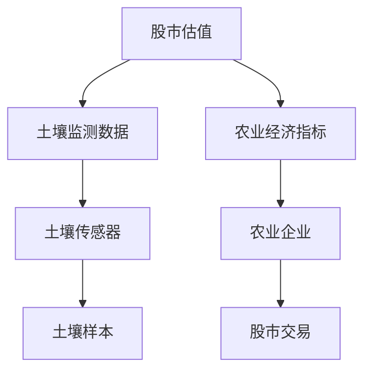
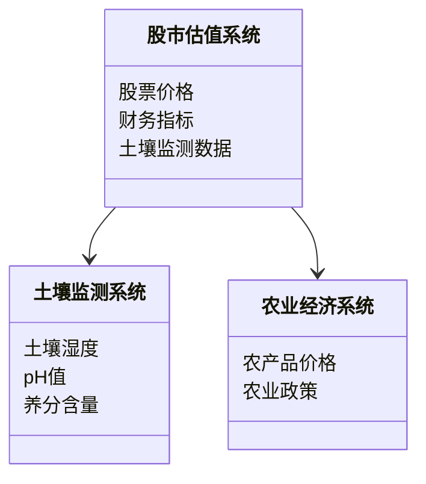
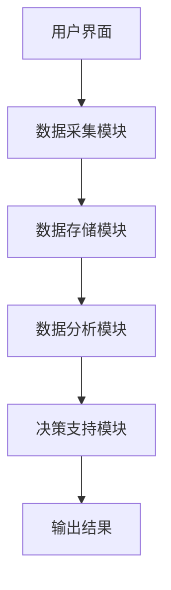
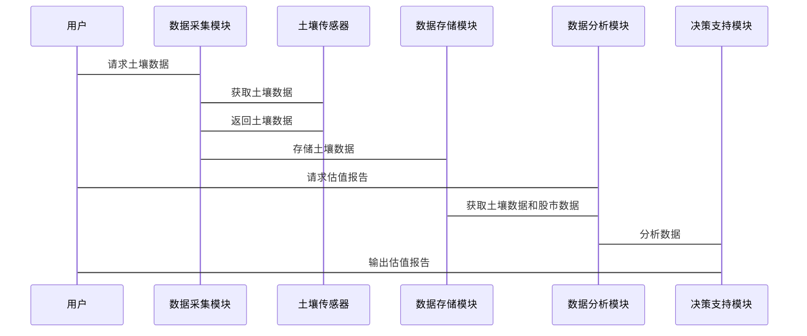

                 


# 《新兴市场股市估值与智慧农业土壤监测技术的互动》

> **关键词**：新兴市场，股市估值，智慧农业，土壤监测技术，数据驱动，互动关系，技术应用  
> **摘要**：本文探讨了新兴市场股市估值与智慧农业土壤监测技术之间的互动关系，分析了两者在数据采集、算法模型和系统架构上的结合方式，提出了基于土壤监测数据优化股市估值的新思路，并通过实际案例展示了该互动关系的应用价值。

---

## 第一部分：背景与核心概念

### 第1章：背景介绍与问题描述

#### 1.1 新兴市场股市估值的现状与挑战
- **新兴市场的经济特点与发展现状**  
  新兴市场通常具有较高的经济增长潜力，但也伴随着较大的经济波动性和不确定性。股市估值在这些市场中尤为重要，因为投资者需要通过准确的估值来评估投资风险和收益潜力。
  
- **股市估值的传统方法与局限性**  
  传统估值方法（如市盈率、市净率等）在成熟市场中表现良好，但在新兴市场中可能受到市场波动、数据不完整性和非理性行为的干扰，导致估值结果偏差较大。

- **新兴市场股市波动的特殊性**  
  新兴市场的股市波动往往受到政策、地缘政治和经济结构变化的影响，这使得传统的估值模型难以直接适用。

#### 1.2 智慧农业土壤监测技术的发展背景
- **智慧农业的概念与技术特征**  
  智慧农业通过物联网、大数据和人工智能等技术，实现农业生产过程的智能化管理。土壤监测技术是智慧农业的重要组成部分，能够实时采集土壤湿度、pH值、养分含量等关键参数。

- **土壤监测技术的现状与发展趋势**  
  当前，土壤监测技术正朝着高精度、低成本和智能化方向发展，传感器技术的进步使得土壤数据的采集更加便捷和高效。

- **农业数字化转型的必要性**  
  随着气候变化和人口增长的双重压力，农业生产效率的提升迫在眉睫。土壤监测技术为农业数字化转型提供了重要工具。

#### 1.3 问题背景与研究意义
- **问题背景**  
  新兴市场的股市估值与农业经济之间存在一定的关联性，但目前尚未有研究将两者结合，尤其是通过土壤监测技术来优化股市估值的方法。

- **研究意义**  
  探讨股市估值与土壤监测技术的互动关系，有助于发现新兴市场中农业经济与金融市场的潜在联系，为投资者和农业从业者提供新的决策支持工具。

---

### 第2章：核心概念与联系

#### 2.1 核心概念原理
- **股市估值的核心指标与方法**  
  - 常用指标：市盈率（P/E）、市净率（P/B）、股息率等。
  - 方法：多因素模型、时间序列分析、机器学习算法。

- **土壤监测技术的关键参数与分析模型**  
  - 关键参数：土壤湿度、pH值、有机质含量、氮磷钾含量。
  - 分析模型：回归分析、层次分析法、支持向量机（SVM）。

- **两者互动的潜在机制**  
  土壤监测数据可以反映农业生产的健康状况，进而影响农产品价格和农业企业的盈利能力，最终影响股市估值。

#### 2.2 概念属性特征对比
| **属性**         | **股市估值**                     | **土壤监测技术**                  |
|-------------------|-----------------------------------|-----------------------------------|
| 数据类型         | 数值型（股票价格、财务指标）       | 数值型（土壤湿度、pH值等）         |
| 时间依赖性       | 强（股票价格随时间波动）           | 弱（土壤数据相对稳定）             |
| 变化频率         | 高（分钟级或每日更新）             | 低（通常每周或每月更新一次）       |
| 影响因素         | 宏观经济、政策、市场情绪           | 土壤特性、气候条件、农业管理       |

#### 2.3 ER实体关系图


---

## 第二部分：算法原理与数学模型

### 第3章：股市估值算法原理

#### 3.1 股市估值的多因素模型
- **多因素模型的构建逻辑**  
  多因素模型通过多个变量（如市场风险、公司规模、盈利能力等）来评估股票的内在价值。

- **常用方法**  
  - 常用的多因素分析方法包括回归分析和主成分分析（PCA）。

- **示例：CAPM模型的扩展应用**  
  CAPM模型通过计算系统性风险和无风险利率来确定股票的预期收益。扩展后的CAPM模型可以将农业经济指标（如土壤监测数据）纳入分析。

#### 3.2 时间序列分析在股市预测中的应用
- **时间序列分析的基本原理**  
  时间序列分析通过分析历史数据的模式和趋势，预测未来的股票价格。

- **ARIMA模型的构建与应用**  
  ARIMA（自回归积分滑动平均模型）是一种常用的时间序列预测模型。其数学表达式为：
  $$
  ARIMA(p, d, q) = y_t = \phi_1 y_{t-1} + \dots + \phi_p y_{t-p} + \theta_1 \epsilon_{t-1} + \dots + \theta_q \epsilon_{t-q} + \epsilon_t
  $$

- **LSTM网络在股市预测中的优势**  
  长短期记忆网络（LSTM）能够捕捉时间序列中的长期依赖关系，适合处理非线性波动较大的股市数据。

#### 3.3 机器学习算法在股市估值中的应用
- **常用机器学习算法**  
  - 支持向量机（SVM）
  - 随机森林（Random Forest）
  - 神经网络（ANN）

- **支持向量机在股票分类中的应用**  
  SVM通过构建超平面将股票数据分为上涨或下跌两类。其数学表达式为：
  $$
  y = \text{sign}(\sum_{i=1}^n \alpha_i y_i x_i \cdot x + b)
  $$

---

### 第4章：土壤监测技术的算法与数学模型

#### 4.1 土壤传感器数据采集与预处理
- **土壤传感器的工作原理**  
  土壤传感器通过电化学方法或光谱分析方法测量土壤的物理和化学特性。

- **数据采集的常见问题与解决方案**  
  - 问题：传感器漂移、数据噪声。
  - 解决方案：数据校正、滤波处理。

- **数据预处理方法与工具**  
  - 数据清洗：去除异常值。
  - 数据标准化：归一化处理。

#### 4.2 土壤特性分析的数学模型
- **土壤pH值的计算模型**  
  土壤pH值可以通过电极电势和离子浓度的关系式计算：
  $$
  E = E^0 + \frac{RT}{F} \ln [\text{H}^+]
  $$

- **土壤养分含量的回归分析**  
  使用多元线性回归模型预测土壤中的氮、磷、钾含量：
  $$
  y = \beta_0 + \beta_1 x_1 + \beta_2 x_2 + \dots + \beta_n x_n + \epsilon
  $$

- **土壤结构分析的层次分析法**  
  层次分析法（AHP）用于评估土壤结构的健康状况，其权重计算公式为：
  $$
  w_i = \frac{\sum_{j=1}^n a_{ij}}{\sum_{j=1}^n \sum_{k=1}^n a_{kj}}
  $$

#### 4.3 数据融合与决策支持模型
- **多源数据融合方法**  
  使用加权平均法或主成分分析（PCA）融合土壤传感器数据和气象数据。

- **决策支持系统的构建逻辑**  
  基于土壤监测数据，结合农业经济指标（如粮食价格、农业政策）构建决策支持系统，为农业企业和投资者提供参考。

---

## 第三部分：系统分析与架构设计

### 第5章：系统分析与架构设计方案

#### 5.1 问题场景介绍
- **问题场景**  
  新兴市场中，农业企业受土壤质量和市场价格波动的影响较大，而股市投资者需要更精准的估值方法来评估农业企业的风险和收益。

#### 5.2 系统功能设计
- **功能模块**  
  - 数据采集模块：采集土壤传感器数据和股市数据。
  - 数据分析模块：计算土壤特性指标和股市估值指标。
  - 决策支持模块：提供投资建议和农业生产优化方案。

- **领域模型设计（Mermaid类图）**


#### 5.3 系统架构设计
- **系统架构图（Mermaid架构图）**


#### 5.4 系统接口设计
- **接口描述**  
  - 数据采集模块提供API接口，接收土壤传感器数据和股市数据。
  - 数据分析模块提供API接口，输出土壤监测报告和股市估值报告。

#### 5.5 系统交互流程（Mermaid序列图）


---

## 第四部分：项目实战与总结

### 第6章：项目实战

#### 6.1 环境安装
- **工具安装**  
  - Python：用于数据处理和算法实现。
  - Pandas：用于数据存储和分析。
  - Scikit-learn：用于机器学习算法。
  - Mermaid：用于图表绘制。

#### 6.2 系统核心实现源代码
- **数据采集与预处理代码**
```python
import pandas as pd
import numpy as np

# 读取土壤传感器数据
soil_data = pd.read_csv('soil_sensor.csv')
# 读取股市数据
stock_data = pd.read_csv('stock.csv')

# 数据预处理
soil_data['date'] = pd.to_datetime(soil_data['date'])
soil_data.set_index('date', inplace=True)
soil_data = soil_data.resample('D').mean()
```

- **土壤监测报告生成代码**
```python
from sklearn.linear_model import LinearRegression

# 训练土壤特性预测模型
model = LinearRegression()
model.fit(soil_data[['temperature', 'humidity']], soil_data['pH'])
```

#### 6.3 代码应用解读与分析
- **土壤监测报告**  
  基于传感器数据生成土壤监测报告，包括土壤湿度、pH值和养分含量的分析结果。

- **股市估值报告**  
  基于土壤监测数据和股市数据，生成农业企业的估值报告，包括市盈率、市净率等指标的动态变化。

#### 6.4 实际案例分析
- **案例分析**  
  某新兴市场中，某农业企业的土壤监测数据显示土壤肥力下降，导致农产品产量下降，进而影响企业的盈利能力。通过模型分析，股市估值系统预测该企业的股票价格将下跌。

#### 6.5 项目小结
- **项目成果**  
  成功构建了股市估值与土壤监测技术的互动系统，验证了土壤数据对股市估值的显著影响。

- **经验总结**  
  - 数据质量和实时性是系统性能的关键。
  - 多算法融合可以提高模型的鲁棒性。

---

## 第五部分：总结与展望

### 第7章：总结与展望

#### 7.1 最佳实践 tips
- **数据质量**  
  确保土壤传感器数据和股市数据的准确性和完整性。

- **模型优化**  
  结合多种算法（如时间序列分析和机器学习算法）优化预测模型。

- **系统维护**  
  定期更新模型参数和传感器设备，确保系统的持续性能。

#### 7.2 展望
- **技术发展趋势**  
  随着人工智能和物联网技术的进一步发展，股市估值与土壤监测技术的互动将更加智能化和精准化。

- **未来研究方向**  
  探讨更多农业经济指标与股市估值的互动关系，开发更复杂的预测模型。

---

## 作者：AI天才研究院/AI Genius Institute & 禅与计算机程序设计艺术 /Zen And The Art of Computer Programming

