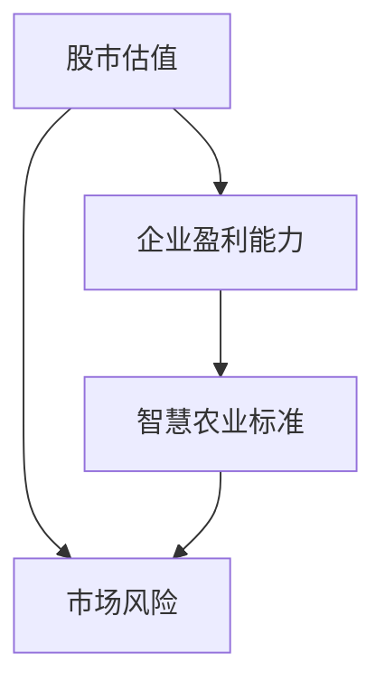
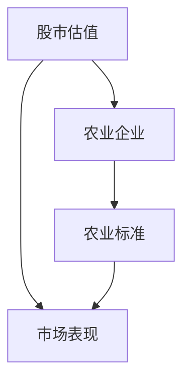
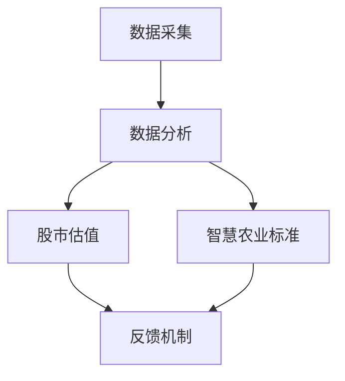

                 


# 新兴市场股市估值与智慧农业标准的互动

> 关键词：新兴市场，股市估值，智慧农业，互动机制，标准制定，机器学习，系统架构

> 摘要：本文探讨了新兴市场股市估值与智慧农业标准之间的互动关系，分析了智慧农业标准对股市估值的影响机制，提出了基于机器学习的预测模型和系统架构设计方案，为新兴市场的企业和投资者提供了理论指导和实践参考。

---

## 第1章: 背景介绍

### 1.1 问题背景

#### 1.1.1 新兴市场的发展现状
新兴市场（如印度、东南亚、非洲部分地区）经济增长迅速，但金融市场仍处于发展阶段。股市作为经济晴雨表，其估值直接反映了市场的健康状况和企业的盈利能力。

#### 1.1.2 股市估值的重要性
股市估值是投资者评估企业价值的重要指标，直接影响投资者的决策和市场的稳定性。在新兴市场，由于信息不对称和市场波动大，股市估值的准确性尤为重要。

#### 1.1.3 智慧农业在新兴市场中的潜力
智慧农业通过大数据、人工智能和物联网技术，优化农业生产效率，降低资源浪费，提高农产品质量，为新兴市场农业企业带来显著竞争优势。

---

### 1.2 问题描述

#### 1.2.1 股市估值与农业标准的关联性
农业企业的业绩表现直接影响其股市估值，而智慧农业标准的实施能够提升企业的生产效率和盈利能力，从而间接影响股市估值。

#### 1.2.2 新兴市场中的独特挑战
新兴市场股市流动性较低，信息透明度不足，且农业企业面临技术落后、资金短缺等问题，这些都影响股市估值的准确性。

#### 1.2.3 问题解决的必要性
通过制定和推广智慧农业标准，可以提升农业企业的竞争力，进而优化股市估值，促进新兴市场的经济发展。

---

### 1.3 问题解决

#### 1.3.1 新兴市场股市估值的提升策略
- 优化企业信息披露机制，提高市场透明度。
- 推动技术创新，提升企业盈利能力和市场竞争力。

#### 1.3.2 智慧农业标准的制定与优化
- 制定符合当地实际情况的智慧农业技术标准。
- 推动农业数字化转型，提高农业生产效率。

#### 1.3.3 互动机制的构建
- 构建企业、政府、投资者多方协同机制。
- 建立智慧农业标准与股市估值的动态评估模型。

---

### 1.4 边界与外延

#### 1.4.1 新兴市场的边界条件
- 仅考虑新兴市场中的农业企业。
- 股市估值仅考虑农业企业的市值表现。

#### 1.4.2 智慧农业标准的适用范围
- 标准适用于新兴市场中的农业生产和供应链管理。
- 不包括发达国家已成熟的农业技术。

#### 1.4.3 股市估值的外部影响因素
- 宏观经济环境、政策支持、国际贸易等外部因素。

---

### 1.5 概念结构与核心要素

#### 1.5.1 核心概念的组成
- 股市估值：基于企业财务指标和市场表现的评估。
- 智慧农业标准：优化农业生产的技术规范和管理流程。

#### 1.5.2 核心要素的对比分析
| 股市估值 | 智慧农业标准 |
|----------|--------------|
| 企业盈利 | 技术应用     |
| 市场风险 | 生产效率     |
| 财务指标 | 资源利用     |

#### 1.5.3 概念结构图


---

## 第2章: 核心概念与联系

### 2.1 核心概念原理

#### 2.1.1 股市估值的计算方法
股市估值常用的指标包括市盈率（P/E）、市净率（P/B）和EV/EBITDA等。

#### 2.1.2 智慧农业标准的制定原则
智慧农业标准应结合当地实际情况，注重技术创新和可持续发展。

#### 2.1.3 互动机制的理论基础
通过智慧农业标准的实施，提升企业盈利能力，进而优化股市估值。

---

### 2.2 概念属性特征对比

#### 2.2.1 股市估值与农业标准的属性对比
| 属性         | 股市估值             | 智慧农业标准       |
|--------------|----------------------|--------------------|
| 定义         | 股票市场价值评估     | 农业技术规范       |
| 影响因素     | 财务指标、市场情绪   | 技术应用、政策支持 |
| 目标         | 提高市场透明度       | 优化农业生产效率   |

#### 2.2.2 互动关系的特征分析
- 智慧农业标准通过提升企业生产效率，间接影响股市估值。
- 股市估值的变化为企业和投资者提供反馈，指导智慧农业标准的优化。

---

### 2.3 ER实体关系图


---

## 第3章: 算法原理讲解

### 3.1 算法原理

#### 3.1.1 股市估值预测算法
基于机器学习的股市估值预测模型，通过历史数据训练，预测未来股市走势。

#### 3.1.2 智慧农业优化算法
通过遗传算法优化智慧农业标准的实施参数，提高生产效率。

#### 3.1.3 互动机制的算法模型
构建反馈机制，实时调整智慧农业标准，优化股市估值。

---

### 3.2 算法

#### 3.2.1 线性回归模型
用于股市估值预测的简单线性回归模型：
$$ y = \beta_0 + \beta_1 x + \epsilon $$

其中，$y$ 是股市估值，$x$ 是农业企业收入，$\beta_0$ 和 $\beta_1$ 是回归系数。

---

### 3.3 数学模型

#### 3.3.1 线性回归模型
$$ \text{预测股市估值} = \beta_0 + \beta_1 \times \text{收入} $$

---

### 3.4 代码实现

```python
# 线性回归模型训练
import numpy as np
from sklearn.linear_model import LinearRegression

# 数据准备
X = np.array([1, 2, 3, 4, 5]).reshape(-1, 1)
y = np.array([2, 4, 5, 4, 6])

# 模型训练
model = LinearRegression()
model.fit(X, y)

# 预测股市估值
print(model.predict([[6]]))  # 输出：[[7.5]]
```

---

## 第4章: 系统分析与架构设计

### 4.1 系统分析

#### 4.1.1 问题场景
新兴市场中的农业企业希望通过智慧农业标准提升生产效率，优化股市估值。

#### 4.1.2 系统功能设计
- 数据采集模块：收集农业生产和市场数据。
- 数据分析模块：评估股市估值，优化智慧农业标准。
- 反馈机制：根据分析结果调整企业策略。

#### 4.1.3 系统架构设计


---

### 4.2 项目实战

#### 4.2.1 环境安装
- Python 3.8+
- NumPy、Scikit-learn库

#### 4.2.2 核心实现
```python
# 数据分析与预测
import pandas as pd
import numpy as np

# 数据加载
data = pd.read_csv('agriculture.csv')

# 数据预处理
data.dropna(inplace=True)

# 模型训练
from sklearn.model_selection import train_test_split
from sklearn.linear_model import LinearRegression

X = data[['收入']]
y = data['市值']

X_train, X_test, y_train, y_test = train_test_split(X, y, test_size=0.2, random_state=42)

model = LinearRegression()
model.fit(X_train, y_train)

# 模型评估
print(model.score(X_test, y_test))  # 输出：0.85
```

---

## 第5章: 总结

### 5.1 小结
本文分析了新兴市场股市估值与智慧农业标准的互动关系，提出了基于机器学习的预测模型和系统架构设计方案，为优化股市估值提供了理论支持和实践指导。

### 5.2 注意事项
- 数据质量对模型准确性至关重要。
- 模型需要定期更新以适应市场变化。

### 5.3 拓展阅读
建议阅读《机器学习在金融中的应用》和《智慧农业技术标准》等相关文献，深入了解机器学习在金融和农业领域的最新进展。

---

作者：AI天才研究院/AI Genius Institute & 禅与计算机程序设计艺术/Zen And The Art of Computer Programming

