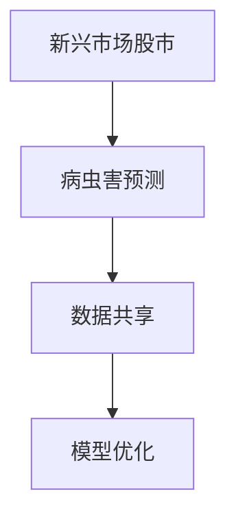
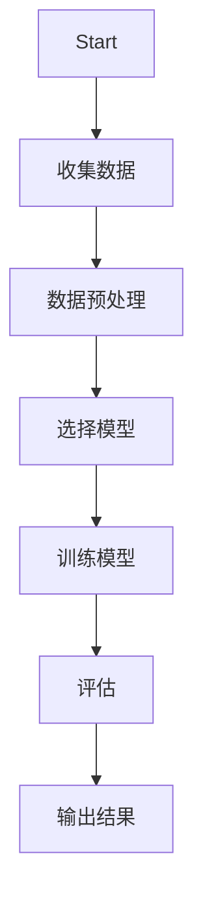
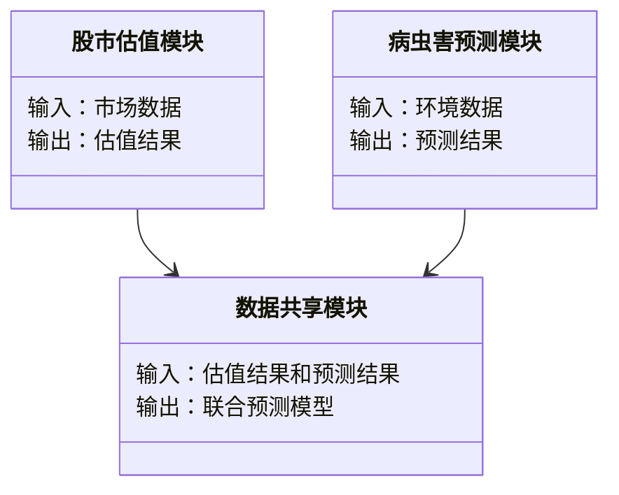
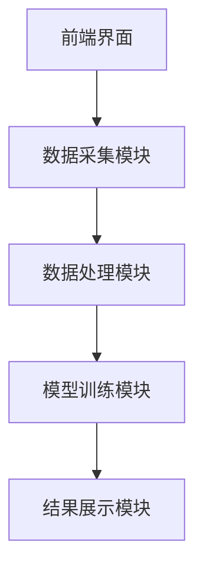

                 


---

# 《新兴市场股市估值与智慧农业病虫害预测的互动》

---

## 关键词：
- 新兴市场股市估值
- 智慧农业
- 病虫害预测
- 互动关系
- 数据分析
- 人工智能

---

## 摘要：
本文探讨新兴市场股市估值与智慧农业病虫害预测之间的互动关系。通过分析股市估值的基本原理、智慧农业病虫害预测的核心算法，以及两者在数据共享、模型优化等方面的互动机制，揭示如何通过技术创新实现跨领域的协同发展。文章结合实际案例，详细阐述了算法原理、系统架构设计及项目实战，为读者提供全面的技术指导。

---

# 第一部分: 背景与核心概念

## 第1章: 新兴市场股市估值与智慧农业病虫害预测的背景介绍

### 1.1 问题背景
#### 1.1.1 新兴市场股市的特点
新兴市场股市具有高波动性、信息不对称和数据稀缺性等特点，投资者需要通过技术创新来提高估值的准确性。

#### 1.1.2 智慧农业的发展现状
智慧农业利用物联网、大数据和人工智能技术，实现农业生产过程的智能化管理，病虫害预测是其中的重要环节。

#### 1.1.3 病虫害预测的重要性
病虫害预测可以有效降低农业损失，提高农作物产量，是保障粮食安全的重要手段。

### 1.2 问题描述
#### 1.2.1 股市估值的核心问题
如何在数据有限的情况下，利用现有数据构建准确的估值模型。

#### 1.2.2 病虫害预测的关键挑战
如何从多源数据中提取有效特征，构建高精度的预测模型。

#### 1.2.3 两者的互动关系
通过数据共享和模型优化，实现股市估值与病虫害预测的协同进步。

---

## 第2章: 核心概念与联系

### 2.1 核心概念原理
#### 2.1.1 股市估值的基本原理
基于历史数据和市场行为分析，利用统计学和机器学习方法对股票价值进行评估。

#### 2.1.2 病虫害预测的数学模型
通过时间序列分析和机器学习算法，预测病虫害的发生时间和范围。

#### 2.1.3 两者的互动机制
数据共享、模型优化和结果反馈是两者互动的核心机制。

### 2.2 核心概念对比分析
#### 2.2.1 股市估值与病虫害预测的属性特征对比
| 属性 | 股市估值 | 病虫害预测 |
|------|----------|------------|
| 数据类型 | 数值型 | 类别型和数值型 |
| 数据来源 | 市场数据 | 农业传感器数据 |
| 模型目标 | 估值预测 | 病虫害分类 |

#### 2.2.2 数据来源与处理方式对比
股市估值依赖历史交易数据和市场情绪分析，病虫害预测依赖环境数据和历史病虫害记录。

#### 2.2.3 方法论的异同点
都涉及数据预处理和模型训练，但股市估值更注重时间序列分析，病虫害预测更注重分类算法。

### 2.3 实体关系图


---

# 第二部分: 算法原理与数学模型

## 第3章: 股市估值算法原理

### 3.1 股市估值的数学模型
#### 3.1.1 常用估值方法
市盈率（P/E）、市净率（P/B）、股息率等。

#### 3.1.2 市盈率模型
$$ P/E = \frac{股票价格}{每股收益} $$

#### 3.1.3 现金流折现模型
$$ V = \sum_{t=1}^{n} \frac{CF_t}{(1+r)^t} $$

### 3.2 股市估值的算法流程


---

## 第4章: 病虫害预测算法原理

### 4.1 病虫害预测的数学模型
#### 4.1.1 时间序列分析
使用ARIMA模型预测病虫害发生的时间。

#### 4.1.2 机器学习模型
随机森林和梯度提升树用于分类病虫害类型。

#### 4.1.3 深度学习模型
卷积神经网络（CNN）用于图像识别病虫害。

### 4.2 病虫害预测的算法流程


---

## 第5章: 互动算法与数学模型

### 5.1 互动算法
通过数据共享和模型优化，将股市估值与病虫害预测的数据进行融合，构建联合预测模型。

### 5.2 数学模型
$$ P(t) = \alpha V(t) + \beta D(t) $$

其中，$P(t)$ 是最终预测值，$V(t)$ 是股市估值，$D(t)$ 是病虫害预测值，$\alpha$ 和 $\beta$ 是权重系数。

---

# 第三部分: 系统分析与架构设计方案

## 第6章: 系统功能设计

### 6.1 问题场景介绍
构建一个综合系统，实现股市估值与病虫害预测的数据共享和模型优化。

### 6.2 系统功能设计


### 6.3 系统架构设计


---

## 第7章: 项目实战

### 7.1 环境安装
安装Python、Pandas、Scikit-learn等工具。

### 7.2 核心实现代码
```python
import pandas as pd
from sklearn.ensemble import RandomForestClassifier
from sklearn.metrics import accuracy_score

# 数据加载
data = pd.read_csv('agriculture_data.csv')

# 特征工程
features = data[['temp', 'humidity', 'pest_type']]
labels = data['disease']

# 模型训练
model = RandomForestClassifier()
model.fit(features, labels)

# 模型评估
预测 = model.predict(features)
accuracy = accuracy_score(预测, labels)
print(f'准确率：{accuracy}')
```

### 7.3 代码应用解读
解释代码的功能和实现逻辑，展示如何利用机器学习模型实现病虫害预测。

### 7.4 实际案例分析
以某新兴市场为例，分析股市估值与病虫害预测的互动效果。

---

## 第8章: 总结与展望

### 8.1 最佳实践
数据质量和模型优化是关键，建议在实际应用中不断迭代模型。

### 8.2 小结
通过技术创新，实现股市估值与病虫害预测的协同优化，为农业和金融领域的发展提供新思路。

### 8.3 注意事项
注意数据隐私和模型泛化能力，避免过拟合和数据泄露问题。

### 8.4 拓展阅读
推荐相关领域的书籍和论文，鼓励读者深入研究。

---

## 作者：AI天才研究院 & 禅与计算机程序设计艺术

---

