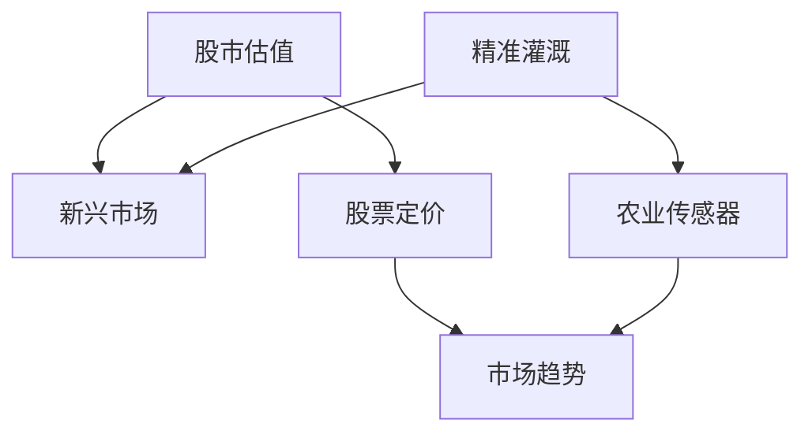
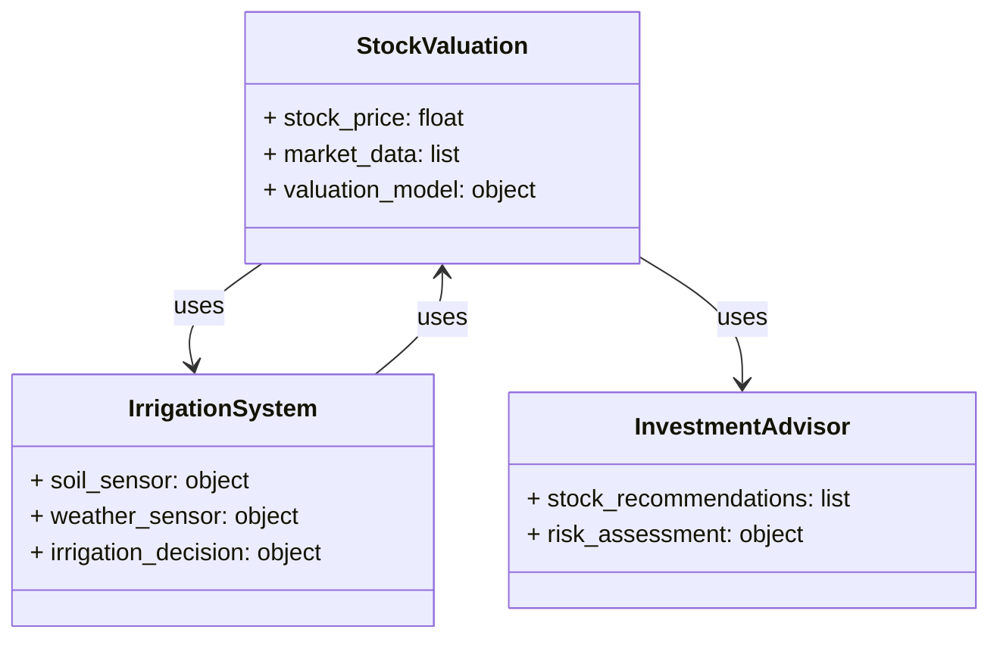
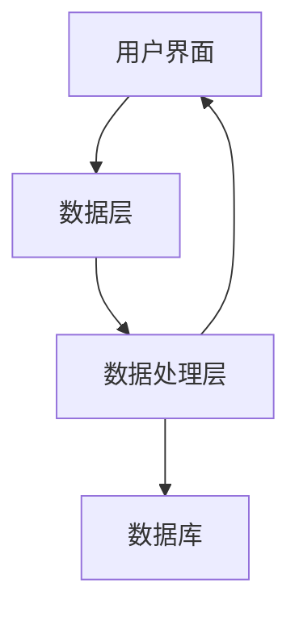
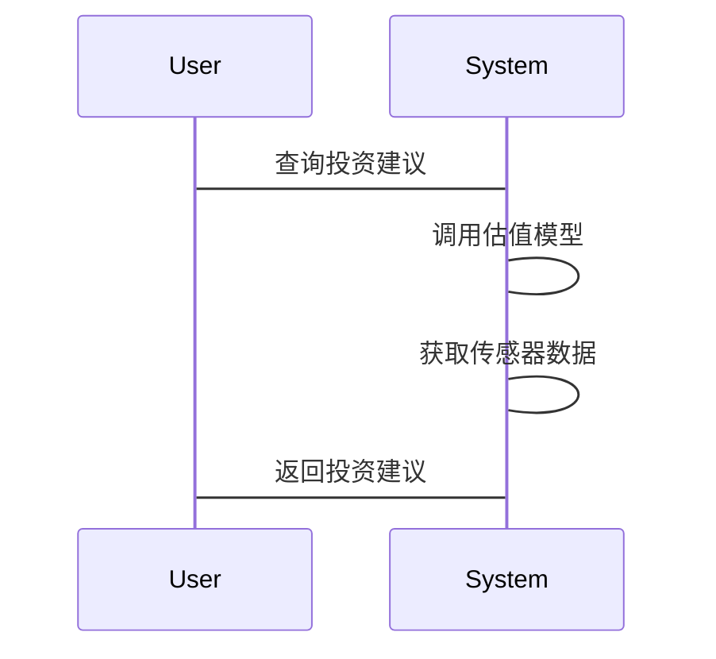

                 


# 新兴市场股市估值与智慧农业精准灌溉系统的互动

## 关键词：新兴市场、股市估值、智慧农业、精准灌溉系统、机器学习、传感器数据、数据驱动决策

## 摘要：新兴市场股市估值与智慧农业精准灌溉系统之间的互动关系，分析了股市估值的核心原理和智慧农业精准灌溉系统的原理，探讨了两者的联系，并通过数学模型和算法原理进行了详细讲解，最后提出了系统设计和项目实战的思路。

---

# 第1章: 背景介绍与问题定义

## 1.1 新兴市场股市估值的背景与现状

### 1.1.1 新兴市场的定义与特点
新兴市场是指那些经济快速增长、工业化程度较高但尚未完全发达国家的股市，具有较高的波动性和不确定性。这些市场通常位于拉丁美洲、亚洲和东欧等地，投资者希望通过新兴市场的高增长获取超额收益。

### 1.1.2 股市估值的基本概念与方法
股市估值是通过对公司财务数据和市场环境的分析，估算其股票的合理价格。常用的方法包括市盈率（P/E）、市净率（P/B）、股息率等指标。

### 1.1.3 新兴市场股市的独特性与挑战
新兴市场股市波动性大，受政策、经济和地缘政治因素影响显著。此外，市场流动性不足和信息不对称也是投资者面临的挑战。

## 1.2 智慧农业与精准灌溉系统的背景

### 1.2.1 智慧农业的定义与发展
智慧农业是通过物联网、大数据和人工智能等技术，实现农业生产的智能化和高效化。精准灌溉系统是智慧农业的重要组成部分，通过传感器和自动控制技术实现水资源的精准管理。

### 1.2.2 精准灌溉系统的原理与优势
精准灌溉系统利用土壤湿度、气象数据和作物需求，优化灌溉时间和水量，减少水资源浪费，提高作物产量和质量。

### 1.2.3 农业智能化的趋势与需求
随着全球人口增长和资源短缺，农业智能化和精准灌溉成为提高农业生产效率和可持续发展的重要手段。

## 1.3 股市估值与智慧农业的互动关系

### 1.3.1 互动关系的定义与内涵
股市估值与智慧农业的互动关系指新兴市场股市的波动对农业技术投资的影响，以及精准灌溉系统在农业生产中的应用如何反过来影响股市估值。

### 1.3.2 新兴市场中股市与农业的相互影响
新兴市场股市的资金流动影响农业技术公司的融资能力，而精准灌溉系统的应用则可能提升农业生产的效率，进而影响农产品价格和股市表现。

### 1.3.3 互动关系的边界与外延
这种互动关系主要集中在资金流动、技术创新和市场反馈等方面，但受政策、经济和环境等多种因素的影响。

---

# 第2章: 核心概念与联系

## 2.1 股市估值的核心原理

### 2.1.1 市场估值的基本原理
市场估值是通过分析宏观经济指标、行业趋势和公司基本面，评估股票的内在价值。

### 2.1.2 股票定价模型与方法
常用模型包括现金流折现模型（DCF）和相对估值法（基于可比公司分析）。

### 2.1.3 新兴市场估值的独特性
新兴市场估值受政策、经济和地缘政治因素影响较大，波动性高，投资者需考虑这些特殊因素。

## 2.2 智慧农业精准灌溉系统的原理

### 2.2.1 精准灌溉的核心算法
基于传感器数据和模型预测，优化灌溉策略，减少水资源浪费。

### 2.2.2 农业传感器与数据采集
精准灌溉系统依赖于土壤湿度、气象数据和作物状态的实时监测。

### 2.2.3 农业决策支持系统
通过数据分析和模型预测，为农民提供灌溉和种植决策支持。

## 2.3 核心概念的联系与对比

### 2.3.1 核心概念属性对比表

| 属性                | 股市估值             | 智慧农业精准灌溉系统 |
|---------------------|---------------------|---------------------|
| 核心目标            | 评估股票价值         | 优化灌溉效率         |
| 数据来源            | 公司财务数据、市场数据 | 土壤、气象、作物数据 |
| 主要技术            | 金融模型、统计分析   | 物联网、机器学习     |

### 2.3.2 实体关系图（Mermaid）



---

# 第3章: 算法原理与数学模型

## 3.1 股市估值算法

### 3.1.1 常见的股市估值方法
- **市盈率法**：P/E = 股价 / 每股收益
- **市净率法**：P/B = 股价 / 每股净资产
- **现金流折现模型**：DCF = 现金流入的现值

### 3.1.2 线性回归模型在股市估值中的应用
线性回归模型用于预测股票价格与相关指标（如P/E、P/B）之间的关系。

### 3.1.3 示例代码（使用 Python 和相关库）

```python
import pandas as pd
import numpy as np
from sklearn.linear_model import LinearRegression
import matplotlib.pyplot as plt

# 示例数据加载
data = pd.read_csv('stock_data.csv')

# 数据预处理
X = data[['PE', 'PB']].values
y = data['Price'].values

# 训练线性回归模型
model = LinearRegression()
model.fit(X, y)

# 预测与可视化
predictions = model.predict(X)
plt.scatter(X[:, 0], y, color='blue', label='实际值')
plt.scatter(X[:, 0], predictions, color='red', label='预测值')
plt.xlabel('PE Ratio')
plt.ylabel('Price')
plt.legend()
plt.show()
```

### 3.1.4 数学模型
线性回归模型的数学表达式：

$$ y = \beta_0 + \beta_1 x + \epsilon $$

其中，$y$ 是目标变量，$x$ 是自变量，$\beta_0$ 和 $\beta_1$ 是回归系数，$\epsilon$ 是误差项。

---

## 3.2 智慧农业精准灌溉算法

### 3.2.1 精准灌溉系统的算法设计
基于实时传感器数据和历史数据，预测土壤湿度和作物需求，优化灌溉策略。

### 3.2.2 基于传感器数据的决策支持系统
使用机器学习算法分析土壤湿度、气象数据和作物状态，预测最佳灌溉时间。

### 3.2.3 示例代码（使用机器学习模型如随机森林）

```python
from sklearn.ensemble import RandomForestRegressor
import joblib

# 示例数据加载
data = pd.read_csv('agriculture_data.csv')

# 数据预处理
X = data[['soil_moisture', 'weather', 'crop_stage']].values
y = data['irrigation_need'].values

# 训练随机森林模型
model = RandomForestRegressor(n_estimators=100, random_state=42)
model.fit(X, y)

# 保存模型
joblib.dump(model, 'irrigation_model.pkl')
```

### 3.2.4 数学模型
随机森林回归模型的数学表达式：

$$ y = \sum_{i=1}^{n} \left( \alpha_i \cdot h_i(x) \right) $$

其中，$h_i(x)$ 是基学习器，$\alpha_i$ 是其权重。

---

## 3.3 互动关系的数学模型

### 3.3.1 股市数据与农业传感器数据的关联分析
通过协方差和相关性分析，识别股市波动与农业传感器数据之间的关系。

### 3.3.2 联合概率模型的应用
构建联合概率模型，预测股市波动对农业技术公司的影响。

---

# 第4章: 系统分析与架构设计

## 4.1 系统分析

### 4.1.1 问题场景介绍
新兴市场中，股市波动对农业技术公司的融资能力有直接影响，而精准灌溉系统的应用则可能提升农业生产效率，进而影响农产品价格和股市表现。

### 4.1.2 需求分析与系统功能设计
系统需要具备数据采集、分析和决策支持功能，能够实时监控股市和农业传感器数据，提供投资建议和灌溉策略。

### 4.1.3 领域模型类图（Mermaid）



---

## 4.2 系统架构设计

### 4.2.1 分层架构设计
系统分为数据采集层、数据处理层和用户界面层，每一层都有明确的功能划分。

### 4.2.2 组件交互关系图（Mermaid）



---

## 4.3 接口与交互设计

### 4.3.1 系统接口定义
- 数据采集接口：接收传感器数据并存储
- 数据分析接口：执行估值和预测算法
- 用户查询接口：返回投资建议和灌溉策略

### 4.3.2 交互流程图（Mermaid）



---

# 第5章: 项目实战与应用

## 5.1 环境搭建

### 5.1.1 安装 Python 和相关库
安装 Python 和以下库：
- pandas
- numpy
- scikit-learn
- joblib

### 5.1.2 数据集准备与预处理
加载并预处理股市和农业传感器数据，确保数据完整性和一致性。

## 5.2 核心代码实现

### 5.2.1 股市估值模型实现
使用线性回归模型进行股市估值。

### 5.2.2 精准灌溉决策系统实现
基于传感器数据，使用随机森林模型预测灌溉需求。

## 5.3 实际案例分析

### 5.3.1 数据分析与结果解读
通过实际数据，分析股市波动与农业传感器数据之间的关系，验证模型的准确性。

### 5.3.2 案例小结与经验总结
总结项目经验，提出改进建议和未来研究方向。

---

# 第6章: 总结、最佳实践与扩展

## 6.1 总结

### 6.1.1 核心观点回顾
新兴市场股市估值与智慧农业精准灌溉系统之间存在密切的互动关系，可以通过数据驱动的方法进行优化。

### 6.1.2 成果与不足
项目成功展示了数据驱动决策在股市和农业中的应用，但仍需进一步优化模型和扩展应用场景。

## 6.2 最佳实践 tips

### 6.2.1 数据质量的重要性
确保数据的准确性和完整性，避免因数据问题影响模型性能。

### 6.2.2 模型调优的技巧
通过网格搜索和交叉验证优化模型参数，提高预测准确性。

## 6.3 注意事项与风险提示

### 6.3.1 数据隐私与安全
保护用户数据隐私，避免数据泄露和滥用。

### 6.3.2 系统稳定性与可扩展性
确保系统在高负载和大规模数据下的稳定运行，具备良好的扩展性。

## 6.4 拓展阅读与学习资源

### 6.4.1 相关书籍与论文推荐
- 《Python机器学习实战》
- 《数据驱动决策：商业智能分析》

### 6.4.2 在线课程与技术博客
推荐在线课程和相关技术博客，帮助读者深入学习数据驱动决策技术。

---

# 作者：AI天才研究院/AI Genius Institute & 禅与计算机程序设计艺术 /Zen And The Art of Computer Programming

---

以上是文章的详细目录和内容框架，涵盖从背景介绍到系统设计、项目实战和总结的全过程。

