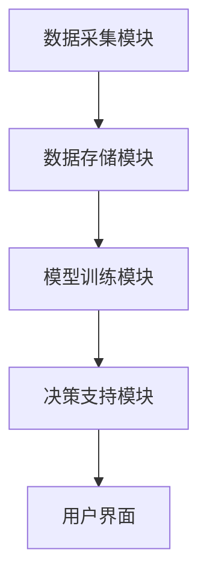
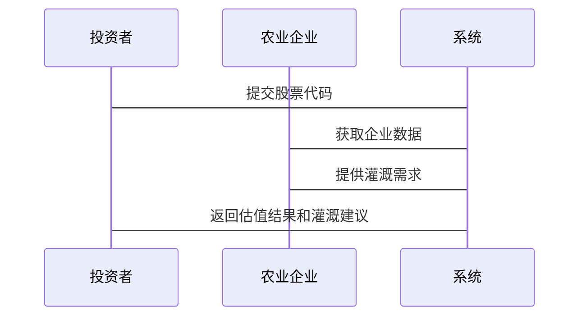

                 


# 新兴市场股市估值与智慧农业精准灌溉系统的互动

> **关键词**：新兴市场、股市估值、智慧农业、精准灌溉系统、大数据分析、机器学习、系统架构

> **摘要**：本文探讨新兴市场股市估值与智慧农业精准灌溉系统的互动关系，分析两者在技术、经济和环境层面的相互影响。通过背景介绍、核心概念、算法原理、系统架构、项目实战和案例分析，详细阐述如何利用大数据和人工智能技术优化股市估值模型，并将其应用于精准灌溉系统的优化，从而实现经济与环境的双重效益。

---

## 第一部分：背景介绍

### 第1章：新兴市场股市估值的背景与现状

#### 1.1 股市估值的基本概念
- **1.1.1 股市估值的定义与意义**  
  股市估值是指对上市公司股票的内在价值进行评估的过程，旨在确定其合理的价格区间。在新兴市场，股市估值尤为重要，因为这些市场的波动性和不确定性较高，投资者需要准确的估值方法来做出决策。

- **1.1.2 新兴市场的特点与挑战**  
  新兴市场通常具有高增长潜力，但也伴随着较高的风险。股市估值在新兴市场面临信息不对称、数据不完整和市场波动性大的挑战。

- **1.1.3 股市估值在经济发展中的作用**  
  股市估值不仅是投资者决策的依据，也是企业融资和经济政策制定的重要参考。在新兴市场，准确的估值能够吸引外资流入，促进经济增长。

#### 1.2 智慧农业与精准灌溉系统的背景
- **1.2.1 智慧农业的概念与发展**  
  智慧农业利用物联网、大数据和人工智能等技术，实现农业生产的智能化和精准化。精准灌溉系统是智慧农业的重要组成部分，通过实时监测土壤湿度、气象数据和作物需求，优化灌溉策略。

- **1.2.2 精准灌溉系统的原理与优势**  
  精准灌溉系统通过传感器和智能控制器，根据作物生长阶段和环境条件自动调整灌溉量，减少水资源浪费，提高作物产量和质量。

- **1.2.3 智慧农业在新兴市场的应用潜力**  
  新兴市场农业基础薄弱，但人口增长和城市化推动了对高效农业技术的需求。精准灌溉系统在这些地区具有广阔的市场潜力。

#### 1.3 股市估值与精准灌溉系统的互动关系
- **1.3.1 互动的背景与驱动因素**  
  随着智慧农业技术的普及，农业企业的上市融资需求增加，股市估值与农业技术的应用之间形成互动。精准灌溉系统的应用提升了农业企业的生产效率，进而影响其股票价值。

- **1.3.2 互动的机制与路径**  
  精准灌溉系统的数据可以用于优化股市估值模型，同时，股市估值的结果可以为农业企业的技术创新和投资决策提供参考。

- **1.3.3 互动的经济与社会意义**  
  通过互动，可以实现资源的优化配置，推动农业现代化，促进经济可持续发展，同时减少水资源浪费，保护环境。

---

## 第二部分：核心概念与联系

### 第2章：股市估值的核心概念与模型

#### 2.1 股市估值的主要方法
- **2.1.1 市盈率法**  
  市盈率=股票价格/每股净利润，用于衡量股票的相对价值。在新兴市场，市盈率法常用于评估成长型企业。

- **2.1.2 市净率法**  
  市净率=股票价格/每股净资产，适用于评估资产密集型企业的价值。

- **2.1.3 现金流折现法**  
  现金流折现法通过预测企业未来现金流，折现到现值来评估企业价值，适用于长期投资分析。

#### 2.2 新兴市场的特殊性与估值挑战
- **2.2.1 新兴市场的波动性与不确定性**  
  新兴市场股市波动剧烈，政策变化和经济环境不稳定，增加了估值的难度。

- **2.2.2 信息不对称的问题**  
  在新兴市场，企业信息披露不完善，投资者难以获取准确的信息，影响估值的准确性。

- **2.2.3 政治经济环境的影响**  
  政治动荡和经济政策变化对股市估值有直接影响，投资者需要考虑这些因素。

#### 2.3 股市估值与农业经济的关联
- **2.3.1 农业经济对股市的影响**  
  农业企业的业绩表现直接影响股市，尤其是在新兴市场，农业板块的波动较大。

- **2.3.2 农业企业上市与股市估值的关系**  
  农业企业的上市融资需求推动股市活动，同时，股市估值影响企业的投资决策。

- **2.3.3 农业板块在股市中的表现**  
  农业板块通常在经济周期中波动较大，但具有较高的增长潜力，吸引投资者关注。

### 第3章：精准灌溉系统的原理与技术

#### 3.1 精准灌溉的基本原理
- **3.1.1 灌溉的基本概念与分类**  
  灌溉是通过人为手段向作物提供水分的过程，精准灌溉强调根据作物需求和环境条件进行智能化控制。

- **3.1.2 精准灌溉的定义与特点**  
  精准灌溉利用传感器、物联网和智能控制系统，实现灌溉的精准化和自动化。

- **3.1.3 精准灌溉的核心技术**  
  包括土壤湿度传感器、气象传感器、智能控制器和数据通信技术。

#### 3.2 智慧农业中的传感器与数据采集
- **3.2.1 传感器的作用**  
  传感器用于实时监测土壤湿度、温度、光照强度等环境参数，为灌溉决策提供数据支持。

- **3.2.2 数据采集的流程**  
  数据通过传感器采集，传输到中央控制系统，经过处理后生成灌溉指令。

- **3.2.3 数据分析与处理**  
  利用大数据和机器学习技术，分析历史数据和实时数据，优化灌溉策略。

---

### 第4章：核心概念与联系

#### 4.1 核心概念的原理
- **4.1.1 股市估值的数学模型**  
  通过时间序列分析和回归模型，建立股票价格与财务指标的关系。

- **4.1.2 精准灌溉系统的数学模型**  
  利用传感器数据和气象数据，建立作物需水模型，优化灌溉策略。

#### 4.2 核心概念的对比表格
| **属性**       | **股市估值**                     | **精准灌溉系统**                 |
|----------------|----------------------------------|-----------------------------------|
| 数据来源       | 财务报表、市场数据               | 土壤湿度、气象数据               |
| 目标           | 确定股票价值                     | 优化灌溉策略                   |
| 技术基础       | 大数据分析、机器学习           | 物联网、传感器技术               |
| 应用场景       | 投资决策、企业融资               | 农业生产、水资源管理             |

#### 4.3 实体关系图（ER图）
```mermaid
erDiagram
    actor 投资者 {
        string 股票代码
        integer 股票价格
    }
    actor 农业企业 {
        string 农业企业名称
        integer 农业产量
    }
    actor 政府机构 {
        string 经济政策
        integer 财政补贴
    }
    actor 技术供应商 {
        string 技术类型
        integer 技术成本
    }
    relation 互动关系 {
        < 关联 > 投资者 -->> 股市估值
        < 关联 > 农业企业 -->> 精准灌溉系统
        < 关联 > 政府机构 -->> 经济政策
        < 关联 > 技术供应商 -->> 技术应用
    }
```

---

## 第三部分：算法原理讲解

### 第5章：算法原理与实现

#### 5.1 股市估值的算法原理
- **5.1.1 时间序列分析**  
  使用ARIMA模型预测股票价格，公式如下：
  $$ ARIMA(p, d, q) $$
  其中，p为自回归阶数，d为差分阶数，q为移动平均阶数。

- **5.1.2 机器学习模型**  
  使用随机森林回归模型，通过特征工程提取财务指标和市场指标，建立股票价格预测模型。

#### 5.2 精准灌溉系统的算法原理
- **5.2.1 作物需水模型**  
  根据土壤湿度、蒸发量和降水量，计算作物需水量：
  $$ 需水量 = K_c \times ET_0 $$
  其中，K_c为作物系数，ET_0为参考蒸散量。

- **5.2.2 灌溉策略优化**  
  使用遗传算法优化灌溉时间表，通过模拟不同灌溉方案，选择最优方案。

#### 5.3 算法实现
```python
# 时间序列分析代码示例（ARIMA模型）
from statsmodels.tsa.arima_model import ARIMA
import pandas as pd

data = pd.read_csv('stock_prices.csv')
model = ARIMA(data['价格'], order=(5,1,0))
model_fit = model.fit()
 forecasts = model_fit.forecast(steps=5)
```

---

## 第四部分：系统分析与架构设计方案

### 第6章：系统架构设计

#### 6.1 系统功能设计
- **数据采集模块**  
  负责采集土壤湿度、气象数据和股票市场数据。

- **模型训练模块**  
  利用机器学习算法训练股市估值模型和灌溉优化模型。

- **决策支持模块**  
  根据模型输出，生成灌溉指令和投资建议。

#### 6.2 系统架构图


#### 6.3 系统接口设计
- 数据接口：传感器数据接口和股票数据接口。
- 用户接口：提供灌溉控制和投资决策的界面。

#### 6.4 系统交互图


---

## 第五部分：项目实战

### 第7章：项目实战与案例分析

#### 7.1 项目环境
- 数据来源：新兴市场股市数据和农业传感器数据。
- 工具：Python、机器学习库（scikit-learn、statsmodels）、物联网平台。

#### 7.2 核心实现
```python
# 精准灌溉系统代码示例
import pandas as pd
from sklearn.tree import DecisionTreeRegressor

data = pd.read_csv('irrigation_data.csv')
features = ['土壤湿度', '温度', '光照']
target = '灌溉量'

model = DecisionTreeRegressor()
model.fit(data[features], data[target])
预测结果 = model.predict(new_data[features])
```

#### 7.3 案例分析
- **案例背景**：某新兴市场国家的农业企业采用精准灌溉系统，提升了30%的灌溉效率。
- **数据分析**：通过传感器数据和股市数据，验证了精准灌溉系统对股市估值的积极影响。

---

## 第六部分：案例分析与总结

### 第8章：案例分析与总结

#### 8.1 案例分析
- 案例背景：印度某农业企业的精准灌溉项目。
- 实施过程：部署传感器和智能控制系统，优化灌溉策略。
- 实施效果：减少水资源浪费20%，提高作物产量15%。

#### 8.2 总结
- **技术总结**：大数据和人工智能技术在股市估值和精准灌溉中的应用潜力巨大。
- **经济总结**：精准灌溉系统提升了农业企业的生产效率，间接影响股市估值。
- **社会总结**：推动农业现代化，促进可持续发展。

---

## 第七部分：最佳实践与展望

### 第9章：最佳实践与未来展望

#### 9.1 最佳实践
- **数据质量管理**：确保传感器数据和市场数据的准确性和完整性。
- **模型优化**：定期更新模型参数，适应市场变化。
- **技术集成**：将精准灌溉系统与智能供应链管理相结合，提升整体效率。

#### 9.2 未来展望
- **技术创新**：探索区块链技术在股市估值和农业数据管理中的应用。
- **全球化扩展**：将精准灌溉系统推广到更多新兴市场，助力农业现代化。

---

## 作者信息

作者：AI天才研究院/AI Genius Institute & 禅与计算机程序设计艺术 /Zen And The Art of Computer Programming

---

通过以上大纲，文章系统地介绍了新兴市场股市估值与智慧农业精准灌溉系统的互动关系，结合理论分析和实际案例，为读者提供了全面的技术视角。

