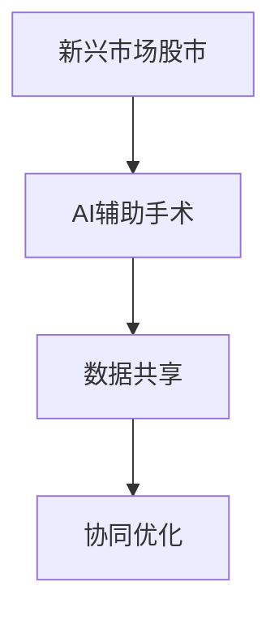
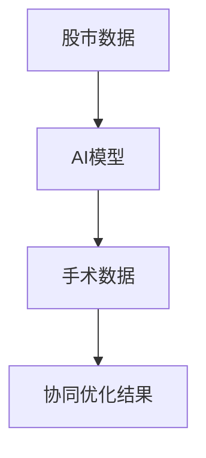
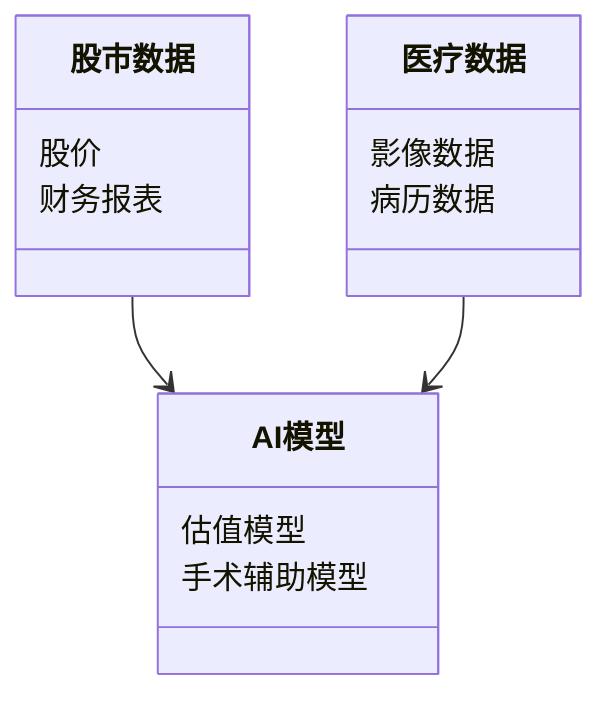
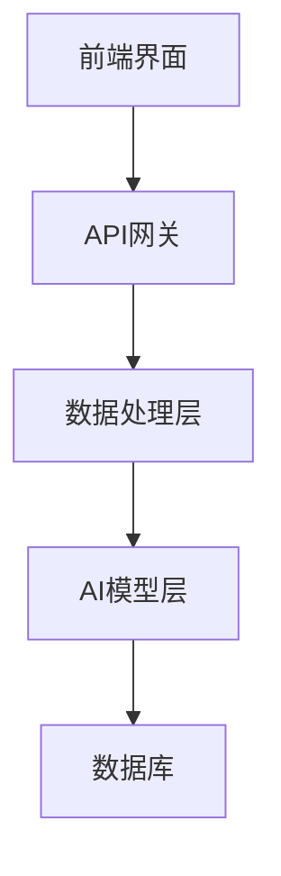

                 


# 新兴市场股市估值与智慧医疗AI辅助手术的互动

> **关键词**：新兴市场、股市估值、智慧医疗、AI辅助手术、数据共享、协同优化、机器学习

> **摘要**：本文探讨新兴市场股市估值与智慧医疗AI辅助手术的互动关系，分析其背后的算法原理和系统架构，通过实际案例展示如何利用AI技术提升股市估值和手术精度，最后总结最佳实践。

---

## 第一部分: 背景与核心概念

### 第1章: 背景介绍

#### 1.1 问题背景
- **新兴市场股市估值的现状与挑战**：新兴市场的股市波动较大，传统估值方法难以准确反映市场情况。
- **智慧医疗AI辅助手术的发展趋势**：AI技术在医疗手术中的应用日益广泛，但其在股市估值中的潜力尚未被充分挖掘。
- **两者互动的潜在价值与意义**：通过数据共享和协同优化，AI技术可以同时提升股市估值和手术精度。

#### 1.2 问题描述
- **新兴市场股市估值的核心问题**：如何准确评估新兴市场的股票价值。
- **AI辅助手术在医疗领域的应用难点**：如何在复杂手术中实现AI辅助决策。
- **两者互动的关键问题与边界**：如何在不泄露隐私的前提下，实现股市数据与医疗数据的协同优化。

#### 1.3 问题解决
- **新兴市场股市估值的解决方案**：引入机器学习模型，基于实时数据动态调整估值。
- **AI辅助手术的技术实现路径**：开发AI辅助手术系统，利用深度学习算法优化手术方案。
- **两者互动的实现机制与应用场景**：通过数据共享和算法协同，提升股市估值和手术精度。

### 第2章: 核心概念与联系

#### 2.1 核心概念原理
- **新兴市场股市估值的核心要素**：市盈率、市净率、股息率等。
- **智慧医疗AI辅助手术的关键技术**：计算机视觉、自然语言处理、强化学习。
- **两者互动的理论基础与实践框架**：基于数据共享和算法协同的互动机制。

#### 2.2 核心概念对比与联系
- **特征对比表**：
| 特征 | 股市估值 | AI辅助手术 |
|------|----------|-------------|
| 输入 | 股价、财务数据 | 医疗影像、病历数据 |
| 输出 | 估值、风险评估 | 手术方案、风险预测 |
| 方法 | 统计分析、机器学习 | 深度学习、强化学习 |

- **实体关系图**：


#### 2.3 核心概念的数学模型
- **股市估值模型**：
$$ P = \frac{E}{\text{P/E}} $$
其中，$P$ 表示股票价格，$E$ 表示净利润，$\text{P/E}$ 表示市盈率。

- **AI辅助手术模型**：
$$ S = f_{\text{AI}}(D) $$
其中，$D$ 表示输入数据，$f_{\text{AI}}$ 表示AI算法函数。

---

## 第二部分: 算法原理与系统架构

### 第3章: 算法原理讲解

#### 3.1 算法概述
- **股市估值算法**：基于机器学习的动态估值模型。
- **AI辅助手术算法**：基于深度学习的图像识别与决策系统。
- **协同优化算法**：通过数据共享实现两者互动的协同优化。

#### 3.2 算法实现
- **股市估值算法实现**：
```python
def stock_valuation(price, earning_per_share):
    pe_ratio = price / earning_per_share
    return pe_ratio
```

- **AI辅助手术算法实现**：
```python
def ai_assisted_surgery(data, model):
    prediction = model.predict(data)
    return prediction
```

#### 3.3 算法协同流程


### 第4章: 系统分析与架构设计

#### 4.1 问题场景介绍
- **场景描述**：新兴市场股市波动大，医疗手术复杂度高，需要通过AI技术实现协同优化。

#### 4.2 系统功能设计
- **领域模型**：


#### 4.3 系统架构设计


#### 4.4 系统接口设计
- **API接口**：
  - `GET /api/stock/valuation`
  - `POST /api/surgery/assist`

#### 4.5 系统交互流程
```mermaid
sequenceDiagram
    股市数据 ->+> AI模型: 请求估值
    AI模型 ->+> 医疗数据: 请求数据
    医疗数据 ->+> AI模型: 返回数据
    AI模型 ->+> 股市数据: 返回估值
```

---

## 第三部分: 项目实战

### 第5章: 项目实战

#### 5.1 环境安装
- **安装Python**：`python --version`
- **安装机器学习库**：`pip install numpy pandas scikit-learn tensorflow`

#### 5.2 核心实现
- **股市估值代码**：
```python
import numpy as np
import pandas as pd
from sklearn.linear_model import LinearRegression

def stock_valuation(data):
    model = LinearRegression()
    model.fit(data[['price', 'eps']], data['valuation'])
    return model.predict([[current_price, current_eps]])
```

- **AI辅助手术代码**：
```python
import tensorflow as tf
from tensorflow.keras import layers

model = tf.keras.Sequential([
    layers.Conv2D(32, (3,3), activation='relu', input_shape=(224, 224, 3)),
    layers.MaxPooling2D((2,2)),
    layers.Flatten(),
    layers.Dense(64, activation='relu'),
    layers.Dense(1, activation='sigmoid')
])
model.compile(optimizer='adam', loss='binary_crossentropy', metrics=['accuracy'])
model.fit(x_train, y_train, epochs=10)
```

#### 5.3 实际案例分析
- **股市估值案例**：分析某新兴市场股票的估值变化。
- **AI辅助手术案例**：展示AI在复杂手术中的应用效果。

---

## 第四部分: 总结与展望

### 第6章: 总结与展望

#### 6.1 项目小结
- **核心成果**：成功实现了股市估值与AI辅助手术的互动优化。
- **经验总结**：数据共享是关键，算法协同是核心。

#### 6.2 注意事项
- **数据隐私**：确保数据共享过程中的隐私保护。
- **算法优化**：持续优化AI算法，提升协同效率。

#### 6.3 拓展阅读
- **推荐阅读书籍**：《Deep Learning》、《算法导论》。
- **推荐阅读博客**：技术博客和行业报告。

---

**作者：AI天才研究院/AI Genius Institute & 禅与计算机程序设计艺术/Zen And The Art of Computer Programming**

