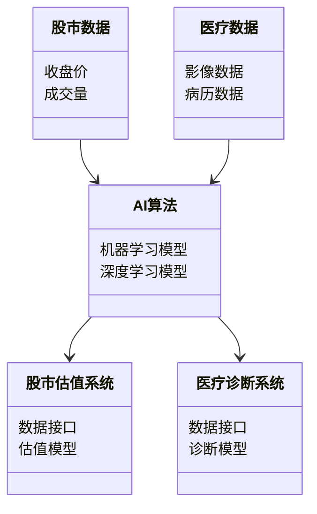
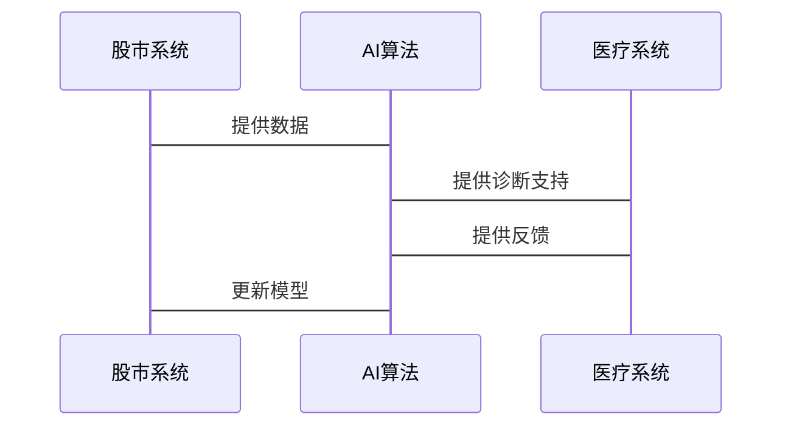

                 


# 新兴市场股市估值与智慧医疗AI辅助诊断的互动

**关键词**：新兴市场，股市估值，智慧医疗，AI辅助诊断，数据驱动，互动机制

**摘要**：本文探讨新兴市场股市估值与智慧医疗AI辅助诊断的互动关系，分析两者如何通过数据驱动和算法创新实现互利共赢，为投资者和医疗行业提供新的视角和解决方案。

---

# 第1章: 新兴市场股市估值与智慧医疗AI辅助诊断的背景与互动

## 1.1 新兴市场股市估值的现状与挑战
### 1.1.1 新兴市场的定义与特点
新兴市场是指经济快速发展但尚未达到发达水平的国家，如中国、印度等。这些市场的特点是增长潜力大，但波动性和不确定性较高。

### 1.1.2 股市估值的基本概念与方法
股市估值通过分析公司基本面、市场趋势等因素，评估股票的合理价格。常用方法包括市盈率、市净率等。

### 1.1.3 新兴市场股市估值的独特性与挑战
新兴市场的经济波动、政策变化等增加了估值的复杂性，需要结合宏观和微观因素。

## 1.2 智慧医疗AI辅助诊断的发展现状
### 1.2.1 智慧医疗的定义与核心要素
智慧医疗利用AI、大数据等技术优化医疗流程，提高诊断准确性。

### 1.2.2 AI在医疗诊断中的应用领域
AI用于疾病诊断、药物研发等领域，提升医疗效率和准确性。

### 1.2.3 AI辅助诊断的优势与局限性
优势包括高效性和准确性，但数据隐私和模型泛化能力是挑战。

## 1.3 股市估值与智慧医疗AI的互动关系
### 1.3.1 互动的背景与驱动因素
技术进步和数据共享推动两者的互动。

### 1.3.2 互动的核心机制与应用场景
通过数据共享和算法优化，提升股市估值和医疗诊断的准确性。

### 1.3.3 互动的潜在影响与未来趋势
数据驱动和AI创新将推动两者的深度融合。

---

# 第2章: 新兴市场股市估值的核心算法与实现

## 2.1 股市估值的基本原理
### 2.1.1 股票估值的常用方法
市盈率、市净率等方法帮助评估股票价值。

### 2.1.2 数据驱动的估值模型
利用历史数据和机器学习模型预测股票价格。

### 2.1.3 机器学习在估值中的应用
机器学习通过分析大量数据，识别市场趋势和潜在风险。

## 2.2 基于机器学习的股市预测算法
### 2.2.1 算法原理与流程
数据预处理、特征提取、模型训练和预测。

### 2.2.2 常用算法（如随机森林、神经网络）的实现
随机森林和神经网络在股市预测中的应用及其优缺点。

### 2.2.3 算法的优缺点与适用场景
随机森林适合小数据，神经网络适合大数据。

## 2.3 股市数据的特征提取与处理
### 2.3.1 数据清洗与预处理
去除噪声数据，处理缺失值。

### 2.3.2 特征选择与降维
使用主成分分析等方法减少维度。

### 2.3.3 时间序列数据的处理方法
使用ARIMA模型预测未来走势。

## 2.4 算法实现的代码示例
```python
import pandas as pd
from sklearn.ensemble import RandomForestRegressor
from sklearn.metrics import mean_absolute_error

# 数据加载与预处理
data = pd.read_csv('stock_data.csv')
X = data.drop('target', axis=1)
y = data['target']

# 模型训练
model = RandomForestRegressor(n_estimators=100)
model.fit(X, y)

# 预测与评估
预测 = model.predict(X)
print(mean_absolute_error(y, 预测))
```

## 2.5 本章小结
本章介绍了股市估值的基本原理和机器学习算法的应用，展示了如何通过数据驱动的方法提升估值准确性。

---

# 第3章: 智慧医疗AI辅助诊断的核心算法与实现

## 3.1 医疗诊断的基本原理
### 3.1.1 医疗诊断的流程与方法
医生通过症状、检查结果等进行诊断。

### 3.1.2 AI在医疗诊断中的作用
AI辅助诊断通过分析医学影像和病历数据，提高诊断效率。

### 3.1.3 常见的医疗诊断数据类型
包括医学影像、实验室数据和患者病史。

## 3.2 基于深度学习的医疗图像诊断算法
### 3.2.1 卷积神经网络（CNN）的原理
CNN通过多层卷积提取图像特征。

### 3.2.2 医疗图像分类的实现流程
数据预处理、模型训练和结果分析。

### 3.2.3 算法的优化与调优
调整学习率和批量大小提升模型性能。

## 3.3 医疗诊断数据的特征提取与处理
### 3.3.1 医疗数据的预处理方法
归一化和标准化处理数据。

### 3.3.2 基于特征工程的诊断模型
选择关键特征构建诊断模型。

### 3.3.3 数据增强与模型泛化能力
通过数据增强提升模型的泛化能力。

## 3.4 算法实现的代码示例
```python
import tensorflow as tf
from tensorflow.keras import layers

# 构建CNN模型
model = tf.keras.Sequential([
    layers.Conv2D(32, (3,3), activation='relu', input_shape=(224, 224, 3)),
    layers.MaxPooling2D((2,2)),
    layers.Conv2D(64, (3,3), activation='relu'),
    layers.MaxPooling2D((2,2)),
    layers.Flatten(),
    layers.Dense(128, activation='relu'),
    layers.Dense(2, activation='softmax')
])

# 编译模型
model.compile(optimizer='adam', loss='sparse_categorical_crossentropy', metrics=['accuracy'])
```

## 3.5 本章小结
本章介绍了AI在医疗诊断中的应用，特别是深度学习在医疗图像处理中的优势。

---

# 第4章: 新兴市场股市估值与智慧医疗AI的互动机制与实现

## 4.1 互动机制的理论基础
### 4.1.1 互动的核心概念与模型
通过数据共享和算法优化实现互动。

### 4.1.2 数据流与信息交互的机制
数据在两者之间流动，推动算法优化。

### 4.1.3 互动的数学模型与公式
建立数学模型描述数据流动和算法优化的关系。

## 4.2 互动机制的实现方案
### 4.2.1 数据接口的设计与实现
定义数据接口，实现数据共享。

### 4.2.2 互动算法的流程与步骤
数据预处理、模型训练和结果分析。

### 4.2.3 系统架构的设计
设计系统架构，确保数据流畅和算法高效。

## 4.3 系统分析与架构设计方案
### 4.3.1 问题场景介绍
新兴市场股市波动和医疗诊断需求。

### 4.3.2 项目介绍
通过AI技术优化股市估值和医疗诊断。

### 4.3.3 系统功能设计（领域模型mermaid类图）


### 4.3.4 系统架构设计mermaid架构图


### 4.3.5 系统交互mermaid序列图


## 4.4 项目实战
### 4.4.1 环境安装与配置
安装必要的Python库，如TensorFlow、Keras等。

### 4.4.2 系统核心实现源代码
```python
import pandas as pd
import tensorflow as tf

# 数据加载
data = pd.read_csv('combined_data.csv')

# 模型构建
model = tf.keras.Sequential([
    layers.Dense(64, activation='relu', input_shape=(n_features,)),
    layers.Dense(1, activation='sigmoid')
])

# 编译模型
model.compile(optimizer='adam', loss='binary_crossentropy', metrics=['accuracy'])
```

### 4.4.3 代码应用解读与分析
解读代码功能，分析如何实现数据共享和算法优化。

### 4.4.4 实际案例分析
分析一个实际案例，展示互动机制的应用效果。

## 4.5 本章小结
本章详细讲解了新兴市场股市估值与智慧医疗AI的互动机制，展示了如何通过数据共享和算法优化实现互利共赢。

---

# 作者：AI天才研究院 & 禅与计算机程序设计艺术

**小结**：本文通过详细分析新兴市场股市估值与智慧医疗AI辅助诊断的互动关系，展示了数据驱动和算法创新在提升股市估值和医疗诊断中的重要作用。通过实际案例和代码示例，帮助读者理解如何实现两者互动，为投资者和医疗行业提供新的视角和解决方案。

**注意事项**：在实际应用中，需注意数据隐私和模型泛化能力，确保算法的可靠性和安全性。

**拓展阅读**：进一步了解机器学习在金融和医疗领域的应用，探索更多数据驱动的技术创新。

