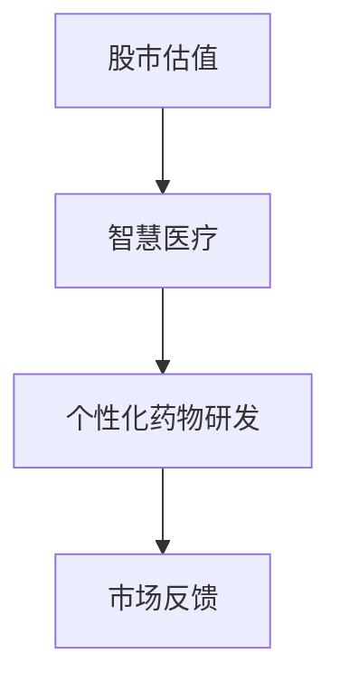
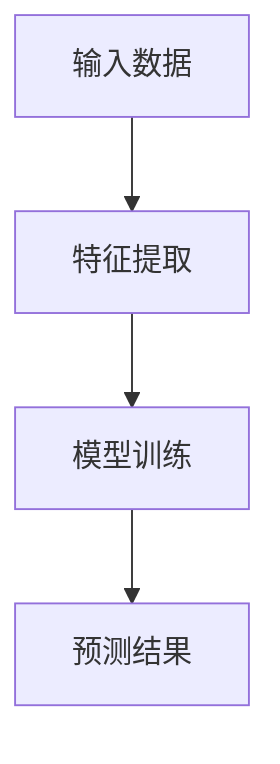
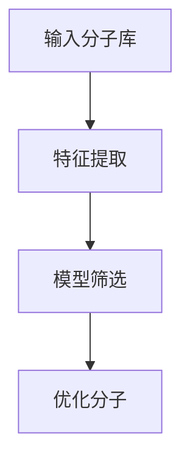
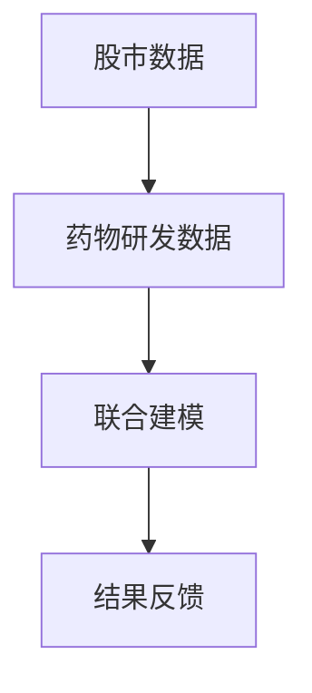
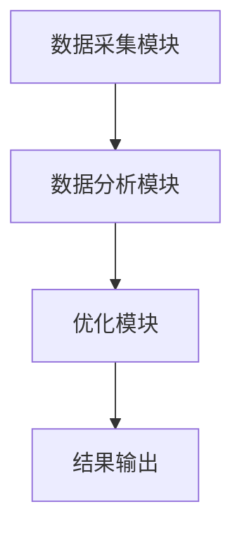
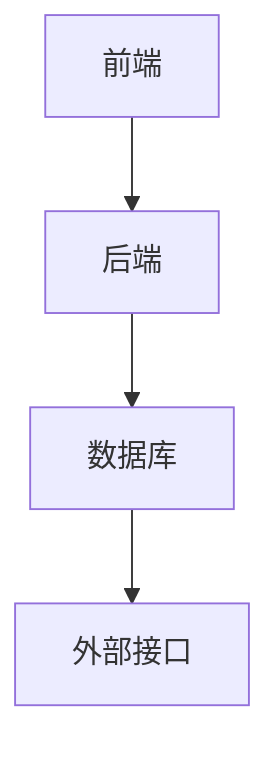
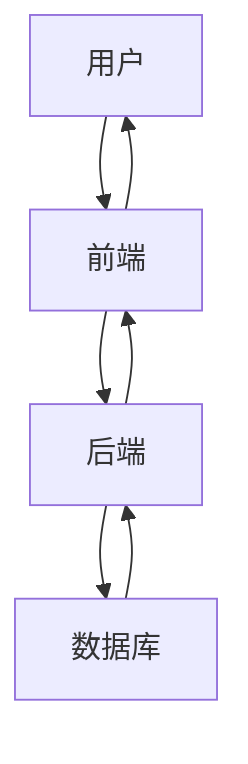

                 


# 新兴市场股市估值与智慧医疗个性化药物研发的互动

> 关键词：新兴市场，股市估值，智慧医疗，个性化药物研发，算法原理，数学模型，系统架构

> 摘要：本文探讨新兴市场股市估值与智慧医疗个性化药物研发之间的互动关系，分析其核心概念、算法原理、数学模型、系统架构及项目实战。通过理论与实践结合，揭示两者在数据共享、技术协同和市场反馈方面的互动机制，为相关领域的研究和实践提供参考。

---

## 第一部分: 新兴市场股市估值与智慧医疗个性化药物研发的背景介绍

### 第1章: 新兴市场股市估值与智慧医疗个性化药物研发的背景介绍

#### 1.1 新兴市场股市估值的定义与特点
- **1.1.1 新兴市场的概念与特点**  
  新兴市场是指那些经济快速增长、金融市场逐步完善的国家或地区的股市。其特点包括市场规模较小、波动性较大、投资者结构多元化等。

- **1.1.2 股市估值的基本原理**  
  股市估值是通过对公司基本面、市场环境和宏观经济指标的分析，预测股票的合理价格区间。常用的方法包括市盈率（P/E）、市净率（P/B）等。

- **1.1.3 新兴市场股市估值的独特性**  
  新兴市场的股市估值受到政策、经济波动和国际资本流动的影响较大，且市场参与者的信息不对称问题更为突出。

#### 1.2 智慧医疗与个性化药物研发的定义与特点
- **1.2.1 智慧医疗的定义与核心要素**  
  智慧医疗是指通过大数据、人工智能和物联网等技术，优化医疗资源配置、提升诊疗效率和精准度的医疗模式。

- **1.2.2 个性化药物研发的基本原理**  
  个性化药物研发基于患者的基因、生活方式和疾病特征，量身定制药物治疗方案，提高治疗效果和减少副作用。

- **1.2.3 智慧医疗在个性化药物研发中的作用**  
  智慧医疗通过数据挖掘和机器学习技术，加速药物研发过程，降低研发成本，提高药物开发的效率和精准性。

#### 1.3 互动关系的背景与问题描述
- **1.3.1 新兴市场股市与智慧医疗的互动背景**  
  随着新兴市场经济的快速发展，智慧医疗和个性化药物研发成为推动经济增长的重要引擎，同时股市估值的变化也直接影响相关企业的融资能力和研发投入。

- **1.3.2 个性化药物研发与股市估值的相互影响**  
  个性化药物研发的成功可能带来企业的股价上涨，而股市估值的变化则会影响企业的融资能力，进而影响研发进程。

- **1.3.3 问题边界与外延**  
  本文主要关注新兴市场中智慧医疗企业如何通过个性化药物研发影响股市估值，以及股市估值的变化如何反过来影响企业的研发能力和市场表现。

#### 1.4 核心概念结构与组成
- **1.4.1 核心概念的组成要素**  
  包括股市估值、智慧医疗、个性化药物研发三个核心要素。

- **1.4.2 概念结构图**  
  通过 Mermaid 流程图展示三者之间的关系。



- **1.4.3 核心要素的对比分析**  
  列表对比三者的定义、特点和作用。

---

## 第二部分: 新兴市场股市估值与智慧医疗个性化药物研发的核心概念与联系

### 第2章: 新兴市场股市估值与智慧医疗个性化药物研发的核心概念与联系

#### 2.1 核心概念原理
- **2.1.1 股市估值的核心原理**  
  通过对公司财务数据、行业地位和宏观经济指标的分析，预测股票的合理价格区间。

- **2.1.2 个性化药物研发的核心原理**  
  基于患者的基因组数据和疾病特征，利用机器学习和大数据技术筛选潜在药物分子，优化药物研发流程。

- **2.1.3 两者互动的机制**  
  智慧医疗技术的应用可以提高个性化药物研发的效率，从而影响企业的估值；同时，股市估值的变化也会影响企业的研发投入能力。

#### 2.2 核心概念属性特征对比
- **2.2.1 股市估值的属性特征**  
  数据驱动、动态变化、受宏观经济影响。

- **2.2.2 个性化药物研发的属性特征**  
  技术密集型、数据驱动、周期长。

- **2.2.3 对比分析表**  
  列表展示两者在目标、方法、影响因素等方面的对比。

#### 2.3 ER实体关系图
- **2.3.1 实体关系图的构建**  
  通过 Mermaid 绘制 ER 图，展示三者之间的关系。

```mermaid
erd
    股市估值 --(影响)-> 智慧医疗
    智慧医疗 --(推动)-> 个性化药物研发
    个性化药物研发 --(反馈)-> 股市估值
```

---

## 第三部分: 新兴市场股市估值与智慧医疗个性化药物研发的算法原理

### 第3章: 新兴市场股市估值与智慧医疗个性化药物研发的算法原理

#### 3.1 股市估值的算法原理
- **3.1.1 时间序列分析**  
  使用 ARIMA 模型预测股票价格。

- **3.1.2 机器学习在股市预测中的应用**  
  利用 LSTM 网络进行股票价格预测。

- **3.1.3 算法流程图**  
  通过 Mermaid 绘制 LSTM 网络的训练流程图。



#### 3.2 个性化药物研发的算法原理
- **3.2.1 基于机器学习的药物筛选**  
  使用随机森林算法筛选潜在药物分子。

- **3.2.2 分子动力学模拟**  
  通过分子动力学模拟优化药物分子的结构。

- **3.2.3 算法流程图**  
  通过 Mermaid 绘制药物筛选流程图。



#### 3.3 互动关系的算法原理
- **3.3.1 数据共享与协同分析**  
  将股市估值数据与个性化药物研发数据进行整合分析。

- **3.3.2 技术协同的算法实现**  
  使用联合学习（Federated Learning）技术在不同数据源之间协同建模。

- **3.3.3 算法流程图**  
  通过 Mermaid 绘制联合学习流程图。



---

## 第四部分: 新兴市场股市估值与智慧医疗个性化药物研发的数学模型与公式

### 第4章: 新兴市场股市估值与智慧医疗个性化药物研发的数学模型与公式

#### 4.1 股市估值的数学模型
- **4.1.1 时间序列分析模型**  
  使用 ARIMA 模型预测股票价格：

  $$ ARIMA(p, d, q) $$

- **4.1.2 回归模型**  
  通过多元回归分析预测股票价格：

  $$ y = \beta_0 + \beta_1 x_1 + \beta_2 x_2 + \epsilon $$

- **4.1.3 分类算法**  
  使用逻辑回归模型对股票进行涨跌分类：

  $$ P(y=1|x) = \frac{e^{\beta x}}{1 + e^{\beta x}} $$

#### 4.2 个性化药物研发的数学模型
- **4.2.1 分子动力学模型**  
  通过分子动力学模拟优化药物分子的结合能：

  $$ E = -RT \ln Q $$

- **4.2.2 药物筛选模型**  
  使用随机森林算法筛选潜在药物分子：

  $$ y = \text{max}(\text{accuracy}) $$

- **4.2.3 优化算法**  
  使用遗传算法优化药物分子的结构参数。

#### 4.3 互动关系的数学模型
- **4.3.1 数据共享模型**  
  使用分布式计算框架整合股市估值和药物研发数据。

- **4.3.2 技术协同模型**  
  通过联合学习技术在不同数据源之间协同建模：

  $$ f(x) = \sum_{i=1}^n f_i(x) $$

- **4.3.3 优化模型**  
  使用强化学习算法优化药物研发和股市估值的互动关系。

---

## 第五部分: 新兴市场股市估值与智慧医疗个性化药物研发的系统分析与架构设计方案

### 第5章: 新兴市场股市估值与智慧医疗个性化药物研发的系统分析与架构设计方案

#### 5.1 系统组成模块
- **5.1.1 数据采集模块**  
  采集股市估值数据和个性化药物研发数据。

- **5.1.2 数据分析模块**  
  对数据进行清洗、特征提取和建模分析。

- **5.1.3 优化模块**  
  优化药物研发和股市估值的互动关系。

#### 5.2 系统架构设计
- **5.2.1 系统功能设计**  
  通过 Mermaid 绘制系统功能模块图。



- **5.2.2 系统架构设计**  
  通过 Mermaid 绘制系统架构图。



- **5.2.3 系统接口设计**  
  设计 API 接口，实现数据的交互和模型的调用。

#### 5.3 系统交互设计
- **5.3.1 系统交互流程图**  
  通过 Mermaid 绘制系统交互流程图。



---

## 第六部分: 新兴市场股市估值与智慧医疗个性化药物研发的项目实战

### 第6章: 新兴市场股市估值与智慧医疗个性化药物研发的项目实战

#### 6.1 环境搭建
- **6.1.1 环境安装**  
  安装 Python、TensorFlow、PyTorch 等相关工具。

#### 6.2 核心实现
- **6.2.1 股市估值模型实现**  
  编写 LSTM 网络代码，预测股票价格。

```python
import tensorflow as tf
from tensorflow.keras import layers

model = tf.keras.Sequential([
    layers.LSTM(64, input_shape=(timesteps, features)),
    layers.Dense(1)
])
model.compile(optimizer='adam', loss='mse')
```

- **6.2.2 个性化药物研发模型实现**  
  编写随机森林算法代码，筛选潜在药物分子。

```python
from sklearn.ensemble import RandomForestClassifier

model = RandomForestClassifier(n_estimators=100)
model.fit(X_train, y_train)
```

#### 6.3 项目小结
- **6.3.1 项目总结**  
  总结项目实现的成果和遇到的问题。

- **6.3.2 最佳实践 tips**  
  提供一些项目实施中的经验和建议。

- **6.3.3 注意事项**  
  提醒读者在实际应用中需要注意的事项。

- **6.3.4 拓展阅读**  
  推荐相关领域的书籍和论文，供读者进一步学习。

---

## 结语

本文通过系统地分析新兴市场股市估值与智慧医疗个性化药物研发的互动关系，揭示了两者在数据共享、技术协同和市场反馈方面的互动机制。通过理论与实践结合，为相关领域的研究和实践提供了参考。

---

**作者：AI天才研究院/AI Genius Institute & 禅与计算机程序设计艺术 /Zen And The Art of Computer Programming**

