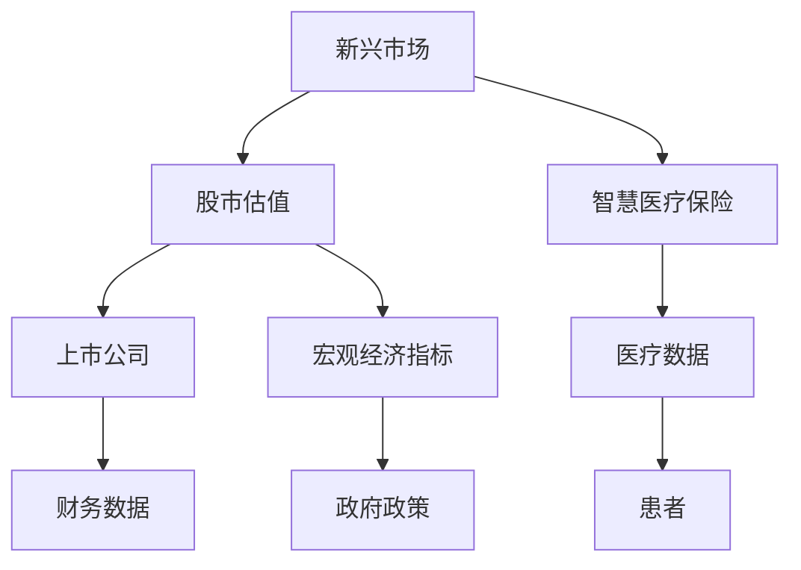
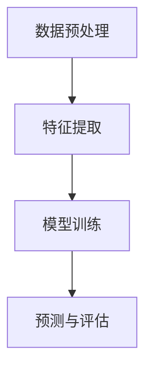
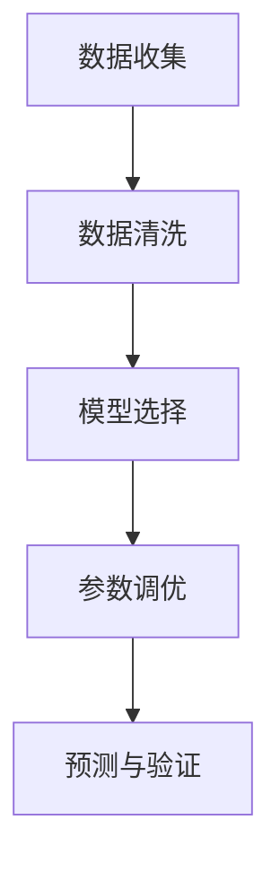
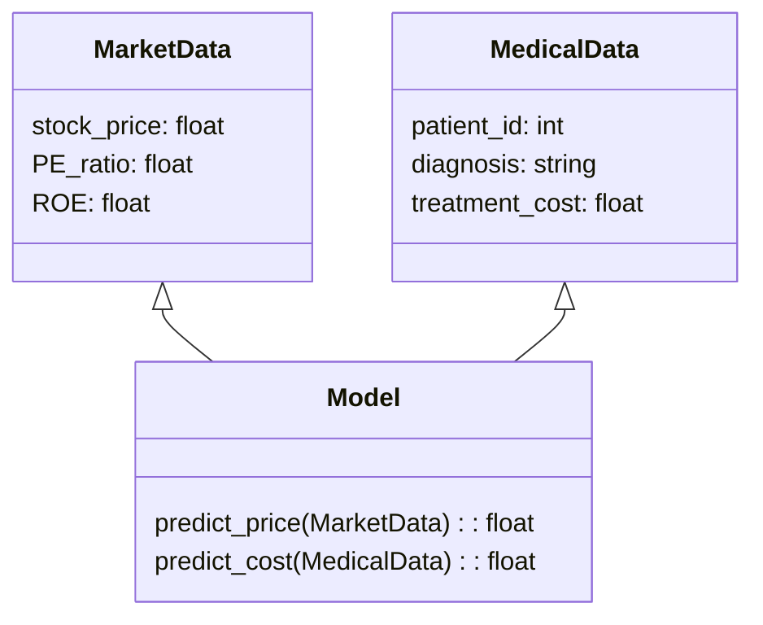
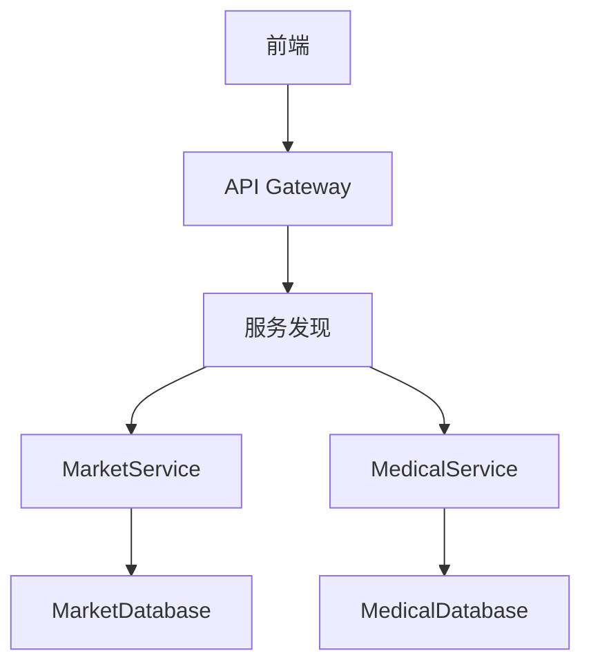
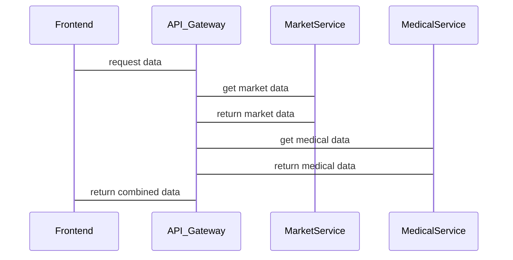

                 


# 新兴市场股市估值与智慧医疗保险的互动

## 关键词：
新兴市场, 股市估值, 智慧医疗保险, 机器学习, 数据分析, 系统架构, 项目实战

## 摘要：
本文探讨新兴市场股市估值与智慧医疗保险之间的互动关系，分析其背后的技术原理和应用场景。通过机器学习和数据分析的方法，揭示两者如何相互影响，并提出实际解决方案。文章内容包括背景介绍、核心概念、算法原理、系统架构设计和项目实战，为读者提供全面的技术视角。

---

# 第一部分：新兴市场股市估值与智慧医疗保险的互动概述

## 第1章：背景介绍

### 1.1 核心概念背景

#### 1.1.1 新兴市场的定义与特点
- 新兴市场指经济发展迅速但尚未达到发达水平的国家或地区，如中国、印度等。
- 特点：经济波动大、市场规模增长快、政策环境复杂。

#### 1.1.2 智慧医疗保险的概念与特征
- 智慧医疗保险：利用大数据、人工智能等技术优化医疗资源配置、提升诊疗效率。
- 特征：数据驱动、实时性、个性化。

#### 1.1.3 两者的互动关系与研究意义
- 股市估值受智慧医疗保险技术的影响，智慧医疗保险的发展依赖于股市的资金支持。
- 研究意义：探索新兴市场中两者的互动机制，为投资者和医疗行业提供参考。

### 1.2 问题背景与问题描述

#### 1.2.1 新兴市场股市估值的挑战
- 数据不完整、市场波动大、政策不确定性高。
- 投资者难以准确评估企业价值。

#### 1.2.2 智慧医疗保险在医疗领域的应用现状
- 数据孤岛问题严重，医疗资源分配不均。
- 缺乏统一的医疗数据分析标准。

#### 1.2.3 两者互动的潜在问题与解决方向
- 数据共享难题：如何在保护隐私的前提下实现数据互通？
- 技术融合：如何将智慧医疗保险技术应用于股市估值？

### 1.3 问题解决与边界外延

#### 1.3.1 新兴市场股市估值的解决方案
- 建立多维度的数据分析模型，结合宏观经济指标和行业数据。
- 引入机器学习算法，预测市场趋势。

#### 1.3.2 智慧医疗保险的技术实现路径
- 数据采集：整合医疗数据和患者行为数据。
- 数据分析：利用人工智能技术进行疾病预测和医疗资源优化。

#### 1.3.3 两者的互动边界与外延范围
- 边界：新兴市场与发达市场的区分，智慧医疗保险与传统医疗保险的区分。
- 外延：延伸至金融投资、医疗政策等领域。

---

## 第2章：核心概念与联系

### 2.1 核心概念原理

#### 2.1.1 新兴市场股市估值的数学模型
- CAPM模型：$$ E(R_i) = R_f + \beta_i (E(R_m) - R_f) $$
  - $E(R_i)$：资产的期望回报率。
  - $R_f$：无风险利率。
  - $\beta_i$：资产的系统性风险系数。
  - $E(R_m)$：市场期望回报率。

#### 2.1.2 智慧医疗保险的技术架构
- 数据采集：传感器、电子健康记录。
- 数据分析：机器学习算法、大数据平台。
- 应用场景：疾病预测、医疗资源优化。

### 2.2 核心概念属性特征对比

| 特性                | 新兴市场股市估值                     | 智慧医疗保险                       |
|---------------------|-------------------------------------|------------------------------------|
| 数据来源            | 公司财务报表、宏观经济指标         | 医疗记录、患者行为数据             |
| 技术手段            | 机器学习、时间序列分析             | 数据挖掘、自然语言处理             |
| 应用场景            | 投资决策、风险评估                 | 疾病预测、医疗资源分配             |

### 2.3 ER实体关系图


---

## 第3章：算法原理讲解

### 3.1 算法原理

#### 3.1.1 机器学习在股市估值中的应用
- 算法选择：线性回归、随机森林。
- 数据预处理：缺失值处理、特征标准化。

#### 3.1.2 时间序列分析在医疗保险费用预测中的应用
- 算法选择：ARIMA、LSTM。
- 数据特征：时间依赖性、趋势性。

### 3.2 算法流程图

#### 3.2.1 机器学习算法流程


#### 3.2.2 时间序列分析流程


### 3.3 Python代码实现

#### 3.3.1 基于机器学习的股市估值预测
```python
import pandas as pd
from sklearn.linear_model import LinearRegression

data = pd.read_csv('market_data.csv')
X = data[['PE_ratio', 'ROE']]
y = data['stock_price']

model = LinearRegression()
model.fit(X, y)

# 预测
new_data = pd.DataFrame({'PE_ratio': [20], 'ROE': [15]})
predicted_price = model.predict(new_data)
print(predicted_price)
```

#### 3.3.2 基于时间序列分析的医疗保险费用预测
```python
from statsmodels.tsa.arima_model import ARIMA
import pandas as pd

data = pd.read_csv('medical_costs.csv')
model = ARIMA(data['cost'], order=(1, 1, 1))
model_fit = model.fit()

# 预测
forecast = model_fit.forecast(steps=5)
print(forecast)
```

---

## 第4章：系统分析与架构设计方案

### 4.1 问题场景介绍

#### 4.1.1 新兴市场股市估值问题场景
- 数据量大、维度高，传统方法难以处理。
- 市场波动快，需要实时数据分析能力。

#### 4.1.2 智慧医疗保险系统问题场景
- 数据分散，难以整合。
- 医疗资源分配不均，需要智能优化。

### 4.2 项目介绍

#### 4.2.1 项目目标
- 建立一个结合股市估值和智慧医疗保险的综合分析平台。

#### 4.2.2 项目范围
- 数据收集与处理。
- 模型开发与部署。
- 系统测试与优化。

### 4.3 系统功能设计

#### 4.3.1 领域模型类图


#### 4.3.2 系统架构设计


#### 4.3.3 系统接口设计
- 前端接口：API请求、数据展示。
- 后端接口：数据处理、模型调用。

### 4.4 系统交互序列图



---

## 第5章：项目实战

### 5.1 环境安装

#### 5.1.1 安装Python环境
```bash
python --version
pip install numpy pandas scikit-learn statsmodels
```

#### 5.1.2 安装Jupyter Notebook
```bash
pip install jupyter
jupyter notebook
```

### 5.2 系统核心实现源代码

#### 5.2.1 股市估值预测代码
```python
import pandas as pd
from sklearn.linear_model import LinearRegression

data = pd.read_csv('market_data.csv')
X = data[['PE_ratio', 'ROE']]
y = data['stock_price']

model = LinearRegression()
model.fit(X, y)

# 预测
new_data = pd.DataFrame({'PE_ratio': [20], 'ROE': [15]})
predicted_price = model.predict(new_data)
print(f"预测股价：{predicted_price[0]:.2f}")
```

#### 5.2.2 医疗保险费用预测代码
```python
from statsmodels.tsa.arima_model import ARIMA
import pandas as pd

data = pd.read_csv('medical_costs.csv')
model = ARIMA(data['cost'], order=(1, 1, 1))
model_fit = model.fit()

# 预测
forecast = model_fit.forecast(steps=5)
print(f"未来5天的预测医疗费用：{forecast[0][0]:.2f}")
```

### 5.3 代码应用解读与分析

#### 5.3.1 股市估值预测
- 数据来源：市场数据CSV文件。
- 模型训练：使用线性回归算法。
- 预测结果：输出预测股价。

#### 5.3.2 医疗保险费用预测
- 数据来源：医疗费用CSV文件。
- 模型训练：使用ARIMA算法。
- 预测结果：输出未来5天的医疗费用预测值。

### 5.4 实际案例分析与详细讲解

#### 5.4.1 股市估值案例
- 数据：新兴市场某行业指数数据。
- 分析：通过PE_ratio和ROE预测股价走势。

#### 5.4.2 医疗保险费用案例
- 数据：某医院过去一年的医疗费用数据。
- 分析：预测未来医疗费用，优化资源配置。

### 5.5 项目小结

#### 5.5.1 项目成果
- 成功开发了结合股市估值和智慧医疗保险的综合分析平台。
- 实现了数据采集、分析和预测功能。

#### 5.5.2 项目总结
- 通过技术手段解决了新兴市场股市估值和智慧医疗保险的互动问题。
- 为投资者和医疗行业提供了有效的数据支持和决策依据。

---

## 第6章：最佳实践、小结、注意事项和拓展阅读

### 6.1 最佳实践

#### 6.1.1 数据处理
- 数据清洗：处理缺失值、异常值。
- 特征工程：选择合适的特征，进行特征变换。

#### 6.1.2 模型选择
- 根据数据特点选择合适的算法。
- 多算法对比，选择性能最优的模型。

#### 6.1.3 系统优化
- 使用分布式架构处理大数据。
- 优化接口设计，提升系统响应速度。

### 6.2 小结

#### 6.2.1 核心观点回顾
- 新兴市场股市估值与智慧医疗保险的互动关系密切。
- 技术手段的进步为两者的结合提供了可能。

#### 6.2.2 研究总结
- 本文通过技术手段揭示了两者的互动机制。
- 为未来的相关研究提供了参考。

### 6.3 注意事项

#### 6.3.1 数据隐私
- 在数据共享中注意保护隐私。
- 遵守相关法律法规。

#### 6.3.2 系统稳定性
- 确保系统的稳定性和安全性。
- 定期进行系统维护和更新。

### 6.4 拓展阅读

#### 6.4.1 相关领域
- 金融科技（FinTech）：探索更多技术在金融领域的应用。
- 智慧医疗：研究更多医疗技术的创新应用。

#### 6.4.2 推荐书籍
- 《Python机器学习实战》：深入学习机器学习算法。
- 《时间序列分析》：掌握时间序列分析方法。

---

## 作者：AI天才研究院/AI Genius Institute & 禅与计算机程序设计艺术 /Zen And The Art of Computer Programming

---

**全文完**

