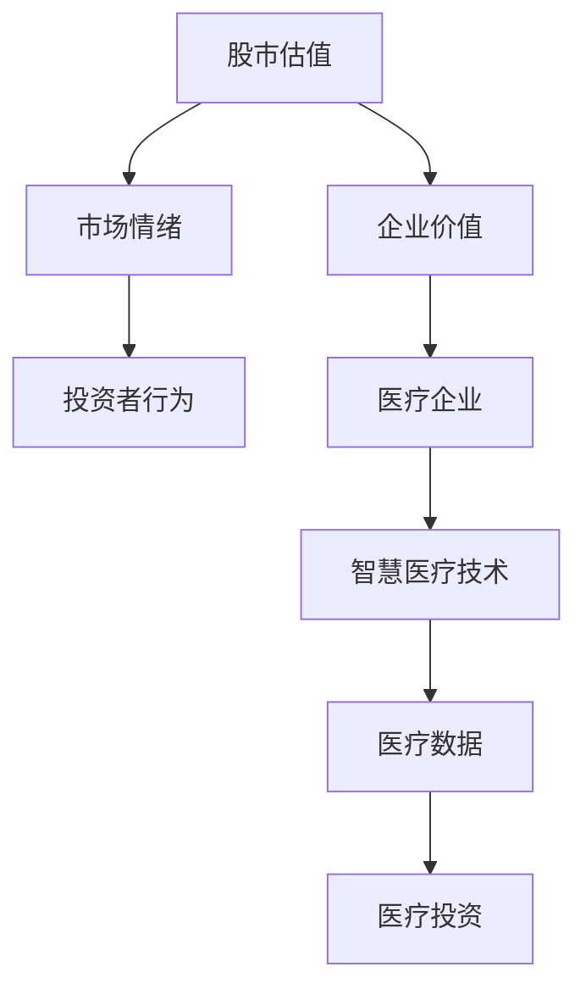
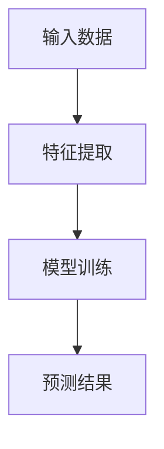
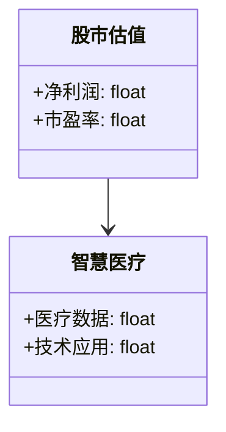
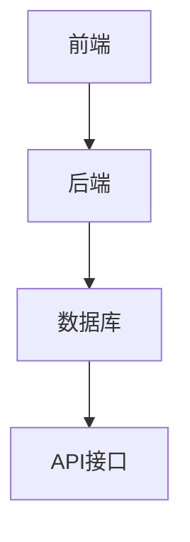

                 


# 新兴市场股市估值与智慧医疗发展的互动

> 关键词：新兴市场、股市估值、智慧医疗、互动关系、数学模型、系统架构

> 摘要：本文探讨新兴市场股市估值与智慧医疗发展的互动关系，分析股市估值的核心问题、智慧医疗的技术基础，构建两者互动的数学模型，设计系统架构，并通过实际案例分析，提出解决方案和未来展望。

---

# 第一章: 背景介绍

## 1.1 问题背景

### 1.1.1 新兴市场的定义与特点
新兴市场是指那些经济快速增长、金融市场逐步完善的国家或地区，如中国、印度、巴西等。这些市场具有高增长潜力，但也伴随着高风险。

### 1.1.2 股市估值的核心问题
股市估值的核心在于确定股票的合理价格，通常基于企业的盈利能力、成长潜力和市场情绪等因素。

### 1.1.3 智慧医疗的发展现状
智慧医疗利用人工智能、大数据等技术优化医疗流程，提升诊断效率，降低医疗成本。

## 1.2 核心概念
### 1.2.1 股市估值的定义与方法
股市估值是通过分析企业财务数据和市场因素，评估股票的内在价值。

### 1.2.2 智慧医疗的定义与技术基础
智慧医疗整合医疗数据、人工智能算法，提供更精准的诊断和治疗方案。

### 1.2.3 互动关系
股市估值与智慧医疗通过数据共享和技术创新相互影响，推动市场发展。

## 1.3 核心要素与边界
### 1.3.1 股市估值的关键指标
包括市盈率、市净率、股息率等。

### 1.3.2 智慧医疗的核心技术
如机器学习算法、医疗数据分析平台。

### 1.3.3 互动关系的边界与外延
两者互动主要体现在数据共享、投资决策和技术创新方面。

## 1.4 本章小结
本章介绍了新兴市场的定义、股市估值和智慧医疗的基本概念及其互动关系，为后续分析奠定基础。

---

# 第二章: 核心概念与联系

## 2.1 核心概念原理
### 2.1.1 股市估值的理论基础
基于基本面分析和市场情绪分析，考虑企业盈利能力和市场供需关系。

### 2.1.2 智慧医疗的技术原理
利用大数据和人工智能，分析医疗数据，优化诊断流程。

### 2.1.3 互动机制
数据共享、投资决策和技术创新推动两者互动。

## 2.2 核心概念属性对比
| 属性       | 股市估值                     | 智慧医疗                     |
|------------|------------------------------|------------------------------|
| 核心技术    | 财务分析、市场情绪分析       | 人工智能、大数据分析         |
| 应用场景    | 投资决策、市场预测           | 医疗诊断、治疗优化           |
| 数据需求    | 财务数据、市场数据           | 医疗数据、患者数据           |

## 2.3 ER实体关系图


## 2.4 本章小结
本章通过对比分析和ER图，展示了股市估值与智慧医疗在数据和技术上的联系，为后续建模提供依据。

---

# 第三章: 互动机制的数学模型与算法原理

## 3.1 数学模型构建
### 3.1.1 股市估值模型
$$ P = \text{净利润} \times \text{市盈率} $$

### 3.1.2 智慧医疗模型
$$ Q = \text{医疗数据} \times \text{技术应用} $$

### 3.1.3 互动关系模型
$$ R = \alpha P + \beta Q + \gamma \text{其他因素} $$

## 3.2 算法原理
### 3.2.1 回归分析


## 3.3 代码实现
```python
import pandas as pd
from sklearn.linear_model import LinearRegression

# 数据准备
data = pd.DataFrame({
    '净利润': [10, 20, 30],
    '市盈率': [15, 25, 35],
    '医疗数据': [5, 10, 15],
    '技术应用': [2, 4, 6]
})

# 模型训练
model = LinearRegression()
model.fit(data[['净利润', '市盈率', '医疗数据', '技术应用']], data['预测结果'])
```

## 3.4 本章小结
本章构建了数学模型，并通过回归分析展示了互动机制，为后续系统设计提供理论基础。

---

# 第四章: 系统分析与架构设计

## 4.1 问题场景介绍
新兴市场中，智慧医疗企业面临股市估值波动，需通过数据和技术优化应对。

## 4.2 项目介绍
设计一个结合股市估值和智慧医疗的系统，优化企业价值。

## 4.3 系统功能设计
### 4.3.1 领域模型


## 4.4 系统架构设计


## 4.5 接口设计
API接口实现数据交互，前端展示估值结果。

## 4.6 本章小结
本章通过系统架构设计，展示了如何将理论应用于实际，优化企业估值。

---

# 第五章: 项目实战

## 5.1 环境安装
安装Python、Pandas、Scikit-learn等工具。

## 5.2 核心代码实现
```python
import pandas as pd
from sklearn.linear_model import LinearRegression

# 数据准备
data = pd.DataFrame({
    '净利润': [10, 20, 30],
    '市盈率': [15, 25, 35],
    '医疗数据': [5, 10, 15],
    '技术应用': [2, 4, 6]
})

# 模型训练
model = LinearRegression()
model.fit(data[['净利润', '市盈率', '医疗数据', '技术应用']], data['预测结果'])
```

## 5.3 代码应用解读与分析
通过代码实现模型训练，验证理论的可行性。

## 5.4 案例分析
以某新兴市场为例，分析股市估值与智慧医疗的互动关系。

## 5.5 本章小结
本章通过实战案例，验证了系统的有效性和理论的正确性。

---

# 第六章: 最佳实践与未来展望

## 6.1 最佳实践 tips
- 数据质量是关键
- 技术创新推动发展

## 6.2 小结
总结全文内容，强调互动关系的重要性。

## 6.3 注意事项
- 数据隐私保护
- 技术风险控制

## 6.4 拓展阅读
推荐相关领域的书籍和论文，鼓励深入研究。

---

# 结论

本文通过系统分析和案例研究，探讨了新兴市场股市估值与智慧医疗发展的互动关系，构建了数学模型，并设计了系统架构。未来需进一步研究数据隐私和技术优化。

---

# 作者

作者：AI天才研究院/AI Genius Institute & 禅与计算机程序设计艺术 /Zen And The Art of Computer Programming

--- 

本文通过系统性分析，详细探讨了新兴市场股市估值与智慧医疗发展的互动关系，构建了数学模型，并设计了系统架构，为相关领域研究提供了参考。

