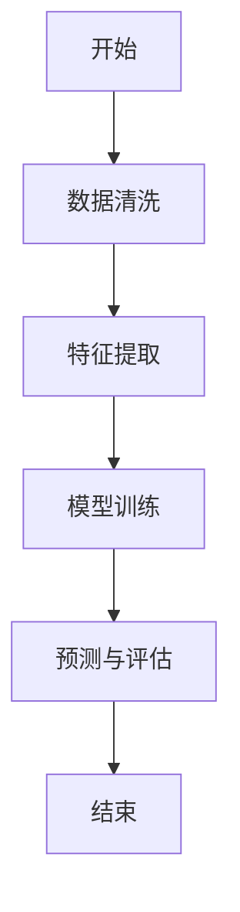
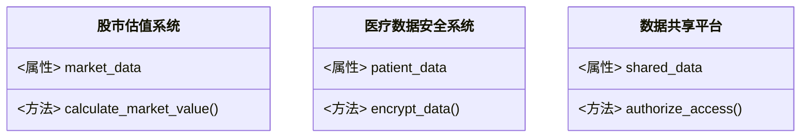
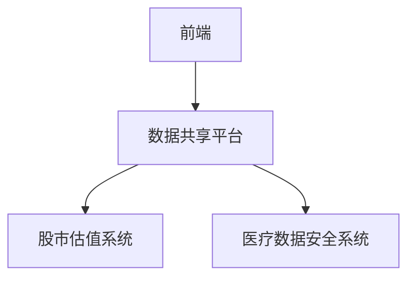

                 


# 《新兴市场股市估值与智慧医疗数据安全的互动》

---

## 关键词：新兴市场、股市估值、智慧医疗、数据安全、互动机制、算法原理、系统设计

---

## 摘要：  
本文探讨新兴市场股市估值与智慧医疗数据安全之间的互动关系，从数据驱动的视角分析股市估值的核心算法与智慧医疗数据安全的关键技术。通过构建数学模型和系统架构，揭示两者在数据共享、隐私保护、风险评估等方面的互动机制，并提出解决方案。文章结合实际案例，深入分析互动中的技术挑战与解决方案，为相关领域的研究和实践提供参考。

---

## 第1章：背景与概述

### 1.1 问题背景与核心概念

#### 1.1.1 新兴市场股市估值的核心问题
- 新兴市场的经济特点：增长快、波动大、数据不完善。
- 股市估值的关键挑战：数据稀缺性、市场不透明性、投资者行为的复杂性。

#### 1.1.2 智慧医疗数据安全的核心问题
- 医疗数据的敏感性：患者隐私、医疗记录的安全性。
- 数据共享的挑战：数据分割、隐私保护与数据利用的平衡。

#### 1.1.3 两者的互动关系与研究意义
- 数据共享对股市估值的影响：医疗数据如何辅助股市分析。
- 股市波动对医疗数据安全的反向影响：市场波动如何影响医疗数据的敏感性。

### 1.2 问题描述与解决路径

#### 1.2.1 股市估值的复杂性
- 数据的不完整性和噪声。
- 市场参与者的异质性。

#### 1.2.2 智慧医疗数据安全的风险
- 数据泄露的后果。
- 技术漏洞对患者隐私的影响。

#### 1.2.3 互动机制与问题解决
- 数据共享的技术与伦理问题。
- 如何在互动中实现双赢。

### 1.3 边界与外延

#### 1.3.1 新兴市场的界定
- 经济指标、市场规模、政策环境。

#### 1.3.2 智慧医疗的定义与范围
- 技术应用、数据类型、服务范围。

#### 1.3.3 互动的边界条件
- 数据共享的范围、隐私保护的限度。

### 1.4 核心要素与概念结构

#### 1.4.1 股市估值的关键因素
- 市盈率、市净率、现金流、收益增长率。

#### 1.4.2 数据安全的核心要素
- 数据分类、访问控制、加密技术。

#### 1.4.3 互动机制的核心结构
- 数据流、利益相关者、技术支撑。

---

## 第2章：核心概念与联系

### 2.1 核心概念原理

#### 2.1.1 股市估值的原理
- 基于历史数据的回归分析。
- 通过市场情绪预测波动。

#### 2.1.2 智慧医疗数据安全的原理
- 数据加密技术。
- 访问控制策略。

### 2.2 概念属性对比分析

| 属性 | 股市估值 | 智慧医疗数据安全 |
|------|----------|------------------|
| 数据类型 | 价格、收益、财务指标 | 患者信息、诊疗记录、健康数据 |
| 数据特征 | 时间序列性、相关性 | 敏感性、隐私性 |
| 数据处理 | 清洗、建模、预测 | 加密、脱敏、访问控制 |

### 2.3 ER实体关系图

```mermaid
erd
entity 股市估值 {
  key 市场代码
  市场指数
  市盈率
}

entity 医疗数据安全 {
  key 病例ID
  患者信息
  医疗记录
}

relation 数据共享关系 {
  股市估值 -->> 医疗数据安全
  关联字段： market_code, case_id
}
```

---

## 第3章：算法原理讲解

### 3.1 数据挖掘算法



#### 3.1.1 Python代码实现

```python
import pandas as pd
from sklearn.tree import DecisionTreeRegressor

# 数据清洗
data = pd.read_csv('market_data.csv')
data = data.dropna()

# 特征提取
features = ['market_index', 'PE_ratio']
target = 'market_value'

# 模型训练
model = DecisionTreeRegressor()
model.fit(data[features], data[target])

# 预测与评估
print(model.predict(data[features]))
print(model.score(data[features], data[target]))
```

### 3.2 数学模型

#### 3.2.1 股市估值模型

$$ P(t) = \alpha \cdot P(t-1) + \beta \cdot E(t) $$

其中：
- $P(t)$ 表示时间 $t$ 的股票价格。
- $\alpha$ 和 $\beta$ 是模型参数。
- $E(t)$ 表示市场预期。

#### 3.2.2 数据安全模型

$$ S = \sum_{i=1}^{n} w_i \cdot x_i $$

其中：
- $S$ 表示安全评分。
- $w_i$ 表示权重。
- $x_i$ 表示安全指标。

---

## 第4章：系统分析与架构设计

### 4.1 问题场景介绍

- 数据共享平台的设计。
- 数据安全与隐私保护。

### 4.2 领域模型类图



### 4.3 系统架构图



### 4.4 接口与交互设计

- 前端接口：`GET /market-value`
- 后端接口：`POST /encrypt-data`

---

## 第5章：项目实战

### 5.1 环境安装

```bash
pip install pandas sklearn matplotlib
```

### 5.2 核心代码实现

```python
import pandas as pd
from sklearn.ensemble import RandomForestRegressor

# 数据加载与预处理
data = pd.read_csv('medical_data.csv')
data = data.dropna()

# 特征工程
features = ['age', 'gender', 'diagnosis']
target = 'risk_score'

# 模型训练
model = RandomForestRegressor()
model.fit(data[features], data[target])

# 模型预测
print(model.predict([[30, 'M', '糖尿病']]))
```

### 5.3 案例分析

- 数据共享对股市估值的影响：医疗数据如何改善股市预测。
- 数据安全的技术实现：如何防止数据泄露。

---

## 第6章：最佳实践

### 6.1 实践总结

- 数据共享是关键，但需谨慎处理隐私问题。
- 技术与政策的结合是互动机制的核心。

### 6.2 注意事项

- 定期更新安全策略。
- 加强技术团队的协作。

### 6.3 拓展阅读

- 推荐书籍：《数据挖掘与机器学习实战》。
- 推荐博客：技术博客分享相关领域的最新进展。

---

## 作者：AI天才研究院/AI Genius Institute & 禅与计算机程序设计艺术 /Zen And The Art of Computer Programming

