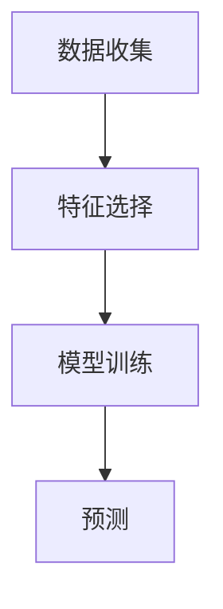
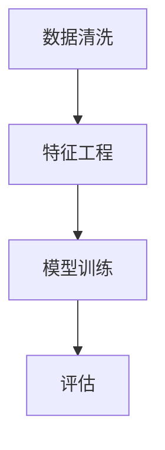
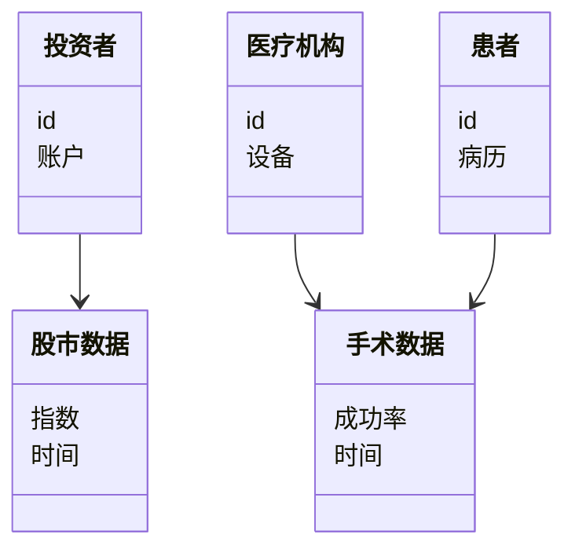
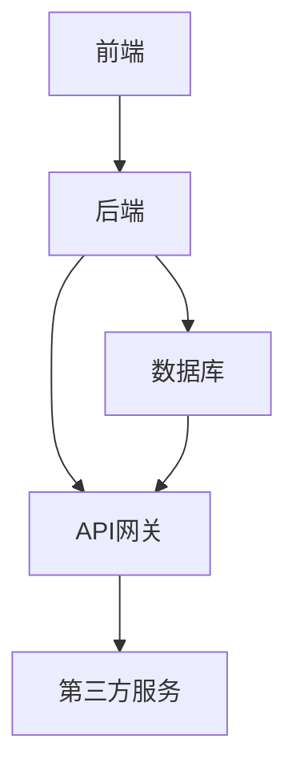
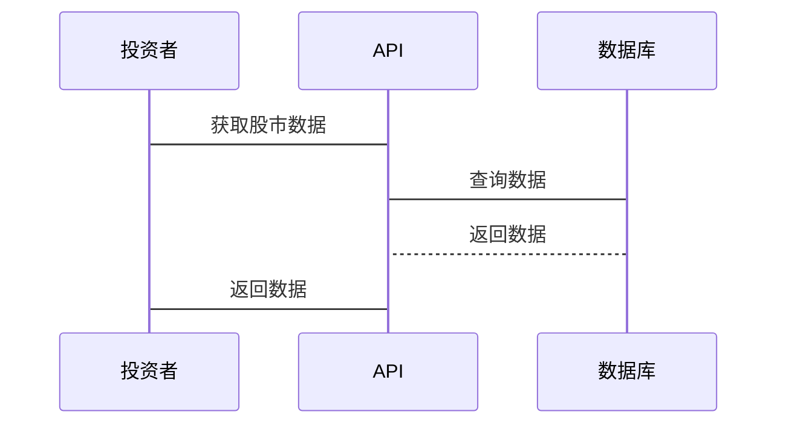

                 


```markdown
# 新兴市场股市估值与智慧医疗远程手术的互动

> 关键词：新兴市场，股市估值，智慧医疗，远程手术，互动

> 摘要：本文探讨新兴市场股市估值与智慧医疗远程手术之间的互动关系，分析其经济和技术影响，提出系统解决方案和实际案例。

# 第1章: 背景介绍

## 1.1 问题背景

### 1.1.1 新兴市场的定义与特点
- 新兴市场：指经济快速发展的国家，如中国、印度等。
- 特点：高增长率、较大的市场波动性。

### 1.1.2 智慧医疗远程手术的兴起
- 定义：利用互联网和AI技术进行远程医疗手术。
- 发展原因：技术进步、医疗资源不足。

### 1.1.3 两者互动的经济与技术背景
- 经济背景：新兴市场经济增长带来股市波动和医疗需求增加。
- 技术背景：5G、AI的发展推动远程医疗技术进步。

## 1.2 问题描述

### 1.2.1 新兴市场股市估值的波动性
- 股市波动：新兴市场受政策和经济因素影响大。
- 投资者行为：情绪化投资影响股市估值。

### 1.2.2 智慧医疗远程手术的技术挑战
- 技术难题：延迟、数据安全、设备兼容性。
- 医疗风险：手术精度和患者安全问题。

### 1.2.3 两者互动的核心问题
- 核心问题：股市波动如何影响医疗投资，远程手术如何受股市影响。

## 1.3 问题解决

### 1.3.1 新兴市场股市估值的分析方法
- 技术分析：利用K线图、均线分析。
- 基本面分析：GDP、企业利润等指标。

### 1.3.2 智慧医疗远程手术的技术解决方案
- 低延迟网络：5G技术。
- 数据安全：加密传输和区块链技术。

### 1.3.3 两者互动的机制与路径
- 股市资金流向医疗企业，影响手术设备投资。
- 医疗技术进步影响股市投资价值。

## 1.4 边界与外延

### 1.4.1 新兴市场股市估值的边界条件
- 数据范围：特定时间、地区。
- 方法限制：分析模型的适用性。

### 1.4.2 智慧医疗远程手术的适用范围
- 适合慢性病、常规手术。
- 不适用于急诊和复杂手术。

### 1.4.3 两者互动的外延影响
- 经济：影响GDP和就业。
- 社会：改善医疗资源分配，降低医疗成本。

## 1.5 概念结构与核心要素

### 1.5.1 新兴市场股市估值的核心要素
- 经济指标：GDP增长率、通货膨胀率。
- 市场因素：投资者情绪、市场流动性。

### 1.5.2 智慧医疗远程手术的核心要素
- 技术要素：5G、AI、物联网。
- 医疗要素：手术类型、医疗团队。

### 1.5.3 两者互动的系统结构
- 数据流：股市数据→医疗投资→手术设备。
- 信息交互：医疗需求→股市资金流动。

## 1.6 本章小结
本章介绍了新兴市场和智慧医疗远程手术的背景，分析了它们的互动关系，为后续章节奠定了基础。

# 第2章: 核心概念与联系

## 2.1 核心概念原理

### 2.1.1 新兴市场股市估值的理论基础
- 技术分析：价格反映市场信息。
- 基本面分析：企业价值决定股价。

### 2.1.2 智慧医疗远程手术的技术原理
- 5G支持高速数据传输。
- AI辅助诊断和手术规划。

### 2.1.3 两者互动的机制分析
- 股市资金流向影响医疗技术投资。
- 医疗技术进步推动股市估值上升。

## 2.2 核心概念属性对比

### 2.2.1 新兴市场股市估值与智慧医疗远程手术的属性对比表格
| 属性 | 新兴市场股市估值 | 智慧医疗远程手术 |
|------|------------------|------------------|
| 核心目标 | 评估市场价值 | 提供远程医疗服务 |
| 主要影响因素 | 经济指标、政策 | 技术水平、网络 |
| 实施难度 | 高 | 中 |

## 2.3 ER实体关系图
```mermaid
er
  actor:投资者
  actor:医疗机构
  actor:患者
  entity:股市数据
  entity:手术数据
  entity:政策法规
  

  -- 投资者参与股市
  投资者 --> 股市数据

  -- 医疗机构提供手术
  医疗机构 --> 手术数据

  -- 患者接受手术
  患者 --> 手术数据

  -- 政策影响股市和手术
  政策法规 --> 股市数据
  政策法规 --> 手术数据
```

## 2.4 本章小结
本章通过对比和ER图，展示了新兴市场股市估值与智慧医疗远程手术的核心概念及其联系。

# 第3章: 算法原理

## 3.1 算法原理概述

### 3.1.1 股市估值预测算法
- 线性回归：预测股市指数。
- 算法步骤：数据收集、特征选择、模型训练、预测。

### 3.1.2 远程手术成功率预测算法
- 逻辑回归：预测手术成功概率。
- 算法步骤：数据清洗、特征工程、模型训练、评估。

## 3.2 算法实现

### 3.2.1 股市估值预测算法流程图


### 3.2.2 远程手术成功率预测算法流程图


### 3.2.3 Python代码实现

#### 股市估值预测代码
```python
import pandas as pd
from sklearn.linear_model import LinearRegression

# 数据加载
data = pd.read_csv('stock_data.csv')

# 特征选择
features = data[['GDP', 'Inflation']]
target = data['Stock_Index']

# 模型训练
model = LinearRegression()
model.fit(features, target)

# 预测
predictions = model.predict(features)
```

#### 远程手术成功率预测代码
```python
import pandas as pd
from sklearn.linear_model import LogisticRegression

# 数据加载
data = pd.read_csv('surgery_data.csv')

# 特征工程
features = data[['Network_Delay', 'AI_Accuracy']]
target = data['Success']

# 模型训练
model = LogisticRegression()
model.fit(features, target)

# 预测
predictions = model.predict(features)
```

### 3.2.4 数学模型

#### 股市估值预测模型
$$ Y = aX + b $$
其中，Y是股市指数，X是自变量，a和b是参数。

#### 远程手术成功率预测模型
$$ P(y=1|x) = \frac{1}{1 + e^{-wx - b}} $$
其中，w是权重，b是偏置，x是输入特征。

## 3.3 算法实现细节

### 3.3.1 数据清洗
- 删除缺失值。
- 处理异常值。

### 3.3.2 特征选择
- GDP、通货膨胀率、网络延迟、AI准确性。

### 3.3.3 模型训练
- 使用训练集，调整参数。
- 验证集评估模型性能。

### 3.3.4 模型评估
- 股市预测：均方误差、R²。
- 手术成功率：准确率、F1分数。

## 3.4 本章小结
本章详细讲解了股市估值和手术成功率的预测算法，提供了代码示例和数学模型。

# 第4章: 系统分析与架构设计

## 4.1 问题场景介绍

### 4.1.1 场景描述
- 医疗机构提供远程手术。
- 投资者关注股市动态。

### 4.1.2 问题分析
- 如何实时监控股市数据。
- 如何确保手术数据安全传输。

## 4.2 系统功能设计

### 4.2.1 领域模型


### 4.2.2 系统架构设计


### 4.2.3 系统接口设计
- 前端接口：显示数据。
- 后端接口：处理数据请求。
- 数据库接口：存储和检索数据。

### 4.2.4 系统交互序列图


## 4.3 本章小结
本章分析了系统需求，设计了领域模型、架构图和接口，展示了系统如何互动。

# 第5章: 项目实战

## 5.1 环境安装

### 5.1.1 系统要求
- Python 3.8+
- Jupyter Notebook
- Pandas、Scikit-learn

### 5.1.2 安装依赖
```bash
pip install pandas scikit-learn
```

## 5.2 系统核心实现

### 5.2.1 股市估值预测代码
```python
import pandas as pd
from sklearn.linear_model import LinearRegression

# 数据加载
data = pd.read_csv('stock_data.csv')

# 特征选择
features = data[['GDP', 'Inflation']]
target = data['Stock_Index']

# 模型训练
model = LinearRegression()
model.fit(features, target)

# 预测
predictions = model.predict(features)
```

### 5.2.2 远程手术成功率预测代码
```python
import pandas as pd
from sklearn.linear_model import LogisticRegression

# 数据加载
data = pd.read_csv('surgery_data.csv')

# 特征工程
features = data[['Network_Delay', 'AI_Accuracy']]
target = data['Success']

# 模型训练
model = LogisticRegression()
model.fit(features, target)

# 预测
predictions = model.predict(features)
```

## 5.3 案例分析与解读

### 5.3.1 股市案例
- 数据来源：新兴市场股市数据。
- 分析结果：模型预测的准确性。

### 5.3.2 远程手术案例
- 数据来源：某医院的手术数据。
- 分析结果：手术成功率与网络延迟的关系。

## 5.4 本章小结
本章通过实际案例，展示了系统的实现和应用。

# 第6章: 最佳实践

## 6.1 小结
- 新兴市场股市估值与智慧医疗远程手术互动的重要性。
- 系统设计的关键点。

## 6.2 注意事项
- 数据质量：确保数据准确。
- 模型选择：根据需求选择合适的算法。
- 系统安全：确保数据传输安全。

## 6.3 拓展阅读
- 推荐书籍：《算法导论》、《机器学习实战》。
- 推荐资源：Kaggle数据集、学术论文。

## 6.4 本章小结
本章总结了项目的最佳实践，提供了注意事项和拓展资源。

# 作者

作者：AI天才研究院/AI Genius Institute & 禅与计算机程序设计艺术 /Zen And The Art of Computer Programming
```

