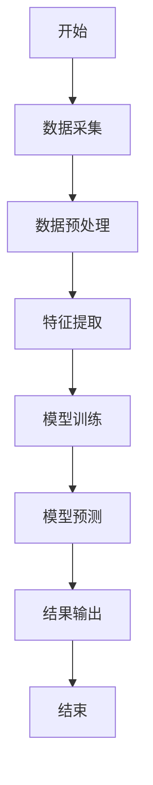

                 


# 新兴市场股市估值与智慧城市5G+AI应用的互动

> 关键词：新兴市场，股市估值，智慧城市，5G，AI，互动分析，技术应用

> 摘要：本文探讨新兴市场股市估值与智慧城市5G+AI应用之间的互动关系。通过分析股市估值的核心算法和智慧城市5G+AI应用的技术原理，结合实际案例，揭示两者如何相互影响，为投资者和决策者提供参考。

---

## 第一部分：背景介绍

### 第1章：核心概念背景

#### 1.1 新兴市场股市估值的定义与特点
- 新兴市场的定义：指经济发展迅速、金融市场尚未完全成熟但潜力巨大的国家或地区。
- 股市估值的核心：通过分析宏观经济指标、公司基本面和市场情绪等因素，预测股票价格的变化趋势。
- 特点：
  - 数据波动性大
  - 影响因素复杂
  - 投资风险较高

#### 1.2 智慧城市5G+AI应用的定义与特点
- 智慧城市：利用5G、AI、物联网等技术，实现城市资源优化配置和高效管理。
- 5G+AI的核心：5G提供高速数据传输，AI负责数据分析与决策支持。
- 特点：
  - 技术集成度高
  - 数据处理能力强
  - 应用场景广泛

#### 1.3 互动关系与研究意义
- 互动关系：智慧城市5G+AI应用会影响新兴市场的经济活动，从而影响股市估值；反之，股市估值的变化也能反映智慧城市技术的应用情况。
- 研究意义：通过分析两者的互动，为投资者和政策制定者提供决策支持。

### 第2章：核心问题与边界外延

#### 2.1 新兴市场股市估值的核心问题
- 数据质量与完整性：新兴市场数据采集困难，影响估值准确性。
- 模型选择：如何选择合适的算法来预测股市走势。
- 风险控制：如何降低投资风险。

#### 2.2 智慧城市5G+AI应用的核心问题
- 技术整合：如何高效整合5G和AI技术。
- 数据隐私：如何保护用户数据隐私。
- 系统稳定性：如何确保系统的高可用性。

#### 2.3 边界与外延
- 边界：研究仅限于股市估值与智慧城市5G+AI应用的直接互动。
- 外延：未来可能扩展到其他领域，如区块链、物联网等。

---

## 第二部分：核心概念与联系

### 第3章：核心概念原理

#### 3.1 新兴市场股市估值的原理
- 数据来源：宏观经济数据、公司财务数据、市场情绪数据。
- 分析方法：技术分析（如K线图）与基本面分析结合。

#### 3.2 智慧城市5G+AI应用的原理
- 5G提供高速网络支持，AI负责数据分析与决策。
- 核心技术：数据采集、传输、存储、分析与反馈。

#### 3.3 互动机制
- 数据共享：智慧城市生成大量数据，影响股市估值。
- 技术驱动：5G和AI技术的进步推动股市估值模型的优化。

### 第4章：概念属性特征对比

#### 4.1 属性特征对比表格

| 属性 | 新兴市场股市估值 | 智慧城市5G+AI应用 |
|------|----------------|------------------|
| 核心目标 | 预测股票价格 | 提升城市管理效率 |
| 数据来源 | 财务报表、市场情绪 | 物联网数据、传感器数据 |
| 技术依赖 | 统计模型、机器学习 | 5G网络、AI算法 |
| 风险因素 | 市场波动、政策风险 | 技术故障、数据隐私 |

#### 4.2 ER实体关系图

```mermaid
er
actor:投资者
database:新兴市场股市数据
database:智慧城市5G+AI应用数据
```

---

## 第三部分：算法原理讲解

### 第5章：算法原理

#### 5.1 新兴市场股市估值算法
- 线性回归模型：
  $$ y = \beta_0 + \beta_1x + \epsilon $$
  其中，y为股票价格，x为宏观经济指标。

#### 5.2 智慧城市5G+AI应用算法
- 基于AI的预测模型：
  $$ y = f(x_1, x_2, ..., x_n) $$
  其中，x_i为输入特征，f为AI模型。

#### 5.3 互动关系的算法模型
- 联合预测模型：
  $$ y_{\text{stock}} = \alpha y_{\text{AI}} + \beta y_{\text{macro}} + \gamma $$
  其中，y_stock为股票价格，y_AI为AI应用指数，y_macro为宏观经济指标。

### 第6章：算法流程图与代码实现

#### 6.1 流程图



#### 6.2 Python源代码实现

```python
import pandas as pd
from sklearn.linear_model import LinearRegression

# 新兴市场股市数据
market_data = pd.read_csv('market.csv')

# 智慧城市5G+AI应用数据
ai_data = pd.read_csv('ai.csv')

# 数据合并与分析
combined_data = pd.merge(market_data, ai_data, on='date')

# 模型训练
model = LinearRegression()
model.fit(combined_data[['gdp_growth', 'ai_index']], combined_data['stock_price'])

# 模型预测
predicted_price = model.predict([[5.5, 85]])
```

---

## 第四部分：系统分析与架构设计

### 第7章：系统分析

#### 7.1 问题场景介绍
- 投资者希望利用5G和AI技术预测新兴市场股市走势。
- 智慧城市需要优化5G+AI应用以提升效率。

#### 7.2 系统功能设计

#### 7.3 系统架构设计


---

## 第五部分：项目实战

### 第8章：项目实战

#### 8.1 环境安装
- Python 3.8+
- NumPy、Pandas、Scikit-learn

#### 8.2 核心实现

```python
import numpy as np
import pandas as pd
from sklearn.model import LinearRegression

# 数据加载与预处理
data = pd.read_csv('data.csv')
data = data.dropna()

# 特征选择
features = ['gdp_growth', 'unemployment_rate', 'ai_index']
target = 'stock_price'

# 模型训练
model = LinearRegression()
model.fit(data[features], data[target])

# 模型预测
new_data = pd.DataFrame({
    'gdp_growth': [5.2],
    'unemployment_rate': [4.5],
    'ai_index': [80]
})
predicted_price = model.predict(new_data[features])
print(predicted_price)
```

---

## 第六部分：最佳实践与总结

### 第9章：总结与展望

#### 9.1 关键点回顾
- 数据质量与模型选择的重要性。
- 5G和AI技术在股市估值中的应用潜力。

#### 9.2 小结
通过分析新兴市场股市估值与智慧城市5G+AI应用的互动，我们揭示了技术与经济之间的深层联系。

#### 9.3 注意事项
- 数据隐私与安全问题。
- 模型的实时性与可解释性。

#### 9.4 拓展阅读
建议读者进一步研究区块链技术在股市估值中的应用。

---

作者：AI天才研究院（AI Genius Institute） & 禅与计算机程序设计艺术（Zen And The Art of Computer Programming）

