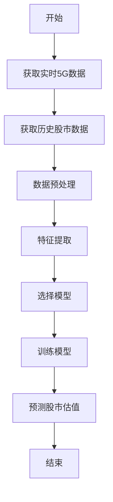

                 


# 新兴市场股市估值与智慧城市5G应用的互动

## 关键词：新兴市场、股市估值、智慧城市、5G、数据驱动

## 摘要：本文探讨新兴市场股市估值与智慧城市5G应用之间的互动关系，分析数据驱动的5G技术如何影响股市估值，以及智慧城市中的5G应用如何反过来推动股市发展。文章从背景、核心概念、算法、系统设计到项目实战，全面解析两者互动机制。

---

## 第一部分：背景介绍

### 第1章：新兴市场股市估值与智慧城市5G应用的互动概述

#### 1.1 问题背景与描述
- **1.1.1 新兴市场股市的特点与发展现状**
  - 新兴市场股市：高增长潜力、波动性大、参与者多元化。
  - 当前发展：数字化转型加速，投资者行为变化，政策监管加强。
- **1.1.2 智慧城市5G应用的兴起与技术优势**
  - 5G技术：高速率、低延迟、大规模连接。
  - 应用场景：智能交通、物联网、远程医疗、智慧城市管理。
- **1.1.3 两者的互动关系与研究意义**
  - 数据共享：股市数据与城市运行数据的结合。
  - 技术驱动：5G技术提升股市分析能力，同时智慧城市发展促进5G技术应用。
  - 经济影响：智慧城市5G应用推动经济增长，反过来影响股市估值。

#### 1.2 核心概念与边界
- **1.2.1 股市估值的核心要素**
  - 市盈率（P/E）、市净率（P/B）、股息率、ROE。
  - 新兴市场的特殊性：高波动性、政策敏感性。
- **1.2.2 智慧城市5G应用的关键技术**
  - 网络切片、边缘计算、物联网（IoT）、大数据分析。
  - 5G在智慧城市中的应用：实时数据传输、智能决策支持。
- **1.2.3 互动关系的边界与外延**
  - 互动边界：数据共享与技术应用的范围。
  - 外延：政策、经济、技术的综合影响。

#### 1.3 核心概念结构与组成
- **1.3.1 股市估值模型的构成**
  - 数据输入：历史股价、财务数据、市场情绪。
  - 模型输出：估值指标（如PEG、EV/EBITDA）。
- **1.3.2 智慧城市5G应用的系统架构**
  - 数据采集层：IoT传感器、5G网络。
  - 数据处理层：边缘计算、实时分析。
  - 应用层：智能交通、环境监测、公共安全。
- **1.3.3 互动机制的实体关系图**
  ```mermaid
  er
  entity 股市数据 (Stock Data) {
      id: int
      股票代码: string
      价格: float
      时间戳: datetime
  }
  entity 智慧城市数据 (Smart City Data) {
      id: int
      设备ID: string
      数据类型: string
      时间戳: datetime
  }
  entity 互动关系 (Interaction) {
      id: int
      股市数据ID: int
      智慧城市数据ID: int
      影响程度: int
  }
  relation 股市数据与互动关系 (M:N)
  relation 智慧城市数据与互动关系 (M:N)
  ```

---

## 第二部分：核心概念与联系

### 第2章：股市估值与智慧城市5G应用的核心原理

#### 2.1 核心概念原理
- **2.1.1 股市估值的基本原理与方法**
  - 基本方法：相对估值（市盈率、市净率）与绝对估值（DCF模型）。
  - 新兴市场的特殊性：高波动性、政策影响大。
- **2.1.2 智慧城市5G应用的技术原理**
  - 5G技术优势：高速率、低延迟、大规模连接。
  - 数据传输与处理：实时数据传输、边缘计算支持。

#### 2.2 概念属性特征对比
- **2.2.1 股市估值的属性特征**
  | 属性 | 描述 |
  |------|------|
  | 数据来源 | 历史股价、财务报表、市场情绪 |
  | 方法 | 相对估值、绝对估值 |
  | 影响因素 | 宏观经济、行业趋势、公司基本面 |
- **2.2.2 智慧城市5G应用的属性特征**
  | 属性 | 描述 |
  |------|------|
  | 技术基础 | 5G网络、物联网、边缘计算 |
  | 应用场景 | 智能交通、环境监测、公共安全 |
  | 数据处理 | 实时、海量数据 |
- **2.2.3 对比分析与表格总结**
  | 属性 | 股市估值 | 智慧城市5G应用 |
  |------|----------|-----------------|
  | 数据类型 | 金融数据 | 物理数据 |
  | 数据量 | 中等 | 大规模 |
  | 数据实时性 | 低 | 高 |
  | 技术依赖 | 统计分析 | 大数据分析 |

#### 2.3 ER实体关系图
```mermaid
er
    entity 股市 (Stock Market) {
        id: int
        名称: string
        市场指数: float
    }
    entity 智慧城市 (Smart City) {
        id: int
        名称: string
        5G网络覆盖: bool
    }
    entity 互动关系 (Interaction) {
        id: int
        股市id: int
        智慧城市id: int
        影响程度: int
    }
    relation 股市与互动关系 (M:N)
    relation 智慧城市与互动关系 (M:N)
```

---

## 第三部分：算法原理与数学模型

### 第3章：互动机制的算法与模型

#### 3.1 算法原理
- **3.1.1 基于5G数据的股市预测模型**
  - 数据来源：智慧城市中的实时5G数据（如交通流量、环境数据）。
  - 模型输入：实时5G数据、历史股市数据。
  - 模型输出：预测的股市估值指标。

#### 3.2 算法流程图


#### 3.3 数学模型与公式
- **时间序列分析模型（ARIMA）**
  - 模型公式：
    $$ ARIMA(p, d, q) = \phi(B) (1 - B)^d X_t = \theta(B) \epsilon_t $$
  - 参数说明：
    - p：自回归阶数。
    - d：差分阶数。
    - q：移动平均阶数。
  - 应用场景：预测股市未来的走势。

- **机器学习模型（LSTM）**
  - 模型公式：
    $$ LSTM(input, hidden) = \begin{cases}
    f gates \\
    i gates \\
    o gates \\
    \end{cases} $$
  - 优势：适合处理时间序列数据，捕捉长期依赖关系。

#### 3.4 算法实现代码示例
```python
import numpy as np
from sklearn.preprocessing import MinMaxScaler
from keras.models import Sequential
from keras.layers import LSTM, Dense, Dropout

# 数据预处理
data = np.array(stock_data).reshape(-1, 1)
scaler = MinMaxScaler()
scaled_data = scaler.fit_transform(data)

# 划分训练集和测试集
train_size = int(len(scaled_data) * 0.8)
train_data = scaled_data[:train_size]
test_data = scaled_data[train_size:]

# 创建训练样本
X_train = []
y_train = []
for i in range(60, len(train_data)):
    X_train.append(train_data[i-60:i])
    y_train.append(train_data[i])

X_train = np.array(X_train)
y_train = np.array(y_train)

# 模型构建
model = Sequential()
model.add(LSTM(units=50, return_sequences=True, input_shape=(60,1)))
model.add(Dropout(0.2))
model.add(LSTM(units=50, return_sequences=False))
model.add(Dense(1))

model.compile(loss='mean_squared_error', optimizer='adam')

# 训练模型
model.fit(X_train, y_train, epochs=50, batch_size=32)
```

---

## 第四部分：系统分析与架构设计方案

### 第4章：系统架构与设计

#### 4.1 项目介绍
- **项目目标**：构建一个结合股市估值与智慧城市5G应用的实时数据分析系统。
- **项目范围**：涵盖数据采集、处理、分析、可视化。

#### 4.2 系统功能设计
- **数据采集模块**：
  - 从股市API获取实时股价数据。
  - 从智慧城市传感器获取实时5G数据。
- **数据处理模块**：
  - 数据清洗、特征提取、数据转换。
- **数据分析模块**：
  - 应用时间序列分析模型预测股市估值。
  - 应用机器学习模型优化预测结果。
- **数据可视化模块**：
  - 可视化预测结果与实际数据对比。

#### 4.3 系统架构设计


---

## 第五部分：项目实战

### 第5章：项目实现与案例分析

#### 5.1 环境配置
- **开发环境**：Python 3.8+，Jupyter Notebook。
- **依赖库安装**：numpy、pandas、keras、tensorflow、scikit-learn。

#### 5.2 核心代码实现
```python
# 数据采集模块
import requests
import json

def get_stock_data(api_key):
    endpoint = f"https://api.example.com/stock?api_key={api_key}"
    response = requests.get(endpoint)
    return json.loads(response.text)

# 数据处理模块
from sklearn.preprocessing import MinMaxScaler

def preprocess_data(data):
    scaler = MinMaxScaler()
    scaled_data = scaler.fit_transform(data)
    return scaled_data

# 数据分析模块
from keras.models import load_model

def predict_stock_value(model, scaled_data):
    X_test = []
    for i in range(60, len(scaled_data)):
        X_test.append(scaled_data[i-60:i])
    X_test = np.array(X_test)
    predicted = model.predict(X_test)
    return scaler.inverse_transform(predicted)

# 数据可视化模块
import matplotlib.pyplot as plt

def visualize_results(actual, predicted):
    plt.plot(actual, label='Actual')
    plt.plot(predicted, label='Predicted')
    plt.xlabel('Time')
    plt.ylabel('Stock Value')
    plt.legend()
    plt.show()
```

#### 5.3 案例分析
- **案例背景**：假设一个新兴市场国家，股市受到智慧城市5G应用的影响。
- **数据获取**：获取该国股市的历史数据和智慧城市中的实时5G数据。
- **模型训练**：使用上述代码训练LSTM模型。
- **结果分析**：对比实际股价与预测股价，评估模型准确性。

---

## 第六部分：最佳实践与总结

### 第6章：总结与展望

#### 6.1 最佳实践 tips
- 数据质量：确保数据准确、完整。
- 模型选择：根据数据特点选择合适的算法。
- 系统优化：实时监控系统性能，及时调整模型参数。

#### 6.2 小结
- 本文通过分析新兴市场股市估值与智慧城市5G应用的互动关系，提出了数据驱动的5G技术在股市分析中的应用。
- 通过系统架构设计与项目实战，展示了如何利用5G技术优化股市估值模型。

#### 6.3 注意事项
- 数据隐私：保护用户数据隐私，遵守相关法律法规。
- 模型局限：算法的局限性，如过拟合、数据稀疏性。

#### 6.4 拓展阅读
- 《Data-driven Smart City Applications》
- 《Time Series Analysis and Forecasting》

---

## 作者：AI天才研究院/AI Genius Institute & 禅与计算机程序设计艺术/Zen And The Art of Computer Programming

