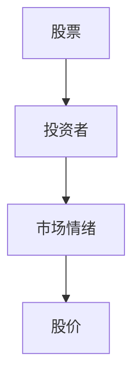
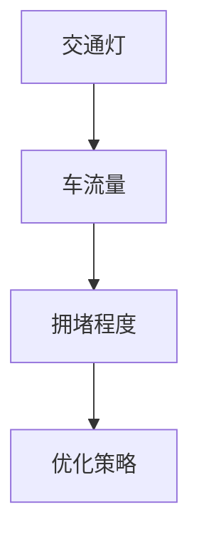
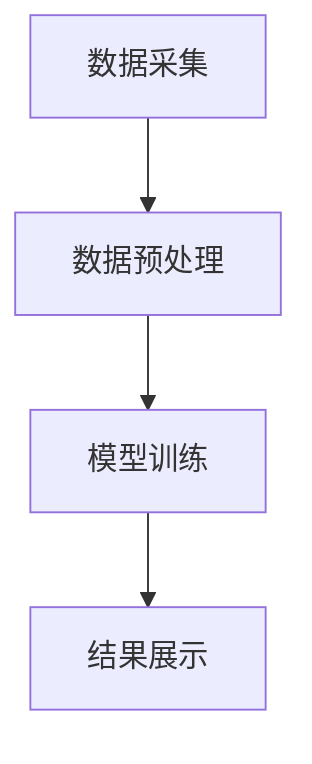

                 


# 新兴市场股市估值与智慧城市交通拥堵预测系统的互动

## 关键词：
- 新兴市场股市估值
- 智慧城市
- 交通拥堵预测
- 互动系统
- 数据驱动

## 摘要：
本文探讨了新兴市场股市估值与智慧城市交通拥堵预测系统之间的互动关系。通过分析股市估值的核心原理、交通拥堵预测的关键算法，以及两者的互动机制，展示了如何利用数据驱动的方法，构建一个跨领域的智能系统，实现资源优化配置和城市交通管理的创新。文章结合理论分析与实际案例，详细阐述了系统架构、算法实现和项目实战，为读者提供了全面的技术指导。

---

## 第一部分: 背景与概念

### 第1章: 背景介绍

#### 1.1 问题背景
新兴市场的股市通常波动较大，受政策、经济和市场情绪的影响显著。与此同时，智慧城市建设中，交通拥堵问题日益严重，如何通过数据和技术手段优化交通管理成为关键。两者的互动关系可以通过数据共享和模型预测实现协同优化。

#### 1.2 问题描述
股市估值的核心在于预测股票价格的变化趋势，而交通拥堵预测的核心在于实时监控和优化交通流量。两者的共同点在于数据驱动的预测和优化，可以通过类似的方法和技术实现。

#### 1.3 问题解决
通过建立数据共享机制，利用时间序列分析和深度学习模型，预测股市波动和交通拥堵情况，从而实现资源的优化配置和交通管理的智能化。

#### 1.4 边界与外延
股市估值的边界包括数据的完整性和准确性，而交通拥堵预测的外延则涉及实时数据的处理和模型的动态调整。

#### 1.5 核心要素组成
- 数据来源与特征：股市数据包括开盘价、收盘价、成交量等，交通数据包括车流量、道路占有率等。
- 算法模型的选择：时间序列模型和深度学习模型。
- 系统架构的设计：分层架构，包括数据采集、模型训练和结果展示。

---

## 第二部分: 核心概念与联系

### 第2章: 核心概念原理

#### 2.1 股市估值的核心原理
股市估值通过分析历史数据、市场情绪和财务指标，预测未来股价走势。常用的方法包括技术分析和基本面分析。

#### 2.2 交通拥堵预测的核心原理
交通拥堵预测通过实时数据和历史数据，利用机器学习模型预测交通流量的变化，优化交通信号灯和路线规划。

#### 2.3 核心概念对比
| 特征       | 股市估值 | 交通拥堵预测 |
|------------|----------|--------------|
| 数据类型   | 数值型   | 数值型       |
| 时间依赖性 | 强       | 强           |
| 预测目标   | 股价     | 拥堵程度     |

### 第3章: 实体关系图

#### 3.1 股市估值实体关系图


#### 3.2 交通拥堵预测实体关系图


---

## 第三部分: 算法原理讲解

### 第3章: 算法原理

#### 3.1 时间序列分析
时间序列分析用于预测股市波动和交通流量。常用模型包括ARIMA和LSTM。

#### 3.2 深度学习模型
LSTM（长短期记忆网络）适用于处理时间序列数据，能够捕捉长期依赖关系。

#### 3.3 算法实现
```python
import numpy as np
from tensorflow.keras.models import Sequential
from tensorflow.keras.layers import LSTM, Dense

# 示例代码：LSTM模型训练
model = Sequential()
model.add(LSTM(50, input_shape=(None, 1)))
model.add(Dense(1))
model.compile(loss='mean_squared_error', optimizer='adam')
model.fit(X_train, y_train, epochs=50, batch_size=32)
```

#### 3.4 数学模型
$$
\text{LSTM单元的输出} = \text{遗忘门} \cdot \text{细胞状态} + \text{输入门} \cdot \text{输入}
$$

---

## 第四部分: 系统分析与架构设计

### 第4章: 系统架构

#### 4.1 问题场景介绍
系统需要实时处理股市数据和交通数据，预测股市波动和交通拥堵，优化资源配置。

#### 4.2 系统功能设计
- 数据采集模块：采集股市和交通数据。
- 数据预处理模块：清洗和转换数据。
- 模型训练模块：训练预测模型。
- 结果展示模块：可视化预测结果。

#### 4.3 系统架构图


---

## 第五部分: 项目实战

### 第5章: 项目实战

#### 5.1 环境安装
安装必要的库：
```bash
pip install numpy pandas scikit-learn tensorflow
```

#### 5.2 核心代码实现
```python
import pandas as pd
import numpy as np
from sklearn.preprocessing import MinMaxScaler
from tensorflow.keras.models import Sequential
from tensorflow.keras.layers import LSTM, Dense

# 数据预处理
data = pd.read_csv('stock_data.csv')
data = data.values
data = data.astype('float32')

scaler = MinMaxScaler(feature_range=(0, 1))
data_scaled = scaler.fit_transform(data)

# 划分训练集和测试集
train_size = int(len(data_scaled) * 0.7)
test_size = len(data_scaled) - train_size
X_train = []
y_train = []
for i in range(train_size):
    X_train.append(data_scaled[i:i+1])
    y_train.append(data_scaled[i+1])
X_train = np.array(X_train)
y_train = np.array(y_train)

# 模型训练
model = Sequential()
model.add(LSTM(50, input_shape=(1, 1)))
model.add(Dense(1))
model.compile(loss='mean_squared_error', optimizer='adam')
model.fit(X_train, y_train, epochs=50, batch_size=32)
```

#### 5.3 案例分析
以某新兴市场为例，分析股市波动和交通拥堵预测的互动关系，展示模型预测结果。

---

## 第六部分: 最佳实践

### 第6章: 最佳实践

#### 6.1 小结
通过数据驱动的方法，可以实现股市估值与交通拥堵预测的互动，优化资源配置和城市交通管理。

#### 6.2 注意事项
- 数据的实时性和准确性是关键。
- 模型的可解释性和鲁棒性需要进一步优化。

#### 6.3 拓展阅读
- 《深度学习实战》
- 《时间序列分析与应用》

---

## 作者信息

作者：AI天才研究院/AI Genius Institute & 禅与计算机程序设计艺术 /Zen And The Art of Computer Programming

