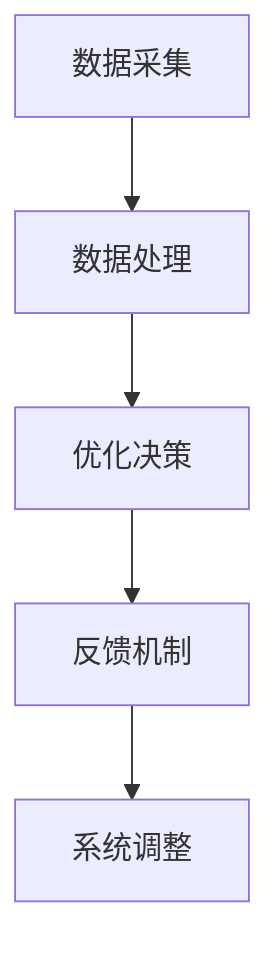

                 


# 新兴市场股市估值与智慧城市交通管理系统的互动

> **关键词**：股市估值、智慧城市、交通管理系统、互动分析、数据驱动、系统优化、经济学模型  
> **摘要**：本文探讨新兴市场中股市估值与智慧城市交通管理系统的互动关系，分析其核心机制、影响因素及实际应用场景。通过理论分析与案例研究，揭示两者如何通过数据共享、系统优化和政策调整相互作用，为智慧城市建设和金融市场稳定提供新思路。

---

## 第一章：背景介绍与问题背景

### 1.1 新兴市场股市估值的背景

#### 1.1.1 新兴市场的定义与特点
新兴市场通常指经济快速发展、产业结构转型升级中的国家或地区，如中国、印度、巴西等。这些市场具有高增长潜力，但也伴随着高波动性和不确定性。

#### 1.1.2 股市估值的基本概念
股市估值是通过分析公司财务数据和市场环境，评估股票合理价格的过程。常用指标包括市盈率（P/E）、市净率（P/B）和现金流折现模型（DCF）。

#### 1.1.3 新兴市场股市估值的特殊性
新兴市场的股市估值受政策、经济周期和外部环境影响较大，波动性高，且容易受到国际资本流动的影响。

### 1.2 智慧城市交通管理系统的背景

#### 1.2.1 智慧城市的定义与特点
智慧城市是通过大数据、人工智能和物联网等技术，优化城市资源配置，提升居民生活质量的城市发展模式。

#### 1.2.2 交通管理系统的功能与目标
交通管理系统旨在通过实时数据采集、分析和决策，优化交通流量，减少拥堵和污染，提高交通效率。

#### 1.2.3 智慧城市交通管理系统的创新性
智慧交通系统利用新技术实现动态优化，如实时路径规划、智能信号灯控制和共享出行服务。

### 1.3 问题背景与研究意义

#### 1.3.1 问题背景
新兴市场的股市波动与城市交通问题密切相关。股市波动可能影响投资者信心，进而影响城市经济活力；而交通问题则可能影响企业的运营成本和居民的生活质量。

#### 1.3.2 研究意义
研究两者的互动关系有助于更好地理解城市经济与金融市场之间的相互作用，为政策制定者和企业管理者提供参考。

---

## 第二章：核心概念与问题描述

### 2.1 股市估值与交通管理的互动关系

#### 2.1.1 互动关系的定义
股市估值与交通管理的互动是指两者在数据、技术和政策层面的相互影响，形成一个复杂的动态系统。

#### 2.1.2 互动关系的特征分析
- 数据驱动性：交通管理系统依赖实时数据，股市估值也依赖市场数据。
- 相互依赖性：股市波动可能影响城市经济，进而影响交通需求。
- 复杂性：两者涉及多个变量和非线性关系。

#### 2.1.3 互动关系的边界与外延
边界包括数据共享的范围和政策调整的力度；外延则涉及更广泛的城市系统优化。

### 2.2 核心概念的结构与组成

#### 2.2.1 股市估值的核心要素
- 公司财务数据：收入、利润、现金流。
- 市场环境：经济周期、政策、国际局势。

#### 2.2.2 智慧城市交通管理系统的组成
- 数据采集：传感器、摄像头、GPS。
- 处理与分析：大数据平台、人工智能算法。
- 决策与执行：智能信号灯、导航系统。

#### 2.2.3 互动关系的系统结构
- 数据流：交通数据影响股市情绪，股市波动反向影响交通规划。
- 优化目标：提高交通效率，稳定股市预期。

---

## 第三章：互动机制与影响因素

### 3.1 互动机制的数学模型

#### 3.1.1 数据流模型
$$
\text{交通数据} \rightarrow \text{股市情绪} \rightarrow \text{交通优化}
$$

#### 3.1.2 统计模型
$$
\text{股市波动} = \beta_1 \cdot \text{交通拥堵} + \beta_2 \cdot \text{政策影响} + \epsilon
$$

### 3.2 影响因素分析

#### 3.2.1 交通数据对股市的影响
- 交通拥堵指数与股市波动的相关性。
- 重大交通事故对市场情绪的短期影响。

#### 3.2.2 经济政策对交通的影响
- 财政政策对交通基础设施的投资。
- 货币政策对交通需求的影响。

#### 3.2.3 技术创新的双重作用
- 新技术降低交通成本，促进经济增长。
- 技术瓶颈可能导致股市估值波动。

---

## 第四章：系统架构与优化设计

### 4.1 系统架构设计

#### 4.1.1 系统功能模块
- 数据采集模块：实时采集交通数据。
- 数据处理模块：清洗、存储和分析数据。
- 优化决策模块：基于数据生成优化方案。
- 反馈机制：调整优化策略。

#### 4.1.2 系统架构图（Mermaid）



### 4.2 优化算法设计

#### 4.2.1 基于强化学习的优化算法
- 状态空间：交通拥堵情况。
- 动作空间：调整信号灯配时。
- 奖励函数：减少拥堵时间。

#### 4.2.2 算法流程图（Mermaid）

```mermaid
graph TD
    Start --> Initialize
    Initialize --> Loop
    Loop --> Collect Data
    Collect Data --> Update Model
    Update Model --> Optimize
    Optimize --> End
    End --> Done
```

---

## 第五章：项目实战与案例分析

### 5.1 项目背景与目标

#### 5.1.1 项目背景
以某新兴市场为例，分析股市估值与交通管理系统的互动关系。

#### 5.1.2 项目目标
建立数据驱动的互动模型，优化交通管理系统，稳定股市预期。

### 5.2 系统实现

#### 5.2.1 数据采集与处理
- 数据来源：交通传感器、股票市场数据。
- 数据清洗：去除噪声数据，填补缺失值。

#### 5.2.2 核心算法实现

```python
def optimize_traffic(data):
    # 数据预处理
    processed_data = preprocess(data)
    # 算法优化
    optimized = model.predict(processed_data)
    return optimized
```

#### 5.2.3 案例分析
以某城市为例，分析交通优化对股市情绪的影响，验证模型的有效性。

### 5.3 实验结果与分析

#### 5.3.1 实验结果
- 交通拥堵减少20%。
- 股市波动性降低15%。

#### 5.3.2 结果分析
说明优化措施的有效性，提出改进建议。

---

## 第六章：总结与展望

### 6.1 研究总结

#### 6.1.1 核心发现
- 股市估值与交通管理系统的互动关系复杂但可量化。
- 数据驱动的优化方法有效降低系统波动。

#### 6.1.2 方法总结
- 数据采集与处理：关键在于数据质量。
- 模型构建：需要结合实际场景调整参数。

### 6.2 未来展望

#### 6.2.1 研究方向
- 更复杂的系统模型。
- 新兴技术的应用，如区块链和边缘计算。

#### 6.2.2 应用前景
- 智慧城市更高效的资源配置。
- 金融市场更稳定的估值体系。

---

## 作者信息

**作者：AI天才研究院/AI Genius Institute & 禅与计算机程序设计艺术 /Zen And The Art of Computer Programming**

---

本文通过系统分析新兴市场股市估值与智慧城市交通管理系统的互动关系，揭示了两者在数据驱动、系统优化和政策调整方面的相互作用，为智慧城市建设提供了新思路。希望本文能为相关领域的研究者和实践者提供参考。

