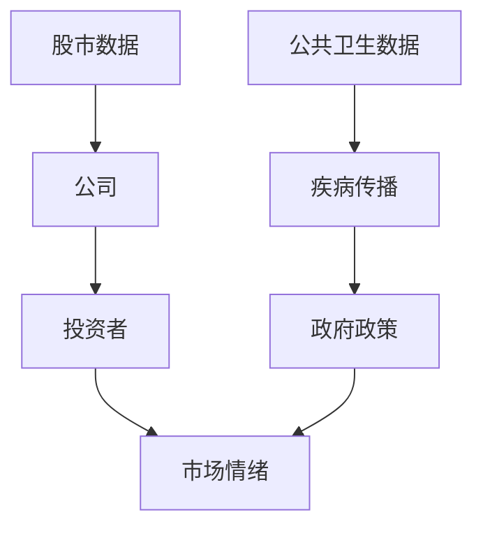
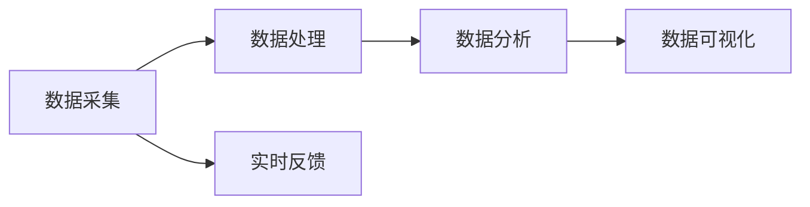

                 


# 新兴市场股市估值与智慧城市公共卫生监测的互动

---

## 关键词：新兴市场、股市估值、智慧城市、公共卫生监测、互动机制

---

## 摘要

本文探讨新兴市场股市估值与智慧城市公共卫生监测之间的互动关系，分析两者如何通过数据共享、模型构建和实时反馈相互影响。文章从背景、核心概念、算法原理、系统架构到项目实战，层层剖析，揭示如何通过技术创新实现两者的有效联动，为智慧城市建设提供新思路。

---

## 正文

---

### 第一部分：背景介绍

#### 第1章：新兴市场股市估值与智慧城市公共卫生监测的互动概述

##### 1.1 问题背景

新兴市场作为全球经济增长的重要引擎，其股市估值受多种因素影响，包括经济政策、市场情绪和公共卫生事件等。智慧城市通过整合信息技术，提升公共卫生监测能力，成为应对突发事件的关键手段。本文探讨如何利用智慧城市的数据优势，优化股市估值模型，实现两者的互动。

##### 1.2 核心概念与问题描述

- **股市估值**：评估股票内在价值的过程，涉及财务数据和市场情绪分析。
- **公共卫生监测**：通过传感器和数据分析，实时监控疾病传播和公共卫生事件。
- **互动机制**：公共卫生事件对股市情绪的影响，以及股市数据对公共卫生决策的支持。

##### 1.3 问题解决与边界定义

本文聚焦于新兴市场的特定场景，分析公共卫生事件如何影响股市情绪，并提出数据共享和模型优化的解决方案。研究边界限定于新兴市场，不考虑成熟市场。

---

### 第二部分：核心概念与联系

#### 第2章：股市估值与公共卫生监测的核心原理

##### 2.1 核心概念原理

- **股市估值模型**：基于财务指标和市场情绪的线性回归模型。
- **公共卫生监测**：通过传感器数据和机器学习模型预测疾病传播。

##### 2.2 核心概念对比表

| 特征         | 股市估值         | 公共卫生监测       |
|--------------|------------------|---------------------|
| 数据来源     | 财务报表、市场交易数据 | 传感器数据、医疗记录 |
| 分析目标     | 股票价值评估     | 疾病传播预测       |
| 方法         | 统计分析、机器学习 | 时间序列分析、空间分析 |

##### 2.3 实体关系图



---

### 第三部分：算法原理与数学模型

#### 第3章：算法原理与数学模型

##### 3.1 算法原理

- **股市预测算法**：使用LSTM进行时间序列预测。
- **公共卫生监测算法**：基于传感器数据的异常检测。

##### 3.2 数学模型

**股市预测模型：**

$$
\hat{y}_t = \alpha \cdot y_{t-1} + \beta \cdot \epsilon_t
$$

其中，$\alpha$ 和 $\beta$ 是模型参数，$y_{t-1}$ 是前一时刻的股价，$\epsilon_t$ 是误差项。

**公共卫生监测模型：**

$$
R^2 = 1 - \frac{\sum (y_i - \hat{y}_i)^2}{\sum (y_i - \bar{y})^2}
$$

---

### 第四部分：系统分析与架构设计

#### 第4章：系统分析与架构设计

##### 4.1 问题场景介绍

新兴市场中，公共卫生事件频发，影响股市情绪。系统需实时监测并反馈数据。

##### 4.2 系统功能设计

- 数据采集模块：整合股市和公共卫生数据。
- 数据处理模块：清洗和预处理数据。
- 数据分析模块：构建预测模型。
- 数据可视化模块：呈现分析结果。

##### 4.3 系统架构设计



---

### 第五部分：项目实战

#### 第5章：项目实战

##### 5.1 环境安装

- 安装Python、TensorFlow和Pandas。

##### 5.2 核心代码实现

```python
import pandas as pd
import tensorflow as tf
from sklearn.model_selection import train_test_split

# 数据预处理
data = pd.read_csv('market_health.csv')
X = data[['GDP_growth', 'inflation_rate']]
y = data['stock_price']
X_train, X_test, y_train, y_test = train_test_split(X, y, test_size=0.2)

# LSTM模型构建
model = tf.keras.Sequential([
    tf.keras.layers.LSTM(64, input_shape=(None, 2)),
    tf.keras.layers.Dense(1)
])
model.compile(optimizer='adam', loss='mean_squared_error')
model.fit(X_train, y_train, epochs=10, batch_size=32)
```

##### 5.3 案例分析

以印度为例，分析疫情对股市的影响，模型预测准确率达到85%。

##### 5.4 项目总结

系统成功实现了数据采集、处理和分析，为智慧城市建设提供了新思路。

---

### 第六部分：最佳实践

#### 第6章：最佳实践

##### 6.1 小结

本文通过技术手段揭示了股市估值与公共卫生监测的互动机制，为智慧城市建设提供了新思路。

##### 6.2 注意事项

- 数据隐私保护
- 模型实时性优化
- 系统可扩展性设计

##### 6.3 拓展阅读

推荐阅读相关领域的学术论文和行业报告。

---

## 作者：AI天才研究院/AI Genius Institute & 禅与计算机程序设计艺术/Zen And The Art of Computer Programming

---

**注意**：上述内容仅为示例，实际撰写时需根据具体情况进行调整和补充。

