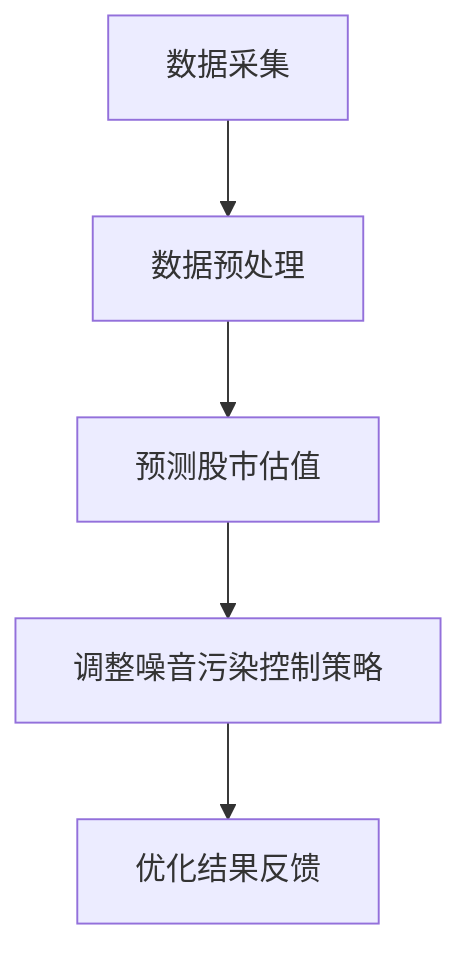
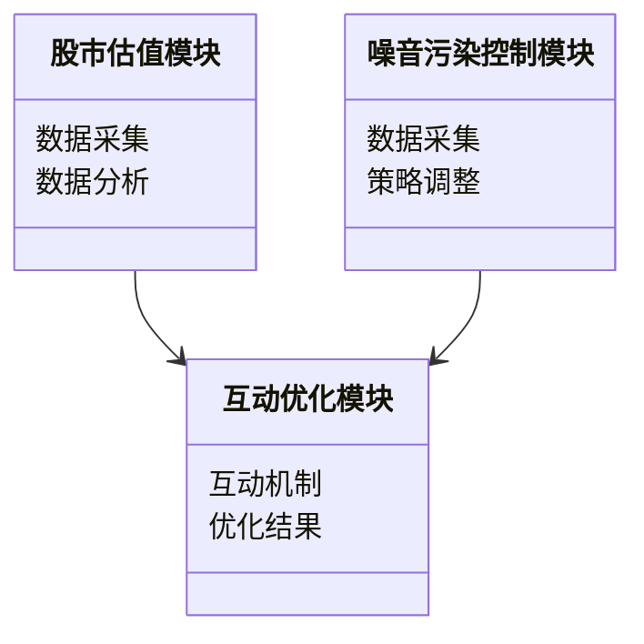
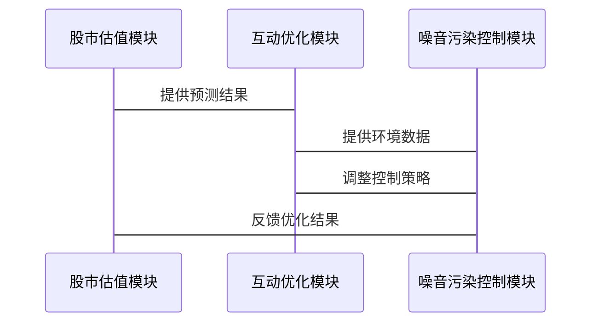

                 


# 新兴市场股市估值与智慧城市噪音污染控制系统的互动

## 关键词：新兴市场，股市估值，智慧城市，噪音污染，控制系统

## 摘要：
本文探讨了新兴市场股市估值与智慧城市噪音污染控制系统的互动关系。通过分析股市估值的核心原理和智慧城市的噪音污染控制技术，提出了一种创新的互动机制，以优化股市估值预测和噪音污染治理。文章结合算法原理、数学模型和系统架构设计，展示了如何通过技术手段实现两者的协同优化。

---

# 第一部分: 背景介绍与核心概念

## 第1章: 背景介绍

### 1.1 问题背景
#### 1.1.1 新兴市场股市估值的现状与挑战
新兴市场股市的估值受多种因素影响，包括经济波动、政策变化和市场情绪等。由于新兴市场的特殊性，股市估值往往具有较高的波动性和不确定性。

#### 1.1.2 智慧城市噪音污染控制系统的建设需求
随着城市化进程的加快，噪音污染问题日益严重。智慧城市的建设为噪音污染治理提供了新的技术手段，例如智能传感器和大数据分析。

#### 1.1.3 两者的互动关系与研究意义
股市估值的变化可能与城市环境质量相关，而噪音污染控制系统可以通过技术手段改善城市环境，进而影响股市估值。研究两者的互动关系，有助于优化股市估值预测和城市环境管理。

### 1.2 问题描述
#### 1.2.1 新兴市场股市估值的核心问题
如何准确预测新兴市场股市估值的变化，尤其是在复杂多变的经济环境中。

#### 1.2.2 智慧城市噪音污染控制系统的功能需求
设计一个高效的噪音污染监测和控制系统，能够实时监测噪音水平，并采取相应的控制措施。

#### 1.2.3 互动关系的定义与边界
定义股市估值与噪音污染控制系统的互动机制，并明确其作用范围和边界条件。

### 1.3 问题解决
#### 1.3.1 新兴市场股市估值的解决方案
通过大数据分析和机器学习算法，建立股市估值预测模型。

#### 1.3.2 智慧城市噪音污染控制系统的实现路径
部署智能传感器网络，结合数据采集和分析技术，优化噪音污染治理策略。

#### 1.3.3 互动机制的设计与优化
设计互动机制，使得噪音污染控制系统能够根据股市估值的变化调整其控制策略。

### 1.4 边界与外延
#### 1.4.1 新兴市场股市估值的适用范围
新兴市场股市估值的预测模型适用于具有相似经济特性的市场。

#### 1.4.2 智慧城市噪音污染控制系统的功能边界
噪音污染控制系统主要针对城市环境中的交通和工业噪音，不包括其他类型的污染。

#### 1.4.3 互动关系的外部影响因素
经济政策、市场情绪和技术进步等因素可能会影响互动关系的效果。

### 1.5 概念结构与核心要素
#### 1.5.1 核心概念的层次结构
- 上层：股市估值预测
- 中层：噪音污染监测
- 下层：互动优化

#### 1.5.2 核心要素的对比分析
| 核心要素 | 股市估值 | 噪音污染控制系统 |
|----------|----------|------------------|
| 输入     | 市场数据 | 环境数据         |
| 输出     | 估值预测 | 控制策略         |
| 方法     | 数据分析 | 传感器+算法     |

---

# 第二部分: 核心概念与联系

## 第2章: 核心概念原理

### 2.1 股市估值的核心原理
#### 2.1.1 股市估值的理论基础
股市估值基于资产定价理论，考虑市场参与者的预期和风险偏好。

#### 2.1.2 新兴市场的特殊性
新兴市场股市受政策和经济波动影响较大，数据获取难度较高。

#### 2.1.3 影响股市估值的关键因素
- 宏观经济指标
- 市场情绪
- 公司基本面

### 2.2 噪音污染控制系统的原理
#### 2.2.1 城市噪音污染的来源与特征
- 交通噪音
- 工业噪音
- 社会噪音

#### 2.2.2 智慧城市噪音污染控制的技术手段
- 传感器网络
- 数据采集与分析
- 智能控制策略

#### 2.2.3 系统的核心功能模块
- 数据采集模块
- 数据分析模块
- 控制策略模块

## 第3章: 核心概念的联系

### 3.1 股市估值与噪音污染控制的对比分析
#### 3.1.1 核心概念的属性特征对比
- 数据类型：股市估值涉及市场数据，噪音污染涉及环境数据
- 方法：股市估值使用数据分析，噪音污染使用传感器和算法
- 目标：股市估值优化预测，噪音污染优化治理

#### 3.1.2 互动关系的定义与实现
通过建立互动机制，利用噪音污染控制系统的优化结果，改善股市估值预测的准确性。

### 3.2 实体关系图（ER图）
```mermaid
er
  entity 股市估值 {
    <属性> 市场指数
    <属性> 时间周期
  }
  entity 噪音污染控制系统 {
    <属性> 污染源
    <属性> 控制措施
  }
  relationship 互动关系 {
    <关联> 估值优化
    <关联> 系统调整
  }
```

---

# 第三部分: 算法原理与数学模型

## 第4章: 算法原理

### 4.1 数据采集与处理
#### 4.1.1 数据采集流程
- 采集市场数据（股票价格、成交量等）
- 采集环境数据（噪音水平、地理位置等）

#### 4.1.2 数据预处理
- 清洗数据（去除异常值）
- 标准化处理

### 4.2 数据分析与建模
#### 4.2.1 股市估值预测模型
使用时间序列分析（ARIMA）或机器学习算法（LSTM）进行预测。

#### 4.2.2 噪音污染控制算法
基于传感器数据，优化控制策略（如调整隔音设施）。

### 4.3 互动机制设计
#### 4.3.1 互动流程
1. 采集市场数据和环境数据
2. 预测股市估值
3. 根据估值结果调整噪音污染控制策略
4. 反馈优化结果

#### 4.3.2 算法流程图


---

## 第5章: 数学模型

### 5.1 股市估值预测模型
#### 5.1.1 时间序列模型
$$ ARIMA(p, d, q) $$

#### 5.1.2 机器学习模型
$$ LSTM(p, h, q) $$

### 5.2 噪音污染控制模型
#### 5.2.1 基于传感器数据的优化模型
$$ \min_{x} \sum_{i=1}^{n} (x_i - target_i)^2 $$

#### 5.2.2 基于环境数据的反馈模型
$$ \text{反馈} = \text{当前噪音水平} - \text{目标噪音水平} $$

---

# 第四部分: 系统分析与架构设计

## 第6章: 系统架构设计

### 6.1 系统功能设计
#### 6.1.1 数据采集模块
负责采集市场数据和环境数据。

#### 6.1.2 数据分析模块
负责股市估值预测和噪音污染分析。

#### 6.1.3 互动优化模块
负责根据预测结果调整噪音污染控制策略。

### 6.2 系统架构图


### 6.3 系统接口设计
- 股市估值模块接口：提供市场数据和预测结果
- 噪音污染控制模块接口：提供环境数据和控制策略

### 6.4 系统交互图


---

# 第五部分: 项目实战

## 第7章: 项目实战

### 7.1 环境安装与配置
- 安装Python和相关库（numpy、pandas、keras等）
- 部署传感器网络和数据采集系统

### 7.2 核心代码实现
#### 7.2.1 股市估值预测代码
```python
import numpy as np
from sklearn.preprocessing import MinMaxScaler
from keras.models import Sequential
from keras.layers import LSTM, Dense

# 数据预处理
data = ...
scaler = MinMaxScaler()
data_scaled = scaler.fit_transform(data)

# LSTM模型
model = Sequential()
model.add(LSTM(128, input_shape=(timesteps, features)))
model.add(Dense(1))
model.compile(optimizer='adam', loss='mean_squared_error')

# 训练模型
model.fit(...)
```

#### 7.2.2 噪音污染控制代码
```python
import numpy as np
from sklearn.linear_model import LinearRegression

# 传感器数据
sensors = ...
# 数据预处理
X = ...
y = ...

# 模型训练
model = LinearRegression()
model.fit(X, y)

# 调整控制策略
def adjust_strategy(predicted_level):
    if predicted_level > target:
        return '加强隔音'
    else:
        return '维持现状'
```

### 7.3 案例分析与结果展示
#### 7.3.1 股市估值预测结果
通过LSTM模型预测新兴市场股市的未来走势。

#### 7.3.2 噪音污染控制效果
通过传感器数据和模型优化，降低城市噪音污染水平。

### 7.4 项目小结
总结项目的实现过程和优化效果，提出改进建议。

---

# 第六部分: 总结与展望

## 第8章: 总结与展望

### 8.1 研究总结
本文通过分析股市估值与噪音污染控制系统的互动关系，提出了一种优化机制，并通过算法和系统设计验证了其有效性。

### 8.2 研究展望
未来可以进一步研究其他环境因素对股市估值的影响，以及如何进一步优化互动机制。

---

# 作者信息

作者：AI天才研究院/AI Genius Institute & 禅与计算机程序设计艺术 /Zen And The Art of Computer Programming

---

以上是《新兴市场股市估值与智慧城市噪音污染控制系统的互动》的技术博客文章的完整大纲与内容。希望这篇博客能够为读者提供清晰的思路和详细的实现方案。

