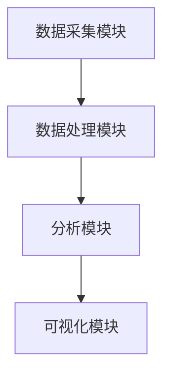

                 


# 新兴市场股市估值与智慧城市废弃物管理的互动

> **关键词**: 新兴市场股市估值、智慧城市、废弃物管理、互动关系、算法模型、系统设计

> **摘要**: 本文探讨了新兴市场股市估值与智慧城市废弃物管理之间的互动关系。通过分析股市估值的核心要素和智慧城市废弃物管理的系统构成，结合数学模型和算法实现，揭示了两者在城市化和经济发展中的互动机制，并提出相应的系统设计与实现方案。

---

## 第一部分：背景介绍

### 第1章：新兴市场股市估值与智慧城市废弃物管理的互动概述

#### 1.1 问题背景

- **新兴市场的经济特点与股市发展**：新兴市场通常具有较高的经济增长潜力，股市作为经济发展的晴雨表，反映了市场的活跃程度和投资信心。
- **智慧城市与废弃物管理的全球趋势**：随着城市化进程加快，废弃物管理问题日益突出，智慧城市的建设为废弃物管理提供了新的技术手段。
- **研究意义**：研究两者的互动关系，有助于理解城市化与经济发展的相互影响，为政策制定和投资决策提供依据。

#### 1.2 核心概念

- **股市估值**：通过市盈率、市净率等指标衡量市场的价值。
- **智慧城市废弃物管理**：利用智能技术优化废弃物收集、处理和资源化的过程。
- **互动关系**：城市化推动股市增长，而股市的健康发展又反哺城市基础设施建设。

#### 1.3 研究目标与方法

- **目标**：量化新兴市场股市估值与智慧城市废弃物管理之间的互动关系。
- **方法**：采用多元回归分析和系统动力学模型，结合实际案例进行验证。

---

## 第二部分：核心概念与联系

### 第2章：新兴市场股市估值的核心要素

#### 2.1 核心要素分析

- **市场流动性**：高流动性促进股市估值的稳定性。
- **宏观经济指标**：GDP增长率、通胀率等影响股市表现。
- **企业盈利能力**：企业盈利是股市估值的基础。

#### 2.2 股市估值的数学模型

- **市盈率（P/E）模型**：$$ P/E = \frac{\text{股价}}{\text{每股收益}} $$
- **市净率（P/B）模型**：$$ P/B = \frac{\text{股价}}{\text{每股净资产}} $$

### 第3章：智慧城市废弃物管理的系统分析

#### 3.1 系统构成

- **分类收集系统**：智能垃圾桶、物联网传感器。
- **处理与资源化技术**：生物降解、再生资源利用。
- **智能化管理平台**：数据采集、分析和优化。

---

## 第三部分：互动机制与算法模型

### 第4章：互动机制的数学模型

- **互动强度分析**：建立多元回归模型：$$ V = \beta_0 + \beta_1 G + \beta_2 W + \epsilon $$，其中V为估值，G为城市化指标，W为废弃物管理指数。

### 第5章：互动关系的算法实现

- **算法步骤**：
  1. 数据收集：获取股市估值和废弃物管理相关数据。
  2. 数据预处理：标准化和缺失值处理。
  3. 建立模型：使用多元回归分析。
  4. 模型验证：交叉验证和参数调整。

#### 5.1 Python代码示例

```python
import pandas as pd
from sklearn.linear_model import LinearRegression
from sklearn.metrics import mean_squared_error

# 数据加载与预处理
data = pd.read_csv('data.csv')
X = data[['GDP_growth', 'waste_management_index']]
y = data['market_valuation']

# 模型训练
model = LinearRegression()
model.fit(X, y)

# 模型验证
y_pred = model.predict(X)
mse = mean_squared_error(y, y_pred)
print(f'MSE: {mse}')
```

---

## 第四部分：系统分析与架构设计

### 第6章：系统设计

#### 6.1 系统架构图



#### 6.2 接口设计

- 数据采集模块：API接口获取实时数据。
- 分析模块：提供数据处理和模型预测功能。

---

## 第五部分：项目实战

### 第7章：环境安装与核心实现

- **环境安装**：安装Python、Pandas、Scikit-learn等工具。
- **核心代码**：实现回归模型并进行预测。
- **案例分析**：以某新兴市场为例，展示模型的应用和效果。

---

## 第六部分：最佳实践与总结

### 第8章：总结与展望

- **总结**：本文通过数学模型和系统设计，揭示了新兴市场股市估值与智慧城市废弃物管理的互动关系。
- **展望**：未来研究可进一步考虑更多变量，如政策因素和技术创新对互动关系的影响。

---

**作者：AI天才研究院 & 禅与计算机程序设计艺术**

