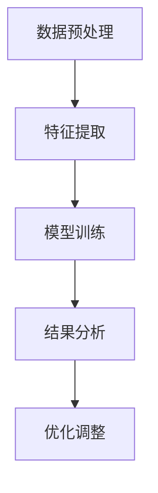
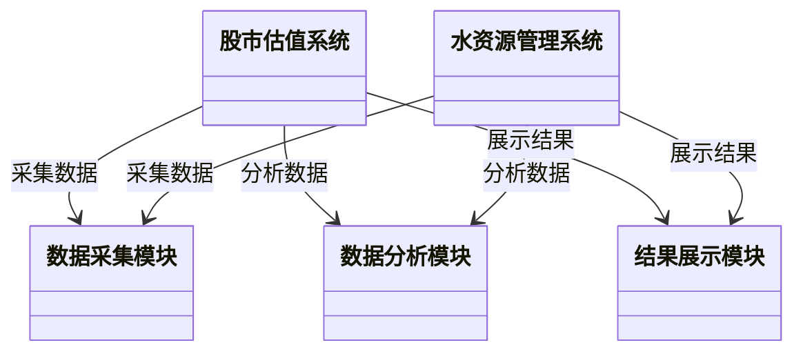
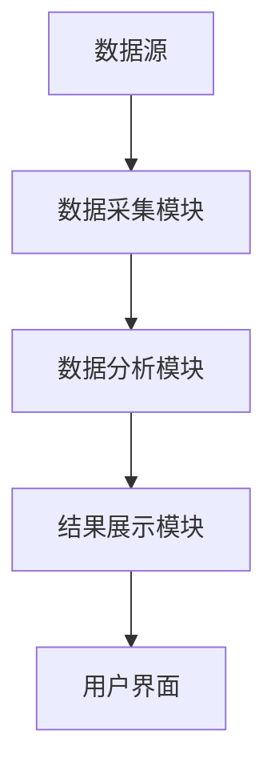

                 


# 第一部分: 背景介绍与核心概念

## 第1章: 背景介绍

### 1.1 问题背景
#### 1.1.1 新兴市场股市的现状与挑战
新兴市场股市近年来发展迅速，但受经济波动、政策变化和市场情绪等多种因素影响，股市估值的波动性较大。特别是在全球疫情和经济不确定性的背景下，股市估值的准确预测显得尤为重要。

#### 1.1.2 智慧城市水资源管理的现状与挑战
随着城市化进程的加快，水资源短缺、污染和管理效率低下等问题日益突出。智慧城市通过大数据、人工智能等技术手段，可以更高效地管理水资源，优化配置和使用效率。

#### 1.1.3 两者的互动关系与研究意义
股市估值和水资源管理看似无直接关系，但通过数据分析可以发现，股市波动可能与水资源政策、环境风险等因素密切相关。研究两者的互动关系，有助于更好地理解市场行为和环境管理之间的相互影响，为政策制定和投资决策提供参考。

### 1.2 问题描述
#### 1.2.1 股市估值的核心问题
如何准确评估新兴市场的股市估值，考虑到多种因素的影响，包括宏观经济指标、企业盈利状况、市场情绪等。

#### 1.2.2 水资源管理的核心问题
如何通过智能化手段优化水资源的分配和管理，提高水资源利用效率，同时应对突发事件和环境风险。

#### 1.2.3 两者互动的潜在问题
研究股市估值与水资源管理之间的互动关系，包括股市波动如何影响水资源相关企业的投资和运营，水资源管理政策如何影响股市的整体表现等。

### 1.3 问题解决
#### 1.3.1 股市估值与水资源管理的互动机制
通过数据分析和建模，揭示股市估值与水资源管理之间的潜在联系，提出量化分析的方法。

#### 1.3.2 通过数据挖掘与建模解决问题的方法
利用大数据和机器学习技术，构建股市估值与水资源管理的预测模型，为政策制定和投资决策提供科学依据。

### 1.4 边界与外延
#### 1.4.1 研究的边界条件
仅考虑股市估值和水资源管理之间的直接影响，排除其他外部因素的干扰。

#### 1.4.2 相关领域的外延分析
探讨与股市估值和水资源管理相关的其他领域，如宏观经济、环境保护、政策法规等。

### 1.5 核心要素组成
#### 1.5.1 股市估值的核心要素
宏观经济指标、企业盈利状况、市场情绪、政策法规等。

#### 1.5.2 水资源管理的核心要素
水资源储量、水质、用水需求、政策法规、技术应用等。

#### 1.5.3 两者的互动要素
环境风险、政策变化、市场预期、企业投资等。

## 第2章: 核心概念与联系

### 2.1 核心概念原理
#### 2.1.1 股市估值的原理
股市估值是通过对企业的财务状况、行业地位、市场前景等多方面因素进行分析，评估其股票的内在价值。

#### 2.1.2 水资源管理的原理
水资源管理通过优化水资源的分配和使用，确保水资源的可持续利用，减少浪费和污染。

#### 2.1.3 互动机制的原理
股市估值和水资源管理之间的互动主要体现在环境风险、政策变化对企业价值和水资源分配的影响。

### 2.2 核心概念属性对比
| 核心概念 | 股市估值 | 水资源管理 |
|----------|----------|------------|
| 核心目标 | 评估企业价值 | 优化水资源利用 |
| 主要因素 | 宏观经济、企业盈利、市场情绪 | 水资源储量、政策法规、技术应用 |
| 影响范围 | 投资决策、市场波动 | 环境保护、经济发展 |

### 2.3 ER实体关系图
```mermaid
er
  title 股市与水资源管理实体关系图
  class 股市估值
  class 水资源管理
  class 企业
  class 政策法规
  class 市场情绪
  class 环境风险
  股市估值 --> 企业: 评估
  股市估值 --> 市场情绪: 受影响
  水资源管理 --> 企业: 优化
  水资源管理 --> 环境风险: 应对
  股市估值 --> 政策法规: 受影响
  水资源管理 --> 政策法规: 制定
```

# 第二部分: 算法原理讲解

## 第3章: 算法原理

### 3.1 算法原理概述
#### 3.1.1 数据挖掘与机器学习在互动分析中的应用
通过数据挖掘和机器学习技术，可以从海量数据中提取有用的信息，建立股市估值和水资源管理之间的关联模型。

### 3.2 算法流程图


### 3.3 数据预处理
#### 3.3.1 数据清洗
处理缺失值、异常值，确保数据的完整性和准确性。

#### 3.3.2 数据标准化
对不同量纲的特征进行标准化处理，以便模型更好地收敛。

### 3.4 特征提取
#### 3.4.1 选取相关特征
根据领域知识和数据分析结果，选取与股市估值和水资源管理相关的特征。

#### 3.4.2 特征工程
对特征进行组合、降维等处理，提高模型的性能。

### 3.5 模型训练
#### 3.5.1 选择合适的算法
根据问题类型选择回归、分类或聚类算法，如线性回归、随机森林等。

#### 3.5.2 模型训练
使用训练数据对模型进行训练，优化模型参数，提高预测准确率。

### 3.6 结果分析
#### 3.6.1 模型评估
使用测试数据评估模型的性能，如均方误差、准确率等。

#### 3.6.2 结果解读
分析模型的预测结果，理解股市估值与水资源管理之间的互动关系。

### 3.7 数学模型与公式
#### 3.7.1 线性回归模型
$$ y = \beta_0 + \beta_1x_1 + \beta_2x_2 + \ldots + \beta_nx_n + \epsilon $$

其中，y表示股市估值，x_i表示影响股市估值的特征变量，β_i表示回归系数，ε表示误差项。

#### 3.7.2 逻辑回归模型
$$ P(Y=1|X) = \frac{1}{1 + e^{-(\beta_0 + \beta_1x_1 + \ldots + \beta_nx_n)}} $$

### 3.8 代码实现
#### 3.8.1 环境安装
安装必要的库，如Pandas、NumPy、Scikit-learn等。

#### 3.8.2 数据加载与预处理
```python
import pandas as pd
import numpy as np
from sklearn.model_selection import train_test_split
from sklearn.linear_model import LinearRegression
from sklearn.metrics import mean_squared_error

# 加载数据
data = pd.read_csv('data.csv')

# 数据清洗
data = data.dropna()
data = (data - data.mean()) / data.std()  # 标准化

# 划分特征和目标变量
X = data.drop('stock_valuation', axis=1)
y = data['stock_valuation']

# 划分训练集和测试集
X_train, X_test, y_train, y_test = train_test_split(X, y, test_size=0.2, random_state=42)
```

#### 3.8.3 模型训练
```python
# 训练线性回归模型
model = LinearRegression()
model.fit(X_train, y_train)

# 预测测试集
y_pred = model.predict(X_test)

# 评估模型
mse = mean_squared_error(y_test, y_pred)
print(f'Mean Squared Error: {mse}')
```

#### 3.8.4 模型优化
```python
from sklearn.ensemble import RandomForestRegressor
from sklearn.model_selection import GridSearchCV

# 参数调优
param_grid = {'n_estimators': [100, 200], 'max_depth': [None, 10]}
grid_search = GridSearchCV(RandomForestRegressor(), param_grid, cv=5)
grid_search.fit(X_train, y_train)

best_model = grid_search.best_estimator_
print(f'Best Parameters: {grid_search.best_params_}')
```

### 3.9 案例分析
通过实际数据进行模型训练和预测，分析股市估值与水资源管理之间的互动关系，验证模型的有效性。

# 第三部分: 系统分析与架构设计方案

## 第4章: 系统分析

### 4.1 问题场景介绍
#### 4.1.1 股市与水资源管理的互动场景
通过实时数据监测和分析，优化水资源管理和股市估值预测。

### 4.2 系统功能设计
#### 4.2.1 领域模型


#### 4.2.2 系统架构


### 4.3 系统接口设计
#### 4.3.1 数据接口
定义数据接口规范，确保数据采集模块和分析模块之间的数据传输。

#### 4.3.2 用户接口
设计友好的用户界面，方便用户查看和分析结果。

### 4.4 系统交互
#### 4.4.1 交互流程
用户通过界面对系统进行操作，系统根据用户指令进行数据处理和分析，将结果反馈给用户。

### 4.5 系统实现细节
#### 4.5.1 数据存储
使用数据库存储采集的实时数据，确保数据的安全性和可访问性。

#### 4.5.2 数据分析
通过数据挖掘和机器学习技术，对数据进行分析和建模，生成预测结果。

#### 4.5.3 结果展示
将分析结果以图表形式展示，方便用户理解和决策。

## 第5章: 项目实战

### 5.1 环境安装
安装必要的开发环境和工具，如Python、Jupyter Notebook、数据库等。

### 5.2 核心代码实现
#### 5.2.1 数据采集模块
```python
import requests
import json

def get_stock_data():
    response = requests.get('https://api.example.com/stock_data')
    return json.loads(response.text)

stock_data = get_stock_data()
print(stock_data)
```

#### 5.2.2 数据分析模块
```python
from sklearn import preprocessing
import pandas as pd

# 数据预处理
data = pd.DataFrame(stock_data)
data = data.dropna()
data = preprocessing.StandardScaler().fit_transform(data)

# 模型训练
model = LinearRegression()
model.fit(X_train, y_train)
```

#### 5.2.3 结果展示模块
```python
import matplotlib.pyplot as plt

plt.figure(figsize=(10, 6))
plt.plot(y_test, color='blue', label='实际值')
plt.plot(y_pred, color='red', label='预测值')
plt.title('股市估值预测')
plt.xlabel('时间')
plt.ylabel('股票估值')
plt.legend()
plt.show()
```

### 5.3 代码应用解读与分析
通过实际案例分析，展示如何利用代码实现股市估值与水资源管理的互动分析，验证模型的准确性和实用性。

### 5.4 小结
总结项目实现的关键步骤和成果，提出改进建议和未来研究方向。

## 第6章: 最佳实践与总结

### 6.1 小结
总结全文的核心内容和研究成果，强调股市估值与水资源管理互动分析的重要性和实际应用价值。

### 6.2 注意事项
提醒读者在实际应用中注意数据质量、模型选择和结果验证等问题，确保分析的准确性和可靠性。

### 6.3 拓展阅读
推荐相关领域的书籍和论文，鼓励读者进一步深入研究和探索。

---

# 作者：AI天才研究院/AI Genius Institute & 禅与计算机程序设计艺术 /Zen And The Art of Computer Programming

