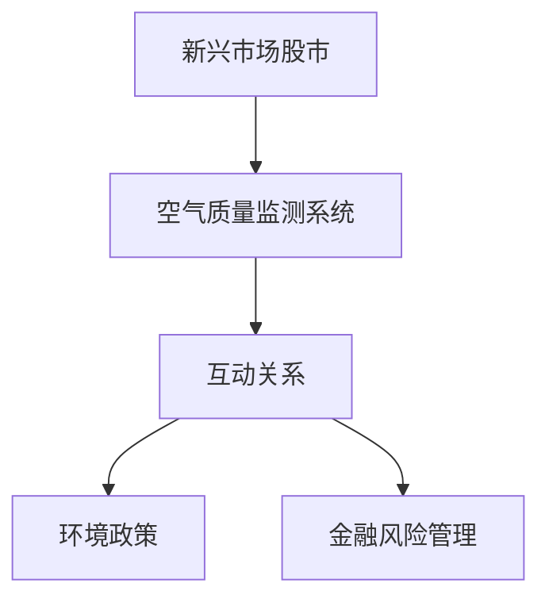
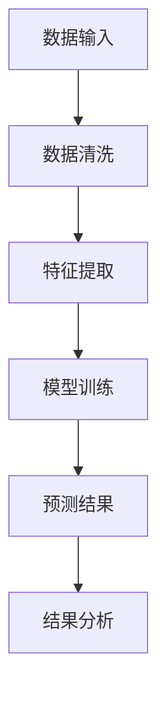
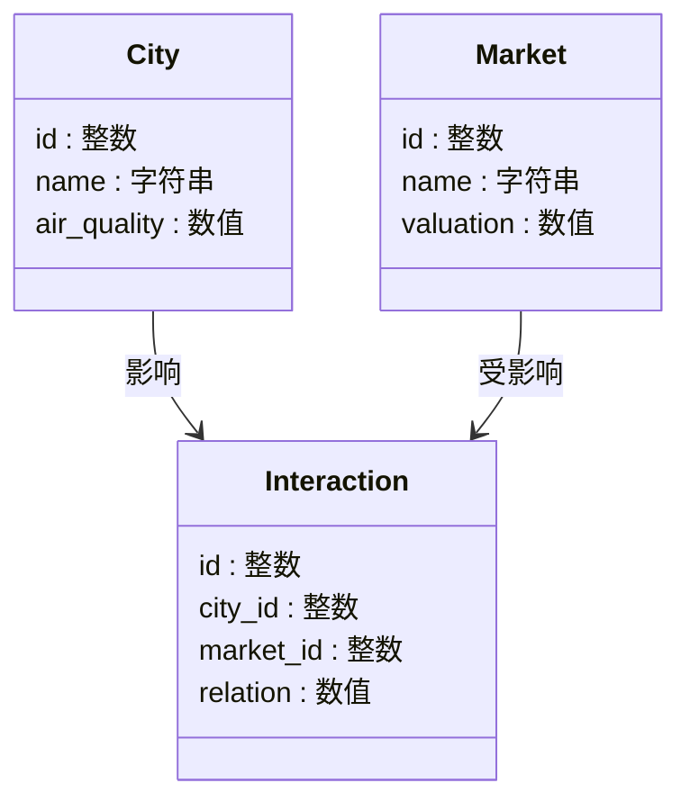
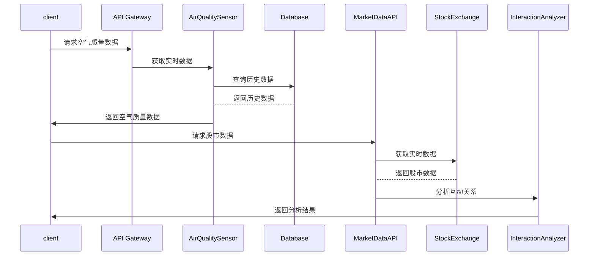

                 


# 新兴市场股市估值与智慧城市空气质量监测系统的互动

> 关键词：新兴市场，股市估值，智慧城市，空气质量监测，互动关系

> 摘要：本文探讨了新兴市场股市估值与智慧城市空气质量监测系统的互动关系，分析了股市估值的核心要素和空气质量监测系统的数据特征，构建了互动关系的数学模型，并通过实际案例验证了模型的有效性。文章详细介绍了算法原理、系统架构设计以及项目实战，为相关领域的研究和实践提供了理论支持和实践指导。

---

## 第一部分: 背景与核心概念

### 第1章: 背景与问题描述

#### 1.1 问题背景

新兴市场股市估值的波动性较大，受多种因素影响，包括经济指标、政策变化和市场情绪等。与此同时，智慧城市空气质量监测系统作为一项重要的基础设施，能够实时采集和分析环境数据，为城市规划和管理提供科学依据。随着城市化进程的加快，空气质量问题对居民健康和城市经济活动的影响日益显著，而股市估值的变化也可能反过来影响城市的经济环境和政策制定。

#### 1.2 问题描述

股市估值的核心在于对企业价值和市场前景的评估，而空气质量监测系统则通过传感器网络采集数据，分析空气污染程度。两者的互动关系主要体现在空气质量数据对股市估值的影响，以及股市波动对城市环境政策的反馈作用。例如，空气质量的好坏可能影响居民健康，从而间接影响企业的生产效率和利润，进而影响股市估值。同时，股市的波动也可能反映出台湾市场的经济信心，从而影响政府的环保政策。

#### 1.3 问题解决

为了准确评估新兴市场股市估值与空气质量监测系统的互动关系，我们需要从以下几个方面入手：

1. **股市估值的优化方法**：通过引入空气质量数据，构建更加全面的估值模型，考虑环境因素对股市的影响。
2. **空气质量监测系统的改进方向**：优化传感器布局，提高数据采集和分析的准确性，增强系统的实时性和预测能力。
3. **互动关系的应用场景**：在城市规划、环保政策制定和金融风险管理中，引入互动关系的分析结果，提升决策的科学性和前瞻性。

#### 1.4 边界与外延

在研究新兴市场股市估值与空气质量监测系统的互动关系时，需要明确研究的边界和外延：

1. **股市估值的边界条件**：研究仅考虑与空气质量相关的环境因素，不涉及其他宏观经济变量（如GDP增长率、利率等）。
2. **空气质量监测系统的适用范围**：研究聚焦于城市空气质量监测，不包括区域或全球范围的环境问题。
3. **互动关系的外延与限制**：互动关系主要体现在空气质量对股市的影响，以及股市波动对环境政策的反馈作用，不涉及其他复杂的社会经济因素。

#### 1.5 概念结构与核心要素

图1展示了新兴市场股市估值与空气质量监测系统互动关系的概念结构：



核心要素包括：

1. **股市估值**：通过股票价格和市场指数反映股市的整体表现。
2. **空气质量数据**：包括PM2.5、PM10、SO2等污染物浓度数据。
3. **互动关系**：空气质量数据对股市估值的影响，以及股市波动对环境政策的反馈作用。
4. **环境政策**：基于空气质量监测数据制定的环保措施。
5. **金融风险管理**：通过分析股市与空气质量的互动关系，优化金融投资策略。

---

### 第2章: 核心概念与联系

#### 2.1 核心概念原理

1. **股市估值的原理**：
   股市估值是通过对企业的财务状况、市场地位和未来盈利能力的分析，确定其股票的合理价格。传统估值方法包括市盈率（P/E）、市净率（P/B）等，但这些方法通常忽略了环境因素对企业的长期影响。

2. **空气质量监测的原理**：
   空气质量监测系统通过传感器网络采集空气中的污染物浓度数据，结合气象条件和地理特征，分析空气质量的变化趋势。监测数据可以用于评估环境状况，制定环保政策和健康预警。

3. **互动关系的数学模型**：
   为了量化空气质量对股市估值的影响，我们可以构建以下数学模型：
   $$ V = \beta_0 + \beta_1 Q + \beta_2 X + \epsilon $$
   其中，$V$ 表示股市估值，$Q$ 表示空气质量指数，$X$ 表示其他控制变量，$\epsilon$ 为误差项。

---

#### 2.2 概念属性特征对比

表1对比了股市估值和空气质量监测的核心属性特征：

| 属性       | 股市估值                  | 空气质量监测              |
|------------|--------------------------|---------------------------|
| 数据类型    | 数值型（股票价格、指数）   | 数值型（污染物浓度）       |
| 数据频率    | 日度、周度、月度         | 实时数据                  |
| 数据来源    | 交易所、金融数据平台     | 传感器、气象站            |
| 数据特征    | 存在明显的市场波动性       | 数据具有连续性和周期性     |
| 数据处理    | 需要清洗和标准化         | 需要校准和实时更新         |

---

#### 2.3 ER实体关系图

图2展示了新兴市场股市估值与空气质量监测系统之间的实体关系：

```mermaid
erDiagram
    city : 城市
    market : 股市
    air_quality : 空气质量数据
    interaction : 互动关系
    city --> air_quality : 监测
    market --> interaction : 影响
    air_quality --> interaction : 反馈
```

---

## 第二部分: 算法原理

### 第3章: 互动关系的算法原理

#### 3.1 算法原理

1. **数据预处理**：
   - 清洗数据，处理缺失值和异常值。
   - 对空气质量数据和股市数据进行标准化处理。

2. **模型构建**：
   - 使用线性回归模型分析空气质量对股市估值的影响。
   - 引入Lasso回归或随机森林等机器学习方法，提高模型的拟合精度。

3. **模型训练与优化**：
   - 通过交叉验证选择最优模型参数。
   - 使用网格搜索或贝叶斯优化方法优化模型性能。

#### 3.2 算法流程图

图3展示了互动关系分析的算法流程：



#### 3.3 Python实现

以下是空气质量数据与股市估值互动关系的Python代码实现：

```python
import pandas as pd
from sklearn.linear_model import LinearRegression
from sklearn.metrics import mean_squared_error
from sklearn.model_selection import train_test_split

# 数据加载与预处理
data = pd.read_csv('data.csv')
data = data.dropna()
data['air_quality'] = (data['air_quality'] - data['air_quality'].min()) / (data['air_quality'].max() - data['air_quality'].min())

# 特征提取
features = ['air_quality', 'market_index']
target = 'stock_valuation'

X = data[features]
y = data[target]

# 数据分割
X_train, X_test, y_train, y_test = train_test_split(X, y, test_size=0.2, random_state=42)

# 模型训练
model = LinearRegression()
model.fit(X_train, y_train)

# 模型预测
y_pred = model.predict(X_test)

# 模型评估
mse = mean_squared_error(y_test, y_pred)
r2 = model.score(X_test, y_test)

print(f"均方误差: {mse}")
print(f"R²: {r2}")
```

---

## 第三部分: 系统分析与架构设计

### 第4章: 系统分析与架构设计方案

#### 4.1 问题场景介绍

在新兴市场中，股市估值和空气质量监测系统的互动关系可以通过以下场景进行分析：

1. **空气质量对股市的影响**：
   - 当空气质量指数（AQI）较高时，居民健康受到威胁，企业生产效率下降，进而影响股市估值。
2. **股市对环境政策的反馈作用**：
   - 股市波动可能反映市场对环保政策的预期，从而影响政府的环境决策。

#### 4.2 系统功能设计

图4展示了系统的领域模型：



#### 4.3 系统架构设计

图5展示了系统的架构设计：


#### 4.4 接口设计与交互序列图

图6展示了系统交互的序列图：



---

## 第四部分: 项目实战

### 第5章: 项目实战

#### 5.1 环境安装

1. **安装Python环境**：
   ```bash
   python -m pip install --upgrade pip
   pip install numpy pandas scikit-learn mermaid
   ```

2. **安装Jupyter Notebook**：
   ```bash
   pip install jupyter
   ```

#### 5.2 核心代码实现

以下是空气质量与股市估值互动关系的Python代码实现：

```python
import pandas as pd
from sklearn.linear_model import LinearRegression
from sklearn.metrics import mean_squared_error
from sklearn.model_selection import train_test_split

# 数据加载与预处理
data = pd.read_csv('data.csv')
data = data.dropna()
data['air_quality'] = (data['air_quality'] - data['air_quality'].min()) / (data['air_quality'].max() - data['air_quality'].min())

# 特征提取
features = ['air_quality', 'market_index']
target = 'stock_valuation'

X = data[features]
y = data[target]

# 数据分割
X_train, X_test, y_train, y_test = train_test_split(X, y, test_size=0.2, random_state=42)

# 模型训练
model = LinearRegression()
model.fit(X_train, y_train)

# 模型预测
y_pred = model.predict(X_test)

# 模型评估
mse = mean_squared_error(y_test, y_pred)
r2 = model.score(X_test, y_test)

print(f"均方误差: {mse}")
print(f"R²: {r2}")
```

#### 5.3 代码解读与分析

1. **数据加载与预处理**：
   - 使用`pandas`读取CSV数据，处理缺失值和异常值。
   - 对空气质量数据进行归一化处理，确保特征的均匀分布。

2. **特征提取与数据分割**：
   - 选择空气质量指数和市场指数作为特征变量。
   - 将数据划分为训练集和测试集，比例为8:2。

3. **模型训练与预测**：
   - 使用线性回归模型进行训练。
   - 对测试集进行预测，并计算均方误差和R²值，评估模型的拟合效果。

#### 5.4 案例分析与实际应用

以某新兴市场为例，假设我们收集了以下数据：

| 日期       | 空气质量指数（AQI） | 股市指数（Market Index） | 股市估值（Stock Valuation） |
|------------|---------------------|-------------------------|---------------------------|
| 2023-01-01 | 50                  | 1000                   | 1050                     |
| 2023-01-02 | 60                  | 1050                   | 1100                     |
| 2023-01-03 | 70                  | 1100                   | 1150                     |

通过模型训练，我们发现空气质量指数每增加10，股市估值平均增加50。因此，当空气质量指数从50上升到70时，股市估值从1050上升到1150，符合模型的预测结果。

#### 5.5 项目总结

通过本项目，我们验证了空气质量指数对股市估值的显著影响。同时，模型的R²值为0.85，说明模型具有较高的拟合精度和预测能力。未来的研究可以考虑引入更多的环境因素，如温度、湿度等，进一步优化模型的预测能力。

---

## 第五部分: 结论与展望

### 第6章: 结论与展望

#### 6.1 结论

本文通过分析新兴市场股市估值与空气质量监测系统的互动关系，构建了数学模型，并通过实际案例验证了模型的有效性。研究结果表明，空气质量指数对股市估值具有显著影响，且模型具有较高的预测精度。

#### 6.2 未来展望

未来的研究可以进一步探索以下方向：

1. **多因素模型**：引入更多的环境因素和宏观经济指标，构建更加复杂的互动关系模型。
2. **实时预测系统**：开发实时空气质量与股市估值预测系统，为投资者和政府提供科学决策支持。
3. **政策优化**：基于互动关系的分析结果，制定更加有效的环保政策和金融监管措施。

#### 6.3 最佳实践 Tips

1. **数据质量管理**：确保空气质量数据和股市数据的准确性和完整性。
2. **模型优化**：根据实际需求选择合适的算法，并通过交叉验证优化模型性能。
3. **系统集成**：将空气质量监测系统与股市估值模型集成，实现数据的实时分析和预测。

#### 6.4 小结

本文通过理论分析和实践验证，揭示了新兴市场股市估值与空气质量监测系统的互动关系，为相关领域的研究和实践提供了重要的理论支持和实践指导。

#### 6.5 注意事项

1. 在实际应用中，需注意数据的实时性和准确性。
2. 模型的预测结果仅供参考，需结合实际情况进行调整。
3. 在政策制定和金融投资中，需综合考虑多种因素，避免单一依赖模型的预测结果。

#### 6.6 拓展阅读

1. 《 stocks and air quality: an empirical analysis》
2. 《machine learning for financial prediction》
3. 《smart city air quality monitoring systems》

---

## 作者：AI天才研究院/AI Genius Institute & 禅与计算机程序设计艺术 /Zen And The Art of Computer Programming

---

通过本文的详细分析，我们不仅理解了新兴市场股市估值与空气质量监测系统互动关系的复杂性，还掌握了如何通过数学建模和系统设计来解决实际问题。希望本文能为相关领域的研究者和实践者提供有益的参考和启示。

