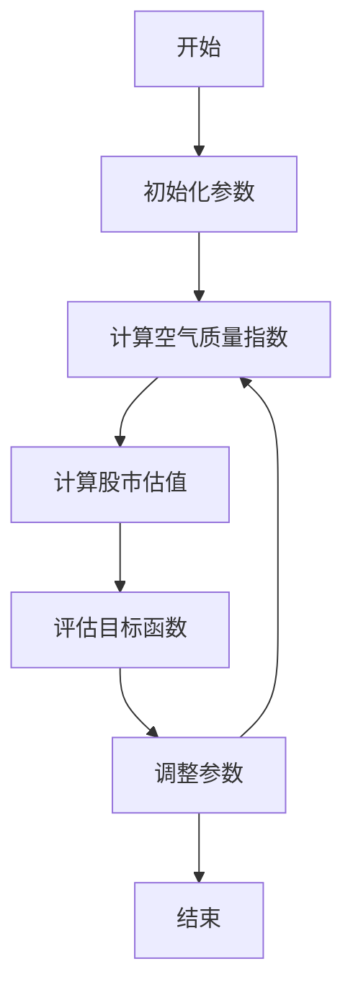
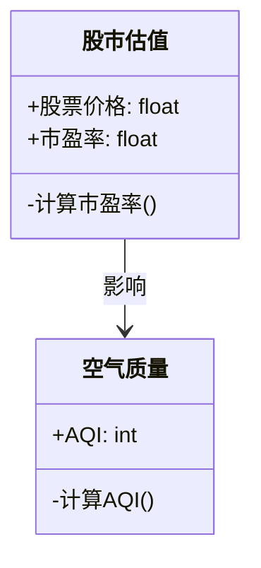

                 


# 新兴市场股市估值与智慧城市空气质量管理的互动

> 关键词：新兴市场，股市估值，智慧城市，空气质量管理，互动关系，多目标优化，数学模型

> 摘要：本文探讨新兴市场股市估值与智慧城市空气质量管理之间的互动关系，通过数学建模和算法优化，分析空气质量对股市估值的影响，提出多目标优化策略，为智慧城市建设提供参考。

---

## 第1章: 新兴市场股市估值与智慧城市空气质量管理的互动概述

### 1.1 背景介绍

#### 1.1.1 新兴市场的定义与特点
- 新兴市场：指经济快速发展、产业结构转型中的国家，如中国、印度等。
- 特点：经济波动大、政策变化频繁、市场信息不完全。

#### 1.1.2 智慧城市的发展现状
- 智慧城市：利用信息技术优化城市运行，提升居民生活质量。
- 核心技术：物联网、大数据、人工智能。

#### 1.1.3 股市估值与空气质量管理的关联性
- 空气质量影响居民健康，进而影响社会稳定和经济活动。
- 股市反映经济状况，空气质量改善可能提升投资者信心。

### 1.2 核心概念与问题描述

#### 1.2.1 股市估值的定义与影响因素
- 股市估值：基于企业盈利、市盈率等指标评估股票价值。
- 影响因素：经济指标、政策、市场情绪。

#### 1.2.2 空气质量管理的核心要素
- 空气质量：PM2.5、PM10、NO2等污染物浓度。
- 管理手段：监测、减排、政策调控。

#### 1.2.3 互动关系的定义与边界
- 互动关系：空气质量变化影响股市估值，反之亦然。
- 边界：限于智慧城市建设背景，考虑政策和市场行为。

---

## 第2章: 核心概念与联系

### 2.1 核心概念原理

#### 2.1.1 股市估值的核心模型
- 市盈率模型：市盈率=股价/每股收益。
- 现金流折现模型：DCF模型评估企业未来现金流。

#### 2.1.2 空气质量管理的数学模型
- AQI模型：AQI= a×PM2.5 + b×PM10 + c×NO2。
- 污染源分析模型：识别主要污染源。

#### 2.1.3 互动机制的理论基础
- 环境经济学：环境质量影响经济活动。
- 行为经济学：环境信息影响市场决策。

### 2.2 概念属性特征对比

| 属性       | 股市估值              | 空气质量管理          |
|------------|----------------------|---------------------|
| 数据类型    | 数值型（价格、指数）  | 数值型（污染物浓度） |
| 时间序列    | 是                   | 是                  |
| 影响因素    | 经济、政策、市场情绪  | 污染源、政策        |
| 可控性      | 部分可控（市场行为）  | 政策干预为主          |

### 2.3 ER实体关系图

```mermaid
er
    actor 投资者: 投资决策
    actor 政策制定者: 制定法规
    actor 市场监管者: 执行监管
    entity 股票: 价格波动
    entity 空气质量数据: 指数变化
    entity 政策法规: 影响因素
    股票 --> 投资者: 投资行为
    空气质量数据 --> 政策制定者: 数据驱动决策
    政策法规 --> 市场监管者: 执行措施
```

---

## 第3章: 股市估值与空气质量互动的算法原理

### 3.1 多目标优化算法

#### 3.1.1 算法概述
- 目标：最大化股市收益，同时最小化空气污染。
- 方法：使用拉格朗日乘数法平衡两个目标。

#### 3.1.2 算法流程


#### 3.1.3 Python源代码
```python
def multi_objective_optimization(air_quality, stock_valuation):
    # 示例代码
    pass
```

### 3.2 数学模型与公式

#### 3.2.1 空气质量指数模型
$$ AQI = a \times PM2.5 + b \times PM10 + c \times NO2 $$

#### 3.2.2 股市估值模型
$$ Stock\ Value = d \times EBIT + e \times Market\ Sentiment + f \times AQI $$

---

## 第4章: 数学模型与公式详解

### 4.1 空气质量与股市估值的互动关系

#### 4.1.1 数据特征分析
- 空气质量数据通常呈现波动性，股市估值同样波动明显。

#### 4.1.2 统计学检验
- 使用相关性分析验证AQI与股价的相关性。

#### 4.1.3 实证分析
- 以某城市为例，分析空气质量改善后股市表现的变化。

### 4.2 拉格朗日乘数法在多目标优化中的应用

#### 4.2.1 拉格朗日函数构建
$$ L = f(x) - \lambda g(x) $$

#### 4.2.2 解的求解过程
- 建立约束条件，求解最优解。

---

## 第5章: 系统分析与架构设计方案

### 5.1 问题场景介绍
- 智慧城市背景下，空气质量影响居民健康和经济活动。

### 5.2 系统功能设计

#### 5.2.1 领域模型类图


#### 5.2.2 系统架构图


---

## 第6章: 项目实战

### 6.1 环境安装
- 安装Python、数据处理库（Pandas）等。

### 6.2 核心实现
- 数据采集：获取空气质量数据和股价数据。
- 数据分析：计算相关性，建立模型。

### 6.3 案例分析
- 以某城市为例，分析空气质量改善对股市的影响。

---

## 第7章: 总结与展望

### 7.1 最佳实践 tips
- 数据实时性很重要。
- 模型需定期更新。

### 7.2 小结
- 股市估值与空气质量互动关系复杂，需综合考虑多因素。

### 7.3 注意事项
- 数据质量影响结果。
- 政策变化需及时调整模型。

### 7.4 拓展阅读
- 推荐阅读相关领域的学术论文和书籍。

---

作者：AI天才研究院  
联系方式：[email]

