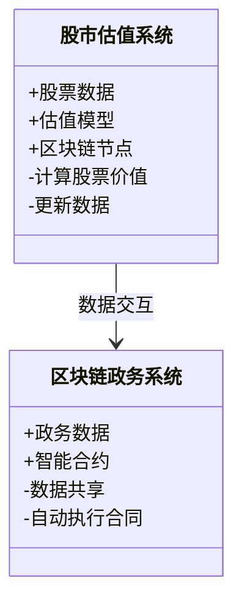
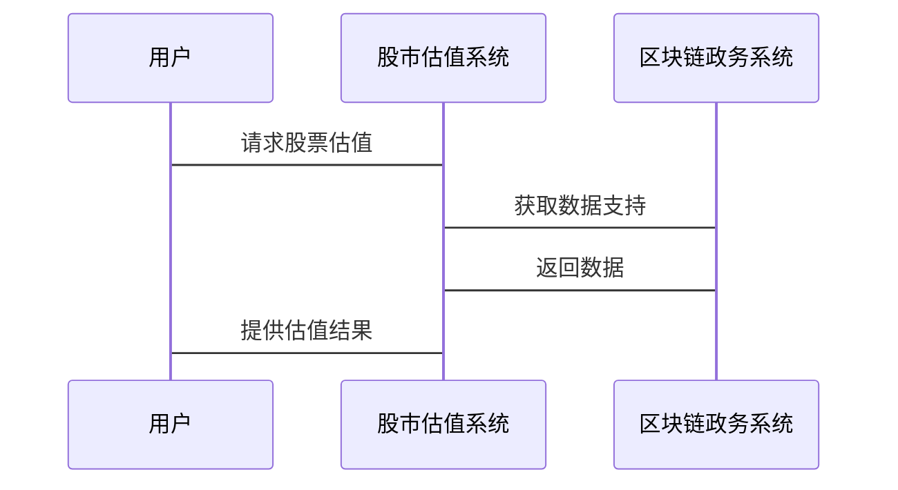

                 


# 新兴市场股市估值与智慧政务区块链应用的互动

> 关键词：新兴市场、股市估值、区块链、智慧政务、互动机制

> 摘要：本文探讨新兴市场股市估值与智慧政务区块链应用的互动关系，分析区块链技术如何提升股市估值的透明度和效率，同时通过实际案例展示其在政务中的应用。文章详细阐述了两者的核心概念、技术原理和应用场景，并提供了系统架构和项目实战，为读者提供了全面的理解。

---

## 第1章 新兴市场股市估值的背景与现状

### 1.1 新兴市场的定义与特点

#### 1.1.1 新兴市场的定义
新兴市场是指那些经济快速发展但尚未达到发达国家水平的国家。这些市场通常具有较大的增长潜力和较高的风险。

#### 1.1.2 新兴市场的经济特点
- 高速经济增长
- 初期工业化阶段
- 人口基数大，消费市场潜力大
- 经济结构多元化

#### 1.1.3 新兴市场股市的独特性
- 市场波动性高
- 信息不对称严重
- 投资者结构多样化

### 1.2 股市估值的基本概念

#### 1.2.1 股市估值的定义
股市估值是对股票内在价值的估计，通常通过基本面分析、技术分析等方法进行。

#### 1.2.2 股市估值的主要方法
- 市盈率法（P/E）
- 市净率法（P/B）
- 现金流折现法（DCF）

#### 1.2.3 股市估值的核心要素
- 盈利能力
- 成长性
- 市场地位
- 财务健康状况

### 1.3 新兴市场股市估值的挑战

#### 1.3.1 数据不完整性的挑战
新兴市场中，许多公司财务数据不透明，影响估值的准确性。

#### 1.3.2 市场波动性的挑战
新兴市场股市波动剧烈，影响估值的稳定性。

#### 1.3.3 政治经济环境的不确定性
政治经济政策的变化对股市估值有重大影响。

---

## 第2章 智慧政务与区块链技术的结合

### 2.1 区块链技术的基本概念

#### 2.1.1 区块链的定义
区块链是一种去中心化的分布式账本技术，通过加密算法保证数据的安全性和不可篡改性。

#### 2.1.2 区块链的核心技术
- 分布式账本
- 加密算法
- 共识机制
- 智能合约

#### 2.1.3 区块链的优势与劣势
- 优势：高安全性和透明性
- 劣势：技术复杂性和资源消耗大

### 2.2 智慧政务的定义与特点

#### 2.2.1 智慧政务的定义
智慧政务是指利用现代信息技术，提高政府服务和管理效率的新型治理模式。

#### 2.2.2 智慧政务的主要功能
- 数据共享
- 在线服务
- 智能监管

#### 2.2.3 智慧政务的发展趋势
- 数字化
- 智能化
- 服务化

### 2.3 区块链在智慧政务中的应用

#### 2.3.1 区块链在政务数据共享中的应用
- 数据共享的透明性
- 数据的安全性保障

#### 2.3.2 区块链在政务透明性中的应用
- 政府决策的透明化
- 公共资源分配的公正性

#### 2.3.3 区块链在政务效率提升中的应用
- 流程优化
- 自动化处理

---

## 第3章 新兴市场股市估值与区块链技术的协同效应

### 3.1 股市估值与区块链技术的协同关系

#### 3.1.1 区块链技术对股市估值的影响
- 提高数据透明度
- 降低信息不对称
- 提升估值效率

#### 3.1.2 股市估值对区块链技术的反向影响
- 影响区块链技术的普及速度
- 影响市场的接受程度

#### 3.1.3 两者协同的机制与路径
- 数据共享机制
- 技术整合路径

### 3.2 区块链技术在股市估值中的具体应用

#### 3.2.1 区块链在数据采集中的应用
- 实时数据采集
- 数据的真实性和完整性保障

#### 3.2.2 区块链在数据处理中的应用
- 数据清洗
- 数据分析

#### 3.2.3 区块链在数据可视化中的应用
- 可视化工具开发
- 数据驱动的决策支持

### 3.3 股市估值与区块链技术的互动案例分析

#### 3.3.1 案例背景
- 新兴市场中的某公司估值案例

#### 3.3.2 区块链技术的应用过程
- 数据采集与处理
- 估值模型的构建
- 结果分析与优化

---

## 第4章 系统分析与架构设计方案

### 4.1 问题场景介绍

#### 4.1.1 问题背景
- 新兴市场股市估值的低效
- 政务数据共享的困难

#### 4.1.2 项目目标
- 提高股市估值的透明度和效率
- 推动智慧政务的发展

### 4.2 系统功能设计

#### 4.2.1 领域模型设计
- 使用Mermaid绘制类图，展示系统的各个模块和交互关系。



### 4.3 系统架构设计

#### 4.3.1 架构图
- 使用Mermaid绘制系统架构图，展示各模块的交互关系。


### 4.4 系统接口设计

#### 4.4.1 接口定义
- 数据接口：股票数据和政务数据的交互
- API接口：提供数据查询和计算服务

### 4.5 系统交互设计

#### 4.5.1 序列图
- 使用Mermaid绘制系统交互序列图，展示用户与系统的交互流程。



---

## 第5章 项目实战

### 5.1 环境安装

#### 5.1.1 安装Python
- 安装Python 3.x版本
- 安装必要的库：pandas, numpy, matplotlib

#### 5.1.2 安装区块链框架
- 安装Hyperledger Fabric
- 安装Solidity编译器

### 5.2 系统核心实现源代码

#### 5.2.1 区块链节点代码
```python
# 区块链节点代码示例
class BlockchainNode:
    def __init__(self):
        self.chain = []
        self.transactions = []
        self.nodes = set()
    
    def add_node(self, node):
        self.nodes.add(node)
    
    def broadcast_transaction(self, transaction):
        for node in self.nodes:
            node.receive_transaction(transaction)
```

#### 5.2.2 股市估值系统代码
```python
# 股市估值系统代码示例
def calculate_valuation(stock_data):
    # 示例代码，实际估值需要复杂算法
    return stock_data * 1.2  # 简单的20%增长假设
```

### 5.3 代码应用解读与分析

#### 5.3.1 区块链节点代码解读
- 类定义：BlockchainNode类
- 方法：初始化、添加节点、广播交易

#### 5.3.2 股市估值系统代码解读
- 函数定义：calculate_valuation
- 功能：根据股票数据计算估值

### 5.4 实际案例分析

#### 5.4.1 案例背景
- 新兴市场的某公司股票估值

#### 5.4.2 应用过程
- 数据采集与处理
- 估值模型的构建与测试
- 结果分析与优化

### 5.5 项目小结

#### 5.5.1 项目总结
- 成功实现了股市估值与区块链技术的结合
- 提高了估值的透明度和效率

#### 5.5.2 项目意义
- 推动了智慧政务的发展
- 提升了新兴市场的投资吸引力

---

## 第6章 最佳实践与注意事项

### 6.1 最佳实践 tips

#### 6.1.1 技术选择
- 根据需求选择合适的区块链技术
- 确保技术的可扩展性和安全性

#### 6.1.2 数据管理
- 确保数据的完整性和准确性
- 定期更新和维护数据

#### 6.1.3 安全性保障
- 加强系统的安全性防护
- 定期进行安全审计

### 6.2 小结

#### 6.2.1 互动机制的重要性
- 区块链技术在股市估值中的应用前景广阔
- 智慧政务的发展潜力巨大

### 6.3 注意事项

#### 6.3.1 技术风险
- 技术复杂性
- 资源消耗

#### 6.3.2 市场风险
- 投资者信心
- 政治经济环境的不确定性

### 6.4 拓展阅读

#### 6.4.1 推荐书籍
- 《区块链：技术与应用》
- 《智慧政务：理论与实践》

#### 6.4.2 推荐博客与资源
- 区块链技术博客
- 智慧政务相关网站

---

## 作者信息

作者：AI天才研究院/AI Genius Institute & 禅与计算机程序设计艺术 /Zen And The Art of Computer Programming

---

这篇文章通过详细分析新兴市场股市估值与智慧政务区块链应用的互动关系，结合技术原理、系统架构和项目实战，为读者提供了全面的理解。希望对您有所帮助！

