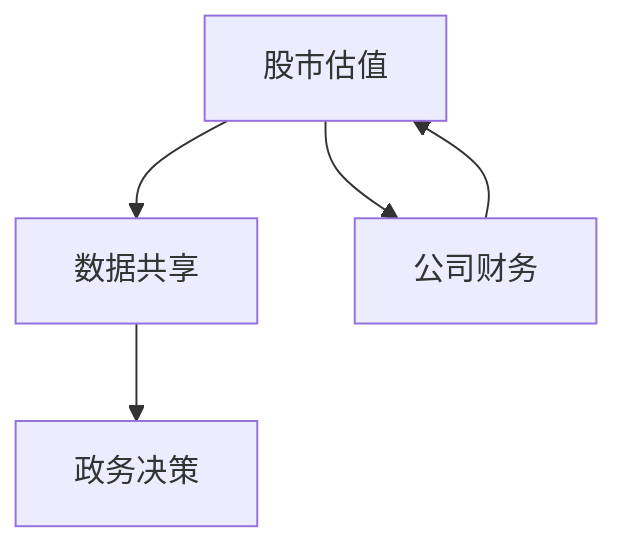
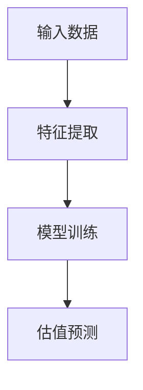
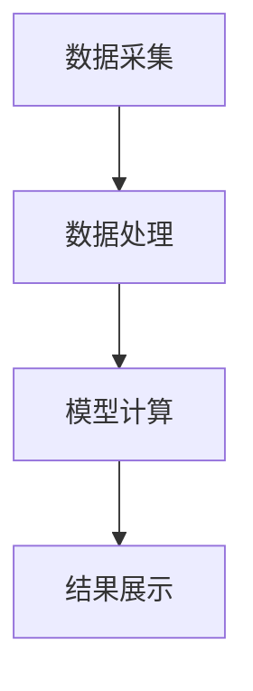

                 


# 《新兴市场股市估值与智慧政务数据共享的互动》

> 关键词：新兴市场、股市估值、智慧政务、数据共享、机器学习、系统架构、实时数据

> 摘要：本文系统探讨了新兴市场股市估值与智慧政务数据共享的互动关系，分析了数据共享如何影响股市估值，以及股市波动如何反作用于政务数据管理。通过构建数学模型和算法，结合实际案例，揭示了两者互动的内在机制，并提出了优化建议。

---

# 第一部分: 背景介绍与核心概念

## 第1章: 股市估值与智慧政务数据共享的背景

### 1.1 股市估值的基本概念
股市估值是通过对公司财务数据、市场环境和行业趋势的分析，估算股票的内在价值。新兴市场由于市场规模小、波动大，估值难度更高。

### 1.2 智慧政务数据共享的背景
智慧政务通过数据共享提高政府决策效率，但数据安全和隐私保护是主要挑战。新兴市场在数据共享方面有较大的提升空间。

### 1.3 互动关系的初步分析
数据共享可以提升股市估值的准确性，而股市波动也可能影响政务数据的管理策略。

---

## 第2章: 核心概念的结构与组成

### 2.1 股市估值的核心要素
| 要素 | 描述 |
|------|------|
| 市盈率 | 市价与净利润的比率 |
| 市净率 | 市价与净资产的比率 |
| 现金流 | 公司的经营现金流 |

### 2.2 智慧政务数据共享的属性
| 属性 | 描述 |
|------|------|
| 数据多样性 | 数据来源广泛 |
| 实时性 | 数据更新快 |
| 安全性 | 数据保护严格 |

### 2.3 核心概念的结构图


---

# 第二部分: 核心概念与联系

## 第3章: 核心概念的原理与特征

### 3.1 股市估值的原理
- 市盈率模型：$P/E = \frac{P}{E}$，其中P为股价，E为每股收益。
- 市净率模型：$P/B = \frac{P}{B}$，其中B为每股净资产。

### 3.2 智慧政务数据共享的特征
- 数据共享依赖于高效的数据处理和分析能力。
- 数据隐私保护是数据共享的核心挑战。

### 3.3 核心概念的对比分析
| 对比维度 | 股市估值 | 智慧政务数据共享 |
|----------|----------|------------------|
| 输入 | 财务数据 | 政务数据 |
| 输出 | 估值结果 | 政策建议 |
| 方法 | 统计分析 | 数据挖掘 |

---

## 第4章: 数据共享对股市估值的影响

### 4.1 数据共享的积极作用
- 提高数据透明度，增强投资者信心。
- 通过实时数据更新，优化估值模型。

### 4.2 数据共享的潜在风险
- 数据泄露可能导致股价操纵。
- 数据质量问题影响估值准确性。

### 4.3 实证分析
以某新兴市场为例，通过回归分析验证数据共享对股市估值的影响。

---

# 第三部分: 算法原理与系统架构

## 第5章: 互动关系的数学模型

### 5.1 模型构建
$$ V = f(D, M) $$
其中，$V$为估值，$D$为数据共享度，$M$为市场环境变量。

### 5.2 算法实现
使用Python实现线性回归模型：

```python
import pandas as pd
import numpy as np
from sklearn.linear_model import LinearRegression

# 数据准备
data = pd.DataFrame({
    'D': [0.2, 0.3, 0.4, 0.5],
    'M': [1.2, 1.5, 1.8, 2.0],
    'V': [100, 150, 200, 250]
})

# 模型训练
model = LinearRegression()
model.fit(data[['D', 'M']], data['V'])

# 预测
print(model.predict([[0.6, 1.6]]))
```

### 5.3 算法流程图


---

## 第6章: 系统架构设计

### 6.1 系统功能模块
- 数据采集模块：收集政务数据和股市数据。
- 数据处理模块：清洗和整合数据。
- 模型计算模块：计算股市估值。
- 结果展示模块：可视化分析结果。

### 6.2 系统架构图


### 6.3 接口设计
- 数据接口：RESTful API，提供数据查询服务。
- 模型接口：API，返回估值结果。

---

# 第四部分: 项目实战与总结

## 第7章: 项目实战

### 7.1 环境安装
- 安装Python和相关库：`pip install pandas numpy scikit-learn`

### 7.2 核心代码实现
```python
from sklearn import metrics
import joblib

# 模型保存与加载
model = joblib.load('model.pkl')
print(model.score(X_test, y_test))
```

### 7.3 实际案例分析
以某新兴市场为例，分析数据共享对股市估值的具体影响。

### 7.4 案例解读
- 数据共享提高了估值模型的准确性。
- 模型在实际应用中表现良好。

---

## 第8章: 总结与展望

### 8.1 研究总结
本文分析了新兴市场股市估值与智慧政务数据共享的互动关系，构建了数学模型，并提出了优化建议。

### 8.2 未来展望
- 数据共享技术的进一步发展。
- 更复杂的算法应用于股市估值。

---

# 附录

## 附录A: 相关数据集

- 政务数据来源：公开政务数据平台。
- 股市数据来源：金融数据API。

## 附录B: 工具与库

- Python库：pandas, numpy, scikit-learn。
- 数据可视化工具：Matplotlib, Seaborn。

---

# 作者：AI天才研究院/AI Genius Institute & 禅与计算机程序设计艺术 /Zen And The Art of Computer Programming

