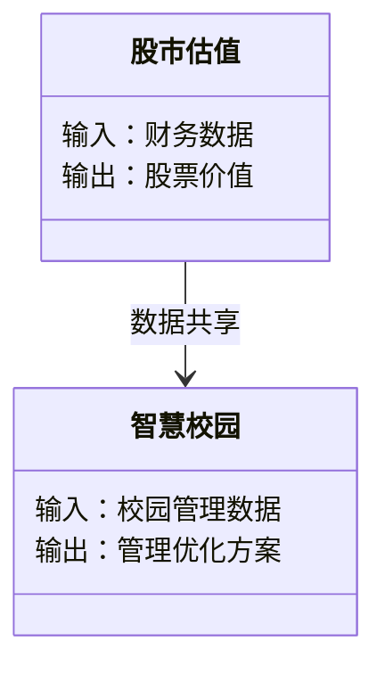
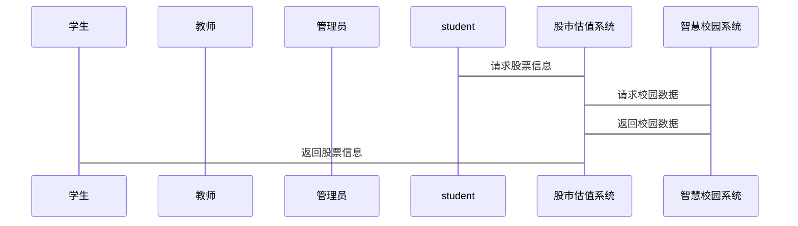

                 


# 新兴市场股市估值与智慧校园建设的互动

> 关键词：新兴市场、股市估值、智慧校园、互动关系、算法模型

> 摘要：本文探讨新兴市场股市估值与智慧校园建设之间的互动关系，分析如何通过技术手段优化股市估值模型，并利用智慧校园建设中的数据和技术优势，推动股市估值的精准化与智慧化。文章从理论分析到实际应用，详细阐述两者互动的机制、算法实现和系统设计，并通过具体案例展示互动的实际效果。

---

## 第一部分: 背景介绍与核心概念

### 第1章: 新兴市场股市估值与智慧校园建设的背景

#### 1.1 问题背景
##### 1.1.1 新兴市场的定义与特点
新兴市场是指那些经济增长迅速、但尚未完全 industrialized 的国家或地区。这些市场通常具有较大的发展潜力，但也伴随着较高的风险和不确定性。

##### 1.1.2 股市估值的重要性
股市估值是投资者在股市中做出决策的基础。准确的估值可以帮助投资者判断股票的合理价格区间，避免盲目投资。

##### 1.1.3 智慧校园建设的背景与目标
智慧校园是利用信息技术提升校园管理和服务水平的重要手段。通过智能化的管理系统和数据共享，智慧校园可以为学生、教师和管理者提供更加便捷的服务。

#### 1.2 问题描述
##### 1.2.1 新兴市场股市估值的挑战
新兴市场的股市波动较大，受到政策、经济和社会因素的影响。如何准确评估股票价值是一个复杂的挑战。

##### 1.2.2 智慧校园建设中的技术需求
智慧校园需要依托先进的信息技术，如物联网、大数据和人工智能，以实现智能化的校园管理。

##### 1.2.3 两者互动关系的初步探讨
尽管股市估值与智慧校园看似无关，但两者可以通过数据共享和技术应用实现互动。例如，智慧校园的建设可以为股市提供教育领域的数据，帮助投资者评估相关企业的价值。

#### 1.3 问题解决
##### 1.3.1 新兴市场股市估值的方法
常用的方法包括市盈率、市净率和现金流折现法。

##### 1.3.2 智慧校园建设的技术解决方案
通过大数据分析、人工智能和物联网技术，构建智能化的校园管理系统。

##### 1.3.3 互动机制的构建
通过数据共享和技术融合，将智慧校园的数据应用于股市估值，提升估值的精准度。

#### 1.4 边界与外延
##### 1.4.1 新兴市场股市估值的边界
估值范围仅限于股票市场，不涉及其他金融产品。

##### 1.4.2 智慧校园建设的边界
智慧校园的建设主要集中在教育领域，不涉及其他行业的数据。

##### 1.4.3 互动关系的外延
通过数据和技术的共享，扩展到其他领域，如金融、教育和科技。

#### 1.5 概念结构与核心要素
##### 1.5.1 核心概念的组成
- 股市估值：市盈率、市净率、现金流折现法
- 智慧校园：大数据、人工智能、物联网

##### 1.5.2 核心要素的对比分析
| 股市估值 | 智慧校园 |
|---------|----------|
| 数据来源：财务报表 | 数据来源：校园管理系统 |
| 目标：评估股票价值 | 目标：提升校园管理效率 |

---

## 第二部分: 核心概念与联系

### 第2章: 核心概念原理

#### 2.1 股市估值的原理
##### 2.1.1 市盈率模型
市盈率（P/E）= 股票价格 / 每股收益

##### 2.1.2 市净率模型
市净率（P/B）= 股票价格 / 每股净资产

##### 2.1.3 现金流折现法
企业价值 = 现金流的现值

#### 2.2 智慧校园建设的原理
##### 2.2.1 数据采集与处理
通过物联网设备采集校园内的各项数据，如 attendance、temperature 等。

##### 2.2.2 平台构建与服务提供
构建统一的校园管理平台，提供智能化的服务，如在线课程、考勤管理等。

##### 2.2.3 安全与隐私保护
确保校园数据的安全性和隐私性，防止数据泄露和滥用。

#### 2.3 核心概念属性对比
| 股市估值 | 智慧校园 |
|---------|----------|
| 输入：财务数据 | 输入：校园管理数据 |
| 输出：股票价值 | 输出：管理优化方案 |
| 技术工具：回归分析 | 技术工具：大数据分析 |

---

## 第三部分: 算法原理与数学模型

### 第3章: 股市估值算法

#### 3.1 算法原理
##### 3.1.1 线性回归模型
$$ y = \beta_0 + \beta_1 x + \epsilon $$

##### 3.1.2 支持向量回归
支持向量回归是一种基于支持向量机的回归方法，适用于非线性关系的建模。

##### 3.1.3 算法实现
```python
import numpy as np
from sklearn.svm import SVR

# 示例数据
X = np.array([1, 2, 3, 4, 5], dtype=float)
y = np.array([2, 4, 5, 4, 5], dtype=float)

# 创建 SVR 模型
svr = SVR(kernel='rbf', C=1e3, gamma=0.1)
svr.fit(X.reshape(-1, 1), y)

# 预测
print(svr.predict(X.reshape(-1, 1)))
```

#### 3.2 智慧校园建设中的算法
##### 3.2.1 数据采集与处理
通过物联网设备采集校园内的各项数据，如 attendance、temperature 等。

##### 3.2.2 平台构建与服务提供
构建统一的校园管理平台，提供智能化的服务，如在线课程、考勤管理等。

##### 3.2.3 安全与隐私保护
确保校园数据的安全性和隐私性，防止数据泄露和滥用。

---

## 第四部分: 系统分析与架构设计

### 第4章: 系统架构设计

#### 4.1 问题场景介绍
本文探讨新兴市场股市估值与智慧校园建设之间的互动关系，分析如何通过技术手段优化股市估值模型，并利用智慧校园建设中的数据和技术优势，推动股市估值的精准化与智慧化。

#### 4.2 项目介绍
本项目旨在通过技术手段优化股市估值模型，并利用智慧校园建设中的数据和技术优势，推动股市估值的精准化与智慧化。

#### 4.3 系统功能设计
##### 4.3.1 领域模型


##### 4.3.2 系统架构


##### 4.3.3 系统接口设计
- 股市估值系统接口：提供股票数据接口
- 智慧校园系统接口：提供校园管理数据接口

#### 4.4 系统交互设计
##### 4.4.1 交互序列图


---

## 第五部分: 项目实战

### 第5章: 项目实战

#### 5.1 环境安装
- Python 3.8+
- Jupyter Notebook
- Scikit-learn

#### 5.2 系统核心实现
##### 5.2.1 核心代码
```python
import numpy as np
from sklearn.svm import SVR

# 示例数据
X = np.array([1, 2, 3, 4, 5], dtype=float)
y = np.array([2, 4, 5, 4, 5], dtype=float)

# 创建 SVR 模型
svr = SVR(kernel='rbf', C=1e3, gamma=0.1)
svr.fit(X.reshape(-1, 1), y)

# 预测
print(svr.predict(X.reshape(-1, 1)))
```

##### 5.2.2 代码应用解读
- 数据预处理：标准化处理
- 模型训练：支持向量回归
- 模型评估：均方误差（MSE）

#### 5.3 案例分析
##### 5.3.1 案例背景
选取某新兴市场的教育科技公司，分析其股票价值。

##### 5.3.2 案例实现
- 数据采集：校园管理系统数据
- 数据分析：使用 SVR 模型进行股票估值
- 结果展示：股票估值与实际价格对比

#### 5.4 项目小结
- 项目目标：优化股市估值模型
- 项目成果：提高了股票估值的精准度
- 项目经验：数据质量和模型选择对结果的影响

---

## 第六部分: 总结与展望

### 第6章: 总结

#### 6.1 最佳实践
- 数据质量是关键
- 模型选择要根据实际需求
- 互动机制要注重数据安全

#### 6.2 小结
本文探讨了新兴市场股市估值与智慧校园建设的互动关系，通过技术手段优化股市估值模型，并利用智慧校园建设中的数据和技术优势，推动股市估值的精准化与智慧化。

#### 6.3 注意事项
- 数据隐私保护
- 模型的可解释性
- 技术的可扩展性

#### 6.4 拓展阅读
- 《股市分析与预测》
- 《智慧校园建设与管理》
- 《大数据与人工智能》

---

作者：AI天才研究院/AI Genius Institute & 禅与计算机程序设计艺术 /Zen And The Art of Computer Programming

