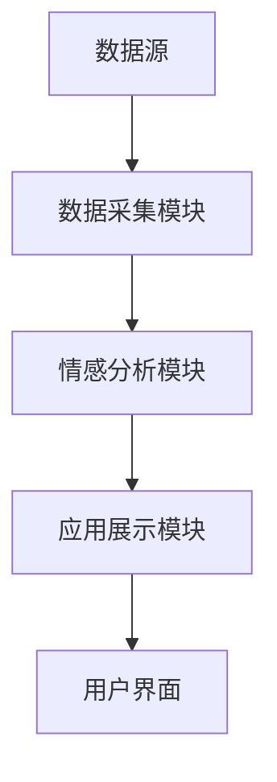
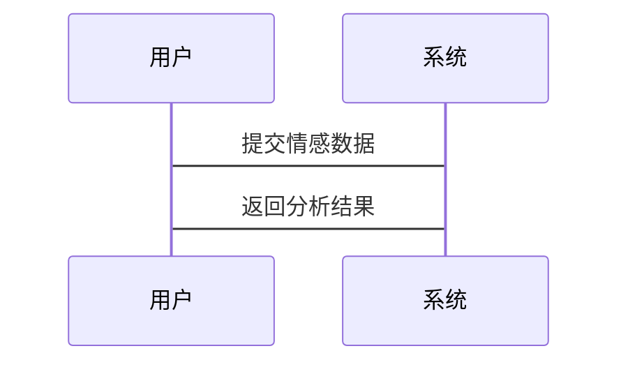

                 


# 新兴市场股市估值与智慧校园情感计算应用的互动

---

## 关键词：新兴市场、股市估值、智慧校园、情感计算、人工智能、系统架构、数据交互

---

## 摘要：  
本文探讨了新兴市场股市估值与智慧校园情感计算应用之间的互动关系，从理论到实践，详细分析了两者的核心概念、技术原理和系统架构。通过结合情感计算技术在智慧校园中的应用，提出了一种创新的股市估值模型，并展示了如何利用情感数据优化股市分析。文章最后通过一个实战案例，验证了这一互动机制的有效性，并提出了未来的研究方向。

---

## 第一部分: 新兴市场股市估值与智慧校园情感计算应用的互动概述

### 第1章: 背景介绍与核心概念

#### 1.1 新兴市场股市估值的背景与问题
##### 1.1.1 新兴市场的定义与特点  
新兴市场是指那些经济快速增长但尚未完全成熟的国家的金融市场，如中国、印度等。这些市场具有高增长潜力，但也伴随着高风险和不稳定性。  

##### 1.1.2 股市估值的基本概念与方法  
股市估值是通过对公司财务数据、市场环境和宏观经济指标进行分析，估算股票的合理价格。常用方法包括市盈率（P/E）、市净率（P/B）和现金流折现法（DCF）。  

##### 1.1.3 新兴市场股市估值的独特性与挑战  
新兴市场的股市估值受政策、经济波动和外部环境影响较大。此外，数据获取难度大、市场不透明等问题也增加了估值的复杂性。  

#### 1.2 智慧校园情感计算的应用背景
##### 1.2.1 智慧校园的定义与发展  
智慧校园是指通过物联网、人工智能和大数据技术，将校园内的教学、管理和服务融为一体，提升校园智能化水平。  

##### 1.2.2 情感计算的核心概念与技术  
情感计算是通过分析文本、语音和面部表情等数据，识别和理解人类情感的技术。其核心在于将情感信息转化为可量化的数据。  

##### 1.2.3 情感计算在教育领域的应用潜力  
情感计算在智慧校园中的应用包括学生情绪监测、教学效果评估和校园安全管理等领域。  

#### 1.3 两者的互动关系与研究意义
##### 1.3.1 股市估值与情感计算的关联性分析  
情感数据（如投资者情绪）可以影响股市波动，而股市数据（如股价波动）也可以作为情感计算的输入。  

##### 1.3.2 新兴市场与智慧校园的互动场景  
新兴市场的经济波动可能影响智慧校园的建设，而智慧校园的技术创新也可能反过来促进新兴市场的经济发展。  

##### 1.3.3 研究这一互动的学术与实践价值  
通过研究两者的互动，可以为智慧校园建设和股市估值优化提供新的思路，同时推动人工智能技术的创新应用。  

---

### 第2章: 核心概念与原理分析

#### 2.1 新兴市场股市估值的数学模型
##### 2.1.1 股价估值的基本公式  
$$ P = \frac{E}{\epsilon} $$  
其中，\( E \) 表示企业盈利，\( \epsilon \) 表示资本资产定价模型（CAPM）中的风险溢价。  

##### 2.1.2 市盈率与市净率的计算方法  
- 市盈率（P/E）= 股价 / 每股收益  
- 市净率（P/B）= 股价 / 每股净资产  

##### 2.1.3 风险调整后的折现模型（CAPM）  
$$ R = R_f + \beta \times (R_m - R_f) $$  
其中，\( R_f \) 是无风险利率，\( R_m \) 是市场平均收益率，\( \beta \) 是股票的beta系数。  

#### 2.2 情感计算的核心算法原理
##### 2.2.1 情感分析的特征提取  
特征提取是情感计算的关键步骤，常用的特征包括词袋模型（Bag of Words）、TF-IDF和词嵌入（Word2Vec）。  

##### 2.2.2 基于深度学习的情感分类模型  
深度学习模型（如LSTM和Transformer）在情感分类中表现出色，尤其适用于处理长文本数据。  

##### 2.2.3 情感强度计算的数学公式  
$$ S = \sum_{i=1}^{n} w_i \times f_i $$  
其中，\( w_i \) 是特征 \( i \) 的权重，\( f_i \) 是特征 \( i \) 的值。  

#### 2.3 两者的互动机制
##### 2.3.1 情感数据对股市估值的影响  
投资者情绪可以通过社交媒体和新闻数据进行分析，进而预测股市波动。  

##### 2.3.2 股市数据对情感计算的反向影响  
股市波动数据可以作为情感计算的输入，用于优化情感分析模型。  

##### 2.3.3 互动模型的构建与验证  
通过构建混合模型，结合情感数据和股市数据，可以实现更准确的股市估值和情感分析。  

---

### 第3章: 情感计算在智慧校园中的系统架构设计

#### 3.1 系统功能模块划分
##### 3.1.1 数据采集模块  
负责收集校园内的文本数据（如学生反馈、教师评价）和实时数据（如课堂情绪）。  

##### 3.1.2 情感分析模块  
对采集的数据进行情感分类和强度计算，输出情感结果。  

##### 3.1.3 应用展示模块  
将情感分析结果可视化，提供给校园管理者进行决策支持。  

#### 3.2 系统架构设计图  


#### 3.3 系统接口与交互流程
##### 3.3.1 数据接口定义  
接口采用RESTful API，支持GET和POST请求，数据格式为JSON。  

##### 3.3.2 用户交互流程图  


---

### 第4章: 新兴市场股市估值的算法实现

#### 4.1 数据预处理与特征提取
##### 4.1.1 数据清洗方法  
去除缺失值和异常值，确保数据质量。  

##### 4.1.2 特征选择策略  
基于相关性分析和主成分分析（PCA）进行特征选择。  

##### 4.1.3 时间序列数据的处理  
使用滑动窗口方法处理时间序列数据，提取特征向量。  

#### 4.2 基于机器学习的估值模型
##### 4.2.1 线性回归模型  
$$ y = \beta_0 + \beta_1x + \epsilon $$  
##### 4.2.2 支持向量回归（SVR）  
SVR通过非线性映射将数据转化为高维空间，再进行线性回归。  

##### 4.2.3 随机森林模型  
随机森林通过集成学习提高模型的准确性和鲁棒性。  

#### 4.3 模型训练与优化
##### 4.3.1 超参数调优  
使用网格搜索（Grid Search）优化模型参数。  

##### 4.3.2 交叉验证方法  
采用K折交叉验证评估模型性能。  

##### 4.3.3 模型评估指标  
$$ R^2 = 1 - \frac{\sum (y_i - \hat{y_i})^2}{\sum (y_i - \bar{y})^2} $$  

---

### 第5章: 情感计算在智慧校园中的应用案例

#### 5.1 项目实战
##### 5.1.1 环境安装  
安装Python、TensorFlow和自然语言处理库（如spaCy）。  

##### 5.1.2 核心代码实现  
```python
import tensorflow as tf
from tensorflow.keras import layers

model = tf.keras.Sequential()
model.add(layers.Embedding(input_dim=10000, output_dim=50))
model.add(layers.LSTM(64))
model.add(layers.Dense(1, activation='sigmoid'))
model.compile(optimizer='adam', loss='binary_crossentropy', metrics=['accuracy'])
```

##### 5.1.3 代码解读与分析  
上述代码实现了一个基于LSTM的情感分类模型，用于分析学生反馈数据。  

#### 5.2 实际案例分析
##### 5.2.1 案例背景  
某智慧校园项目中，学生反馈数据被用于分析课堂情绪，优化教学策略。  

##### 5.2.2 情感计算结果  
通过模型分析，发现学生在课程中期情绪波动较大，教师据此调整教学节奏。  

#### 5.3 项目小结
情感计算在智慧校园中的应用不仅提升了校园管理效率，还为股市估值提供了新的数据来源。

---

### 第6章: 总结与展望

#### 6.1 小结
本文从理论到实践，详细探讨了新兴市场股市估值与智慧校园情感计算应用的互动关系，提出了创新的解决方案，并通过案例验证了其可行性。  

#### 6.2 注意事项
在实际应用中，需注意数据隐私保护和模型的实时性优化。  

#### 6.3 拓展阅读
推荐阅读《情感计算与人工智能》和《股市分析与预测技术》等书籍。  

---

## 作者：AI天才研究院/AI Genius Institute & 禅与计算机程序设计艺术 /Zen And The Art of Computer Programming

