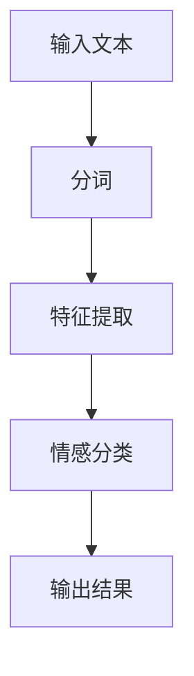
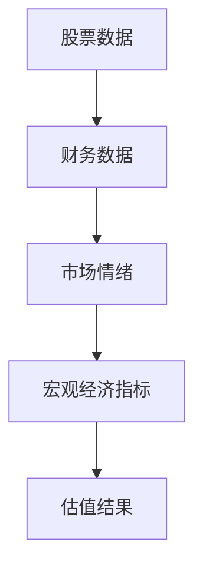

                 


# 新兴市场股市估值与智慧校园情感计算应用的互动

> 关键词：新兴市场、股市估值、情感计算、智慧校园、互动机制

> 摘要：本文探讨新兴市场股市估值与智慧校园情感计算应用之间的互动关系。通过分析股市估值的基本理论、情感计算的核心算法，结合实际案例，揭示两者如何相互影响，并提出系统的架构设计方案。文章最后展示了互动应用的实战项目，为读者提供全面的技术参考。

---

## 第1章: 新兴市场股市估值的背景与现状

### 1.1 股市估值的基本概念

#### 1.1.1 股市估值的定义与意义
股市估值是通过对公司财务数据、市场环境和宏观经济指标的分析，评估股票的内在价值。在新兴市场中，股市估值尤为重要，因为市场波动性大，投资者需要更精准的估值方法。

#### 1.1.2 新兴市场的特点与挑战
新兴市场通常具有高增长潜力，但也伴随着高风险。股市估值在新兴市场中面临数据不全、市场不透明等挑战，需要结合宏观和微观因素进行综合分析。

#### 1.1.3 股市估值的核心要素
- **市盈率（PE）**：市价与每股收益的比率。
- **市净率（PB）**：市价与每股净资产的比率。
- **股息率**：股息与股价的比率。

### 1.2 情感计算的背景与现状

#### 1.2.1 情感计算的定义与应用
情感计算是通过分析文本、语音和图像，识别和理解人类情感的过程。在智慧校园中，情感计算可用于学生情绪监测、课程优化等场景。

#### 1.2.2 智慧校园中的情感计算场景
- 学生情绪监测：通过社交媒体分析学生情绪，帮助学校及时干预。
- 教学优化：根据学生反馈优化课程设置。

#### 1.2.3 情感计算的核心技术
- **自然语言处理（NLP）**：用于文本情感分析。
- **机器学习**：用于情感分类和预测。

---

## 第2章: 情感计算的核心算法

### 2.1 情感分析的机器学习方法

#### 2.1.1 基于特征提取的分类算法
- **TF-IDF**：提取文本关键词。
- **SVM**：支持向量机用于分类。

#### 2.1.2 基于深度学习的情感分析模型
- **LSTM**：长短期记忆网络，适合处理序列数据。
- **BERT**：预训练语言模型，用于情感分析。

#### 2.1.3 情感计算的评价指标
- **准确率**：分类正确的比例。
- **F1分数**：综合精度和召回率的指标。

### 2.2 情感计算的数学模型

#### 2.2.1 情感分析的数学公式
$$ P(y=1|x) = \frac{e^{w \cdot x + b}}{1 + e^{w \cdot x + b}} $$

#### 2.2.2 情感计算的流程图


---

## 第3章: 股市估值的理论与方法

### 3.1 股价影响因素分析

#### 3.1.1 市场情绪对股价的影响
- **市场情绪指数**：反映市场参与者的情绪状态。
- **社交媒体数据**：通过分析社交媒体情绪预测股价波动。

#### 3.1.2 公司基本面分析
- **收入与利润**：公司财务数据。
- **行业地位**：公司在行业中的竞争地位。

#### 3.1.3 宏观经济指标的影响
- **GDP增长率**：反映宏观经济状况。
- **利率水平**：影响企业融资成本。

### 3.2 股市估值的数学模型

#### 3.2.1 市盈率模型
$$ PE = \frac{P}{E} $$

#### 3.2.2 市净率模型
$$ PB = \frac{P}{B} $$

#### 3.2.3 股票估值的流程图


---

## 第4章: 情感计算在股市估值中的应用

### 4.1 情感数据对股市的影响

#### 4.1.1 情感数据的采集与处理
- **数据源**：社交媒体、新闻媒体。
- **数据预处理**：清洗、分词、去停用词。

#### 4.1.2 情感数据对股价波动的预测
- **时间序列分析**：使用ARIMA模型预测股价波动。
- **情感强度分析**：量化市场情绪对股价的影响。

#### 4.1.3 情感计算在投资决策中的应用
- **情绪指数**：综合市场情绪指标，辅助投资决策。

### 4.2 情感计算对股市估值的优化

#### 4.2.1 基于情感计算的估值模型
$$ V = \alpha \cdot PE + \beta \cdot 情绪指数 $$

#### 4.2.2 情感计算对估值结果的改进
- **动态调整**：根据市场情绪实时调整估值参数。

---

## 第5章: 股市数据对情感计算的反向影响

### 5.1 股市数据对情感分析的启示

#### 5.1.1 市场情绪对情感计算模型的优化
- **数据增强**：结合股市数据优化情感分类器。

#### 5.1.2 股市波动对情感计算结果的验证
- **回测分析**：验证情感计算在股市中的应用效果。

#### 5.1.3 股市数据在情感计算中的应用
- **情绪强度分析**：根据股价波动量化情绪强度。

---

## 第6章: 互动应用的系统架构与实现

### 6.1 互动应用的系统架构设计

#### 6.1.1 系统功能模块划分
- **数据采集模块**：采集股市数据和情感数据。
- **情感计算模块**：进行情感分析和预测。
- **股市估值模块**：基于情感数据进行估值计算。
- **结果展示模块**：展示估值结果和情感分析结果。

#### 6.1.2 系统架构设计图


### 6.2 互动应用的实现与案例分析

#### 6.2.1 环境安装与配置
- **Python**：安装Python和相关库（如pandas、numpy、tensorflow）。

#### 6.2.2 核心代码实现
```python
import pandas as pd
from sklearn.model_selection import train_test_split
from sklearn.svm import SVC

# 数据加载
data = pd.read_csv('sentiment_data.csv')

# 数据分割
X = data['text']
y = data['label']
X_train, X_test, y_train, y_test = train_test_split(X, y, test_size=0.2)

# 特征提取
from sklearn.feature_extraction.text import TfidfVectorizer
vectorizer = TfidfVectorizer()
X_train_vec = vectorizer.fit_transform(X_train)
X_test_vec = vectorizer.transform(X_test)

# 模型训练
model = SVC()
model.fit(X_train_vec, y_train)

# 模型预测
y_pred = model.predict(X_test_vec)
print('Accuracy:', accuracy_score(y_test, y_pred))
```

#### 6.2.3 案例分析与解读
通过实际案例分析，展示情感计算如何影响股市估值，以及如何通过系统实现两者互动。

---

## 第7章: 互动应用的实际案例

### 7.1 互动应用的环境搭建

#### 7.1.1 环境配置
- **Python 3.8+**
- **Jupyter Notebook**
- **相关库安装：pandas, numpy, scikit-learn, tensorflow**

### 7.2 核心代码实现与解读

#### 7.2.1 情感计算代码
```python
import tensorflow as tf
from tensorflow.keras import layers

# 情感分析模型
model = tf.keras.Sequential([
    layers.Embedding(10000, 16),
    layers.Dropout(0.5),
    layers.Conv1D(64, 5, activation='relu'),
    layers.GlobalMaxPooling1D(),
    layers.Dense(1, activation='sigmoid')
])

model.compile(loss='binary_crossentropy', optimizer='adam', metrics=['accuracy'])
model.fit(X_train, y_train, epochs=10, batch_size=32)
```

#### 7.2.2 股市估值代码
```python
import pandas as pd
import numpy as np

# 市盈率计算
data['PE'] = data['price'] / data['eps']

# 市净率计算
data['PB'] = data['price'] / data['book_value']
```

### 7.3 项目小结与最佳实践

#### 7.3.1 小结
通过项目实战，展示了情感计算与股市估值的互动应用，验证了理论的可行性。

#### 7.3.2 最佳实践
- **数据质量**：确保数据的准确性和完整性。
- **模型优化**：通过调参和数据增强提升模型性能。
- **实时性**：结合流数据处理技术，实现实时互动应用。

---

## 第8章: 未来展望与总结

### 8.1 未来展望

#### 8.1.1 技术发展
- **更复杂的模型**：如图神经网络、强化学习。
- **多模态数据**：结合图像和语音数据，提升情感计算精度。

#### 8.1.2 应用场景扩展
- **智能投资顾问**：基于情感计算和股市估值，提供智能化的投资建议。
- **教育领域**：进一步优化智慧校园中的情感计算应用。

### 8.2 总结

本文详细探讨了新兴市场股市估值与智慧校园情感计算应用的互动关系，通过理论分析、算法实现和案例研究，展示了两者互动的潜力和价值。未来，随着技术的进步，互动应用将在更多领域发挥重要作用。

---

## 作者：AI天才研究院/AI Genius Institute & 禅与计算机程序设计艺术 /Zen And The Art of Computer Programming

--- 

希望这篇文章能满足您的需求！如果需要进一步调整或补充，请随时告诉我。

