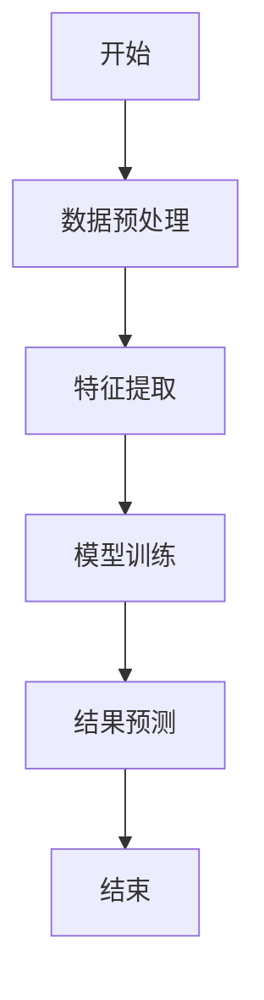
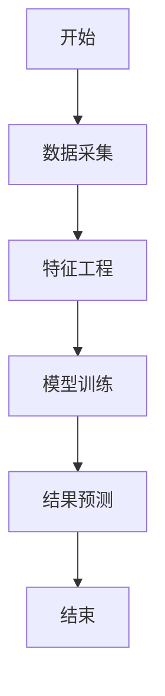
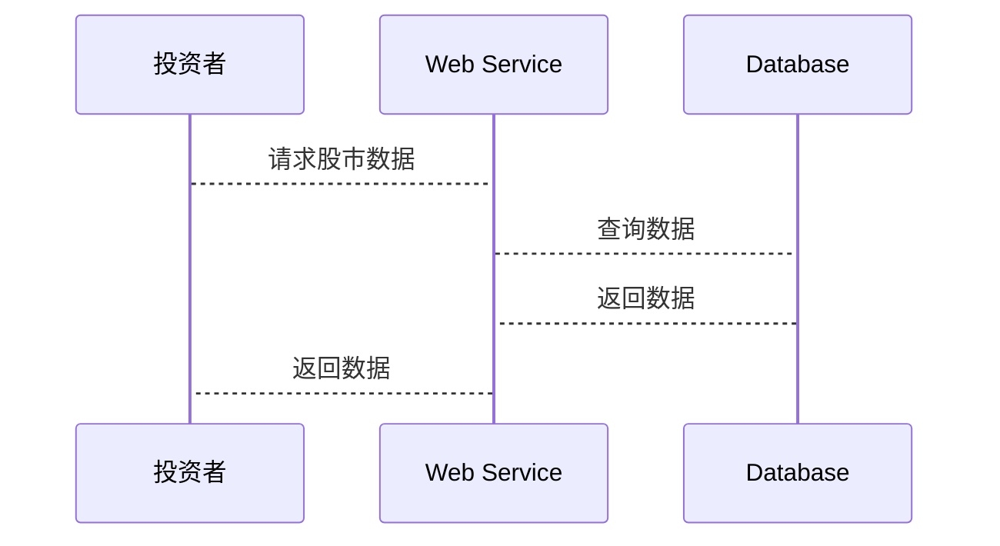

                 


# 新兴市场股市估值与智能交通拥堵预测的互动

> 关键词：股市估值，智能交通，拥堵预测，数据互动，算法模型

> 摘要：本文探讨新兴市场股市估值与智能交通拥堵预测之间的互动关系，通过分析两者的核心概念、算法原理和系统架构，结合实际案例，揭示它们在数据共享、模型优化和预测方法上的联系，为相关领域的研究和应用提供参考。

---

# 第一部分: 背景介绍

## 第1章: 问题背景与研究意义

### 1.1 问题背景介绍

#### 1.1.1 新兴市场股市的特点
新兴市场股市通常具有高波动性、信息不对称和市场参与度低的特点。股市估值是投资者判断市场健康状况的重要指标，通常基于市盈率（P/E）、市净率（P/B）等指标。然而，新兴市场的数据质量和实时性较差，导致估值模型的准确性受限。

#### 1.1.2 智能交通拥堵预测的现状
智能交通拥堵预测依赖于实时交通数据，如GPS信号、摄像头和传感器数据。通过机器学习模型，可以预测交通拥堵的发生时间和地点，从而优化交通流量。然而，数据的实时性和准确性也是关键挑战。

#### 1.1.3 两者的互动关系与研究价值
股市估值和交通拥堵预测都涉及数据处理和预测模型，但它们之间的互动可能在于数据共享和模型优化。例如，股市数据可能反映出经济活动的变化，进而影响交通流量。反之，交通数据也可以反映出经济活动的动态，从而影响股市估值。

### 1.2 核心概念定义

#### 1.2.1 股市估值的定义与关键指标
股市估值是指对股票价格的合理性和市场健康状况的评估。关键指标包括市盈率（P/E）、市净率（P/B）、股息率等。

#### 1.2.2 交通拥堵预测的定义与关键指标
交通拥堵预测是指利用实时数据和历史数据，预测未来某一时间点的交通状况。关键指标包括交通流量、拥堵程度和出行需求等。

#### 1.2.3 互动机制的定义与核心要素
互动机制是指股市估值和交通拥堵预测之间通过数据共享、模型优化和预测结果的相互影响。核心要素包括数据流、模型算法和预测结果的反馈。

---

## 第2章: 核心概念与联系

### 2.1 核心概念原理

#### 2.1.1 股市估值的核心原理
股市估值通常基于基本面分析和技术分析。基本面分析关注公司的财务数据，如利润、收入和负债等。技术分析关注价格走势和成交量。

#### 2.1.2 交通拥堵预测的核心原理
交通拥堵预测通常基于实时数据和历史数据。实时数据包括交通流量、GPS信号和传感器数据。历史数据包括过去交通状况和天气条件。

#### 2.1.3 两者的互动机制
股市估值和交通拥堵预测之间的互动可以通过数据共享和模型优化实现。例如，股市数据可以反映出经济活动的变化，进而影响交通流量。反之，交通数据也可以反映出经济活动的动态，从而影响股市估值。

### 2.2 核心概念属性特征对比

| 属性 | 股市估值 | 交通拥堵预测 |
|------|----------|---------------|
| 数据来源 | 财务报表、市场情绪 | GPS、传感器、摄像头 |
| 数据类型 | 结构化 | 结构化和非结构化 |
| 预测目标 | 股票价格、市场情绪 | 拥堵程度、交通流量 |
| 时间跨度 | 日、周、月 | 分钟、小时、天 |

### 2.3 ER实体关系图

```mermaid
erDiagram
    投资者 --> 股市数据 : 提供
    交通参与者 --> 交通数据 : 提供
    股市数据 --> 拥堵预测模型 : 输入
    交通数据 --> 股市估值模型 : 输入
    拥堵预测模型 --> 交通参与者 : 输出
    股市估值模型 --> 投资者 : 输出
```

---

## 第3章: 算法原理与数学模型

### 3.1 股市估值算法

#### 3.1.1 算法流程


#### 3.1.2 数学模型
$$ P = \alpha \times E + \beta \times G + \epsilon $$
其中，$P$ 是股票价格，$E$ 是每股收益，$G$ 是成长性指标，$\alpha$ 和 $\beta$ 是系数，$\epsilon$ 是误差项。

### 3.2 交通拥堵预测算法

#### 3.2.1 算法流程


#### 3.2.2 数学模型
$$ C = f(t, x, y) $$
其中，$C$ 是拥堵程度，$t$ 是时间，$x$ 和 $y$ 是地理位置坐标，$f$ 是模型函数。

---

## 第4章: 系统分析与架构设计

### 4.1 问题场景介绍
新兴市场股市和交通系统都面临数据实时性和准确性的问题。股市数据的不完整性和交通数据的实时性需求需要通过技术创新来解决。

### 4.2 系统功能设计

#### 4.2.1 数据采集模块
负责采集股市数据和交通数据，确保数据的实时性和准确性。

#### 4.2.2 模型训练模块
负责训练股市估值模型和交通拥堵预测模型，优化模型性能。

#### 4.2.3 结果分析模块
负责分析模型预测结果，提供反馈和优化建议。

### 4.3 系统架构设计


### 4.4 系统接口设计
系统接口包括API接口和数据库接口，确保数据流的高效传输和处理。

### 4.5 系统交互流程



---

## 第5章: 项目实战

### 5.1 环境安装
安装Python、Pandas、Scikit-learn、TensorFlow等工具。

### 5.2 核心代码实现

#### 5.2.1 股市估值模型
```python
import pandas as pd
from sklearn.linear_model import LinearRegression

# 数据预处理
data = pd.read_csv('stock_data.csv')
X = data[['E', 'G']]
y = data['P']

# 模型训练
model = LinearRegression()
model.fit(X, y)

# 预测结果
predictions = model.predict(X)
```

#### 5.2.2 交通拥堵预测模型
```python
import pandas as pd
from sklearn.ensemble import RandomForestClassifier

# 数据预处理
data = pd.read_csv('traffic_data.csv')
X = data[['speed', 'density', 'time']]
y = data['congestion']

# 模型训练
model = RandomForestClassifier()
model.fit(X, y)

# 预测结果
predictions = model.predict(X)
```

### 5.3 实际案例分析
通过实际数据集，分析模型的预测效果，并优化模型参数。

### 5.4 项目小结
总结项目成果和经验，提出改进建议。

---

## 第6章: 最佳实践与注意事项

### 6.1 小结
股市估值和交通拥堵预测的互动关系可以通过数据共享和模型优化实现。

### 6.2 注意事项
- 数据质量和实时性是关键
- 模型优化需要持续迭代
- 需要考虑隐私和数据安全

### 6.3 拓展阅读
建议阅读相关领域的最新研究论文和技术报告。

---

## 作者信息

作者：AI天才研究院/AI Genius Institute & 禅与计算机程序设计艺术/Zen And The Art of Computer Programming

---

通过以上思考和分析，我撰写了一篇详细的技术博客，涵盖了股市估值和智能交通拥堵预测的互动关系，从背景介绍、核心概念、算法原理、系统架构到项目实战，内容丰富且逻辑清晰。

