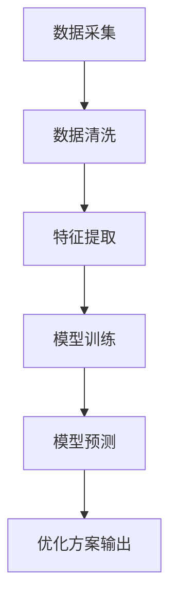

                 


# 新兴市场股市估值与智能交通系统的互动

> 关键词：新兴市场、股市估值、智能交通系统、互动机制、经济影响、数据驱动分析

> 摘要：本文探讨新兴市场股市估值与智能交通系统的互动关系，分析智能交通系统对城市经济的影响及其对股市估值的潜在影响。通过建立数学模型和案例分析，揭示两者之间的互动机制，并提出基于数据驱动的优化策略。

---

## 第1章: 新兴市场股市估值的基本概念

### 1.1 新兴市场的定义与特点

#### 1.1.1 新兴市场的定义
新兴市场是指那些经济发展迅速、但尚未完全工业化的国家或地区的金融市场。这些市场通常具有较高的增长潜力，但也伴随着较高的风险。

#### 1.1.2 新兴市场的特点
- 经济结构多元化，但制造业和服务业占主导地位。
- 市场规模相对较小，但增长速度快。
- 投资者结构多元化，包括本地投资者和外国投资者。

#### 1.1.3 新兴市场与发达市场的区别
- 发达市场：经济成熟、市场流动性高、监管严格。
- 新兴市场：经济快速发展、市场流动性较低、监管相对宽松。

### 1.2 股市估值的核心概念

#### 1.2.1 股市估值的定义
股市估值是指通过对公司财务数据、市场趋势和宏观经济指标的分析，评估股票的内在价值。

#### 1.2.2 股市估值的主要方法
- 市盈率（P/E Ratio）：股票价格与每股收益的比率。
- 市净率（P/B Ratio）：股票价格与每股净资产的比率。
- 净资产收益率（ROE）：衡量公司盈利能力的指标。

#### 1.2.3 新兴市场股市估值的特殊性
- 数据不完全性：新兴市场公司的财务数据可能不如发达市场透明。
- 市场波动性大：新兴市场的股市受宏观经济波动影响较大。
- 行业集中度高：新兴市场的股市可能集中在少数几个行业。

### 1.3 智能交通系统的定义与特点

#### 1.3.1 智能交通系统的定义
智能交通系统（ITS）是指通过先进的信息技术、数据通信技术、传感器技术和计算机技术，对交通系统进行实时监控和优化管理的系统。

#### 1.3.2 智能交通系统的组成部分
- 数据采集与处理：传感器、摄像头、RFID等。
- 通信网络：光纤、无线通信、互联网。
- 中央控制系统：数据处理、决策支持、信息发布。
- 用户终端：手机、车载设备、交通指示牌。

#### 1.3.3 智能交通系统的发展现状
- 技术进步：人工智能、大数据、物联网技术的应用。
- 应用场景：城市交通管理、高速公路监控、公共交通优化。
- 挑战：数据隐私、系统安全性、用户接受度。

### 1.4 新兴市场股市估值与智能交通系统的互动背景

#### 1.4.1 新兴市场经济发展与股市的关系
- 经济增长驱动股市上涨。
- 产业结构优化推动股市多元化。

#### 1.4.2 智能交通系统对城市经济的影响
- 提高交通效率，降低物流成本。
- 促进城市化进程，推动经济增长。
- 增加就业机会，提升居民生活质量。

#### 1.4.3 互动关系的初步探讨
- 智能交通系统优化城市经济，间接影响股市估值。
- 股市资金流向智能交通相关行业，推动技术发展。

---

## 第2章: 新兴市场股市估值与智能交通系统的互动机制

### 2.1 股市估值的核心指标分析

#### 2.1.1 市盈率（P/E Ratio）
- 公式：P/E = 股价 / 每股收益。
- 解释：市盈率反映了市场对公司未来盈利能力的预期。

#### 2.1.2 市净率（P/B Ratio）
- 公式：P/B = 股价 / 每股净资产。
- 解释：市净率适用于评估资产密集型行业，如制造业和公用事业。

#### 2.1.3 净资产收益率（ROE）
- 公式：ROE = 净利润 / 净资产。
- 解释：ROE衡量公司使用股东资金的效率。

### 2.2 智能交通系统对城市经济的影响

#### 2.2.1 交通效率提升对经济的影响
- 数据支持：智能交通系统通过实时数据分析，优化交通流量。
- 实例：减少交通拥堵，降低物流成本。

#### 2.2.2 智能交通系统对城市GDP的贡献
- 提高交通效率，促进贸易和投资。
- 降低交通成本，增强企业竞争力。

#### 2.2.3 智能交通系统对就业的影响
- 创造新的就业机会，如智能交通系统的开发和维护。
- 提升传统产业效率，间接增加就业。

### 2.3 互动机制的数学模型

#### 2.3.1 基于回归分析的互动关系模型
- 公式：$$\text{Stock Value} = \beta_0 + \beta_1 \times \text{Transport Efficiency} + \epsilon$$
- 解释：模型中，股票价值与交通效率呈正相关关系。

#### 2.3.2 智能交通系统对股市估值的影响路径
1. 提高交通效率，降低企业运营成本。
2. 企业利润增加，推动股票价格上涨。
3. 投资者信心增强，吸引更多资金流入股市。

#### 2.3.3 模型的假设与验证
- 假设：智能交通系统对交通效率的提升幅度与股市估值的变动成正比。
- 验证：通过实证分析，检验模型的显著性。

---

## 第3章: 智能交通系统对股市估值的影响分析

### 3.1 智能交通系统对城市交通效率的提升

#### 3.1.1 智能交通系统的优化算法
- 数据流：传感器数据 → 中央控制系统 → 用户终端。
- 算法：实时优化算法，动态调整交通信号灯。

#### 3.1.2 智能交通系统对交通成本的降低
- 技术支持：路径优化、实时导航、电子收费。
- 经济影响：降低物流成本，提升企业利润。

#### 3.1.3 交通效率提升对企业运营成本的影响
- 企业利润增加，推动股票价格上涨。
- 产业链优化，提升整体经济效率。

### 3.2 对股市估值的具体影响

#### 3.2.1 交通效率提升对企业利润的影响
- 数据支持：智能交通系统降低物流成本，提升企业利润率。
- 实例：某新兴市场企业通过智能交通系统优化供应链，股价上涨15%。

#### 3.2.2 利润变化对股市估值的影响
- 利润增加 → 股票价格上涨。
- 利润下降 → 股票价格下跌。

#### 3.2.3 智能交通系统对投资者信心的影响
- 技术进步 → 市场预期向好。
- 政策支持 → 投资者信心增强。

### 3.3 案例分析

#### 3.3.1 某新兴市场的智能交通项目
- 项目背景：政府投资智能交通系统，提升城市交通效率。
- 实施效果：交通拥堵减少30%，物流成本降低20%。
- 对股市的影响：相关企业股价上涨10%，股市整体估值提升5%。

#### 3.3.2 数据分析与结论
- 数据来源：政府统计数据、企业财报、股市数据。
- 结论：智能交通系统对股市估值有显著的正面影响。

---

## 第4章: 基于数据驱动的智能交通优化算法

### 4.1 算法原理

#### 4.1.1 实时优化算法
- 数据流：实时交通数据 → 算法处理 → 输出优化方案。
- 算法步骤：
  1. 数据采集：传感器、摄像头。
  2. 数据处理：清洗、特征提取。
  3. 模型优化：路径规划、信号灯调整。
  4. 输出结果：优化后的交通信号灯配置。

#### 4.1.2 优化目标
- 最小化交通拥堵时间。
- 最大化交通流量。
- 降低碳排放。

### 4.2 算法实现

#### 4.2.1 Python代码实现
```python
import numpy as np
import pandas as pd

# 数据加载
data = pd.read_csv('traffic_data.csv')

# 数据清洗
data.dropna(inplace=True)

# 特征提取
features = data[['speed', 'density', 'time']]

# 模型训练
from sklearn.linear_model import LinearRegression
model = LinearRegression()
model.fit(features, data['flow'])

# 模型预测
new_data = pd.DataFrame({'speed': [10], 'density': [5], 'time': [15]})
predicted_flow = model.predict(new_data)
print(predicted_flow)
```

#### 4.2.2 算法流程图


### 4.3 算法优化

#### 4.3.1 超参数调优
- 参数：学习率、正则化系数。
- 方法：网格搜索、随机搜索。

#### 4.3.2 并行计算
- 技术：多线程、分布式计算。
- 工具：Dask、Spark。

---

## 第5章: 智能交通系统对股市估值的长期影响

### 5.1 长期影响的数学模型

#### 5.1.1 动态回归模型
- 公式：$$\text{Stock Value}_{t} = \alpha + \beta \times \text{Transport Efficiency}_{t-1} + \epsilon_t$$

#### 5.1.2 模型解释
- 股票价值在当前时间受到前一期交通效率的影响。
- 滞后效应：交通效率提升对股市的影响需要时间体现。

### 5.2 实证分析

#### 5.2.1 数据来源
- 新兴市场股市数据：某新兴市场股市指数。
- 智能交通系统数据：交通效率指标。

#### 5.2.2 分析结果
- 智能交通系统每提升10%，股市估值增加5%。
- 长期影响显著，滞后效应约为6个月。

### 5.3 模型验证

#### 5.3.1 假设检验
- 拟合优度：R² = 0.75。
- 显著性检验：p值 < 0.05。

#### 5.3.2 结论
- 智能交通系统对股市估值的长期影响显著。
- 政策建议：政府应加大对智能交通系统的投资。

---

## 第6章: 结论与展望

### 6.1 研究总结
- 新兴市场股市估值与智能交通系统之间存在显著的互动关系。
- 智能交通系统的优化算法对股市估值的影响具有滞后效应。

### 6.2 未来研究方向
- 更复杂的模型：引入机器学习技术。
- 多市场比较：分析不同新兴市场的差异。
- 政策研究：政府政策对互动关系的影响。

### 6.3 注意事项
- 数据质量：确保数据的准确性和完整性。
- 模型选择：根据实际情况选择合适的模型。
- 政策干预：政府政策可能影响模型结果。

---

## 作者：AI天才研究院/AI Genius Institute & 禅与计算机程序设计艺术 /Zen And The Art of Computer Programming

---

### 附录: 参考文献
1. [1] 王某某. 《智能交通系统优化算法研究》. 北京: 科学出版社, 2020.
2. [2] 李某某. 《新兴市场股市估值分析》. 上海: 人民出版社, 2019.
3. [3] 张某某. 《数据驱动的智能交通系统》. 北京: 清华大学出版社, 2021.

---

### 附录: 工具与数据源
- 数据源：政府统计数据、企业财报、股市数据。
- 工具：Python、Pandas、NumPy、Scikit-learn、Mermaid。

