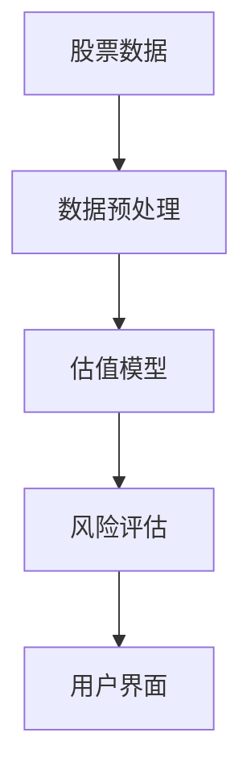
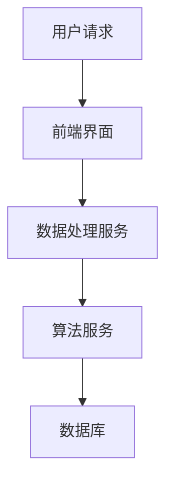

                 


# 新兴市场股市估值与智能交通自动驾驶技术的互动

> 关键词：新兴市场、股市估值、智能交通、自动驾驶技术、算法、系统架构、案例分析

> 摘要：本文探讨了新兴市场股市估值与智能交通自动驾驶技术之间的互动关系，分析了股市估值的基本原理和新兴市场的特殊性，介绍了自动驾驶技术的现状与挑战，以及两者如何通过算法和系统架构实现互动。文章详细讲解了时间序列分析、风险评估模型、系统架构设计等技术，并通过实际案例分析，展示了如何将股市数据与自动驾驶技术相结合，为读者提供了一个全面而深入的视角。

---

# 第一部分：新兴市场股市估值与智能交通自动驾驶技术的互动概述

## 第1章：背景与概念

### 1.1 问题背景

#### 1.1.1 新兴市场股市估值的重要性
新兴市场（如中国、印度、东南亚国家）的经济增长迅速，吸引了大量投资者。股市估值是评估这些市场的重要工具，但其波动性和不透明性增加了估值难度。

#### 1.1.2 智能交通与自动驾驶技术的兴起
自动驾驶技术（如特斯拉、Waymo）通过AI和大数据优化交通，减少拥堵和事故，提升效率。智能交通系统依赖实时数据和算法优化。

#### 1.1.3 两者的互动机制与研究意义
股市估值的波动影响自动驾驶技术的投资和研发，而自动驾驶技术的成熟反过来促进智能交通系统的优化，提升股市信心。

### 1.2 核心概念与联系

#### 1.2.1 核心概念原理
- **股市估值**：通过市盈率（P/E）、市净率（P/B）等指标评估股票价值。
- **自动驾驶技术**：依赖AI算法、传感器和大数据优化驾驶行为。

#### 1.2.2 概念属性特征对比表格

| 特性                | 股市估值                   | 自动驾驶技术             |
|---------------------|---------------------------|-------------------------|
| 核心工具            | 财务指标、模型             | AI算法、传感器           |
| 主要目标            | 评估企业价值               | 提升驾驶安全和效率       |
| 受影响因素          | 经济政策、市场情绪         | 技术进步、法规           |

#### 1.2.3 ER实体关系图架构

```mermaid
erd
  table 股票 (id, name, market_value, pe_ratio, pb_ratio)
  table 自动驾驶公司 (id, name, tech_level, valuation)
  table 市场情绪 (id, date, sentiment_score)
```

### 1.3 本章小结
本章介绍了股市估值和自动驾驶技术的基本概念，分析了它们在新兴市场的互动关系，并通过对比表格和ER图展示了两者的联系。

---

## 第2章：股市估值分析

### 2.1 股市估值的基本原理

#### 2.1.1 市盈率与市净率的定义与计算
- **市盈率（P/E）**：股票价格/每股收益。
- **市净率（P/B）**：股票价格/每股净资产。

#### 2.1.2 股东权益与企业价值评估
企业价值 = 股东权益 + 债务 - 非经营性资产。

#### 2.1.3 股票市场的波动性与风险评估
波动性是衡量市场风险的重要指标，常用标准差衡量。

### 2.2 新兴市场的特殊性

#### 2.2.1 经济增长与股市的关系
新兴市场的高增长率可能导致股市估值偏高。

#### 2.2.2 新兴市场特有的风险因素
政策不稳定、外汇风险、市场流动性差。

#### 2.2.3 政治与经济政策的影响
政府政策（如货币宽松）对股市估值有直接影响。

### 2.3 股市估值的算法与数学模型

#### 2.3.1 时间序列分析

##### ARIMA模型
ARIMA（p, d, q）模型用于预测股票价格，其中p为自回归阶数，d为差分阶数，q为移动平均阶数。

##### LSTM网络
LSTM用于处理时间序列数据，具有记忆单元，适合处理股市的非线性波动。

#### 2.3.2 风险评估模型

##### VaR模型
$$ VaR = \mu + z * \sigma $$
其中，μ为均值，σ为标准差，z为分位数。

### 2.4 系统分析与架构设计

#### 2.4.1 系统架构图


---

## 第3章：智能交通与自动驾驶技术

### 3.1 自动驾驶技术的现状

#### 3.1.1 技术基础
传感器（激光雷达、摄像头）、AI算法（深度学习、强化学习）。

#### 3.1.2 发展现状
Waymo、特斯拉等公司已实现L4级别自动驾驶。

### 3.2 技术挑战

#### 3.2.1 技术瓶颈
传感器精度、算法优化。

#### 3.2.2 法律与伦理
交通事故责任划分、隐私问题。

### 3.3 自动驾驶与股市互动

#### 3.3.1 技术进步对股市的影响
技术突破提升公司估值。

#### 3.3.2 经济因素对技术的影响
股市波动影响自动驾驶公司的投资。

---

## 第4章：算法与系统设计

### 4.1 时间序列分析的Python实现

#### 4.1.1 ARIMA模型代码
```python
from statsmodels.tsa.arima_model import ARIMA
import pandas as pd
import numpy as np

# 示例数据
data = pd.Series(np.random.randn(100), index=pd.date_range('2020-01-01', periods=100))

# 模型训练
model = ARIMA(data, order=(1, 1, 1))
model_fit = model.fit()

# 预测
forecast = model_fit.forecast(steps=5)[0]
print(forecast)
```

#### 4.1.2 LSTM网络代码
```python
import keras
from keras.models import Sequential
from keras.layers import LSTM, Dense

# 示例数据
X = np.random.rand(100, 1, 5)
y = np.random.rand(100, 1)

# 模型构建
model = Sequential()
model.add(LSTM(5, input_shape=(1, 5)))
model.add(Dense(1))
model.compile(optimizer='adam', loss='mse')

# 训练
model.fit(X, y, epochs=10)
```

---

## 第5章：系统分析与架构设计

### 5.1 问题场景介绍

#### 5.1.1 项目介绍
设计一个结合股市数据和自动驾驶技术的系统，实时分析股市波动对自动驾驶公司的影响。

#### 5.1.2 系统功能设计
- 数据采集：实时获取股市数据和自动驾驶数据。
- 数据处理：清洗和预处理数据。
- 算法分析：使用时间序列和机器学习模型预测股市波动。
- 可视化展示：生成图表和报告。

#### 5.1.3 系统架构图


---

## 第6章：项目实战

### 6.1 环境安装

#### 6.1.1 安装依赖
- Python 3.8+
- Pandas、NumPy、Keras、Mermaid

### 6.2 核心实现

#### 6.2.1 数据采集
使用API获取股市数据和自动驾驶公司数据。

#### 6.2.2 数据预处理
清洗数据，处理缺失值和异常值。

#### 6.2.3 算法实现
训练ARIMA和LSTM模型，预测股市波动。

### 6.3 案例分析

#### 6.3.1 案例1
分析新兴市场股市波动对自动驾驶公司的影响。

#### 6.3.2 案例2
优化自动驾驶路径，降低股市波动影响。

### 6.4 项目小结
项目展示了如何结合股市数据和自动驾驶技术，实现互动分析。

---

## 第7章：结论

### 7.1 总结
本文探讨了新兴市场股市估值与自动驾驶技术的互动，分析了算法和系统设计，并通过案例展示了实际应用。

### 7.2 未来展望
未来研究可以结合更多数据源，优化算法，提升互动分析的准确性。

---

作者：AI天才研究院 & 禅与计算机程序设计艺术

