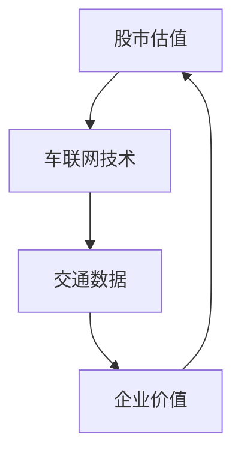
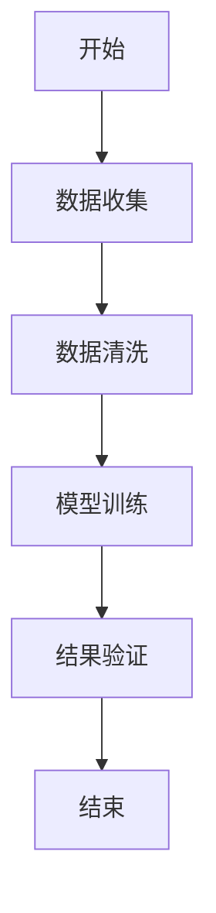
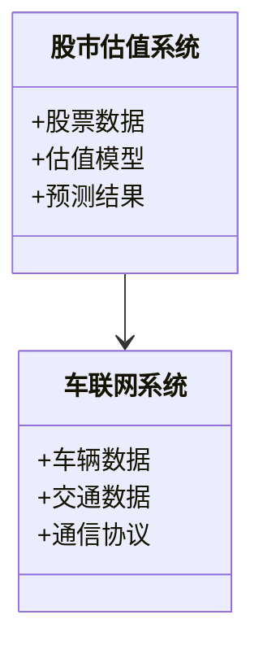
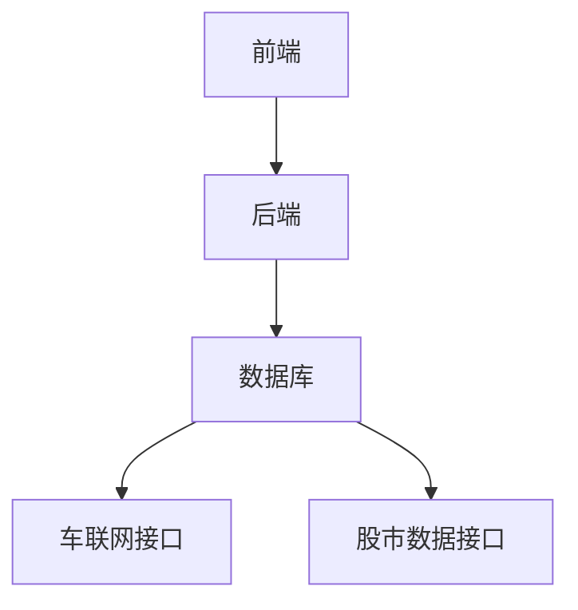
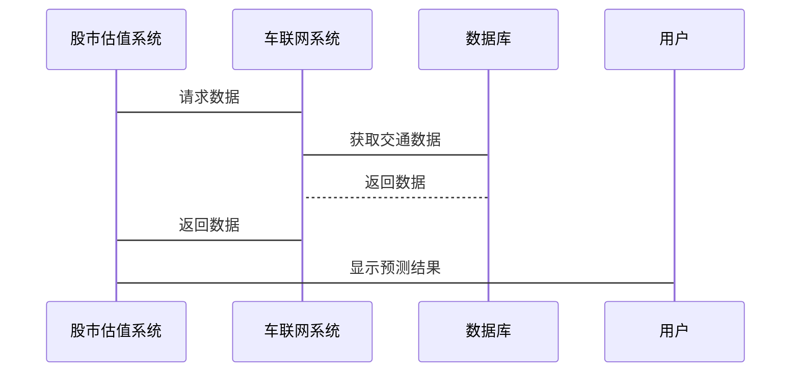

                 


# 新兴市场股市估值与智能交通车联网技术的互动

> 关键词：新兴市场、股市估值、车联网技术、互动关系、算法模型、系统架构

> 摘要：本文探讨新兴市场股市估值与智能交通车联网技术之间的互动关系，分析两者如何相互影响，通过数学模型和算法原理揭示其内在联系，并提出系统架构设计方案。

---

## 第1章: 背景介绍

### 1.1 新兴市场股市估值的现状与挑战

#### 1.1.1 新兴市场的定义与特点
新兴市场是指那些经济增长迅速、但尚未完全工业化的国家或地区。这些市场通常具有较高的波动性和不确定性，但也伴随着巨大的增长潜力。

#### 1.1.2 股市估值的基本概念与方法
股市估值是通过对企业的财务数据、市场环境和行业趋势进行分析，确定其股票的合理价格。常用方法包括市盈率（P/E）、市净率（P/B）等。

#### 1.1.3 新兴市场股市估值的独特性
新兴市场的股市估值受政策、经济波动和国际环境的影响较大，且数据不完善，增加了估值的难度。

### 1.2 智能交通与车联网技术的发展现状

#### 1.2.1 智能交通系统的定义与应用
智能交通系统（ITS）利用信息技术优化交通管理，提升道路使用效率。其应用包括实时监控、智能导航和交通预测。

#### 1.2.2 车联网技术的核心概念与发展趋势
车联网技术通过车辆、道路和云端的协同工作，实现车辆的智能化管理。其发展趋势包括5G通信、人工智能和大数据分析。

#### 1.2.3 新兴市场在智能交通中的角色
新兴市场在智能交通中的角色主要体现在技术应用和数据需求方面，车联网技术的应用可以提升交通效率，降低运营成本。

### 1.3 互动关系的背景与意义

#### 1.3.1 新兴市场股市与智能交通的关联性
新兴市场股市中的交通技术企业，其股票价格受车联网技术发展的影响。

#### 1.3.2 车联网技术对股市估值的影响
车联网技术的商业化进程会影响企业的盈利能力，从而影响其股票估值。

#### 1.3.3 互动关系的研究价值与应用前景
研究两者互动关系有助于优化股市估值模型，促进智能交通技术的发展。

---

## 第2章: 核心概念与联系

### 2.1 股市估值的核心概念与模型

#### 2.1.1 股市估值的基本原理
股市估值基于企业的基本面分析，包括收入、利润和成长性。

#### 2.1.2 常用估值方法对比分析
- 市盈率法：适用于利润稳定的公司。
- 市净率法：适用于资产密集型企业。
- 现金流折现法：适用于高成长企业。

#### 2.1.3 新兴市场的特殊估值模型
新兴市场的估值模型需要考虑政策风险和市场波动。

### 2.2 车联网技术的核心原理与架构

#### 2.2.1 车联网系统的组成与功能
车联网系统包括车载终端、通信网络和云端平台，实现车辆与交通环境的实时交互。

#### 2.2.2 车联网通信协议与数据流
车联网通信采用5G和物联网技术，数据流包括车辆状态、交通信息和用户指令。

#### 2.2.3 车联网技术的数学模型
车联网的数据传输速率模型：
$$ R = \frac{D}{T} $$
其中，R是传输速率，D是数据量，T是传输时间。

### 2.3 互动关系的实体关系图



---

## 第3章: 股市估值与车联网技术的互动机制

### 3.1 股市估值对车联网技术的影响

#### 3.1.1 股市资金流动与车联网投资
股市资金流向直接影响车联网企业的研发投入和市场扩展。

#### 3.1.2 股价波动对车联网企业的影响
股价波动会影响企业的融资能力和员工激励机制。

#### 3.1.3 投资者行为与车联网技术发展
投资者对车联网技术的预期会影响股市估值和企业战略。

### 3.2 车联网技术对股市估值的反馈机制

#### 3.2.1 车联网数据对股市预测的作用
车联网数据可以用于预测交通流量和企业业绩。

#### 3.2.2 车联网技术进步对企业价值的影响
技术进步会提升企业的盈利能力和市场地位，从而提高估值。

#### 3.2.3 车联网市场风险对股市稳定性的影响
车联网技术的不确定性可能导致股市波动。

### 3.3 互动关系的数学模型

$$ V_{\text{车联网}} = \alpha \times V_{\text{股市}} + \beta \times D_{\text{数据}} + \gamma \times T_{\text{技术}} $$

其中，$V_{\text{车联网}}$ 表示车联网技术的价值，$V_{\text{股市}}$ 表示股市估值，$D_{\text{数据}}$ 表示车联网数据的影响，$T_{\text{技术}}$ 表示车联网技术的成熟度。

---

## 第4章: 股市估值与车联网技术的算法原理

### 4.1 股市估值算法

#### 4.1.1 常用估值算法的优缺点
- 市盈率法：简单易懂，但受行业影响大。
- 现金流折现法：精确但计算复杂。

#### 4.1.2 基于车联网数据的改进算法
结合车联网数据，采用机器学习模型优化估值。

#### 4.1.3 算法实现的步骤与流程
1. 数据收集：获取企业财务数据和车联网数据。
2. 数据清洗：处理缺失值和异常值。
3. 模型训练：建立估值模型并进行参数调优。
4. 结果验证：通过回测验证模型的有效性。

### 4.2 车联网技术算法

#### 4.2.1 车联网数据处理算法
- 数据分类：基于车辆类型和交通状况分类数据。
- 数据聚类：识别交通热点区域。

#### 4.2.2 车联网通信协议优化算法
- 码分多址（CDMA）：提高通信容量。
- 频率复用技术：减少干扰。

#### 4.2.3 车联网安全算法
- 加密算法：保障数据安全。
- 认证机制：防止未经授权的访问。

### 4.3 算法流程图



---

## 第5章: 系统分析与架构设计

### 5.1 问题场景介绍
新兴市场的股市估值与车联网技术互动，需要一个高效的数据处理和分析系统。

### 5.2 项目介绍
设计一个结合车联网数据和股市数据的分析平台，提供实时估值和预测功能。

### 5.3 系统功能设计

#### 5.3.1 领域模型


#### 5.3.2 系统架构设计


### 5.4 系统接口设计
- 股市数据接口：提供实时股价和财务数据。
- 车联网接口：提供交通数据和车辆状态。

### 5.5 系统交互设计


---

## 第6章: 项目实战

### 6.1 环境安装
- 安装Python、TensorFlow和Flask框架。
- 配置数据库和API接口。

### 6.2 系统核心实现源代码

#### 6.2.1 股市估值模型
```python
import pandas as pd
from sklearn.linear_model import LinearRegression

# 数据加载
data = pd.read_csv('stock_data.csv')

# 特征与目标分离
X = data[['市盈率', '市净率']]
y = data['股票价格']

# 模型训练
model = LinearRegression()
model.fit(X, y)

# 预测
predicted_price = model.predict(X)
```

#### 6.2.2 车联网数据处理
```python
import pandas as pd

# 数据加载
车联网数据 = pd.read_csv('vehicle_data.csv')

# 数据清洗
车联网数据.dropna(inplace=True)
车联网数据['时间'] = pd.to_datetime(车联网数据['时间'])
```

### 6.3 实际案例分析
以某新兴市场为例，分析车联网技术对企业估值的影响。

### 6.4 项目小结
通过项目实战，验证了车联网技术与股市估值互动关系的理论模型。

---

## 第7章: 最佳实践、小结与展望

### 7.1 最佳实践 tips
- 数据质量是关键，需确保数据的完整性和准确性。
- 模型选择要结合实际场景，避免过度复杂。

### 7.2 小结
本文系统分析了新兴市场股市估值与车联网技术的互动关系，提出了数学模型和系统架构设计方案。

### 7.3 注意事项
- 注意数据隐私和安全问题。
- 定期更新模型以适应市场变化。

### 7.4 拓展阅读
- 《智能交通系统》
- 《股市估值方法论》

---

## 作者：AI天才研究院 & 禅与计算机程序设计艺术

---

感谢您的阅读！如需进一步探讨，欢迎随时联系。

