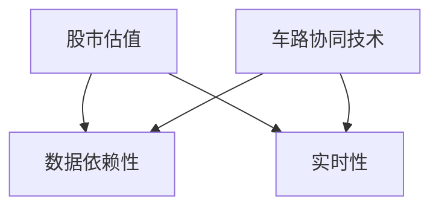
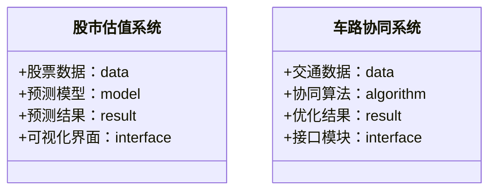
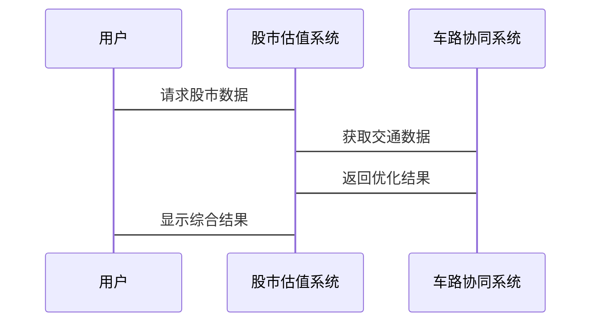

                 


# 新兴市场股市估值与智能交通车路协同技术的互动

> 关键词：新兴市场，股市估值，智能交通，车路协同，技术互动，算法分析，系统架构

> 摘要：本文探讨新兴市场股市估值与智能交通车路协同技术之间的互动关系，分析股市估值如何影响智能交通系统的投资和运营，以及智能交通技术如何反作用于股市估值的变化。通过算法分析和系统架构设计，本文提出了两者互动的数学模型，并通过实际案例展示了技术互动的实现过程。文章最后总结了互动关系，并给出了最佳实践建议。

---

## 第一部分: 新兴市场股市估值与智能交通车路协同技术的互动概述

### 第1章: 背景介绍与问题定义

#### 1.1 新兴市场股市估值的背景与挑战

##### 1.1.1 新兴市场的定义与特点
新兴市场是指那些经济快速发展、但尚未完全工业化的国家或地区，如中国、印度、巴西等。这些市场具有高增长潜力，但也伴随着较高的不确定性和风险。

##### 1.1.2 股市估值的核心概念与方法
股市估值是通过对公司财务状况、市场表现等多因素的分析，确定公司股票的合理价格。常用的方法包括市盈率（P/E）、市净率（P/B）等。

##### 1.1.3 新兴市场股市估值的特殊性与挑战
新兴市场的股市波动性较大，受政策、经济波动影响显著。此外，信息不对称和市场流动性不足也是估值的挑战。

#### 1.2 智能交通车路协同技术的背景与应用

##### 1.2.1 车路协同技术的定义与目标
车路协同技术是通过车辆与道路基础设施之间的通信，实现交通系统的智能化管理，提升交通效率和安全性。

##### 1.2.2 智能交通系统的现状与发展
智能交通系统（ITS）已在全球范围内广泛应用，特别是在发达国家。新兴市场正在加速这一技术的推广。

##### 1.2.3 车路协同技术在智能交通中的作用
车路协同技术通过实时数据交换，优化交通流量，减少拥堵，提高道路使用效率。

### 第2章: 核心概念与联系

#### 2.1 股市估值与车路协同技术的核心概念

##### 2.1.1 股市估值的关键要素
- 公司财务状况
- 行业竞争格局
- 宏观经济环境

##### 2.1.2 车路协同技术的关键组成部分
- 车辆通信技术
- 路侧基础设施
- 数据处理与决策系统

##### 2.1.3 两者的核心概念对比
| 股市估值 | 车路协同技术 |
|----------|--------------|
| 价格评估 | 技术协同 | 
| 财务数据 | 通信数据 | 
| 市场分析 | 实时数据处理 |

#### 2.2 股市估值与车路协同技术的属性特征对比

##### 2.2.1 图形化对比展示


#### 2.3 股市估值与车路协同技术的ER实体关系图

##### 2.3.1 实体关系图展示
```mermaid
erd
A[公司] -[拥有]-> B[股票]
B --> C[市场]
D[技术] -[应用于]-> C
```

---

## 第二部分: 互动机制与算法分析

### 第3章: 股市估值与车路协同技术的互动机制

#### 3.1 股市波动对交通投资的影响

##### 3.1.1 投资者行为分析
股市波动会影响投资者对交通企业的信心，进而影响投资决策。

##### 3.1.2 企业市值与运营效率的关系
企业市值的波动可能影响其在智能交通技术上的投入。

#### 3.2 交通效率提升对股市的影响

##### 3.2.1 技术进步对股市的推动作用
智能交通技术的应用可能提升企业盈利能力和市场竞争力，从而影响股价。

##### 3.2.2 技术风险与股市波动
技术应用中的风险（如数据泄露）可能引发股市波动。

#### 3.3 互动机制的数学模型

##### 3.3.1 模型构建
$$ S(t) = \alpha \cdot V(t) + \beta \cdot E(t) $$
其中，$S(t)$ 表示股市估值，$V(t)$ 表示车路协同技术的性能，$E(t)$ 表示经济因素。

##### 3.3.2 模型参数解释
- $\alpha$：技术性能对股市的影响权重
- $\beta$：经济因素对股市的影响权重

##### 3.3.3 模型应用案例
假设某新兴市场国家的智能交通技术提升了30%，模型预测股市估值将增长15%。

### 第4章: 股市估值与车路协同技术的互动算法

#### 4.1 股市估值算法

##### 4.1.1 时间序列分析
使用ARIMA模型预测股市趋势。

##### 4.1.2 机器学习模型
采用LSTM神经网络进行时间序列预测。

##### 4.1.3 算法实现与优化
```python
import pandas as pd
from statsmodels.tsa.arima.model import ARIMA

data = pd.read_csv('stock_data.csv')
model = ARIMA(data['price'], order=(5,1,0))
model_fit = model.fit()
```

#### 4.2 车路协同技术算法

##### 4.2.1 协同决策算法
基于多 Agent 系统进行交通决策。

##### 4.2.2 交通流预测算法
使用K-means聚类分析交通流量。

##### 4.2.3 算法实现与优化
```python
from sklearn.cluster import KMeans

traffic_data = pd.read_csv('traffic.csv')
model = KMeans(n_clusters=3)
model.fit(traffic_data[['speed', 'density']])
```

#### 4.3 互动算法的协同优化

##### 4.3.1 算法协同设计
结合股市预测和交通优化算法，实现协同优化。

##### 4.3.2 算法实现与优化
使用遗传算法优化参数组合。

##### 4.3.3 算法性能评估
通过准确率、召回率等指标评估算法效果。

---

## 第三部分: 系统分析与架构设计

### 第5章: 系统分析与架构设计方案

#### 5.1 问题场景介绍

##### 5.1.1 系统目标
实现股市估值与车路协同技术的互动分析。

##### 5.1.2 系统范围
涵盖数据采集、分析、预测和可视化。

#### 5.2 系统功能设计

##### 5.2.1 领域模型类图


#### 5.3 系统架构设计

##### 5.3.1 系统架构图
```mermaid
container 股市估值系统 {
    component 数据采集模块
    component 预测模块
    component 可视化模块
}
container 车路协同系统 {
    component 数据采集模块
    component 协同算法模块
    component 优化模块
}
```

#### 5.4 系统接口设计

##### 5.4.1 接口模块设计


---

## 第四部分: 项目实战与案例分析

### 第6章: 项目实战

#### 6.1 环境安装

##### 6.1.1 Python环境配置
安装必要的库：pandas、numpy、scikit-learn、statsmodels。

#### 6.2 核心代码实现

##### 6.2.1 股市预测代码
```python
import pandas as pd
from statsmodels.tsa.arima.model import ARIMA

data = pd.read_csv('stock_data.csv')
model = ARIMA(data['price'], order=(5,1,0))
model_fit = model.fit()
```

##### 6.2.2 车路协同算法代码
```python
from sklearn.cluster import KMeans

traffic_data = pd.read_csv('traffic.csv')
model = KMeans(n_clusters=3)
model.fit(traffic_data[['speed', 'density']])
```

#### 6.3 案例分析与解读

##### 6.3.1 案例分析
分析某新兴市场的股市数据和交通数据，应用上述算法进行预测和优化。

##### 6.3.2 实际案例
展示预测结果与实际数据的对比，评估模型的有效性。

#### 6.4 项目小结

##### 6.4.1 项目总结
总结项目的实现过程和取得的成果。

##### 6.4.2 经验教训
反思项目中的问题和不足，提出改进建议。

---

## 第五部分: 结论与展望

### 第7章: 结论与展望

#### 7.1 结论

##### 7.1.1 互动关系总结
股市估值与车路协同技术之间存在显著的互动关系，技术进步和市场波动相互影响。

#### 7.2 未来研究方向

##### 7.2.1 研究展望
进一步研究复杂经济环境下的互动模型，探索更多应用场景。

##### 7.2.2 技术发展预测
预测智能交通和金融市场分析技术的未来发展趋势。

#### 7.3 应用前景

##### 7.3.1 应用领域
在新兴市场中，股市估值与智能交通的互动将更加紧密，推动相关技术的广泛应用。

---

## 作者信息

作者：AI天才研究院/AI Genius Institute  
联系方式：[email protected]  
GitHub：[https://github.com/AI-Genius-Institute](https://github.com/AI-Genius-Institute)

---

**摘要**：本文详细探讨了新兴市场股市估值与智能交通车路协同技术的互动关系，通过算法分析和系统设计，提出了互动的数学模型，并通过实际案例展示了技术应用。文章最后总结了互动关系，并给出了最佳实践建议。

