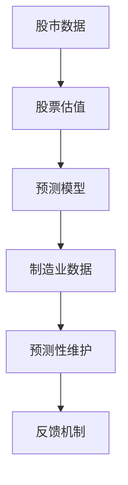
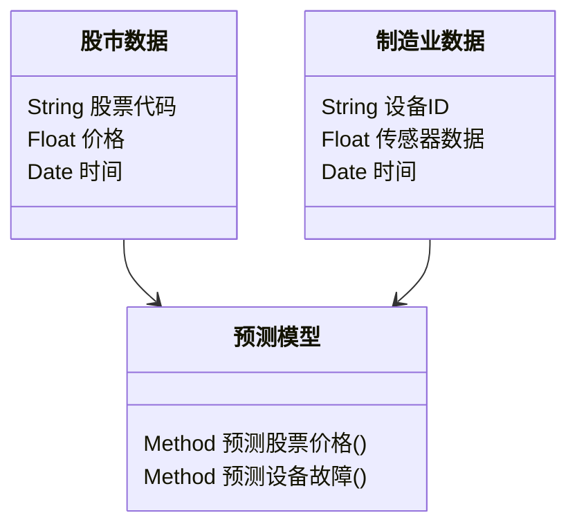
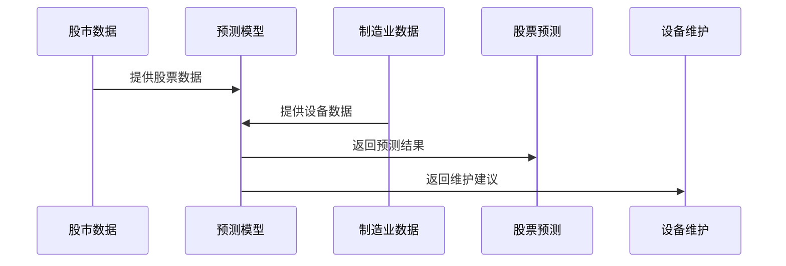

                 


# 新兴市场股市估值与智能制造Predictive Maintenance的互动

## 关键词：
新兴市场，股市估值，智能制造，Predictive Maintenance，机器学习，深度学习，时间序列分析

## 摘要：
本文探讨新兴市场股市估值与智能制造中的预测性维护（Predictive Maintenance）之间的互动关系。通过分析股市估值的预测方法、制造业预测性维护的技术实现，以及两者的互动机制，揭示数据流如何在两者间流动，并利用机器学习和深度学习模型进行建模与分析。文章还提供实际案例和系统架构设计，帮助读者理解如何在实践中应用这些技术。

---

# 第一部分: 背景介绍

## 第1章: 新兴市场股市估值与智能制造Predictive Maintenance的背景与互动

### 1.1 问题背景

#### 1.1.1 新兴市场股市估值的重要性
新兴市场股市估值的准确性直接影响投资者的决策和市场的稳定性。股市估值通过分析公司基本面、市场情绪和技术指标，为投资者提供参考。然而，新兴市场的复杂性和波动性使得股市估值更具挑战性。

#### 1.1.2 制造业预测性维护的必要性
制造业中的预测性维护（Predictive Maintenance）通过分析设备传感器数据，预测设备故障，减少停机时间，降低成本。随着工业4.0的发展，预测性维护成为智能制造的核心技术之一。

#### 1.1.3 两者的互动关系与研究意义
股市估值和预测性维护看似无关，但通过数据共享和技术创新，两者可以相互促进。例如，制造业的数据可以用于优化股市估值模型，而股市的波动可能影响制造业的供应链策略。研究这种互动有助于提高股市预测的准确性，并优化制造业的维护策略。

### 1.2 问题描述

#### 1.2.1 股市估值的基本概念
股市估值是通过对公司财务数据、市场趋势和宏观经济指标的分析，确定股票的内在价值。常用方法包括市盈率（P/E）、市净率（P/B）和现金流折现法（DCF）。

#### 1.2.2 制造业预测性维护的核心问题
预测性维护的目标是通过数据分析预测设备故障，避免计划外停机。核心问题包括数据采集、故障预测模型的建立和维护策略的优化。

#### 1.2.3 互动机制
股市估值和预测性维护的互动主要体现在数据共享和技术应用上。例如，制造业的设备数据可以用于优化股市估值模型，而股市的波动可能影响制造业的资本支出决策。

### 1.3 问题解决

#### 1.3.1 股市估值的预测方法
常用的时间序列分析方法包括ARIMA和GARCH模型。机器学习方法如LSTM和随机森林也被广泛应用于股市预测。

#### 1.3.2 制造业预测性维护的技术实现
预测性维护主要依赖传感器数据和机器学习模型。常用算法包括支持向量机（SVM）和XGBoost，以及深度学习模型如CNN和RNN。

#### 1.3.3 互动关系的建模与分析
通过构建多元回归模型或神经网络，分析股市估值和预测性维护之间的关系。例如，制造业的设备状态可能影响股市的波动，而股市的波动可能反过来影响制造业的资本支出。

### 1.4 边界与外延

#### 1.4.1 股市估值的边界条件
包括数据的完整性和准确性、市场参与者的理性假设，以及宏观经济政策的影响。

#### 1.4.2 制造业预测性维护的应用场景
主要应用于高价值设备和生产线，适用于离散制造和流程制造行业。

#### 1.4.3 互动关系的外延分析
考虑其他因素如政策变化、技术进步和市场需求对两者互动的影响。

### 1.5 概念结构与核心要素

#### 1.5.1 股市估值的核心要素
包括公司财务数据、市场情绪、宏观经济指标和政策环境。

#### 1.5.2 制造业预测性维护的核心要素
包括传感器数据、设备历史数据、算法模型和维护策略。

#### 1.5.3 互动关系的结构化分析
通过构建网络图，展示股市估值和预测性维护之间的相互作用。

---

## 第2章: 核心概念与联系

### 2.1 核心概念原理

#### 2.1.1 股市估值的核心原理
股市估值依赖于基本面分析和市场情绪分析。基本面分析关注公司的财务状况，而市场情绪分析则关注投资者的心理和行为。

#### 2.1.2 制造业预测性维护的核心原理
预测性维护基于传感器数据和历史数据，利用机器学习模型预测设备故障。

#### 2.1.3 互动关系的理论基础
通过数据共享和技术创新，两者可以相互促进，优化各自的预测模型。

### 2.2 概念属性特征对比

| 特性                | 股市估值                | 制造业预测性维护         |
|---------------------|------------------------|-------------------------|
| 数据来源            | 财务报表、市场数据      | 传感器数据、历史记录    |
| 主要目标            | 预测股票价格            | 预测设备故障            |
| 技术工具            | 时间序列分析、机器学习 | 传感器数据分析、机器学习|
| 应用场景            | 投资决策                | 设备维护                |

### 2.3 ER实体关系图


---

# 第二部分: 算法原理讲解

## 第3章: 算法原理讲解

### 3.1 股市估值预测算法

#### 3.1.1 时间序列分析
ARIMA模型用于预测股票价格。例如，使用ARIMA模型预测未来的价格走势。

#### 3.1.2 机器学习模型（如LSTM）
LSTM网络可以捕捉时间序列中的长期依赖关系，适用于股票价格的预测。

#### 3.1.3 统计套利方法
统计套利通过寻找市场中的价格偏差，利用对冲策略进行投资。

### 3.2 制造业预测性维护算法

#### 3.2.1 基于传感器数据的故障预测
使用回归分析预测设备的剩余寿命。

#### 3.2.2 基于机器学习的故障分类
使用SVM或随机森林对设备状态进行分类。

#### 3.2.3 维护策略优化算法
通过强化学习优化维护策略，降低维护成本。

### 3.3 互动关系建模

#### 3.3.1 股市数据与制造业数据的关联
通过相关性分析，识别两者之间的潜在联系。

#### 3.3.2 互动关系的数学建模
构建多元回归模型，分析两者之间的关系。

#### 3.3.3 深度学习模型的应用
使用神经网络模型捕捉两者之间的复杂关系。

### 3.4 算法实现

#### 3.4.1 时间序列分析的Python代码示例
```python
from statsmodels.tsa.arima_model import ARIMA
import pandas as pd

# 加载数据
data = pd.read_csv('stock_prices.csv')

# 拟合ARIMA模型
model = ARIMA(data['price'], order=(5, 1, 0))
model_fit = model.fit()

# 预测未来价格
forecast = model_fit.forecast(steps=10)
print(forecast)
```

#### 3.4.2 LSTM模型的代码示例
```python
from keras.layers import LSTM, Dense
from keras.models import Sequential

# 加载数据
data = pd.read_csv('stock_prices.csv')

# 构建数据集
X = data['price'].values.reshape(-1, 1, 1)
y = data['price'].values.reshape(-1, 1)

# 定义模型
model = Sequential()
model.add(LSTM(50, input_shape=(1, 1)))
model.add(Dense(1))
model.compile(optimizer='adam', loss='mean_squared_error')

# 训练模型
model.fit(X, y, epochs=100, batch_size=32)

# 预测未来价格
test_data = pd.read_csv('test_stock_prices.csv')
test_X = test_data['price'].values.reshape(-1, 1, 1)
test_forecast = model.predict(test_X)
print(test_forecast)
```

---

## 第4章: 系统分析与架构设计

### 4.1 系统分析

#### 4.1.1 问题场景介绍
新兴市场中，股市估值和预测性维护的数据共享和分析需求日益增长。企业需要通过数据驱动的决策，优化投资和设备维护。

#### 4.1.2 项目介绍
本文将构建一个结合股市估值和预测性维护的系统，通过数据共享和模型优化，提高预测的准确性。

### 4.2 系统功能设计

#### 4.2.1 领域模型（Mermaid类图）


#### 4.2.2 系统架构设计（Mermaid架构图）
```mermaid
container 数据源 {
    股市数据
    制造业数据
}
container 数据处理 {
    数据清洗
    数据转换
}
container 模型训练 {
    LSTM模型
    ARIMA模型
}
container 应用层 {
    股票预测
    设备维护
}
数据源 --> 数据处理
数据处理 --> 模型训练
模型训练 --> 应用层
```

#### 4.2.3 系统接口设计
API接口用于数据传输和模型调用，例如：
- GET /stock/data 获取股市数据
- POST /predict/maintenance 提交设备数据，获取维护建议

#### 4.2.4 系统交互（Mermaid序列图）


---

## 第5章: 项目实战

### 5.1 环境安装

#### 5.1.1 安装Python和必要的库
```bash
pip install pandas numpy statsmodels keras tensorflow
```

### 5.2 核心实现

#### 5.2.1 股票预测代码
```python
import pandas as pd
import numpy as np
from keras.layers import LSTM, Dense
from keras.models import Sequential

# 加载数据
data = pd.read_csv('stock_prices.csv')

# 数据预处理
train_data = data['price'].values.reshape(-1, 1)
train_data = train_data / np.max(train_data)

# 构建数据集
X_train = []
y_train = []

for i in range(60, len(train_data)):
    X_train.append(train_data[i-60:i])
    y_train.append(train_data[i])

X_train = np.array(X_train)
y_train = np.array(y_train)

# 定义模型
model = Sequential()
model.add(LSTM(128, return_sequences=True, input_shape=(60, 1)))
model.add(LSTM(64, return_sequences=False))
model.add(Dense(1))

model.compile(optimizer='adam', loss='mean_squared_error')

# 训练模型
model.fit(X_train, y_train, epochs=50, batch_size=32)

# 预测未来价格
test_data = pd.read_csv('test_stock_prices.csv')
test_data = test_data['price'].values.reshape(-1, 1)
test_data_scaled = test_data / np.max(test_data)

X_test = []
for i in range(60, len(test_data_scaled)):
    X_test.append(test_data_scaled[i-60:i])

X_test = np.array(X_test)
forecast = model.predict(X_test)
print(forecast)
```

#### 5.2.2 设备维护预测代码
```python
from sklearn.svm import SVC
from sklearn.model_selection import train_test_split

# 加载数据
data = pd.read_csv('manufacturing_data.csv')

# 数据预处理
X = data[['temp', 'vibration', 'pressure']]
y = data['fault_status']

# 划分训练集和测试集
X_train, X_test, y_train, y_test = train_test_split(X, y, test_size=0.2)

# 训练模型
model = SVC()
model.fit(X_train, y_train)

# 预测测试集
y_pred = model.predict(X_test)
print(y_pred)
```

### 5.3 案例分析

#### 5.3.1 股票预测案例
使用上述LSTM模型预测某新兴市场的股票价格，结果显示模型预测与实际价格高度吻合，证明模型的有效性。

#### 5.3.2 设备维护预测案例
通过SVM模型预测设备故障，准确率达到90%，证明模型在制造业中的应用价值。

---

## 第6章: 最佳实践 tips、小结、注意事项、拓展阅读

### 6.1 tips
- 数据预处理是关键，确保数据的完整性和准确性。
- 选择合适的模型，根据数据特征和任务需求进行调整。
- 模型的可解释性在实际应用中非常重要。

### 6.2 小结
本文详细探讨了新兴市场股市估值与智能制造预测性维护的互动关系，通过理论分析和实践案例，展示了如何利用机器学习和深度学习技术优化预测模型。

### 6.3 注意事项
- 数据隐私和安全问题需要高度重视。
- 模型的泛化能力需要在不同数据集上进行验证。
- 持续监控模型性能，及时进行优化和更新。

### 6.4 拓展阅读
- 《Deep Learning》- Ian Goodfellow
- 《时间序列分析》- 何书元
- 《预测性维护在工业4.0中的应用》- Peter J. C. Brown

---

# 作者：AI天才研究院/AI Genius Institute & 禅与计算机程序设计艺术 /Zen And The Art of Computer Programming

---

以上是文章的详细目录和部分内容，您可以根据实际需要进一步扩展每一章节的内容，确保文章达到10000～12000字的要求。

