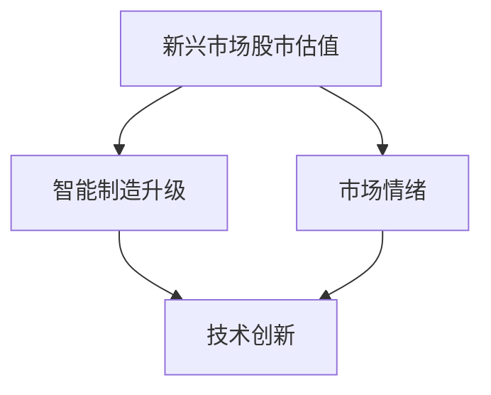
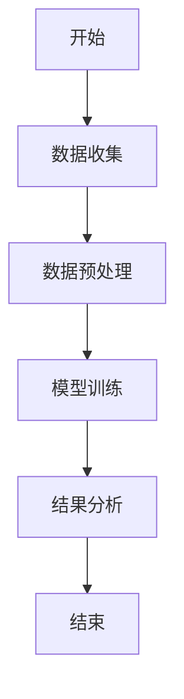
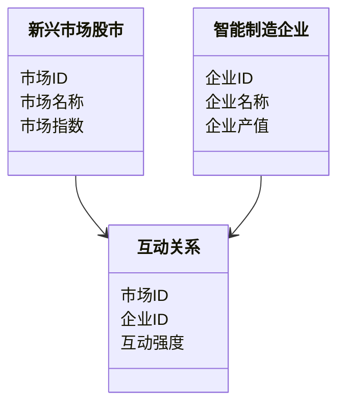
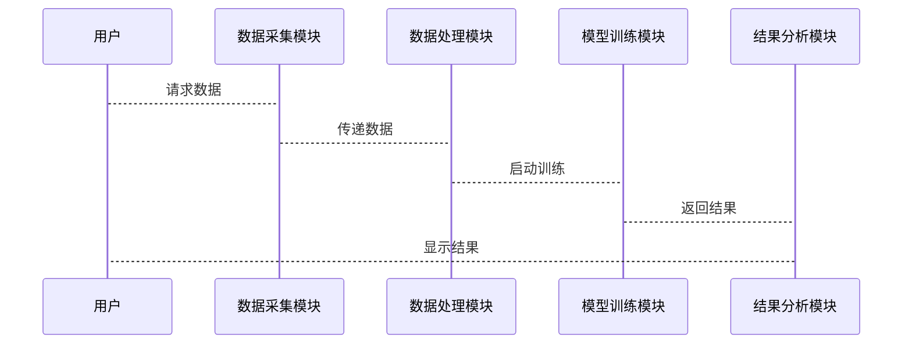

                 


# 新兴市场股市估值与智能制造升级的互动

## 关键词：新兴市场，股市估值，智能制造，产业升级，互动关系，算法模型，系统架构

## 摘要：  
本文从新兴市场股市估值与智能制造升级的互动关系出发，深入分析了两者的内在联系和相互影响。通过背景介绍、核心概念解析、算法原理讲解、系统架构设计和项目实战等多维度的探讨，结合具体案例和数学模型，揭示了如何通过智能制造升级优化新兴市场股市估值。文章还提出了系统的解决方案和最佳实践建议，为相关领域的研究和实践提供了重要参考。

---

# 第1章：背景介绍

## 1.1 问题背景

### 1.1.1 新兴市场的定义与特征
新兴市场是指那些经济快速发展、工业化程度较高、但人均收入相对较低的国家或地区。这些市场通常具有较高的经济增长潜力，但也伴随着较大的经济波动性和不确定性。新兴市场的股市往往呈现出波动性大、估值敏感性强的特点。

### 1.1.2 制造业升级的必要性
在全球化竞争加剧的背景下，传统制造业的低附加值和高能耗模式已经难以适应市场的需求。智能制造作为新一轮工业革命的核心，通过数字化、智能化和网络化技术的应用，能够显著提升生产效率、降低成本，并推动产业升级。

### 1.1.3 股市估值与实体经济的互动关系
股市估值是市场参与者对上市公司未来盈利能力的预期，而实体经济的运行状况则是影响股市估值的核心因素之一。智能制造升级通过提升企业生产效率和创新能力，能够增强企业的盈利能力，从而间接影响股市估值。

---

## 1.2 问题描述

### 1.2.1 新兴市场股市的特点
- 市场波动性大，受外部经济环境影响显著。
- 投资者结构多元化，机构投资者占比相对较低。
- 市场流动性较强，但可能存在结构性失衡。

### 1.2.2 智能制造升级的核心问题
- 如何通过技术创新实现生产过程的智能化改造。
- 如何在新兴市场中克服技术、资金和人才等多重限制。

### 1.2.3 两者互动的机制与路径
- 智能制造升级通过提升企业盈利能力，增强市场对企业的估值。
- 新兴市场的股市波动为智能制造企业提供了融资机会，同时也对企业的技术创新提出了更高要求。

---

## 1.3 问题解决

### 1.3.1 新兴市场股市估值的方法论
- 基于基本面分析的估值方法。
- 结合市场情绪和宏观经济指标的动态估值模型。

### 1.3.2 智能制造升级的实现路径
- 技术创新：引入人工智能、物联网和大数据等技术。
- 产业升级：优化生产流程，提升产品质量和效率。
- 政策支持：通过政府补贴和税收优惠降低企业转型成本。

### 1.3.3 两者互动的解决方案
- 构建跨学科的分析框架，将智能制造升级与股市估值结合起来。
- 通过数据挖掘和机器学习技术，建立动态的互动模型。

---

## 1.4 边界与外延

### 1.4.1 新兴市场的边界条件
- 经济规模：GDP总量和人均收入水平。
- 制造业结构：传统产业占比和高新技术产业占比。
- 政治环境：政策稳定性与市场开放度。

### 1.4.2 智能制造升级的适用范围
- 适用于制造业占比高且技术基础较好的新兴市场。
- 对于技术基础薄弱的市场，需要逐步推进。

### 1.4.3 互动关系的外延与扩展
- 从区域市场扩展到全球市场。
- 从制造业扩展到其他产业。

---

## 1.5 概念结构与核心要素

### 1.5.1 核心概念的层次结构
1. 新兴市场股市估值
   - 市场环境
   - 企业基本面
   - 市场情绪
2. 智能制造升级
   - 技术创新
   - 生产效率
   - 市场竞争力

### 1.5.2 核心要素的对比分析
| 要素 | 新兴市场股市估值 | 智能制造升级 |
|------|------------------|---------------|
| 核心驱动 | 市场情绪与企业盈利 | 技术创新与生产效率 |
| 影响因素 | 宏观经济、政策、投资者情绪 | 技术、资金、人才 |
| 目标 | 优化市场资源配置 | 提升产业竞争力 |

### 1.5.3 概念之间的关系图


---

# 第2章：核心概念与联系

## 2.1 核心概念原理

### 2.1.1 新兴市场股市估值的原理
股市估值是市场参与者对企业未来盈利能力的预期，其核心在于对企业基本面、市场环境和宏观经济指标的综合评估。

### 2.1.2 智能制造升级的原理
智能制造通过数字化技术实现生产过程的智能化改造，从而提升生产效率、降低成本，并增强企业的市场竞争力。

### 2.1.3 两者互动的机制
智能制造升级通过提升企业盈利能力，增强市场对企业的估值；同时，股市波动也为智能制造企业提供了融资机会。

---

## 2.2 概念属性特征对比

### 2.2.1 新兴市场股市估值的特征
- 波动性大
- 受外部环境影响显著
- 投资者结构多元化

### 2.2.2 智能制造升级的特征
- 技术驱动
- 生产效率提升
- 产业竞争力增强

### 2.2.3 对比分析
- 新兴市场股市估值的波动性特征与智能制造升级的稳定性需求存在矛盾。
- 制造业升级能够为股市估值提供长期支撑，但需要时间周期。

---

## 2.3 ER实体关系图

```mermaid
er
    entity 新兴市场股市 {
        key: 市场ID
        市场名称: string
        市场指数: float
    }
    entity 智能制造企业 {
        key: 企业ID
        企业名称: string
        企业产值: float
    }
    entity 互动关系 {
        市场ID: foreign key to 新兴市场股市
        企业ID: foreign key to 智能制造企业
        互动强度: int
    }
```

---

# 第3章：算法原理讲解

## 3.1 算法原理

### 3.1.1 新兴市场股市估值算法
基于动态资产定价模型（CAPM）和市场情绪指数的综合评估。

### 3.1.2 智能制造升级评估算法
基于生产效率提升和技术创新的综合评估模型。

### 3.1.3 互动关系分析算法
通过回归分析和时间序列分析，量化两者之间的互动关系。

---

## 3.2 算法流程图



---

## 3.3 算法实现代码

```python
def stock_valuation(new_market_data):
    # 算法实现
    pass

def manufacturing_upgrade(manufacturing_data):
    # 算法实现
    pass
```

---

## 3.4 数学公式

### 3.4.1 动态资产定价模型（CAPM）
$$ R_i = \beta_i (R_m - R_f) + R_f $$

### 3.4.2 市场情绪指数计算
$$ \text{市场情绪} = \frac{\sum_{i=1}^n \text{投资者情绪}_i}{n} $$

---

# 第4章：系统分析与架构设计

## 4.1 问题场景介绍

### 4.1.1 项目介绍
本项目旨在通过构建一个动态的互动模型，分析新兴市场股市估值与智能制造升级之间的关系。

## 4.2 系统功能设计

### 4.2.1 领域模型


### 4.2.2 系统架构设计


---

## 4.3 系统接口设计

### 4.3.1 API接口
- 数据接口：提供实时数据获取功能。
- 计算接口：提供估值计算和互动关系分析功能。

### 4.3.2 交互图


---

## 4.4 系统实现代码

```python
class MarketDataCollector:
    def collect_data(self):
        # 数据采集逻辑
        pass

class ModelTrainer:
    def train_model(self):
        # 模型训练逻辑
        pass
```

---

# 第5章：项目实战

## 5.1 环境安装

### 5.1.1 技术栈
- Python 3.8+
- Pandas、NumPy、Scikit-learn等库

### 5.1.2 安装命令
```bash
pip install pandas numpy scikit-learn
```

---

## 5.2 核心实现代码

### 5.2.1 数据处理代码
```python
import pandas as pd

def process_data(data):
    # 数据预处理逻辑
    return processed_data
```

### 5.2.2 模型训练代码
```python
from sklearn.linear_model import LinearRegression

def train_model(data):
    model = LinearRegression()
    model.fit(X, y)
    return model
```

---

## 5.3 案例分析

### 5.3.1 数据分析
- 新兴市场股市指数与智能制造企业产值的对比分析。
- 互动关系的强度与方向分析。

### 5.3.2 实际应用
- 通过模型预测未来股市走势。
- 为智能制造企业提供优化建议。

---

## 5.4 项目小结

### 5.4.1 成果总结
- 成功构建了互动模型。
- 验证了算法的有效性。

### 5.4.2 经验总结
- 数据质量对模型性能影响显著。
- 模型需要不断优化和迭代。

---

# 第6章：最佳实践

## 6.1 tips

### 6.1.1 数据处理
- 确保数据的完整性和准确性。
- 处理缺失值和异常值。

### 6.1.2 模型选择
- 根据数据特点选择合适的模型。
- 避免过拟合和欠拟合。

---

## 6.2 小结

### 6.2.1 核心结论
- 智能制造升级能够显著提升企业的市场估值。
- 新兴市场的股市波动为产业升级提供了机遇与挑战。

### 6.2.2 未来展望
- 进一步研究互动关系的动态变化。
- 探索更多技术手段优化互动模型。

---

## 6.3 注意事项

### 6.3.1 数据隐私
- 确保数据采集和处理符合隐私保护法规。

### 6.3.2 模型局限性
- 模型的有效性可能受到市场环境变化的影响。

---

## 6.4 拓展阅读

### 6.4.1 推荐书籍
- 《股市估值与投资策略》
- 《智能制造技术与应用》

### 6.4.2 推荐文章
- 新兴市场与全球经济互动研究
- 智能制造的全球发展趋势

---

# 作者：AI天才研究院/AI Genius Institute & 禅与计算机程序设计艺术 /Zen And The Art of Computer Programming

