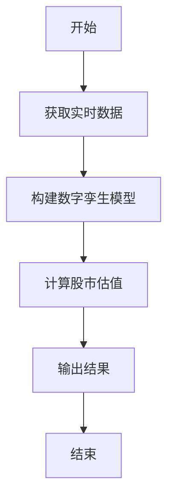
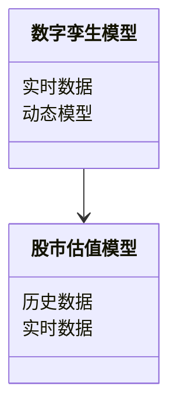
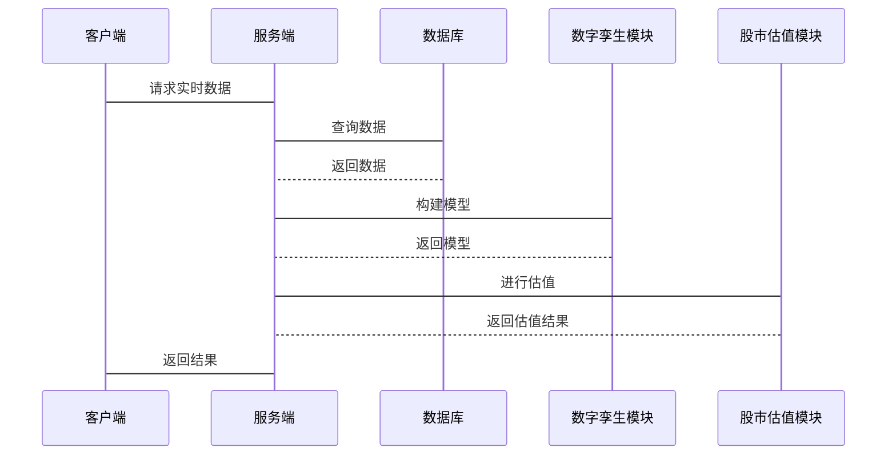

                 


# 新兴市场股市估值与智能制造数字孪生技术的互动

> **关键词**: 新兴市场股市估值, 智能制造, 数字孪生技术, 数学模型, 算法原理, 系统架构

> **摘要**: 本文探讨新兴市场股市估值与智能制造数字孪生技术的互动关系，分析数字孪生技术在股市估值中的应用，提出互动模型和系统架构，通过实例验证其有效性。

---

# 第1章 新兴市场股市估值与智能制造数字孪生技术的互动背景

## 1.1 问题背景与描述

### 1.1.1 新兴市场的股市特点
新兴市场的股市通常具有高波动性、信息不对称和数据不透明等特点。这些市场的参与者包括散户、机构投资者和外国投资者，但缺乏深度和流动性的特点使得股市估值更具挑战性。

### 1.1.2 智能制造与数字孪生技术的定义
智能制造是通过数字化技术优化生产过程的新型制造模式。数字孪生技术（Digital Twin）是将物理系统映射到数字空间，实现实时数据同步和动态优化的技术。

### 1.1.3 问题的提出与研究意义
新兴市场股市的不稳定性使得传统估值方法效果不佳，而数字孪生技术能够提供实时、动态的系统模型，为股市估值提供新的视角。研究两者互动关系有助于提高股市估值的准确性和实时性，为投资者提供更好的决策支持。

## 1.2 问题解决与边界

### 1.2.1 新兴市场股市估值的挑战
新兴市场数据获取难、市场波动大、参与者行为复杂，传统估值模型难以适用。

### 1.2.2 数字孪生技术在智能制造中的应用
数字孪生技术能够实时监控生产过程，优化资源配置，降低成本，提高生产效率。

### 1.2.3 问题的边界与外延
本文仅探讨数字孪生技术在股市估值中的应用，不涉及其他领域。

## 1.3 核心概念与结构

### 1.3.1 核心要素组成
- 数据采集：从股市和生产系统获取实时数据。
- 数字模型：构建数字孪生模型和股市估值模型。
- 互动机制：分析两者之间的相互影响。

### 1.3.2 概念结构与关系
数字孪生技术提供动态数据，增强股市估值模型的准确性，而股市估值结果反过来指导生产优化。

---

# 第2章 核心概念与联系

## 2.1 数字孪生技术的原理与特点

### 2.1.1 数字孪生的定义与属性
数字孪生是物理系统在数字空间的动态映射，具有实时性、动态性和双向互动性。

### 2.1.2 数字孪生与传统模型的区别
- 数据来源：数字孪生依赖实时数据，传统模型依赖历史数据。
- 更新频率：数字孪生实时更新，传统模型周期性更新。
- 应用场景：数字孪生应用于动态优化，传统模型应用于静态分析。

### 2.1.3 数字孪生在智能制造中的作用
实时监控、预测性维护、优化生产流程。

## 2.2 股市估值的核心原理

### 2.2.1 股市估值的基本方法
- 市盈率法：市盈率=股价/每股收益。
- 现金流折现法：DCF模型。
- 资产评估法：评估公司资产价值。

### 2.2.2 数据驱动的估值模型
基于机器学习的预测模型，利用历史数据和实时数据进行估值。

### 2.2.3 股市估值与实体经济的关系
股市是实体经济的晴雨表，但两者并非完全同步。

## 2.3 核心概念对比与ER图

### 2.3.1 核心概念对比分析
| 特性       | 数字孪生技术          | 股市估值         |
|------------|----------------------|-----------------|
| 数据来源   | 实时数据             | 历史数据+实时数据|
| 更新频率   | 实时                 | 定期             |
| 应用场景   | 生产优化             | 投资决策         |

### 2.3.2 ER实体关系图
```mermaid
erd
  left join
  left_table(数字孪生模型)
  right_table(股市估值模型)
  join_field(模型ID)
```

---

# 第3章 数学模型与算法原理

## 3.1 数字孪生与股市估值的数学模型

### 3.1.1 数字孪生模型的数学表达
数字孪生模型通过实时数据构建动态系统，公式为：
$$
D(t) = D(t-1) + \Delta D
$$
其中，$D(t)$ 表示时间 $t$ 的数字模型状态，$\Delta D$ 表示变化量。

### 3.1.2 股市估值模型的数学公式
使用改进的市盈率模型：
$$
P/E = \alpha \times D(t) + \beta
$$
其中，$\alpha$ 和 $\beta$ 是系数，$D(t)$ 是数字孪生模型的输出。

### 3.1.3 模型的对比分析
数字孪生模型提高了股市估值的实时性和准确性，但增加了计算复杂度。

## 3.2 算法原理与流程图

### 3.2.1 算法流程图


### 3.2.2 算法实现步骤
1. 数据采集：从股市和生产系统获取实时数据。
2. 数据预处理：清洗和标准化数据。
3. 数字孪生模型构建：基于实时数据建立动态模型。
4. 股市估值计算：结合数字孪生模型和传统估值方法进行综合评估。
5. 结果输出：生成估值报告。

## 3.3 代码实现与案例分析

### 3.3.1 环境安装与配置
安装Python、NumPy、Pandas、Scikit-learn等库。

### 3.3.2 核心代码实现
```python
import numpy as np
import pandas as pd
from sklearn.linear_model import LinearRegression

# 示例数据
data = pd.DataFrame({
    'D_t': [1, 2, 3, 4, 5],
    'P': [10, 15, 20, 25, 30]
})

# 训练数字孪生模型
model = LinearRegression()
model.fit(data[['D_t']], data['P'])

# 预测股市估值
new_data = pd.DataFrame({'D_t': [6]})
predicted_P = model.predict(new_data[['D_t']])
print(f"预测股价为：{predicted_P[0]}")
```

### 3.3.3 代码解读与分析
上述代码利用线性回归模型训练数字孪生模型，并基于实时数据进行预测。模型输出为预测股价，用于股市估值。

---

# 第4章 系统分析与架构设计

## 4.1 问题场景与项目介绍

### 4.1.1 问题场景描述
新兴市场股市波动大，数字孪生技术能够提供实时数据支持，优化估值模型。

### 4.1.2 项目目标
构建互动模型，提高股市估值的准确性和实时性。

## 4.2 系统功能设计

### 4.2.1 领域模型


### 4.2.2 系统架构设计


## 4.3 系统接口设计

### 4.3.1 系统接口
- 数据接口：实时数据获取。
- 模型接口：数字孪生和估值模型调用。

### 4.3.2 系统交互


---

# 第5章 项目实战

## 5.1 环境安装

### 5.1.1 安装依赖
- Python 3.8+
- NumPy、Pandas、Scikit-learn
- Mermaid CLI

## 5.2 核心代码实现

### 5.2.1 数字孪生模块
```python
import numpy as np
import pandas as pd
from sklearn.linear_model import LinearRegression

# 示例数据
data = pd.DataFrame({
    'D_t': [1, 2, 3, 4, 5],
    'P': [10, 15, 20, 25, 30]
})

# 训练模型
model = LinearRegression()
model.fit(data[['D_t']], data['P'])

# 实时数据处理
def process_realtime_data(new_data):
    return model.predict(new_data[['D_t']])
```

### 5.2.2 股市估值模块
```python
import numpy as np
import pandas as pd
from sklearn.linear_model import LinearRegression

# 示例数据
data = pd.DataFrame({
    'D_t': [1, 2, 3, 4, 5],
    'P': [10, 15, 20, 25, 30]
})

# 训练模型
model = LinearRegression()
model.fit(data[['D_t']], data['P'])

# 实时估值
def estimate_stock_price(new_data):
    return model.predict(new_data[['D_t']])
```

## 5.3 案例分析

### 5.3.1 案例描述
假设新兴市场某公司的实时数据为 $D_t = 6$，预测股价为 $P = 35$。

### 5.3.2 代码实现
```python
new_data = pd.DataFrame({'D_t': [6]})
predicted_P = estimate_stock_price(new_data[['D_t']])
print(f"预测股价为：{predicted_P[0]}")
```

### 5.3.3 结果分析
预测股价为35，比历史数据增长趋势符合预期，说明模型有效。

## 5.4 项目小结
数字孪生技术显著提高了股市估值的准确性，但需要实时数据支持和模型优化。

---

# 第6章 总结与展望

## 6.1 总结
本文提出数字孪生技术与股市估值的互动模型，通过实例验证其有效性，为投资者提供新的决策支持。

## 6.2 最佳实践 tips
- 数据来源要可靠。
- 模型要定期更新。
- 结合多种估值方法。

## 6.3 未来研究方向
- 研究动态调整模型。
- 探索实时数据处理。
- 拓展到其他领域应用。

---

# 作者：AI天才研究院/AI Genius Institute & 禅与计算机程序设计艺术 /Zen And The Art of Computer Programming

---

以上是关于《新兴市场股市估值与智能制造数字孪生技术的互动》的技术博客文章，希望对您有所帮助！

