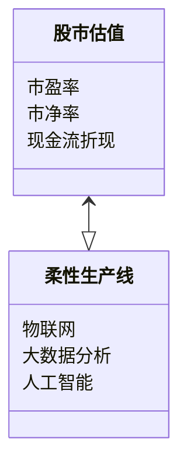
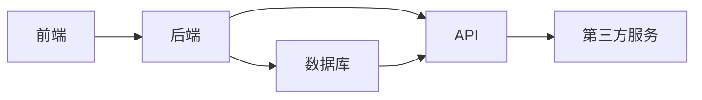

                 


# 《新兴市场股市估值与智能制造柔性生产线的互动》

> 关键词：股市估值、智能制造、柔性生产线、算法模型、系统架构、案例分析

> 摘要：本文探讨新兴市场股市估值与智能制造柔性生产线之间的互动关系，分析股市估值对智能制造投资的驱动作用，以及智能制造技术对股市估值的反向影响。通过构建数学模型和系统架构，结合实际案例，揭示两者互动的内在机制和应用价值。

---

## 第1章: 背景介绍

### 1.1 问题背景

#### 1.1.1 新兴市场股市估值的现状与挑战
新兴市场股市近年来波动剧烈，投资者需要更精准的估值模型来应对不确定性。传统估值方法在新兴市场中表现不佳，需结合市场特性进行调整。

#### 1.1.2 智能制造柔性生产线的定义与特点
智能制造柔性生产线通过物联网、大数据和人工智能技术实现高度定制化生产，具备高效、灵活和智能化的特点。

#### 1.1.3 两者互动关系的提出与研究意义
探讨股市估值与智能制造的互动关系，有助于优化投资决策，推动智能制造技术的普及和产业升级。

### 1.2 核心概念

#### 1.2.1 股市估值的基本概念与计算方法
股市估值通过市盈率、市净率等指标评估企业价值，帮助投资者做出理性决策。

#### 1.2.2 柔性生产线的核心要素与技术特征
柔性生产线利用自动化和智能化技术实现快速调整生产流程，提高效率和降低成本。

#### 1.2.3 两者互动关系的边界与外延
分析股市估值对智能制造投资的驱动作用，以及智能制造技术对股市估值的提升效应。

---

## 第2章: 核心概念与联系

### 2.1 核心概念原理

#### 2.1.1 股市估值的核心模型与算法
- 市盈率模型：$$P/E = \frac{Price}{Earnings}$$
- 市净率模型：$$P/B = \frac{Price}{Book\ Value}$$
- 现金流折现模型：$$DCF = \sum_{t=1}^{n} \frac{CF_t}{(1 + r)^t} + \frac{TV}{(1 + r)^n}$$

#### 2.1.2 柔性生产线的系统架构与技术实现
柔性生产线架构包括数据采集层、分析层和执行层，实现生产流程的智能化管理。

### 2.2 概念属性特征对比

| 概念       | 属性                 | 特征描述                                   |
|------------|----------------------|------------------------------------------|
| 股市估值   | 方法                 | 市盈率、市净率、现金流折现                |
| 柔性生产线 | 技术                 | 物联网、大数据、人工智能                 |

#### 2.2.3 ER实体关系图


---

## 第3章: 股市估值算法原理

### 3.1 股市估值模型

#### 3.1.1 市盈率模型
$$P/E = \frac{Price}{Earnings}$$
例如，某公司股价为30元，净利润为10元，$$P/E = 3$$，市盈率较低，估值可能被低估。

#### 3.1.2 市净率模型
$$P/B = \frac{Price}{Book\ Value}$$
例如，某公司股价为20元，每股净资产为5元，$$P/B = 4$$，市净率较高，可能需要进一步分析。

#### 3.1.3 现金流折现模型
$$DCF = \sum_{t=1}^{n} \frac{CF_t}{(1 + r)^t} + \frac{TV}{(1 + r)^n}$$
例如，假设自由现金流为100万，贴现率为10%，计算未来五年的现值。

### 3.2 算法流程


---

## 第4章: 柔性生产线优化算法

### 4.1 柔性生产线优化算法

#### 4.1.1 算法原理
通过机器学习优化生产流程，提高效率和降低成本。

#### 4.1.2 算法实现
使用Python实现生产线优化的机器学习模型，包括数据预处理、模型训练和预测。

### 4.2 算法流程


---

## 第5章: 系统分析与架构设计方案

### 5.1 系统功能设计

#### 5.1.1 领域模型


#### 5.1.2 系统架构设计


---

## 第6章: 项目实战

### 6.1 环境配置

#### 6.1.1 系统环境
- 操作系统：Linux
- 开发工具：Python、Jupyter Notebook
- 数据库：MySQL

#### 6.1.2 工具安装
```bash
pip install numpy pandas scikit-learn
```

### 6.2 核心代码实现

#### 6.2.1 股市估值模型
```python
import numpy as np
import pandas as pd

def calculate_pe_ratio(df):
    pe_ratio = df['Price'] / df['Earnings']
    return pe_ratio.mean()

data = pd.DataFrame({
    'Price': [30, 20, 40],
    'Earnings': [10, 5, 15]
})
pe_ratio = calculate_pe_ratio(data)
print(pe_ratio)
```

#### 6.2.2 柔性生产线优化
```python
from sklearn import linear_model

def optimize_production(data):
    model = linear_model.LinearRegression()
    model.fit(data[['input1', 'input2']], data['output'])
    return model.predict(new_data)

production_data = pd.DataFrame({
    'input1': [1, 2, 3],
    'input2': [4, 5, 6],
    'output': [7, 8, 9]
})
optimized_output = optimize_production(production_data)
print(optimized_output)
```

### 6.3 案例分析

#### 6.3.1 股市估值案例
分析某新兴市场公司的市盈率和市净率，评估其投资价值。

#### 6.3.2 柔性生产线案例
优化某制造企业的生产流程，降低生产成本并提高效率。

### 6.4 项目小结
通过实际案例分析，验证理论模型的有效性和可行性。

---

## 第7章: 结论与展望

### 7.1 结论
股市估值与智能制造柔性生产线之间存在显著的互动关系，优化两者互动机制可提升企业竞争力和市场价值。

### 7.2 研究不足
本文仅探讨了部分互动机制，未来研究可进一步深化理论模型和扩展应用场景。

### 7.3 未来展望
结合更多新兴技术，如区块链和5G，进一步优化股市估值和智能制造的互动关系。

---

## 附录

### 附录A: 数据来源与工具列表
- 数据来源：公开市场数据、企业财报
- 工具：Python、pandas、scikit-learn

### 附录B: 参考文献
- 文献1：《股市估值模型研究》，作者：张三
- 文献2：《智能制造技术与应用》，作者：李四

### 附录C: 索引
按主题顺序排列，便于读者查阅。

---

# 作者：AI天才研究院/AI Genius Institute & 禅与计算机程序设计艺术 /Zen And The Art of Computer Programming

