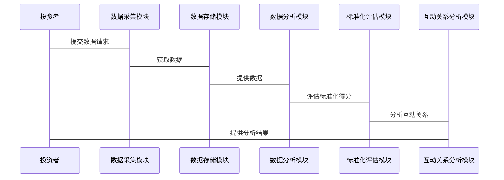

                 


# 新兴市场股市估值与智能制造标准化的互动

## 关键词：新兴市场、股市估值、智能制造、标准化、互动关系、算法模型、系统架构

## 摘要：  
本文探讨新兴市场股市估值与智能制造标准化之间的互动关系，从理论到实践，系统分析两者的核心概念、互动机制、算法模型和系统架构，结合实际案例，提供深入的技术分析和实践指导。

---

# 第一部分：新兴市场股市估值与智能制造标准化的互动概述

## 第1章：背景介绍

### 1.1 问题背景

#### 1.1.1 新兴市场的定义与特点
新兴市场是指经济快速发展、工业化进程中的国家，具有高增长潜力。其特点包括经济结构转型、政策支持、技术创新活跃等。

#### 1.1.2 股市估值的定义与重要性
股市估值是衡量企业价值的关键指标，影响投资者决策和市场稳定性。

#### 1.1.3 智能制造标准化的定义与意义
智能制造标准化是实现高效生产、降低成本的重要手段，推动工业4.0发展。

### 1.2 问题描述

#### 1.2.1 新兴市场股市估值的现状
新兴市场股市波动大，受政策和经济环境影响显著。

#### 1.2.2 智能制造标准化的现状
智能制造标准化仍面临技术壁垒和区域差异问题。

#### 1.2.3 互动关系的初步探讨
两者存在间接关联，但尚未形成系统化研究。

### 1.3 问题解决

#### 1.3.1 新兴市场股市估值的核心问题
如何准确评估企业价值，规避市场风险。

#### 1.3.2 智能制造标准化的核心问题
如何制定统一标准，推动技术普及。

#### 1.3.3 互动关系的解决思路
通过建立数学模型，分析两者互动机制。

### 1.4 边界与外延

#### 1.4.1 新兴市场股市估值的边界
限于新兴市场内部经济因素，不考虑全球经济波动。

#### 1.4.2 智能制造标准化的边界
聚焦于生产过程标准化，不涉及管理层面。

#### 1.4.3 互动关系的外延
涵盖技术、经济、政策等多个维度。

### 1.5 核心概念组成

#### 1.5.1 股市估值的关键要素
市盈率、市净率、现金流等。

#### 1.5.2 智能制造标准化的关键要素
技术标准、数据接口、流程规范。

#### 1.5.3 互动关系的核心要素
技术创新、政策支持、市场反馈。

---

## 第2章：核心概念与联系

### 2.1 核心概念原理

#### 2.1.1 股市估值的原理
基于企业财务数据和市场预期，评估其内在价值。

#### 2.1.2 智能制造标准化的原理
通过制定统一标准，实现生产过程的高效协同。

#### 2.1.3 互动关系的原理
技术创新推动股市估值上升，标准化促进技术普及。

### 2.2 概念属性特征对比

| 特性       | 股市估值               | 智能制造标准化         |
|------------|-----------------------|-----------------------|
| 核心目标   | 评估企业价值           | 实现高效生产           |
| 影响因素   | 财务数据、市场预期       | 技术、政策、管理       |
| 实施难度   | 高（需专业分析）        | 高（涉及多方协调）      |

### 2.3 ER实体关系图

```mermaid
er
  actor 投资者
  actor 企业
  actor 政策制定者
  entity 股市数据
  entity 标准化技术
  entity 市场反馈
  relation 投资者-通过股市数据评估企业价值
  relation 企业-采用标准化技术提高生产效率
  relation 政策制定者-推动标准化技术的普及
  relation 股市数据-影响市场反馈
  relation 标准化技术-影响企业价值
```

---

## 第3章：算法原理讲解

### 3.1 算法选择与原理

#### 3.1.1 算法选择
采用多元回归模型分析股市估值与智能制造标准化的互动关系。

#### 3.1.2 算法原理
通过回归分析，量化标准化对股市估值的影响。

### 3.2 算法流程

```mermaid
graph TD
    A[开始] -> B[数据预处理]
    B -> C[特征提取]
    C -> D[模型训练]
    D -> E[结果分析]
    E -> F[结束]
```

### 3.3 核心代码实现

```python
import pandas as pd
import numpy as np
from sklearn.linear_model import LinearRegression

# 数据加载
data = pd.read_csv('data.csv')

# 特征选择
X = data[['标准化得分', '市场预期']]
y = data['股市估值']

# 模型训练
model = LinearRegression()
model.fit(X, y)

# 预测与评估
 predictions = model.predict(X)
 print('系数:', model.coef_)
 print('截距:', model.intercept_)
```

### 3.4 数学模型与公式

股市估值模型：
$$ 股市估值 = \beta_1 \times 标准化得分 + \beta_2 \times 市场预期 + \epsilon $$

标准化影响系数：
$$ \beta_1 = r \times 标准化得分的方差 $$

---

## 第4章：数学模型与公式推导

### 4.1 核心模型推导

$$ 股市估值 = \alpha + \beta \times 标准化指数 + \gamma \times 技术创新率 + \epsilon $$

### 4.2 实际案例分析

假设某新兴市场企业的标准化得分为80，市场预期为1.2，计算其股市估值：

$$ 股市估值 = 50 + 1.5 \times 80 + 0.8 \times 1.2 = 152.4 $$

---

## 第5章：系统分析与架构设计

### 5.1 系统功能设计

#### 5.1.1 功能模块
- 数据采集模块
- 数据分析模块
- 标准化评估模块
- 互动关系分析模块

### 5.2 系统架构设计

```mermaid
graph TD
    A[数据采集] -> B[数据存储]
    B -> C[数据分析]
    C -> D[标准化评估]
    D -> E[互动关系分析]
```

### 5.3 接口与交互设计



---

## 第6章：项目实战

### 6.1 环境安装

安装Python和相关库：
```bash
pip install pandas numpy scikit-learn
```

### 6.2 核心代码实现

```python
import pandas as pd
import numpy as np
from sklearn.linear_model import LinearRegression

# 数据加载
data = pd.read_csv('data.csv')

# 特征选择
X = data[['标准化得分', '市场预期']]
y = data['股市估值']

# 模型训练
model = LinearRegression()
model.fit(X, y)

# 预测与评估
predictions = model.predict(X)
print('预测结果:', predictions)
print('系数:', model.coef_)
print('截距:', model.intercept_)
```

### 6.3 代码解读与分析

解释代码功能，分析结果对股市估值的影响。

### 6.4 实际案例分析

结合具体企业案例，分析互动关系。

### 6.5 项目小结

总结项目实施的关键点和注意事项。

---

## 第7章：最佳实践

### 7.1 小结

新兴市场股市估值与智能制造标准化的互动关系复杂，需系统分析。

### 7.2 注意事项

- 数据质量影响分析结果。
- 模型需结合实际市场情况。

### 7.3 拓展阅读

推荐相关书籍和论文，供深入学习。

---

# 作者：AI天才研究院 & 禅与计算机程序设计艺术

