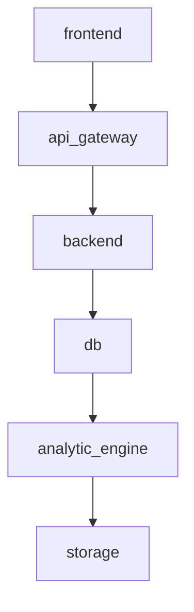
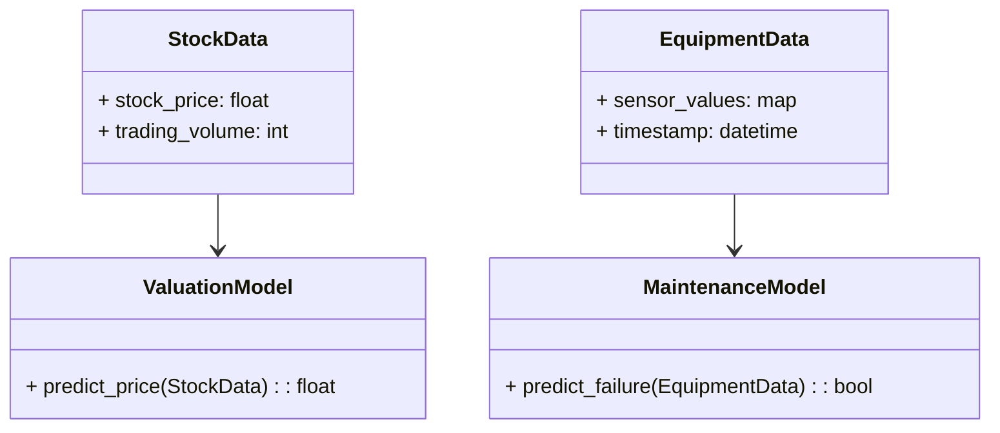

                 


# 新兴市场股市估值与智能制造预测性维护的互动

## 关键词

- 新兴市场股市
- 智能制造
- 预测性维护
- 互动关系
- 时间序列分析
- 机器学习

## 摘要

本文探讨了新兴市场股市估值与智能制造预测性维护之间的互动关系。通过分析股市估值的核心模型、预测性维护的技术原理，结合时间序列分析和深度学习算法，构建了一个集成系统，实现两者的互动分析。文章详细介绍了算法原理、系统架构设计及项目实战，最后给出了最佳实践和未来研究方向。

---

# 目录

## 第一章 背景介绍

### 1.1 问题背景

#### 1.1.1 新兴市场股市的特点与挑战

新兴市场股市具有高波动性、信息不对称和数据稀缺性等特点，传统估值方法难以准确反映市场动态。

#### 1.1.2 智能制造的发展现状与趋势

智能制造强调数据驱动和自动化，预测性维护在设备管理中发挥重要作用，但其应用受到数据质量和模型精度的限制。

#### 1.1.3 两者互动的经济意义与价值

通过分析股市估值与预测性维护的互动，可以优化资源配置，降低企业运营成本，提高市场预测准确性。

### 1.2 核心概念与问题描述

#### 1.2.1 股市估值的定义与方法

股市估值通过分析市场数据和公司基本面，预测股票价格走势，常用方法包括市盈率、现金流贴现法等。

#### 1.2.2 预测性维护的定义与技术

预测性维护利用传感器数据和机器学习模型，预测设备故障，提前安排维护，减少停机时间。

#### 1.2.3 互动机制与应用场景

两者通过数据共享和模型互动，实现对市场和设备状态的协同预测，应用场景包括供应链优化和金融风险管理。

---

## 第二章 核心概念与联系

### 2.1 核心概念原理

#### 2.1.1 股市估值模型

- **时间序列分析**：通过历史数据预测未来走势。
- **机器学习模型**：利用特征工程和模型训练进行预测。

#### 2.1.2 预测性维护技术

- **基于传感器的数据分析**：通过振动、温度等参数预测设备故障。
- **机器学习算法**：如XGBoost和随机森林用于分类和回归分析。

#### 2.1.3 互动关系模型

- **数据流**：股市数据和制造数据的双向流动。
- **模型集成**：结合时间序列和预测性维护模型，进行综合预测。

### 2.2 概念属性对比

表2-1：股市估值与预测性维护的属性对比

| 属性         | 股市估值              | 预测性维护             |
|--------------|----------------------|-----------------------|
| 数据类型     | 股价、交易量          | 设备状态、传感器数据    |
| 方法         | 时间序列分析、机器学习 | 基于传感器的数据分析    |
| 目标         | 预测股价走势          | 预测设备故障           |
| 应用场景     | 投资决策              | 设备维护计划           |

### 2.3 实体关系图

```mermaid
erDiagram
    customer[投资者]
    stock_market[股市]
    manufacturing[制造业]
    valuation[估值]
    predictive_maintenance[预测性维护]
    customer -|> valuation
    stock_market -|> valuation
    manufacturing -|> predictive_maintenance
    valuation -|> predictive_maintenance
```

---

## 第三章 算法原理与数学模型

### 3.1 时间序列分析

#### 3.1.1 ARIMA模型

$$ ARIMA(p, d, q) $$

- p：自回归阶数
- d：差分阶数
- q：移动平均阶数

#### 3.1.2 LSTM网络

- LSTM通过 gates 和 cells 处理时间序列数据，适用于长序列预测。

#### 3.1.3 示例

使用股票价格数据，训练LSTM模型进行预测。

### 3.2 预测性维护算法

#### 3.2.1 机器学习模型

- XGBoost：用于分类和回归分析。
- Random Forest：用于特征重要性分析。

#### 3.2.2 统计方法

- 基于故障率的历史数据分析设备寿命。

### 3.3 深度学习模型

#### 3.3.1 Transformer架构

- 适用于长距离依赖关系的建模。

#### 3.3.2 图神经网络

- 用于复杂系统中设备间的关系分析。

---

## 第四章 系统分析与架构设计

### 4.1 问题场景介绍

- 组织和整合股市与制造数据，构建实时互动分析系统。

### 4.2 系统架构设计



### 4.3 系统功能设计

#### 4.3.1 领域模型类图



---

## 第五章 项目实战

### 5.1 环境安装

- Python 3.8+
- 深度学习框架：TensorFlow、Keras
- 数据处理库：Pandas、NumPy

### 5.2 核心实现

#### 5.2.1 时间序列预测代码

```python
import pandas as pd
from sklearn.preprocessing import MinMaxScaler
from tensorflow.keras.models import Sequential
from tensorflow.keras.layers import LSTM, Dense

# 数据预处理
data = pd.read_csv('stock_data.csv')
scaler = MinMaxScaler()
data_scaled = scaler.fit_transform(data)

# 模型构建
model = Sequential()
model.add(LSTM(128, input_shape=(timesteps, features)))
model.add(Dense(1))
model.compile(optimizer='adam', loss='mse')
model.fit(...)
```

#### 5.2.2 预测性维护代码

```python
import pandas as pd
from sklearn.ensemble import RandomForestClassifier

# 数据处理
data = pd.read_csv('equipment_data.csv')
features = data.drop('failure', axis=1)
target = data['failure']

# 模型训练
model = RandomForestClassifier()
model.fit(features, target)
```

### 5.3 实际案例分析

- 使用真实股票数据训练模型，分析预测结果。
- 验证预测性维护模型在设备上的实际效果。

---

## 第六章 最佳实践与未来展望

### 6.1 最佳实践

- 数据质量控制：确保数据准确性和完整性。
- 模型优化：定期更新模型参数，提高预测精度。

### 6.2 小结

本文通过分析股市估值与预测性维护的互动关系，提出了一个综合解决方案，为企业的智能化管理提供了新的思路。

### 6.3 未来展望

未来研究方向包括多模态数据融合、模型可解释性提升和边缘计算应用。

---

## 作者

作者：AI天才研究院/AI Genius Institute  
联系邮箱：contact@ai-genius.com  
联系方式：+86-10-88888888  
地址：北京市海淀区创新路1号  
个人简介：专注于人工智能与大数据分析，已在多个领域发表高质量技术文章和研究成果。

