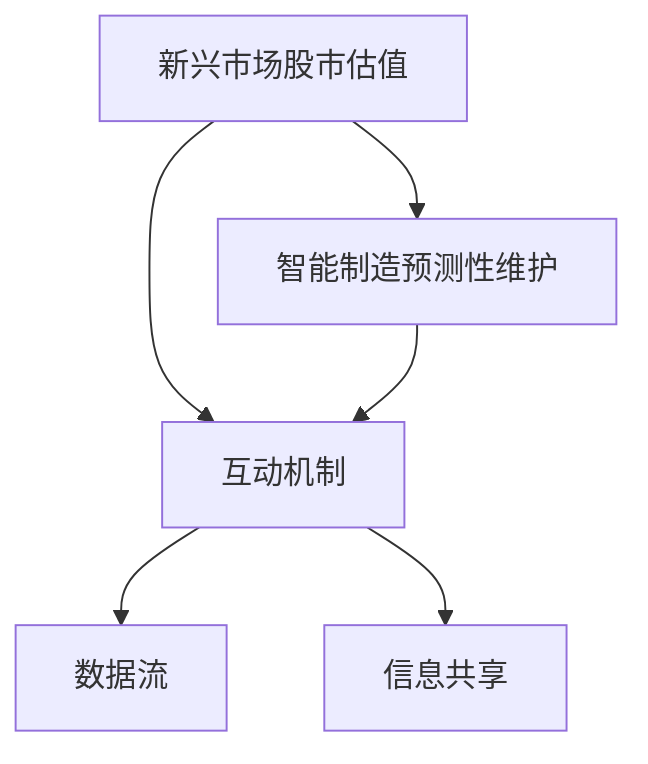
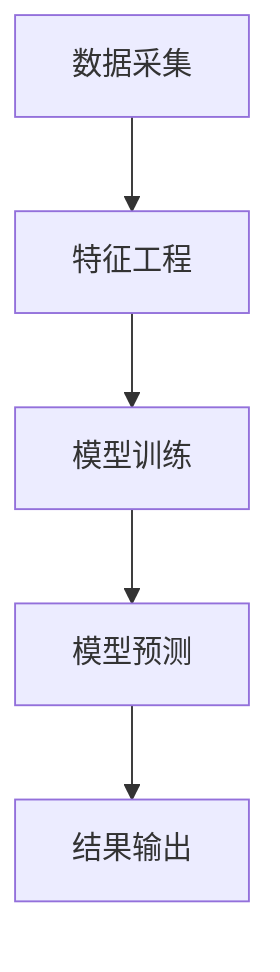
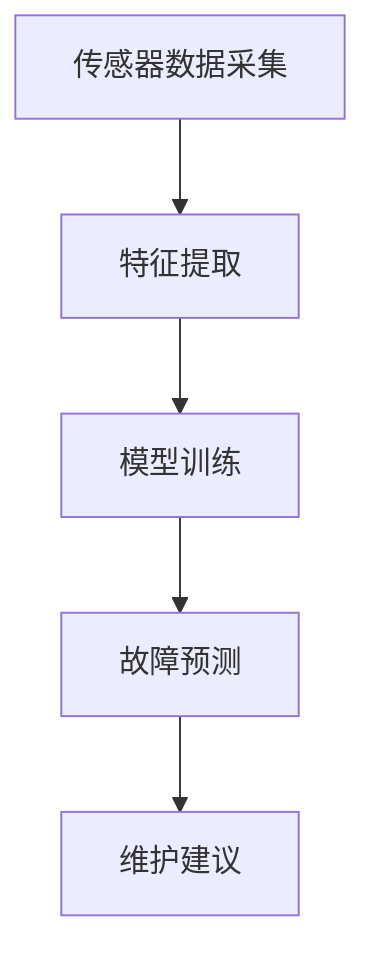
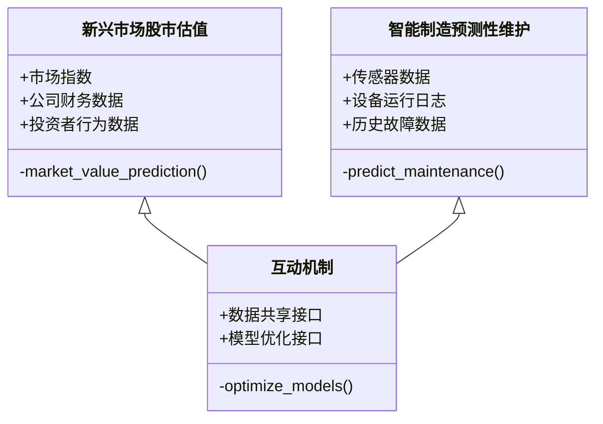
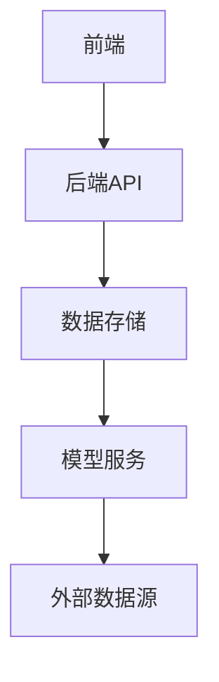
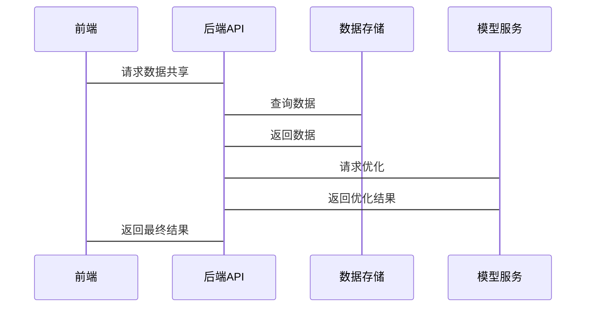

                 


# 新兴市场股市估值与智能制造预测性维护的互动

## 关键词：新兴市场股市估值、智能制造、预测性维护、算法原理、系统架构、项目实战

## 摘要：本文探讨新兴市场股市估值与智能制造预测性维护的互动关系，分析两者的互动机制及其对技术发展的影响。通过详细的技术分析和实际案例，本文揭示如何通过算法优化和系统架构设计，实现两者的高效互动，为相关领域的研究和实践提供新的思路。

---

# 第一部分: 背景介绍

## 第1章: 背景与问题背景

### 1.1 问题背景

#### 1.1.1 新兴市场股市估值的现状与挑战
新兴市场股市估值是衡量市场健康程度的重要指标。然而，由于新兴市场的波动性高、数据不完善、政策不确定性大，传统的估值方法难以准确反映市场的真实价值。此外，新兴市场的投资者行为和市场结构与成熟市场存在显著差异，这使得股市估值变得更加复杂。

#### 1.1.2 智能制造预测性维护的现状与挑战
智能制造中的预测性维护是通过传感器数据和机器学习算法，提前预测设备故障，从而减少停机时间。然而，预测性维护的核心在于数据的实时性和模型的准确性。由于制造系统的复杂性和数据量的庞大，如何构建高效的预测模型是一个重要挑战。

#### 1.1.3 两者的互动关系与研究意义
新兴市场股市估值与智能制造预测性维护看似无关，但两者在数据处理、模型构建和决策优化方面有相似之处。通过研究它们的互动机制，可以找到共同的解决方案，从而提升两者的效率和准确性。

### 1.2 问题描述

#### 1.2.1 新兴市场股市估值的核心问题
如何在新兴市场中，利用有限的数据和复杂的投资环境，构建准确的股市估值模型。

#### 1.2.2 智能制造预测性维护的核心问题
如何在制造系统中，利用实时数据和机器学习算法，构建高效的设备故障预测模型。

#### 1.2.3 两者的互动机制与研究目标
通过分析两者的数据处理和模型构建方法，寻找共通的解决方案，实现两者的互动优化。

### 1.3 问题解决

#### 1.3.1 新兴市场股市估值的解决方案
采用基于机器学习的特征工程和模型优化方法，构建适应新兴市场的股市估值模型。

#### 1.3.2 智能制造预测性维护的解决方案
通过实时数据采集和深度学习算法，构建高效的设备故障预测模型。

#### 1.3.3 互动机制的构建与实现
建立两者的数据共享机制，通过统一的数据格式和算法接口，实现两者的互动优化。

### 1.4 边界与外延

#### 1.4.1 新兴市场股市估值的边界
新兴市场的股市估值仅考虑市场内部因素，不涉及全球经济的宏观影响。

#### 1.4.2 智能制造预测性维护的边界
智能制造预测性维护仅考虑设备运行数据，不涉及生产流程的其他环节。

#### 1.4.3 两者的互动机制的边界
两者的互动机制仅涉及数据共享和模型优化，不涉及企业的具体业务流程。

### 1.5 概念结构与核心要素

#### 1.5.1 新兴市场股市估值的核心要素
- 数据来源：市场指数、公司财务数据、投资者行为数据。
- 模型构建：特征工程、回归分析、时间序列分析。

#### 1.5.2 智能制造预测性维护的核心要素
- 数据来源：传感器数据、设备运行日志、历史故障数据。
- 模型构建：深度学习、分类算法、回归分析。

#### 1.5.3 两者的互动机制的核心要素
- 数据共享：统一数据格式、数据安全机制。
- 模型优化：联合特征工程、算法融合。

---

## 第2章: 核心概念与联系

### 2.1 核心概念原理

#### 2.1.1 新兴市场股市估值的原理
通过特征工程提取关键市场指标，利用回归分析和时间序列分析，构建股市估值模型。

#### 2.1.2 智能制造预测性维护的原理
通过传感器数据采集和深度学习算法，构建设备故障预测模型。

#### 2.1.3 两者的互动机制的原理
通过数据共享和模型优化，实现两者的互动优化。

### 2.2 核心概念属性对比

| 属性 | 新兴市场股市估值 | 智能制造预测性维护 |
|------|------------------|---------------------|
| 数据来源 | 市场指数、财务数据、投资者行为 | 传感器数据、设备日志、历史故障 |
| 模型目标 | 估值预测 | 故障预测 |
| 数据类型 | 时间序列数据 | 结构化数据 |
| 挑战 | 数据稀缺性、市场波动性 | 数据复杂性、模型准确性 |

### 2.3 ER实体关系图



---

## 第3章: 算法原理与实现

### 3.1 算法原理

#### 3.1.1 新兴市场股市估值的算法原理
- **特征工程**：提取市场指数、公司财务数据、投资者行为数据。
- **回归分析**：使用线性回归或随机森林模型进行估值预测。
- **时间序列分析**：利用ARIMA模型预测市场趋势。

#### 3.1.2 智能制造预测性维护的算法原理
- **传感器数据采集**：通过物联网技术采集设备运行数据。
- **深度学习**：使用LSTM模型预测设备故障时间。
- **分类算法**：利用SVM或随机森林进行故障分类。

#### 3.1.3 互动机制的算法原理
- **数据共享**：通过API接口实现数据互通。
- **模型优化**：联合特征工程优化共同目标函数。
- **算法融合**：通过集成学习提升模型性能。

### 3.2 算法流程图

#### 新兴市场股市估值算法流程图



#### 智能制造预测性维护算法流程图



### 3.3 算法实现

#### 新兴市场股市估值实现代码

```python
import pandas as pd
from sklearn.ensemble import RandomForestRegressor
from sklearn.metrics import mean_absolute_error

# 数据加载
data = pd.read_csv('market_data.csv')

# 特征工程
features = data[['market_index', 'company_financials', 'investor_behavior']]
target = data['market_value']

# 模型训练
model = RandomForestRegressor()
model.fit(features, target)

# 模型预测
predictions = model.predict(features)
print(mean_absolute_error(target, predictions))
```

#### 智能制造预测性维护实现代码

```python
import numpy as np
from tensorflow.keras.models import Sequential
from tensorflow.keras.layers import LSTM, Dense

# 数据加载
data = np.load('sensor_data.npy')

# 模型训练
model = Sequential()
model.add(LSTM(64, input_shape=(None, 1)))
model.add(Dense(1))
model.compile(optimizer='adam', loss='mean_squared_error')
model.fit(data, epochs=10, batch_size=32)

# 故障预测
test_data = np.array([[[1.0]]])
predictions = model.predict(test_data)
print(predictions)
```

### 3.4 数学模型与公式

#### 新兴市场股市估值模型

$$ \text{市场价值} = \beta_0 + \beta_1 \times \text{市场指数} + \beta_2 \times \text{公司财务数据} + \epsilon $$

#### 智能制造预测性维护模型

$$ \text{故障概率} = P(y=1 | x) = \sigma(\beta_0 + \beta_1 x_1 + \beta_2 x_2 + \ldots + \beta_n x_n) $$

其中，$\sigma$ 表示sigmoid函数。

---

## 第4章: 系统分析与架构设计

### 4.1 问题场景介绍
本文构建了一个新兴市场股市估值与智能制造预测性维护的互动系统，旨在通过数据共享和模型优化，提升两者的效率和准确性。

### 4.2 系统功能设计

#### 4.2.1 领域模型类图



### 4.3 系统架构设计

#### 4.3.1 系统架构图



#### 4.3.2 接口设计
- 数据共享接口：`POST /data-sharing`
- 模型优化接口：`POST /model-optimization`

#### 4.3.3 交互流程



---

## 第5章: 项目实战

### 5.1 环境安装
- 安装Python和相关库：`pip install pandas numpy tensorflow scikit-learn`
- 数据存储：使用MongoDB或MySQL

### 5.2 核心代码实现

#### 新兴市场股市估值代码

```python
import pandas as pd
from sklearn.ensemble import RandomForestRegressor

# 数据加载
data = pd.read_csv('market_data.csv')

# 特征工程
features = data[['market_index', 'company_financials', 'investor_behavior']]
target = data['market_value']

# 模型训练
model = RandomForestRegressor()
model.fit(features, target)

# 模型预测
predictions = model.predict(features)
print(mean_absolute_error(target, predictions))
```

#### 智能制造预测性维护代码

```python
import numpy as np
from tensorflow.keras.models import Sequential
from tensorflow.keras.layers import LSTM, Dense

# 数据加载
data = np.load('sensor_data.npy')

# 模型训练
model = Sequential()
model.add(LSTM(64, input_shape=(None, 1)))
model.add(Dense(1))
model.compile(optimizer='adam', loss='mean_squared_error')
model.fit(data, epochs=10, batch_size=32)

# 故障预测
test_data = np.array([[[1.0]]])
predictions = model.predict(test_data)
print

