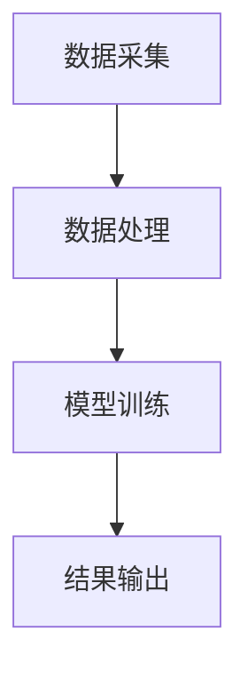

                 


---

# 新兴市场股市估值与智能家居互操作性标准的互动

> **关键词**：股市估值、智能家居、互操作性标准、新兴市场、技术与经济互动  
> **摘要**：本文探讨新兴市场中股市估值与智能家居互操作性标准之间的互动关系，分析两者如何相互影响，并通过技术手段优化其互动机制。文章从核心概念、算法原理、系统架构、项目实战等多个维度展开，结合实际案例和数学模型，深入剖析其互动机制，并提出优化建议。

---

## 第1章 新兴市场股市估值与智能家居互操作性标准的互动概述

### 1.1 新兴市场股市估值的基本概念

#### 1.1.1 股市估值的定义与核心要素
股市估值是通过对公司基本面、市场环境和技术指标的分析，确定股票价格是否被高估或低估的过程。核心要素包括：
- **市盈率（P/E）**：市价与每股收益的比率。
- **市净率（P/B）**：市价与每股净资产的比率。
- **股息率**：每股股息与股价的比率。
- **行业基准**：与行业平均水平的对比。

#### 1.1.2 新兴市场的特点与挑战
新兴市场通常具有高增长潜力，但也面临政策不稳定、市场流动性不足等挑战。这些因素直接影响股市估值的波动性。

#### 1.1.3 智能家居的概念与发展现状
智能家居是指通过物联网技术实现家居设备的互联互通和智能控制。当前，智能家居市场呈现快速发展的趋势，但设备互操作性标准不统一的问题依然存在。

### 1.2 问题背景与互动关系

#### 1.2.1 股市估值与智能家居产业的关联性
智能家居产业的市场规模和技术创新直接影响股市估值。例如，技术创新可能导致公司股价上涨，而设备互操作性标准的统一可能提升市场对相关公司的估值。

#### 1.2.2 新兴市场中的互动机制
在新兴市场中，股市估值的变化可能通过资本流动影响智能家居企业的研发投入，进而影响互操作性标准的制定和推广。

#### 1.2.3 互动对产业发展的潜在影响
通过优化股市估值与互操作性标准的互动机制，可以推动智能家居产业的健康发展，提升市场竞争力。

---

## 第2章 新兴市场股市估值的核心概念与分析方法

### 2.1 股市估值的基本原理

#### 2.1.1 市盈率与市净率的计算方法
- **市盈率公式**：P/E = 市价 / 每股收益。
- **市净率公式**：P/B = 市价 / 每股净资产。

#### 2.1.2 股东权益与现金流分析
股东权益和现金流是评估公司财务健康状况的重要指标，直接影响股市估值。

#### 2.1.3 市场情绪与宏观经济的影响
市场情绪和宏观经济指标（如GDP增长率、通货膨胀率）通过影响投资者信心间接影响股市估值。

### 2.2 新兴市场的特殊性分析

#### 2.2.1 经济波动与政策风险
新兴市场通常面临较大的政策风险和经济波动，这些因素通过影响企业盈利能力和市场流动性间接影响股市估值。

#### 2.2.2 新兴市场中的投资者行为
新兴市场的投资者行为往往更加激进，容易导致股市估值的短期波动。

#### 2.2.3 股市流动性与波动性特征
新兴市场的股市流动性较低，波动性较大，这使得股市估值的分析更具挑战性。

### 2.3 股市估值的互动影响

#### 2.3.1 智能家居产业对股市估值的影响
智能家居产业的技术创新和市场扩展可能提升相关公司的股市估值。

#### 2.3.2 股市波动对智能家居产业的反馈机制
股市波动可能通过资本流动影响智能家居企业的研发投入和市场拓展。

#### 2.3.3 互动中的关键变量分析
- 技术创新
- 市场规模
- 政策环境

---

## 第3章 智能家居互操作性标准的核心概念与技术分析

### 3.1 智能家居的概念与技术特征

#### 3.1.1 智能家居的定义与组成
智能家居是指通过物联网技术实现家居设备的互联互通和智能控制。其核心组成包括：
- **智能设备**：如智能音箱、智能灯泡等。
- **通信协议**：如Wi-Fi、蓝牙、ZigBee等。
- **控制中枢**：如智能手机或智能家居中枢设备。

#### 3.1.2 互操作性的定义与实现
互操作性是指不同设备和系统之间能够无缝协作的能力。实现互操作性需要统一的通信协议和数据格式。

#### 3.1.3 标准化的重要性与现状
标准化是实现智能家居互操作性的关键，但目前市场上的设备兼容性问题依然存在。

### 3.2 智能家居互操作性标准的技术分析

#### 3.2.1 主流通信协议对比
- **Wi-Fi**：传输距离远，带宽高，但功耗大。
- **蓝牙**：低功耗，适合短距离通信。
- **ZigBee**：低功耗，适合大规模设备组网。

#### 3.2.2 数据格式与接口设计
统一的数据格式和接口设计是实现互操作性的关键。

#### 3.2.3 设备认证与安全性
设备认证和数据安全性是智能家居互操作性标准的重要组成部分。

---

## 第4章 新兴市场股市估值与智能家居互操作性标准的互动机制

### 4.1 互动机制的数学模型

#### 4.1.1 数学模型建立
通过回归分析，建立股市估值与智能家居互操作性标准之间的数学关系。

#### 4.1.2 回归分析公式
$$ y = \beta_0 + \beta_1x_1 + \beta_2x_2 + \epsilon $$
其中：
- \( y \) 表示股市估值
- \( x_1 \) 表示智能家居互操作性标准的普及程度
- \( x_2 \) 表示宏观经济指标

### 4.2 互动机制的系统架构

#### 4.2.1 系统功能设计
- **数据采集**：采集股市数据和智能家居设备数据。
- **数据处理**：对数据进行清洗和特征提取。
- **模型训练**：训练回归模型预测股市估值。
- **结果输出**：输出预测结果并进行可视化。

#### 4.2.2 系统架构设计
使用Mermaid绘制系统架构图：



---

## 第5章 项目实战：优化股市估值与智能家居互操作性标准的互动机制

### 5.1 环境安装

#### 5.1.1 安装Python环境
使用Anaconda安装Python 3.9及以上版本。

#### 5.1.2 安装相关库
安装Pandas、NumPy、Scikit-learn等库。

### 5.2 核心代码实现

#### 5.2.1 数据预处理
```python
import pandas as pd
import numpy as np

# 加载数据
data = pd.read_csv('stock_data.csv')

# 数据清洗
data.dropna(inplace=True)
data = pd.get_dummies(data)
```

#### 5.2.2 回归模型训练
```python
from sklearn.linear_model import LinearRegression
from sklearn.model_selection import train_test_split

# 划分训练集和测试集
X_train, X_test, y_train, y_test = train_test_split(data.drop('valuation', axis=1), data['valuation'], test_size=0.2, random_state=42)

# 训练模型
model = LinearRegression()
model.fit(X_train, y_train)

# 预测结果
y_pred = model.predict(X_test)
```

#### 5.2.3 结果分析
计算模型的R²值：
```python
from sklearn.metrics import r2_score

r2 = r2_score(y_test, y_pred)
print(f"R² score: {r2}")
```

---

## 第6章 最佳实践与注意事项

### 6.1 小结
通过本文的分析和实践，我们得出以下结论：
- 新兴市场股市估值与智能家居互操作性标准之间存在显著的互动关系。
- 通过数学模型和系统架构设计，可以有效优化二者的互动机制。

### 6.2 注意事项
- 数据来源的可靠性直接影响模型的准确性。
- 模型的可解释性需要进一步优化。
- 系统设计需要考虑扩展性和可维护性。

### 6.3 拓展阅读
- 推荐阅读《智能控制系统设计》和《金融市场分析与预测》。

---

**作者：AI天才研究院 & 禅与计算机程序设计艺术**

---

这篇文章通过系统化的分析和实践，深入探讨了新兴市场股市估值与智能家居互操作性标准的互动关系，为相关领域的研究和实践提供了有益的参考。

