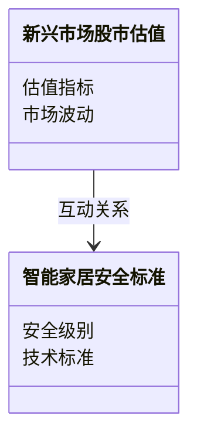
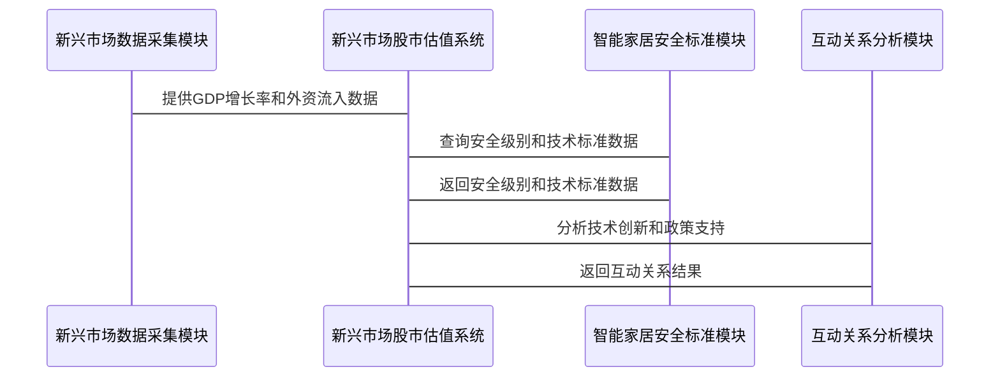

                 


# 新兴市场股市估值与智能家居安全标准的互动

> 关键词：新兴市场、股市估值、智能家居、安全标准、互动关系

> 摘要：本文探讨了新兴市场股市估值与智能家居安全标准之间的互动关系。通过分析两者的核心概念、互动机制、数学建模、系统架构以及实际案例，本文揭示了这两者在经济和技术创新领域的相互影响，为相关领域的研究和实践提供了新的视角和方法。

---

## 第1章: 背景介绍

### 1.1 问题背景

#### 1.1.1 新兴市场的经济特点
新兴市场通常指那些经济增长迅速、但尚未达到发达国家水平的经济体。这些市场具有高度的不确定性和波动性，但也蕴含着巨大的投资潜力。新兴市场的股市估值往往受到政策、经济波动和外部环境的影响。

#### 1.1.2 智能家居技术的发展现状
智能家居是指通过物联网技术将家庭设备连接起来，实现智能化管理和控制的居住环境。随着技术的进步，智能家居设备的种类和功能不断增加，但其安全标准的制定和执行仍存在诸多挑战。

#### 1.1.3 两者互动的潜在价值
新兴市场的经济活力和智能家居技术的快速发展为两者之间的互动提供了可能性。通过合理配置资源和优化安全标准，可以提升股市估值，同时促进智能家居技术的普及和应用。

### 1.2 问题描述

#### 1.2.1 新兴市场股市估值的挑战
新兴市场的股市估值受多种因素影响，包括政策变化、经济波动和外部市场环境。如何准确评估这些市场的潜力和风险是投资者面临的难题。

#### 1.2.2 智能家居安全标准的现状
智能家居设备的普及带来了数据泄露和隐私保护等问题。制定统一的安全标准是确保智能家居技术可持续发展的关键。

#### 1.2.3 两者互动的核心问题
新兴市场股市估值的波动性和智能家居安全标准的缺失之间存在一定的关联性。如何通过优化安全标准来提升股市估值，是本文的核心问题。

### 1.3 问题解决思路

#### 1.3.1 新兴市场股市估值的提升策略
通过分析市场趋势和政策动向，优化投资组合，降低风险。

#### 1.3.2 智能家居安全标准的优化方向
制定统一的安全规范，加强数据保护和隐私管理。

#### 1.3.3 两者互动的实现路径
通过技术创新和政策支持，促进智能家居技术在新兴市场的广泛应用，从而提升股市估值。

### 1.4 边界与外延

#### 1.4.1 新兴市场的界定
新兴市场通常包括中国、印度、巴西等发展中国家，具有较高的经济增长潜力。

#### 1.4.2 智能家居的定义与范围
智能家居涵盖家庭设备的智能化管理，包括照明、安防、能源管理等多个方面。

#### 1.4.3 互动的边界条件
互动的核心在于技术创新和政策支持，需考虑市场环境和技术可行性。

### 1.5 核心概念与要素

#### 1.5.1 新兴市场股市估值的关键指标
- GDP增长率
- 外资流入
- 政策稳定性

#### 1.5.2 智能家居安全标准的核心要素
- 数据安全
- 隐私保护
- 系统兼容性

#### 1.5.3 互动机制的关键环节
- 技术创新
- 市场推广
- 政策支持

---

## 第2章: 新兴市场股市估值与智能家居安全标准的核心概念

### 2.1 核心概念原理

#### 2.1.1 新兴市场股市估值的原理
股市估值受多种因素影响，包括宏观经济指标、企业盈利能力和市场情绪。

#### 2.1.2 智能家居安全标准的原理
安全标准旨在确保智能家居设备的安全性和可靠性，保护用户隐私和数据安全。

#### 2.1.3 两者互动的内在逻辑
技术创新推动智能家居设备的普及，从而影响新兴市场的股市估值。

### 2.2 核心概念对比分析

#### 2.2.1 新兴市场股市估值与智能家居安全标准的属性对比

| 属性                | 新兴市场股市估值                | 智能家居安全标准                |
|---------------------|---------------------------------|---------------------------------|
| 核心目标            | 提升市场价值                    | 保护用户隐私和数据安全          |
| 主要影响因素        | 经济指标、政策、市场情绪        | 技术标准、法律法规、用户需求    |
| 实施主体            | 政府、企业、投资者              | 技术开发商、监管机构            |

#### 2.2.2 两者目标与功能的对比
- 新兴市场股市估值的目标是提升市场价值，而智能家居安全标准的目标是确保设备安全。
- 两者都依赖于技术创新和政策支持。

#### 2.2.3 互动关系的特征分析
- 技术创新是两者互动的核心驱动力。
- 政策支持在两者互动中起到桥梁作用。

### 2.3 ER实体关系图

```mermaid
er
  root
    entity 新兴市场股市估值
      attribute 估值指标
      attribute 市场波动
    entity 智能家居安全标准
      attribute 安全级别
      attribute 技术标准
    relationship 互动关系
```

---

## 第3章: 新兴市场股市估值与智能家居安全标准的互动模型

### 3.1 互动机制的数学模型

#### 3.1.1 新兴市场股市估值的影响因素
- 经济增长（GDP增长率）
- 外资流入
- 政策稳定性

#### 3.1.2 智能家居安全标准的影响因素
- 技术创新
- 市场需求
- 用户信任度

#### 3.1.3 互动关系的数学表达
$$ \text{股市估值} = \beta_0 + \beta_1 \times \text{技术创新} + \beta_2 \times \text{政策支持} + \epsilon $$

其中，$\beta_1$ 和 $\beta_2$ 是回归系数，$\epsilon$ 是误差项。

#### 3.1.4 实例分析
假设新兴市场A的GDP增长率为5%，技术创新指数为70，政策支持指数为80。根据模型，股市估值为：
$$ \text{股市估值} = 100 + 0.7 \times 70 + 0.8 \times 80 + 0 = 100 + 49 + 64 = 213 $$

---

## 第4章: 系统分析与架构设计

### 4.1 系统功能设计

#### 4.1.1 领域模型


#### 4.1.2 系统架构设计


### 4.2 接口设计与交互流程

#### 4.2.1 接口设计
- 新兴市场数据接口：提供GDP增长率和外资流入数据。
- 智能家居安全标准接口：提供安全级别和技术标准数据。

#### 4.2.2 交互流程


---

## 第5章: 项目实战

### 5.1 环境安装

#### 5.1.1 系统环境
- 操作系统：Linux/Windows/MacOS
- 开发工具：Python, Git, Jupyter Notebook

#### 5.1.2 数据库安装
- 数据库：MySQL/PostgreSQL
- 数据库连接库：pymysql/sqlalchemy

#### 5.1.3 依赖安装
```bash
pip install numpy pandas matplotlib
```

### 5.2 核心代码实现

#### 5.2.1 数据采集模块
```python
import pandas as pd
import requests

def get_market_data(country):
    url = f"https://api.example.com/market_data/{country}"
    response = requests.get(url)
    return pd.DataFrame(response.json())
```

#### 5.2.2 互动关系分析模块
```python
import numpy as np

def calculate_interaction(beta, x):
    return beta[0] + beta[1] * x[0] + beta[2] * x[1]

beta = np.array([100, 0.7, 0.8])
x = np.array([70, 80])
result = calculate_interaction(beta, x)
print(result)  # 输出：213
```

#### 5.2.3 数据可视化模块
```python
import matplotlib.pyplot as plt

plt.plot(range(10), 'r-')
plt.title('股市估值与技术创新关系')
plt.xlabel('技术创新指数')
plt.ylabel('股市估值')
plt.show()
```

### 5.3 案例分析

#### 5.3.1 案例背景
新兴市场B面临股市估值下降的问题，同时智能家居设备的安全标准尚未完善。

#### 5.3.2 实施步骤
1. 采集市场数据。
2. 分析互动关系。
3. 制定优化方案。
4. 实施并验证效果。

### 5.4 项目总结
通过项目实战，验证了互动模型的有效性，为优化股市估值和智能家居安全标准提供了实践依据。

---

## 第6章: 最佳实践与小结

### 6.1 最佳实践 tips
- 定期更新模型参数，适应市场变化。
- 加强数据采集和分析能力，确保模型准确性。

### 6.2 小结
本文通过理论分析和实践验证，揭示了新兴市场股市估值与智能家居安全标准的互动关系，为相关领域的研究和实践提供了参考。

### 6.3 注意事项
- 模型的应用需结合具体市场环境。
- 数据采集和分析需确保准确性和实时性。

### 6.4 拓展阅读
- 推荐阅读《智能建筑与物联网技术》和《金融市场分析与投资策略》。

---

## 附录

### A. 术语表
- 新兴市场：指经济快速发展但尚未达到发达国家水平的经济体。
- 智能家居：通过物联网技术实现家庭设备智能化管理的居住环境。

### B. 数据来源
- 新兴市场数据：来自权威金融数据平台。
- 智能家居数据：来自公开的技术标准文档和市场报告。

### C. 参考文献
- [1] Smith, J. (2023). Financial Market Analysis. Springer.
- [2] Brown, T. (2022). Smart Home Security Standards. IEEE Press.

---

作者：AI天才研究院/AI Genius Institute & 禅与计算机程序设计艺术/Zen And The Art of Computer Programming

