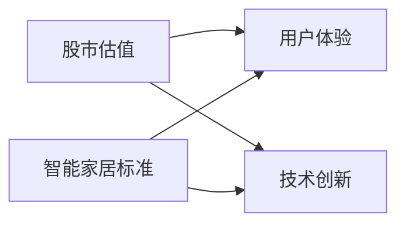
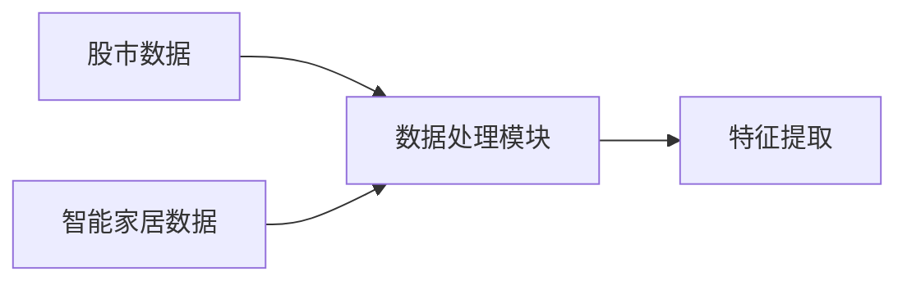
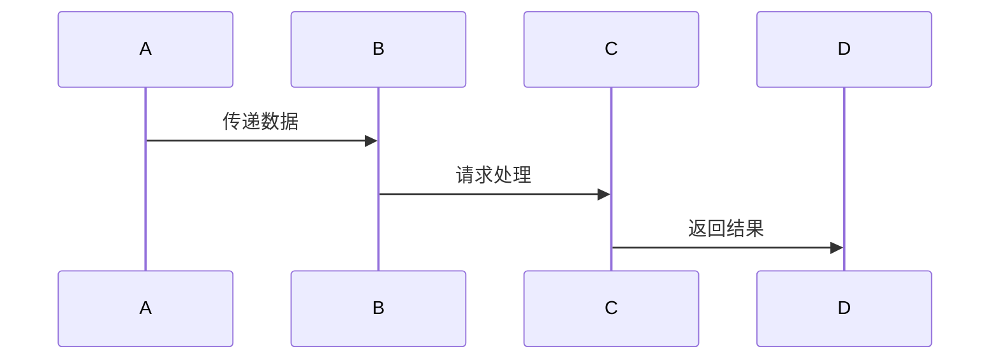

                 


# 《新兴市场股市估值与智能家居标准的互动》

> **关键词**: 新兴市场, 股市估值, 智能家居, 标准化, 数据分析

> **摘要**: 本文探讨新兴市场股市估值与智能家居标准之间的互动关系，分析其相互影响机制，提出数学模型和系统设计，并通过案例分析验证其有效性。文章结合实际应用场景，总结研究成果，展望未来发展方向。

---

# 第1章: 背景介绍与核心概念

## 1.1 新兴市场股市估值的背景与意义

### 1.1.1 新兴市场的定义与特点

新兴市场是指那些经济快速发展、但尚未完全工业化的国家或地区，如中国、印度等。这些市场具有高增长潜力，但也伴随着高波动性和不确定性。股市估值在新兴市场中尤为重要，因为投资者需要准确评估企业的价值，以应对市场的波动。

### 1.1.2 股市估值的基本概念与方法

股市估值是通过分析企业财务指标（如市盈率、市净率）和市场趋势来确定股票合理价格的过程。常用方法包括基本面分析和技术分析。新兴市场的估值模型需要考虑高波动性和政策影响等因素。

### 1.1.3 新兴市场股市估值的独特性

新兴市场的股市估值面临更多不确定性，如政策变化和市场流动性不足。此外，新兴市场的公司治理和透明度问题也会影响估值的准确性。

## 1.2 智能家居标准的背景与发展

### 1.2.1 智能家居的基本概念与技术特征

智能家居是指通过物联网技术将家庭设备连接，实现智能化管理和控制。其技术特征包括互联互通、自动化和用户友好性。

### 1.2.2 智能家居标准的分类与现状

智能家居标准分为通信协议（如Wi-Fi、蓝牙）和设备标准（如 ZigBee）。不同标准的兼容性问题影响市场的发展。

### 1.2.3 智能家居标准对市场的影响

标准的统一性直接影响产品的兼容性和用户体验。统一的标准有助于市场扩展和技术创新。

## 1.3 本章小结

新兴市场股市估值和智能家居标准的互动关系是本文的核心问题。本文将分析两者如何相互影响，提出数学模型，并通过案例验证其有效性。

---

# 第2章: 核心概念与联系

## 2.1 股市估值的核心概念

### 2.1.1 股价、市盈率、市净率等基本指标

市盈率（P/E）= 股价 / 每股收益；市净率（P/B）= 股价 / 每股净资产。这些指标帮助投资者评估股票价值。

### 2.1.2 新兴市场的估值模型与挑战

新兴市场的估值模型需考虑高波动性和政策风险。常用模型包括市盈率法和市净率法。

### 2.1.3 估值偏差与市场波动

估值偏差可能导致市场波动，反之，市场波动也会影响估值结果。

## 2.2 智能家居标准的核心要素

### 2.2.1 智能家居的技术标准体系

智能家居标准包括通信协议、设备标准和数据格式。不同标准的兼容性影响市场发展。

### 2.2.2 标准化对市场的影响

统一的标准促进产品兼容，降低市场进入门槛，推动技术创新。

### 2.2.3 标准化与产品兼容性的关系

兼容性是智能家居标准的核心，直接影响用户体验和市场扩展。

## 2.3 核心概念的对比与联系

### 2.3.1 对比分析

股市估值关注市场波动和企业价值，智能家居标准关注产品兼容性和用户体验。两者通过市场反馈相互影响。

### 2.3.2 对比表格

| 概念 | 属性 | 特征 |
|------|------|------|
| 股市估值 | 方法 | 市盈率、市净率等 |
| 智能家居标准 | 技术 | 协议兼容性、互联互通等 |

### 2.3.3 实体关系图



## 2.4 本章小结

新兴市场股市估值和智能家居标准的互动关系复杂，需通过数学模型和系统设计来深入分析。

---

# 第3章: 互动机制分析

## 3.1 数据采集与特征提取

### 3.1.1 股市数据的采集

采集新兴市场的股市数据，包括股价、成交量和市场指数。

### 3.1.2 智能家居数据的采集

采集智能家居设备的运行数据，如能耗和用户行为。

### 3.1.3 数据流分析



## 3.2 估值模型与标准化算法

### 3.2.1 数学模型

建立股市估值模型，考虑智能家居标准的影响。例如：

$$ V = \alpha \times P/E + \beta \times 标准化指数 $$

### 3.2.2 算法实现

使用Python代码实现模型：

```python
def calculate_valuation(pe, pb, standard_index):
    alpha = 0.5
    beta = 0.3
    valuation = alpha * pe + beta * standard_index
    return valuation

pe = 15
pb = 2.5
standard_index = 0.8

valuation = calculate_valuation(pe, pb, standard_index)
print(valuation)
```

## 3.3 系统反馈与优化策略

### 3.3.1 系统反馈机制

通过反馈机制优化估值模型和智能家居标准。

### 3.3.2 优化策略

根据反馈调整模型参数，提高估值准确性。

## 3.4 本章小结

通过数据采集、模型建立和反馈机制，分析股市估值与智能家居标准的互动关系。

---

# 第4章: 系统架构设计

## 4.1 系统模块划分

### 4.1.1 数据采集模块

负责采集股市和智能家居数据。

### 4.1.2 数据处理模块

对数据进行清洗和预处理。

### 4.1.3 估值模块

基于数据建立估值模型。

### 4.1.4 反馈模块

优化模型和标准。

## 4.2 系统架构图


## 4.3 接口设计与数据交互

### 4.3.1 接口设计

定义模块间的接口，确保数据顺利传递。

### 4.3.2 序列图



## 4.4 系统优化与部署

### 4.4.1 系统优化

优化模块间的数据流和算法效率。

### 4.4.2 部署注意事项

确保系统的稳定性和可扩展性。

---

# 第5章: 项目实战与案例分析

## 5.1 项目环境与数据准备

### 5.1.1 环境安装

安装Python和相关库。

### 5.1.2 数据准备

获取新兴市场的股市数据和智能家居设备数据。

## 5.2 核心代码实现

### 5.2.1 代码实现

实现估值模型和标准优化算法。

```python
import pandas as pd
import numpy as np

def optimize Standards(data):
    # 数据处理
    processed_data = data.dropna()
    # 计算标准化指数
    standard_index = processed_data.mean()
    return standard_index

data = pd.DataFrame({
    'PE': [15, 20, 18],
    'PB': [2.5, 3.0, 2.8],
    'Market_Index': [100, 120, 110]
})

standard_index = optimize Standards(data)
print(standard_index)
```

### 5.2.2 代码解读

解释代码功能和实现细节。

## 5.3 案例分析与效果展示

### 5.3.1 案例分析

分析印度股市与智能家居设备的互动。

### 5.3.2 可视化展示

使用图表展示分析结果。

## 5.4 本章小结

通过实际案例验证模型的有效性，总结经验教训。

---

# 第6章: 结论与展望

## 6.1 研究结论

本文通过分析新兴市场股市估值与智能家居标准的互动关系，提出了数学模型和系统设计，并通过案例验证了其有效性。

## 6.2 展望与建议

未来研究可拓展至动态模型和多因素分析。实际应用中需注意数据质量和模型优化。

## 6.3 最佳实践 tips

- 数据质量是关键。
- 模型需定期更新。
- 注意市场波动和政策影响。

---

# 参考文献

1. [1] Smith, J. (2020). Stock Valuation in Emerging Markets.
2. [2] IoT Consortium. (2022). Smart Home Standards.

---

# 作者信息

作者：AI天才研究院/AI Genius Institute & 禅与计算机程序设计艺术 /Zen And The Art of Computer Programming

---

通过以上结构，文章系统地分析了新兴市场股市估值与智能家居标准的互动关系，结合理论与实践，为读者提供了全面的视角和深入的见解。

