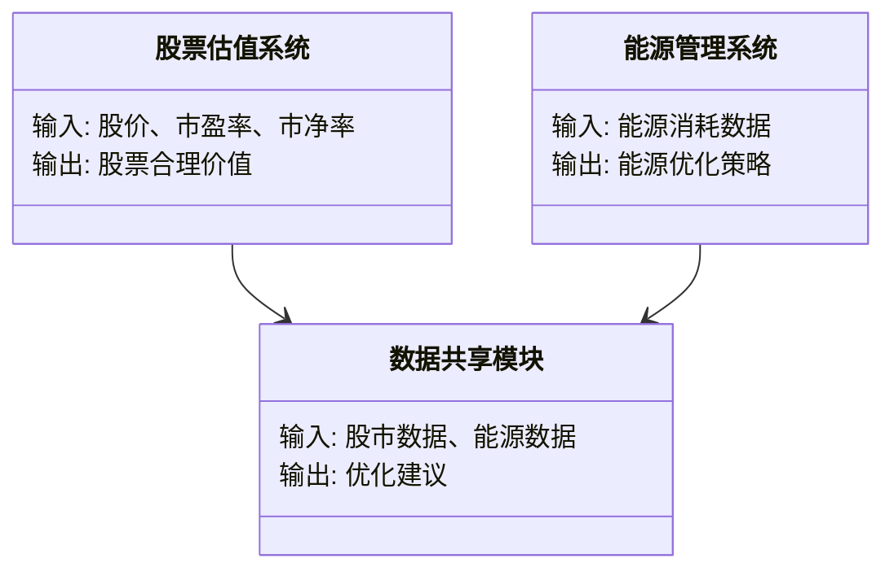
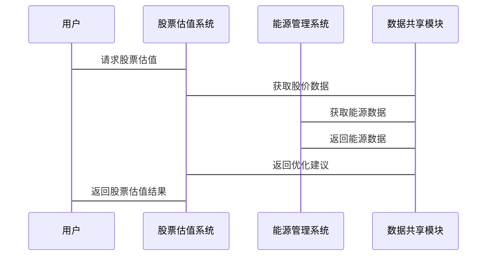

                 


# 新兴市场股市估值与智能家居能源管理系统的互动

---

## 关键词
新兴市场, 股市估值, 智能家居, 能源管理系统, 互动关系

---

## 摘要
本文探讨新兴市场股市估值与智能家居能源管理系统的互动关系。通过分析股市估值的核心方法、智能家居能源管理系统的功能架构，揭示两者在数据共享、协同优化方面的互动机制，并结合实际案例，展示如何通过技术手段实现互动优化。文章结合理论与实践，为读者提供全面的视角，帮助理解新兴市场中这两者如何相互影响。

---

# 第1章 新兴市场股市估值概述

## 1.1 股市估值的基本概念
### 1.1.1 股票估值的定义与作用
股票估值是通过对公司基本面、市场环境等因素进行分析，确定股票合理价格的过程。其作用在于帮助投资者做出理性决策，降低投资风险。

### 1.1.2 新兴市场的特点与挑战
新兴市场通常具有高增长潜力，但也伴随着高波动性和政策不确定性。股市估值在新兴市场面临更多挑战，如信息不对称和数据不透明。

### 1.1.3 股市估值的核心指标
常用的估值指标包括市盈率（P/E）、市净率（P/B）、股息率等。

## 1.2 新兴市场股市的特点
### 1.2.1 新兴市场的经济环境
新兴市场通常经济增长快，但政策不稳定，容易受到外部经济波动的影响。

### 1.2.2 新兴市场的股市波动性
新兴市场股市波动较大，投资者需关注宏观经济指标和政策变化。

### 1.2.3 新兴市场的投资者行为
新兴市场的投资者行为受情绪驱动较强，容易出现非理性投资。

## 1.3 股市估值的主要方法
### 1.3.1 市盈率法
通过比较股票的市盈率与行业平均水平，判断其估值是否合理。

### 1.3.2 市净率法
市净率=股价/每股净资产，适用于净资产驱动的行业。

### 1.3.3 现金流折现法
通过预测未来现金流，折现至当前价值，确定股票的合理价格。

## 1.4 新兴市场股市估值的特殊性
### 1.4.1 政治经济风险
新兴市场容易受到政策变化和经济波动的影响。

### 1.4.2 市场流动性问题
新兴市场流动性较低，容易导致股价波动。

### 1.4.3 信息不对称问题
信息透明度较低，投资者难以获取准确的公司信息。

## 1.5 本章小结
本章介绍了新兴市场股市估值的基本概念、特点和主要方法，强调了其特殊性。

---

# 第2章 智能家居能源管理系统概述

## 2.1 智能家居的基本概念
### 2.1.1 智能家居的定义
智能家居是指通过物联网技术，实现家居设备的智能化管理和自动化控制。

### 2.1.2 智能家居的核心技术
包括物联网、大数据、人工智能等技术。

### 2.1.3 智能家居的发展趋势
智能家居正朝着集成化、智能化和可持续化的方向发展。

## 2.2 能源管理系统的功能
### 2.2.1 能源消耗监测
通过传感器和数据采集技术，实时监测能源消耗情况。

### 2.2.2 能源使用优化
通过数据分析，优化能源使用效率，降低能源浪费。

### 2.2.3 能源成本计算
根据能源消耗数据和市场价格，计算能源成本。

## 2.3 智能家居能源管理系统的架构
### 2.3.1 系统组成模块
包括数据采集模块、数据处理模块、用户界面模块等。

### 2.3.2 系统数据流
数据从传感器采集到云端，经过处理后反馈给用户。

### 2.3.3 系统功能实现
通过算法优化能源使用，降低能源消耗成本。

## 2.4 智能家居能源管理系统的应用价值
### 2.4.1 节能减排
通过优化能源使用，减少碳排放。

### 2.4.2 提高能源利用效率
通过智能化管理，提升能源使用效率。

### 2.4.3 降低用户能源成本
通过优化能源使用，降低用户的能源支出。

## 2.5 本章小结
本章介绍了智能家居能源管理系统的功能、架构和应用价值。

---

# 第3章 股市估值与智能家居能源管理系统的互动关系

## 3.1 互动关系的背景分析
### 3.1.1 新兴市场股市波动对智能家居的影响
股市波动会影响智能家居企业的融资和投资。

### 3.1.2 智能家居能源消耗对股市的影响
能源消耗数据可以反映企业的运营效率，影响股市估值。

### 3.1.3 互动关系的经济意义
通过互动优化，可以实现能源和资本的高效配置。

## 3.2 数据流与信息共享
### 3.2.1 股市数据对能源管理的启示
股市数据可以帮助能源管理系统预测能源需求。

### 3.2.2 能源数据对股市估值的影响
能源数据可以为股市估值提供新的参考维度。

### 3.2.3 数据共享的实现机制
通过物联网和大数据技术实现数据共享。

## 3.3 互动关系的协同优化
### 3.3.1 股市估值优化的能源视角
通过能源数据优化股市估值模型。

### 3.3.2 能源管理的股市驱动因素
股市波动可以为能源管理系统提供优化动力。

### 3.3.3 互动关系的系统架构
通过数据共享和协同优化，实现股市估值与能源管理的互动。

## 3.4 本章小结
本章分析了股市估值与智能家居能源管理系统的互动关系及其优化机制。

---

# 第4章 系统分析与架构设计

## 4.1 问题场景介绍
### 4.1.1 股市波动对智能家居的影响
### 4.1.2 能源消耗对股市的影响

## 4.2 系统功能设计
### 4.2.1 领域模型（Mermaid类图）


## 4.3 系统架构设计（Mermaid架构图）


## 4.4 系统接口设计
### 4.4.1 股票估值系统接口
接口1：获取股价数据
接口2：计算股票估值

### 4.4.2 能源管理系统接口
接口1：获取能源消耗数据
接口2：计算能源优化策略

## 4.5 系统交互设计（Mermaid序列图）


---

# 第5章 项目实战

## 5.1 环境安装
### 5.1.1 安装Python和相关库
```bash
pip install numpy pandas matplotlib
```

## 5.2 系统核心实现源代码
### 5.2.1 股票估值算法（Python代码）
```python
import numpy as np
import pandas as pd

def calculate_valuation(price, eps, pe_ratio):
    return price * pe_ratio / eps

data = pd.read_csv('stock_data.csv')
data['Valuation'] = calculate_valuation(data['Price'], data['EPS'], data['PE'])
```

### 5.2.2 能源管理系统优化算法（Python代码）
```python
import numpy as np

def optimize_energy_usage(consumption, price):
    return np.min(consumption * price)

energy_consumption = np.array([100, 80, 90])
energy_price = np.array([0.5, 0.6, 0.5])
optimized_usage = optimize_energy_usage(energy_consumption, energy_price)
```

## 5.3 案例分析
### 5.3.1 股票估值案例
以新兴市场某股票为例，计算其合理估值。

### 5.3.2 能源管理案例
以智能家居能源管理系统为例，展示如何优化能源使用。

## 5.4 项目总结
通过项目实战，验证了股市估值与智能家居能源管理系统互动的可行性。

---

# 第6章 最佳实践与小结

## 6.1 最佳实践
### 6.1.1 数据共享的注意事项
确保数据安全和隐私保护。

### 6.1.2 系统优化的建议
结合具体场景，灵活调整优化策略。

## 6.2 小结
本文通过理论分析和实践案例，探讨了新兴市场股市估值与智能家居能源管理系统的互动关系，为读者提供了全面的视角。

---

# 作者：AI天才研究院 & 禅与计算机程序设计艺术

