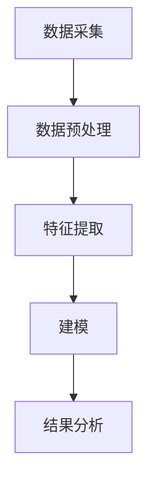
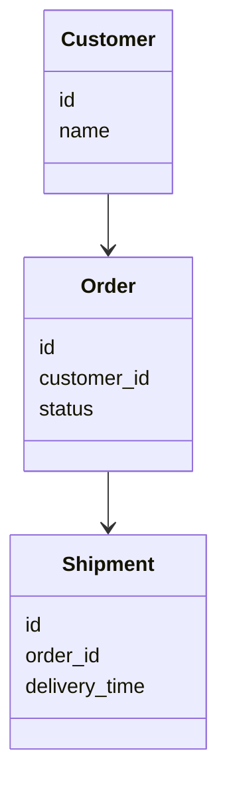
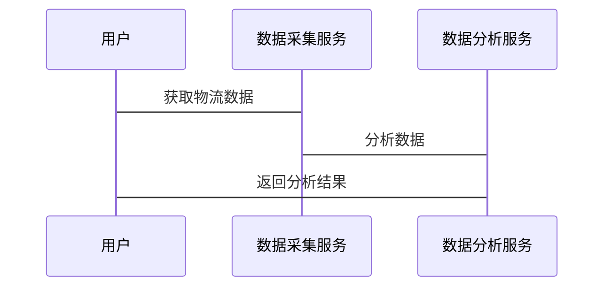

                 


# 新兴市场股市估值与智能物流last-mile配送的互动

## 关键词：新兴市场、股市估值、智能物流、last-mile配送、数据驱动、互动机制

## 摘要：本文探讨了新兴市场股市估值与智能物流last-mile配送之间的互动关系。通过分析股市估值的核心原理、智能物流配送的算法与架构，结合实际案例，展示了如何利用数据驱动的方法优化两者互动，实现高效资源配置。

---

## 第一部分: 背景介绍

### 第1章: 背景与问题描述

#### 1.1 问题背景
##### 1.1.1 新兴市场股市的特点
新兴市场的股市通常具有波动性大、增长快的特点。投资者关注企业的盈利能力和市场扩展能力。

##### 1.1.2 智能物流last-mile配送的现状
智能物流通过大数据和AI优化配送路径，降低成本，提升效率。新兴市场的需求增长推动了最后一公里配送的发展。

#### 1.2 问题描述
##### 1.2.1 股市估值与物流配送的关联性
股市估值反映企业的市场价值，而物流配送能力影响企业的运营效率和成本，进而影响股票价值。

##### 1.2.2 互动机制的复杂性
物流效率影响企业成本和利润，反过来，股市估值的变化会影响企业的资金投入，从而影响物流配送能力。

#### 1.3 问题解决
##### 1.3.1 数据驱动的解决方案
利用大数据分析和机器学习模型，预测物流效率对股市估值的影响。

##### 1.3.2 技术与业务的结合
通过技术手段优化物流配送，提升企业效率，进而优化股市估值。

#### 1.4 边界与外延
##### 1.4.1 问题的边界
专注于新兴市场，考虑市场波动、政策变化等因素。

##### 1.4.2 相关领域的外延
涉及金融分析、物流管理、数据科学等多个领域。

#### 1.5 概念结构与核心要素
##### 1.5.1 核心概念的组成
- 股市估值：市盈率、市净率、收益能力。
- 物流配送：配送效率、成本、技术应用。

##### 1.5.2 核心要素的对比分析
通过对比分析，理解两者如何相互影响。

---

## 第二部分: 核心概念与联系

### 第2章: 核心概念分析

#### 2.1 股市估值的核心原理
##### 2.1.1 市盈率、市净率等指标的计算
市盈率=股价/每股收益；市净率=股价/每股净资产。

##### 2.1.2 影响股市估值的关键因素
盈利能力、成长潜力、行业地位、宏观经济环境。

#### 2.2 智能物流last-mile配送的原理
##### 2.2.1 最后一公里配送的挑战
需求分散、路径优化、成本控制。

##### 2.2.2 智能算法在配送中的应用
路径优化算法、实时调度系统。

#### 2.3 核心概念对比分析
##### 2.3.1 股市估值与物流配送的对比表格
| 比较维度 | 股市估值 | 物流配送 |
|----------|----------|----------|
| 影响因素 | 利润、行业 | 效率、成本 |
| 数据类型 | 财务数据 | 运输数据 |

##### 2.3.2 ER实体关系图
```mermaid
erDiagram
    customer[CUSTOMER] o-|{orders} order[ORDER]
    order o-|{items} item[ITEM]
    customer o-|{shipments} shipment[SHIPMENT]
    shipment o-|{carrier} carrier[CARRIER]
```

---

## 第三部分: 算法原理与数学模型

### 第3章: 算法原理讲解

#### 3.1 数据驱动的互动分析
##### 3.1.1 数据采集与预处理
收集物流数据（配送时间、成本）和股市数据（股价、市盈率），进行清洗和特征提取。

##### 3.1.2 互动关系的建模
建立回归模型，分析物流效率对股价的影响。

#### 3.2 算法流程图


#### 3.3 算法实现代码
```python
import pandas as pd
from sklearn.linear_model import LinearRegression

# 假设data包含物流效率和股价数据
data = pd.DataFrame({
    'logistics_efficiency': [0.8, 0.9, 0.7],
    'stock_price': [100, 110, 90]
})

model = LinearRegression()
model.fit(data[['logistics_efficiency']], data['stock_price'])

# 预测
new_efficiency = 0.85
predicted_price = model.predict([[new_efficiency]])
print(predicted_price)
```

#### 3.4 数学模型
$$ \text{预测股价} = \beta_0 + \beta_1 \times \text{物流效率} + \epsilon $$

---

## 第四部分: 系统分析与架构设计

### 第4章: 系统架构方案

#### 4.1 问题场景介绍
##### 4.1.1 互动分析的场景描述
分析物流效率对股市估值的影响，优化企业资源配置。

##### 4.1.2 系统目标与范围
开发一个实时互动分析系统，优化物流效率和股市估值。

#### 4.2 系统功能设计
##### 4.2.1 领域模型


#### 4.3 系统架构设计
##### 4.3.1 mermaid架构图
```mermaid
container 股市数据系统 {
    service 数据采集服务
    service 数据分析服务
}

container 物流配送系统 {
    service 路径优化服务
    service 实时调度服务
}

股市数据系统 --> 物流配送系统
物流配送系统 --> 股市数据系统
```

#### 4.4 系统接口设计
##### 4.4.1 接口定义与交互流程
API接口：GET /logistics_efficiency?stock=XX

#### 4.5 系统交互设计
##### 4.5.1 mermaid序列图


---

## 第五部分: 项目实战与案例分析

### 第5章: 项目实战

#### 5.1 环境安装与配置
##### 5.1.1 数据库与工具安装
安装Python、Pandas、Scikit-learn、Mermaid工具。

#### 5.2 核心代码实现
##### 5.2.1 互动分析的代码实现
```python
import pandas as pd
from sklearn.linear_model import LinearRegression

data = pd.DataFrame({
    'logistics_efficiency': [0.8, 0.9, 0.7],
    'stock_price': [100, 110, 90]
})

model = LinearRegression()
model.fit(data[['logistics_efficiency']], data['stock_price'])

new_efficiency = 0.85
predicted_price = model.predict([[new_efficiency]])
print(predicted_price)
```

#### 5.3 代码解读与分析
##### 5.3.1 环境配置
安装必要的库：pip install pandas scikit-learn

##### 5.3.2 代码实现
训练模型，输入物流效率，输出预测股价。

#### 5.4 案例分析
##### 5.4.1 案例背景
某新兴市场企业，物流效率提升后，股价上涨。

##### 5.4.2 数据分析
物流效率与股价呈正相关，模型准确预测了股价变化。

##### 5.4.3 结果分析
物流效率的提升显著影响股市估值，企业应优化配送系统。

#### 5.5 项目小结
通过数据驱动的方法，优化物流效率，提升企业估值。

---

## 第六部分: 最佳实践与总结

### 6.1 最佳实践
##### 6.1.1 数据质量的重要性
确保数据的准确性和完整性。

##### 6.1.2 模型的可解释性
选择易于解释的模型，便于业务决策。

##### 6.1.3 系统的可扩展性
设计灵活的架构，适应未来业务发展。

### 6.2 小结
本文详细探讨了新兴市场股市估值与智能物流last-mile配送的互动关系，展示了数据驱动的解决方案和系统架构设计。

### 6.3 注意事项
- 数据隐私和安全问题。
- 模型的实时性和准确性。

### 6.4 拓展阅读
推荐阅读关于数据科学和物流管理的经典书籍。

---

## 作者：AI天才研究院 & 禅与计算机程序设计艺术

