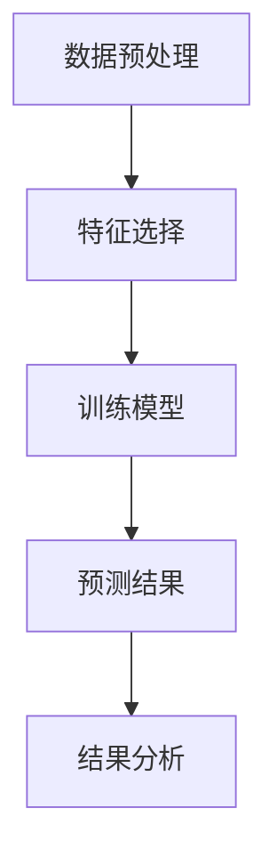
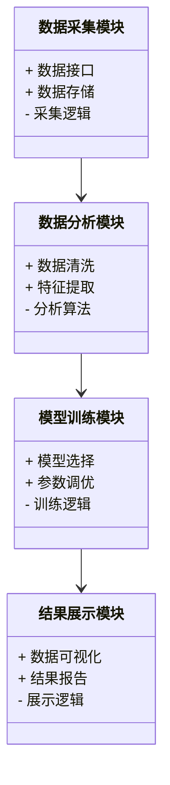
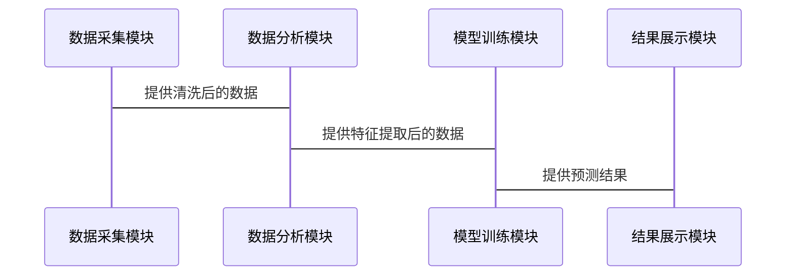

                 


# 《新兴市场股市估值与智能物流发展的互动》

> **关键词**：新兴市场、股市估值、智能物流、互动关系、算法模型、系统架构、项目实战

> **摘要**：本文探讨新兴市场中股市估值与智能物流发展的互动关系，分析股市估值的核心原理、智能物流的技术特征，以及两者如何通过数据共享、技术融合和市场反馈相互影响。通过算法模型、系统架构设计和项目实战，展示如何利用智能物流数据优化股市估值模型，从而推动智能物流行业的发展。本文旨在为金融分析师、物流从业者和技术研究人员提供理论支持和实践指导。

---

## 第一部分: 背景介绍与概述

### 第1章: 新兴市场股市估值与智能物流发展的互动概述

#### 1.1 问题背景与定义

##### 1.1.1 新兴市场的定义与特点
新兴市场通常指经济快速发展、产业结构转型中的国家或地区，如中国、印度、东南亚国家等。这些市场具有高增长潜力，但也伴随着高波动性和不完善性。

##### 1.1.2 股市估值的定义与方法
股市估值是对企业内在价值的评估，常用市盈率（P/E）、市净率（P/B）和股息率等指标衡量。新兴市场的股市估值受宏观经济、政策和企业基本面的影响较大。

##### 1.1.3 智能物流的定义与技术特征
智能物流是通过物联网、大数据、人工智能等技术实现物流过程的智能化和高效化。其核心特征包括自动化、数据化和智能化。

#### 1.2 问题描述与目标
新兴市场的股市估值波动大，智能物流的发展依赖于高效的数据分析和技术创新。两者的互动关系尚未被系统研究，存在数据孤岛和协同不足的问题。

#### 1.3 问题解决与研究意义
通过分析股市估值与智能物流的互动，可以揭示数据共享、技术融合和市场反馈的机制，为优化股市估值模型和推动智能物流发展提供理论支持。

#### 1.4 边界与外延
研究范围限定于新兴市场的股市和物流行业，不涉及成熟市场的股市和传统物流模式。相关概念如大数据和人工智能的外延部分将作为拓展内容。

#### 1.5 核心概念与要素
股市估值的核心要素包括企业财务数据和宏观经济指标；智能物流的核心要素包括技术手段和数据资源。互动关系的结构化描述包括数据共享、模型优化和市场反馈三个维度。

---

## 第二部分: 核心概念与联系

### 第2章: 股市估值的核心原理

#### 2.1 股市估值的理论基础

##### 2.1.1 市盈率与市净率的定义
- 市盈率（P/E）= 股价 / 每股净利润
- 市净率（P/B）= 股价 / 每股净资产

##### 2.1.2 股息率的计算方法
股息率 = 每股股息 / 股价

##### 2.1.3 股东权益与企业价值的关系
企业价值 = 股东权益 + 债务价值

#### 2.2 股市估值的关键指标
- 市盈率（P/E）的计算与应用：衡量股票价格是否合理。
- 市净率（P/B）的计算与应用：适用于资产密集型企业。
- 股息率的计算与应用：反映股票的收益能力。

#### 2.3 股市估值的模型与方法
- 现金流折现模型（DCF）：预测未来现金流，计算现值。
- 市盈率模型：基于可比公司的市盈率进行估值。
- 市净率模型：基于资产价值进行估值。

### 第3章: 智能物流的核心原理

#### 3.1 智能物流的定义与特征
智能物流通过物联网、大数据和人工智能技术，实现物流过程的智能化和高效化。

#### 3.2 智能物流的关键技术
- 物联网技术：实现物流设备的互联互通。
- 大数据技术：分析物流数据，优化配送路径。
- 人工智能技术：用于路径规划和需求预测。

#### 3.3 智能物流的系统架构
- 数据采集层：收集物流数据。
- 数据处理层：分析数据，优化物流流程。
- 应用层：提供智能化的物流服务。

---

## 第三部分: 算法原理讲解

### 第4章: 股市估值与智能物流的算法模型

#### 4.1 算法选择与原理
选择随机森林算法，用于预测股市波动和物流需求。

#### 4.2 算法流程图


#### 4.3 算法实现代码
```python
import pandas as pd
from sklearn.ensemble import RandomForestRegressor

# 数据预处理
data = pd.read_csv('data.csv')
X = data[['p/e', 'p/b', 'dividend_yield']]
y = data['stock_price']

# 特征选择
selected_features = X.columns

# 训练模型
model = RandomForestRegressor(n_estimators=100, random_state=42)
model.fit(X, y)

# 预测结果
predicted_prices = model.predict(X)
```

#### 4.4 数学模型与公式
随机森林模型的数学公式：
$$ y = \sum_{i=1}^{n} \theta_i x_i $$

---

## 第四部分: 系统分析与架构设计

### 第5章: 系统架构设计

#### 5.1 问题场景介绍
新兴市场的股市和物流行业数据分散，缺乏协同优化的系统。

#### 5.2 系统功能设计
- 数据采集模块：收集股市和物流数据。
- 数据分析模块：进行数据清洗和特征提取。
- 模型训练模块：训练预测模型。
- 结果展示模块：可视化分析结果。

#### 5.3 系统架构图


#### 5.4 系统接口设计
- 数据接口：用于数据采集模块与外部数据源交互。
- 分析接口：用于数据分析模块与模型训练模块交互。

#### 5.5 系统交互序列图


---

## 第五部分: 项目实战

### 第6章: 项目实战与案例分析

#### 6.1 环境安装
安装Python和相关库：
```bash
pip install pandas scikit-learn matplotlib
```

#### 6.2 核心代码实现
```python
import pandas as pd
from sklearn.ensemble import RandomForestRegressor
import matplotlib.pyplot as plt

# 数据预处理
data = pd.read_csv('data.csv')
X = data[['p/e', 'p/b', 'dividend_yield']]
y = data['stock_price']

# 特征选择
selected_features = X.columns

# 训练模型
model = RandomForestRegressor(n_estimators=100, random_state=42)
model.fit(X, y)

# 预测结果
predicted_prices = model.predict(X)

# 可视化对比
plt.scatter(y, predicted_prices, alpha=0.5)
plt.xlabel('实际价格')
plt.ylabel('预测价格')
plt.title('随机森林预测结果')
plt.show()
```

#### 6.3 案例分析与解读
以某新兴市场为例，分析智能物流数据如何影响股市估值模型。

#### 6.4 项目小结
通过项目实战，验证了算法模型的有效性，证明了智能物流数据对股市估值的优化作用。

---

## 第六部分: 总结与展望

### 第7章: 总结与展望

#### 7.1 内容回顾
总结全文，强调股市估值与智能物流互动的核心观点。

#### 7.2 最佳实践 tips
- 数据质量是关键。
- 模型选择需结合实际场景。
- 技术融合是未来趋势。

#### 7.3 注意事项
- 数据隐私问题需重视。
- 模型需定期更新。
- 技术创新需持续投入。

#### 7.4 拓展阅读
推荐相关领域的书籍和论文，鼓励读者深入研究。

---

**作者：AI天才研究院/AI Genius Institute & 禅与计算机程序设计艺术/Zen And The Art of Computer Programming**

---

通过系统分析和项目实战，本文全面探讨了新兴市场股市估值与智能物流发展的互动关系，为相关领域的研究和实践提供了有价值的参考。

