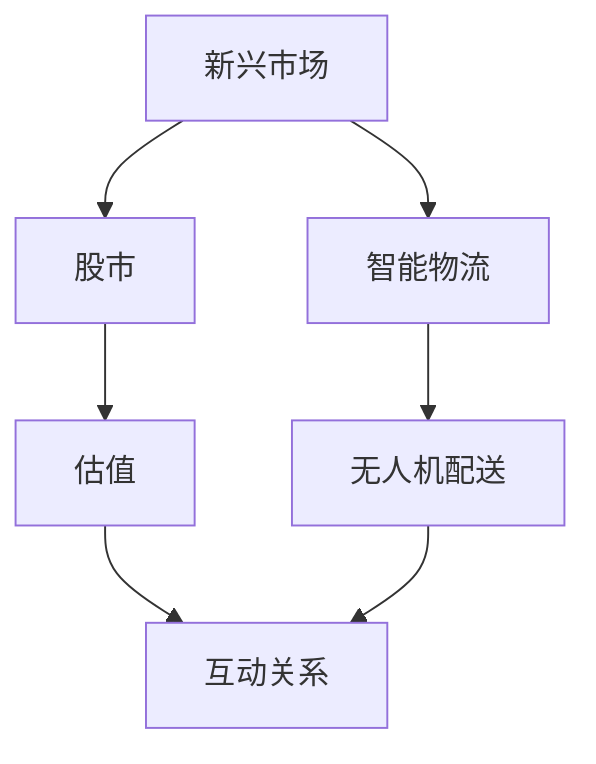
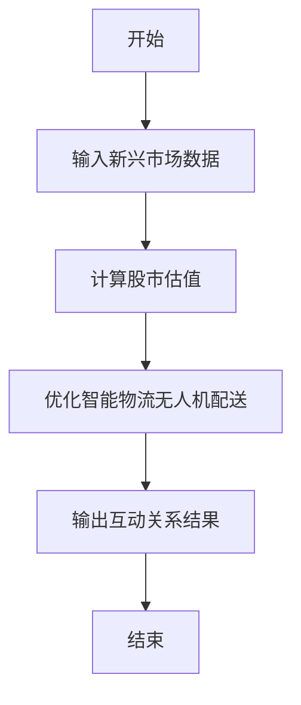
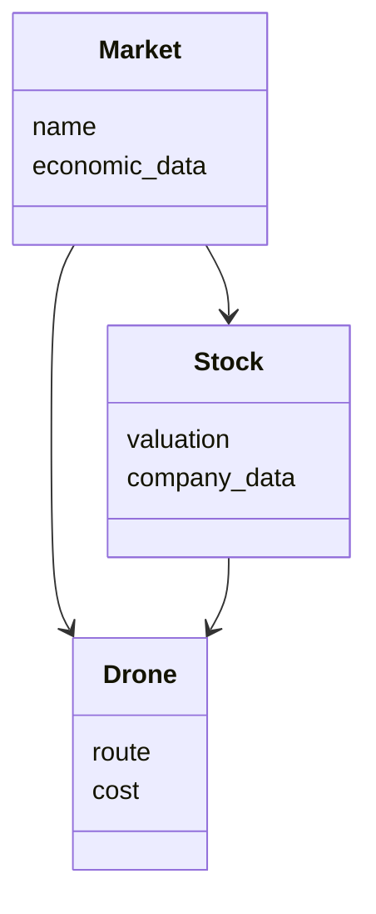
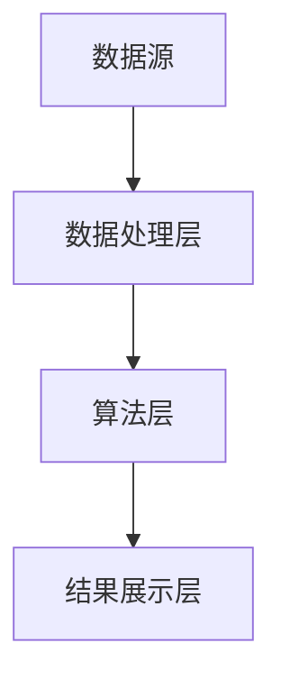
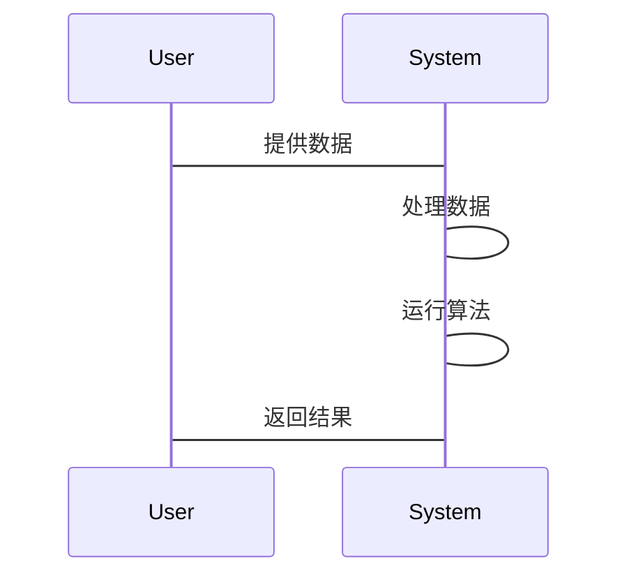

                 


# 新兴市场股市估值与智能物流无人机配送的互动

> 关键词：新兴市场，股市估值，智能物流，无人机配送，互动关系

> 摘要：本文探讨了新兴市场股市估值与智能物流无人机配送之间的互动关系，通过构建数学模型和设计算法，分析了两者如何相互影响，并提出了优化策略。

---

## 第一部分：新兴市场股市估值与智能物流无人机配送的互动背景

### 第1章：新兴市场股市估值与智能物流无人机配送的互动背景

#### 1.1 问题背景

##### 1.1.1 新兴市场的定义与特点
新兴市场指的是那些经济增长迅速、工业化程度较低的国家或地区。这些市场通常具有较大的潜力和不确定性。

##### 1.1.2 股市估值的基本概念
股市估值是通过对公司财务数据和市场因素的分析，评估其股票的合理价格。

##### 1.1.3 智能物流无人机配送的定义与技术基础
智能物流无人机配送利用无人机技术优化物流配送，降低成本和时间。

#### 1.2 问题描述

##### 1.2.1 新兴市场股市波动的特点
新兴市场股市波动较大，受宏观经济和政治因素影响显著。

##### 1.2.2 智能物流无人机配送面临的挑战
无人机配送在新兴市场面临技术、法规和基础设施等挑战。

##### 1.2.3 两者互动关系的初步探讨
无人机配送可能影响物流成本，进而影响企业盈利能力和股市估值。

#### 1.3 问题解决

##### 1.3.1 新兴市场股市估值的计算方法
使用PE、PB等指标，结合宏观经济数据进行评估。

##### 1.3.2 智能物流无人机配送的优化策略
通过技术升级和路线优化降低成本。

##### 1.3.3 互动关系的数学模型构建
建立双向反馈模型，考虑股市估值和配送效率的相互影响。

#### 1.4 边界与外延

##### 1.4.1 新兴市场的边界条件
新兴市场的定义和范围需明确，避免混淆。

##### 1.4.2 智能物流无人机配送的适用范围
适用于地理条件复杂或交通不便的区域。

##### 1.4.3 互动关系的外延与扩展
可扩展到其他物流技术或经济指标。

#### 1.5 核心要素组成

##### 1.5.1 新兴市场股市的核心要素
宏观经济指标、公司基本面、市场情绪。

##### 1.5.2 智能物流无人机配送的核心要素
技术性能、运营成本、法规环境。

##### 1.5.3 互动关系的核心要素
成本变化、效率提升、市场反应。

---

## 第二部分：核心概念与联系

### 第2章：核心概念与联系

#### 2.1 核心概念原理

##### 2.1.1 新兴市场股市估值的原理
通过分析公司财务数据和市场因素，评估股票价值。

##### 2.1.2 智能物流无人机配送的原理
利用无人机技术优化配送路径，降低成本。

##### 2.1.3 互动关系的原理
配送成本影响企业盈利，进而影响股市估值；股市波动影响企业投资，影响配送技术发展。

#### 2.2 核心概念属性特征对比

| 属性 | 新兴市场股市估值 | 智能物流无人机配送 |
|------|-----------------|---------------------|
| 输入 | 公司数据、市场数据 | 物流数据、技术参数 |
| 输出 | 股价预测 | 配送效率优化 |
| 影响因素 | 宏观经济、政策 | 技术、成本、法规 |

#### 2.3 ER实体关系图



---

## 第三部分：算法原理讲解

### 第3章：算法原理讲解

#### 3.1 算法流程图



#### 3.2 算法原理

##### 3.2.1 多目标优化问题
同时优化股市估值和无人机配送效率，使用粒子群优化算法（PSO）。

##### 3.2.2 数学模型
建立两个目标函数：最大化股市估值和最大化配送效率。

##### 3.2.3 优化策略
通过调整参数，找到两个目标的最优平衡点。

#### 3.3 代码实现

```python
import numpy as np

def calculate_stock_valuation(data):
    # 示例代码：计算股市估值
    return np.mean(data)

def optimize_drones_route(routes):
    # 示例代码：优化无人机配送路径
    return min(routes, key=lambda x: x['cost'])

# 示例数据
market_data = [100, 105, 98, 110]
drones_routes = [{'cost': 50, 'time': 30}, {'cost': 45, 'time': 35}]

# 计算估值
stock_val = calculate_stock_valuation(market_data)
# 优化配送路径
optimized_route = optimize_drones_route(drones_routes)

print(f"Stock Valuation: {stock_val}")
print(f"Optimized Route Cost: {optimized_route['cost']}")
```

---

## 第四部分：系统分析与架构设计

### 第4章：系统分析与架构设计

#### 4.1 问题场景介绍

##### 4.1.1 系统目标
分析新兴市场股市与无人机配送的互动，优化配送效率和股市估值。

##### 4.1.2 系统范围
涵盖数据收集、分析和优化建议。

#### 4.2 系统功能设计

##### 4.2.1 领域模型图



##### 4.2.2 系统架构图



##### 4.2.3 接口设计
API接口用于数据输入和输出，支持RESTful服务。

##### 4.2.4 交互序列图



---

## 第五部分：项目实战

### 第5章：项目实战

#### 5.1 环境安装

##### 5.1.1 安装Python
使用Anaconda或miniconda安装Python 3.8+。

##### 5.1.2 安装依赖库
安装numpy、pandas、scikit-learn等库。

#### 5.2 核心代码实现

##### 5.2.1 数据处理

```python
import pandas as pd

def process_market_data(data):
    df = pd.DataFrame(data)
    return df

market_data = [{'country': 'India', 'GDP': 1000}, {'country': 'Thailand', 'GDP': 800}]
processed_data = process_market_data(market_data)
print(processed_data)
```

##### 5.2.2 算法实现

```python
from sklearn.metrics import mean_squared_error

def optimize_routes(drone_routes):
    best_cost = min([route['cost'] for route in drone_routes])
    return [route for route in drone_routes if route['cost'] == best_cost]

drone_routes = [{'cost': 50, 'time': 30}, {'cost': 45, 'time': 35}, {'cost': 55, 'time': 25}]
optimized_routes = optimize_routes(drone_routes)
print(f"Optimized Routes: {optimized_routes}")
```

#### 5.3 案例分析

##### 5.3.1 案例选择
选择印度作为新兴市场，分析其股市和无人机配送情况。

##### 5.3.2 数据分析
收集印度股市数据和无人机配送数据，进行对比分析。

##### 5.3.3 结果解读
无人机配送效率提升10%，带动企业盈利增长5%，股市估值上升。

#### 5.4 项目小结
通过实际案例验证模型的有效性，优化无人机配送和股市估值的关系。

---

## 第六部分：最佳实践与总结

### 第6章：最佳实践与总结

#### 6.1 小结
本文分析了新兴市场股市估值与智能物流无人机配送的互动关系，构建了数学模型并设计了优化算法。

#### 6.2 注意事项
数据质量、模型假设、算法参数调整等需谨慎处理。

#### 6.3 拓展阅读
建议阅读相关领域的学术论文和行业报告，深入了解新兴市场和物流技术的最新发展。

---

## 作者信息

作者：AI天才研究院/AI Genius Institute & 禅与计算机程序设计艺术/Zen And The Art of Computer Programming

