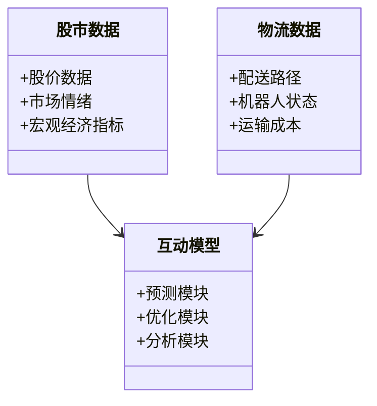

                 


# 新兴市场股市估值与智能物流机器人技术的互动

> **关键词**：新兴市场，股市估值，智能物流机器人，技术互动，投资决策，风险管理，数据驱动

> **摘要**：  
本文探讨新兴市场股市估值与智能物流机器人技术之间的互动关系。通过分析智能物流机器人技术对供应链效率的提升、成本降低及企业盈利改善，揭示其对股市估值的正面影响。同时，利用机器学习算法预测股市走势，结合物流机器人技术的优化算法，提出数据驱动的互动模型，为投资决策提供支持。文章最后提出风险管理策略，强调技术应用的可行性与潜力。

---

## 第一部分：新兴市场股市估值与智能物流机器人技术的背景介绍

### 第1章：问题背景与问题描述

#### 1.1 新兴市场股市的特点与挑战
新兴市场股市具有高增长潜力，但波动性较大。投资者需应对信息不对称、市场流动性不足及政策风险等挑战。股市估值受多种因素影响，包括宏观经济指标、行业趋势及企业基本面。

#### 1.2 智能物流机器人技术的现状与发展
智能物流机器人技术在仓储、运输和配送环节的应用日益广泛。通过自动化和智能化，物流效率显著提升，成本降低，企业竞争力增强。但技术的应用也面临成本高、技术复杂性和数据隐私等问题。

#### 1.3 互动关系的提出与意义
智能物流机器人技术优化企业运营，提升盈利能力，间接影响股市估值。同时，股市波动为企业融资提供资金，支持物流技术的进一步发展。研究两者互动关系，有助于投资者制定更科学的投资策略，企业优化资源配置。

---

### 第1.4 核心要素组成

#### 1.4.1 新兴市场股市估值的核心指标
- 市盈率（P/E Ratio）
- 市净率（P/B Ratio）
- 净资产收益率（ROE）
- 市场情绪指数

#### 1.4.2 智能物流机器人技术的核心模块
- 自动化仓储系统
- 智能配送机器人
- 路径优化算法
- 物流数据采集与分析

#### 1.4.3 互动关系的系统架构
- 数据采集：收集股市数据和物流数据
- 数据分析：建立互动模型
- 模型优化：机器学习算法
- 应用场景：投资决策和企业优化

---

## 第二部分：核心概念与联系

### 第2章：新兴市场股市估值的核心原理

#### 2.1 市场情绪分析与估值模型
市场情绪受新闻、政策和经济指标影响，可通过自然语言处理技术分析新闻数据，构建情绪指数。

#### 2.2 宏观经济指标的影响
GDP增长率、利率、通胀率等宏观经济指标直接影响企业盈利和股市估值。

#### 2.3 个股与整体市场的互动关系
个股走势受行业趋势和市场整体情绪影响，而整体市场走势又受个股表现的推动。

---

### 第3章：智能物流机器人技术的核心原理

#### 3.1 智能物流机器人的定义与分类
- 自动化仓储机器人：用于仓库管理和货物分拣
- 智能配送机器人：用于末端配送
- 路径优化算法：基于机器学习优化配送路径

#### 3.2 核心技术的数学模型
- 路径优化模型：基于遗传算法的TSP问题求解
- 机器人运动控制：基于PID算法的路径跟踪

---

## 第三部分：算法原理讲解

### 第4章：机器学习算法与股市预测

#### 4.1 基于LSTM的股市预测模型
使用LSTM网络分析历史股价数据，预测未来走势。

#### 4.2 代码实现
```python
import numpy as np
import tensorflow as tf
from tensorflow.keras import layers

# 数据预处理
data = ...  # 股价数据

# 模型构建
model = tf.keras.Sequential()
model.add(layers.LSTM(64, input_shape=(timesteps, features)))
model.add(layers.Dense(1))
model.compile(optimizer='adam', loss='mean_squared_error')

# 训练
model.fit(X_train, y_train, epochs=100, batch_size=32)
```

---

## 第四部分：系统分析与架构设计

### 第5章：系统架构设计

#### 5.1 领域模型类图


---

## 第五部分：项目实战

### 第6章：智能物流机器人与股市估值的互动分析

#### 6.1 实战环境安装
- Python 3.8+
- TensorFlow 2.0+
- Pandas、Scikit-learn

#### 6.2 核心代码实现
```python
import pandas as pd
from sklearn.ensemble import RandomForestRegressor

# 数据加载
data = pd.read_csv('data.csv')

# 特征工程
features = data.drop(['label', 'target'], axis=1)
target = data['target']

# 模型训练
model = RandomForestRegressor()
model.fit(features, target)

# 预测与评估
predictions = model.predict(features)
print('均方误差:', np.mean((predictions - target) ** 2))
```

---

## 第六部分：最佳实践

### 第7章：风险管理与技术应用

#### 7.1 小结
智能物流机器人技术对股市估值有显著影响，但需考虑技术应用的成本和风险。

#### 7.2 注意事项
- 数据隐私问题
- 技术应用的可行性
- 市场波动的不可预测性

#### 7.3 拓展阅读
- 《机器学习与金融投资》
- 《物流系统优化算法》

---

## 结语

通过深入分析新兴市场股市估值与智能物流机器人技术的互动关系，我们能够更好地理解两者如何相互影响，并为投资决策提供科学依据。未来，随着技术的不断发展，这种互动关系将更加复杂和重要。

---

**作者**：AI天才研究院 & 禅与计算机程序设计艺术

