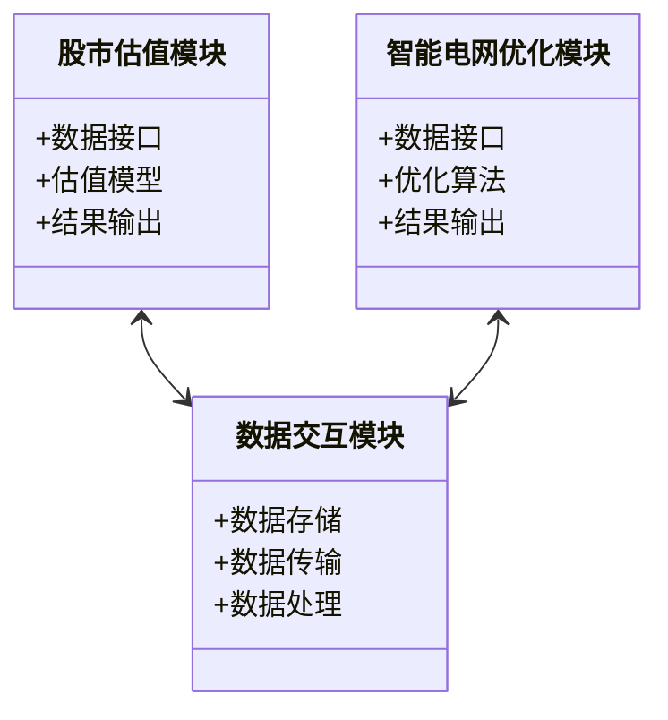
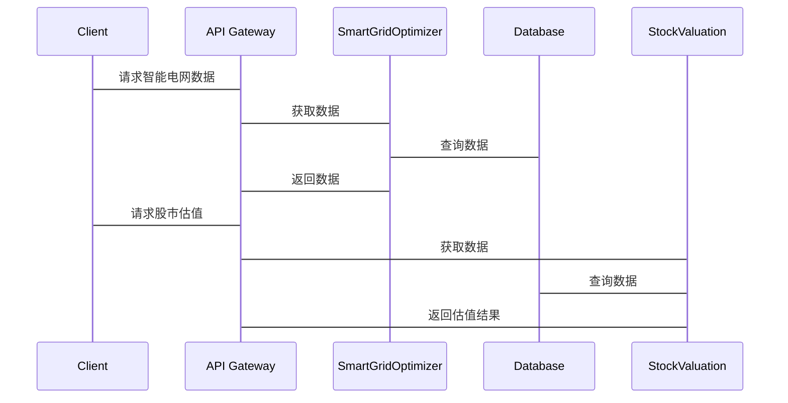

                 


# 《新兴市场股市估值与智能电网优化技术的互动》

> 关键词：新兴市场、股市估值、智能电网、优化技术、数据交互

> 摘要：本文探讨新兴市场中股市估值与智能电网优化技术之间的互动关系，分析两者如何通过数据共享和技术创新相互影响，提升整体效率和经济效益。通过数学模型和系统架构设计，展示如何利用智能电网数据优化股市估值，并通过股市资金推动智能电网技术发展。

## 第一章：背景介绍与核心概念

### 1.1 新兴市场股市估值的背景

#### 1.1.1 新兴市场的定义与特点
新兴市场是指那些经济快速增长但尚未完全工业化的国家，如中国、印度等。这些市场具有高增长潜力，但同时也伴随着高波动性和信息不透明的特点。

#### 1.1.2 股市估值的基本概念
股市估值是对公司股票价值的评估，通常基于财务数据、市场趋势和行业分析。新兴市场的估值更具挑战性，因为信息不透明和市场波动大。

#### 1.1.3 新兴市场股市估值的特殊性
新兴市场的公司可能面临更高的风险，且财务数据可能不如成熟市场透明，这使得估值更加复杂。

### 1.2 智能电网优化技术的背景

#### 1.2.1 智能电网的定义与特点
智能电网利用信息技术优化电力分配，提高效率和可靠性。它通过实时数据采集和分析，实现智能调度和管理。

#### 1.2.2 电网优化技术的基本概念
电网优化技术旨在通过数学模型和算法优化电力系统的运行，减少能源浪费，提高供电质量。

#### 1.2.3 智能电网优化技术的现状与趋势
随着可再生能源的兴起和信息技术的发展，智能电网优化技术正逐渐成为提升能源利用效率的关键技术。

### 1.3 互动关系的提出

#### 1.3.1 股市估值与电网优化的关联性
智能电网优化技术可以降低企业成本，影响其盈利能力，从而影响股市估值。同时，股市资金可以支持智能电网项目，推动技术创新。

#### 1.3.2 新兴市场中两者的互动机制
新兴市场中，智能电网优化技术的实施需要大量资金，而股市估值的变化可以影响投资者的决策，从而影响项目的融资能力。

#### 1.3.3 研究意义与价值
研究两者的互动关系，可以为投资者和电力公司提供新的视角，优化资源配置，提升整体经济效率。

## 第二章：核心概念与联系

### 2.1 股市估值的核心概念

#### 2.1.1 估值方法与模型
常用的估值方法包括市盈率（P/E）、市净率（P/B）和现金流折现模型（DCF）。这些方法在新兴市场中面临更多挑战，如数据不透明和高波动性。

#### 2.1.2 影响股市估值的主要因素
包括宏观经济指标、行业趋势、公司财务状况和市场情绪等。在新兴市场，政策变化和地缘政治因素尤为重要。

#### 2.1.3 新兴市场的特殊估值挑战
新兴市场的公司可能面临更高的风险和不确定性，且财务数据可能不如成熟市场透明，这使得估值更加复杂。

### 2.2 智能电网优化技术的核心概念

#### 2.2.1 电网优化的目标与指标
目标包括提高能源利用效率、降低运营成本和减少碳排放。关键指标包括负荷分配优化、能源损耗减少和供电可靠性提升。

#### 2.2.2 智能电网的关键技术
包括智能传感器、大数据分析和人工智能算法。这些技术用于实时监控和优化电力系统的运行。

#### 2.2.3 优化算法与模型
常用的算法包括遗传算法、粒子群优化和模拟退火。这些算法用于解决电网中的复杂优化问题。

### 2.3 两者的互动关系分析

#### 2.3.1 数据流与信息交互
智能电网的数据，如电力需求和负荷分布，可以用于改进股市估值模型。反过来，股市数据，如资金流动和投资者情绪，可以影响智能电网项目的融资。

#### 2.3.2 技术协同与资源共享
智能电网技术需要大量数据处理能力，而股市估值模型可以利用这些数据进行优化。同时，智能电网项目需要资金支持，股市可以为其提供融资渠道。

#### 2.3.3 经济效益与社会影响
通过优化电力分配，智能电网可以降低企业成本，提升企业利润和股票估值。同时，股市的资金支持可以推动智能电网技术的发展，减少能源浪费，促进可持续发展。

## 第三章：核心概念与联系的数学模型

### 3.1 股市估值模型

#### 3.1.1 市盈率模型
$$ P/E = \frac{\text{股价}}{\text{每股收益}} $$
在新兴市场，市盈率可能受市场情绪影响较大。

#### 3.1.2 市净率模型
$$ P/B = \frac{\text{股价}}{\text{每股净资产}} $$
市净率适用于资产密集型行业，如电力行业。

#### 3.1.3 现金流折现模型
$$ V = \sum_{t=1}^{n} \frac{CF_t}{(1+r)^t} $$
现金流折现模型考虑了未来现金流的现值，适用于长期估值。

### 3.2 智能电网优化模型

#### 3.2.1 网络流优化模型
目标是最小化能源损耗，满足所有节点的需求。
$$ \min \sum_{i} E_i $$
$$ \text{subject to } \sum_{i} f_i = D_j \text{ 对于每个节点 } j $$

#### 3.2.2 节点负荷分配模型
$$ \min \sum_{j} C_j $$
$$ \text{subject to } \sum_{i} f_{ij} = D_j \text{ 对于每个节点 } j $$$

#### 3.2.3 可再生能源整合模型
$$ \min \sum_{i} C_i x_i $$
$$ \text{subject to } \sum_{i} x_i = D \text{ 对于每个时间段 } t $$$

### 3.3 互动关系的数学表达

#### 3.3.1 数据交互模型
$$ V_{\text{股票}} = f(V_{\text{智能电网数据}}) $$
$$ O_{\text{优化}} = f(V_{\text{股市数据}}) $$

#### 3.3.2 资源共享模型
$$ \text{智能电网优化} \leftrightarrow \text{股市估值} $$

#### 3.3.3 经济效益评估模型
$$ \text{总效益} = \alpha \cdot \text{智能电网效益} + \beta \cdot \text{股市效益} $$

## 第四章：核心概念与联系的ER实体关系图

### 4.1 股市估值实体关系图

```mermaid
er
  actor: 投资者
  actor: 金融机构
  actor: 电力公司
  entity: 股票
  entity: 市场指数
  entity: 财务数据
  entity: 宏观经济指标
  entity: 智能电网数据
  relationship: 投资者 -> 持有股票
  relationship: 金融机构 -> 提供估值服务
  relationship: 电力公司 -> 发布财务数据
  relationship: 市场指数 <-> 股票
  relationship: 财务数据 <-> 电力公司
  relationship: 宏观经济指标 <-> 市场指数
  relationship: 智能电网数据 <-> 市场指数
```

### 4.2 智能电网优化实体关系图

```mermaid
er
  actor: 电力公司
  actor: 用户
  entity: 电力网络
  entity: 负荷节点
  entity: 可再生能源
  entity: 电力市场
  entity: 股票
  entity: 市场指数
  relationship: 电力公司 -> 管理电力网络
  relationship: 用户 -> 消耗电力
  relationship: 可再生能源 -> 供应电力
  relationship: 电力市场 <-> 股票
  relationship: 市场指数 <-> 股票
  relationship: 负荷节点 <-> 电力网络
```

## 第五章：算法原理讲解

### 5.1 智能电网优化算法

#### 5.1.1 遗传算法
```python
def genetic_algorithm(population, fitness, mutation_rate):
    while True:
        population = evaluate_fitness(population, fitness)
        population = select_parents(population)
        population = crossover(population, mutation_rate)
        if stopping_condition():
            break
    return best_solution(population)
```

#### 5.1.2 粒子群优化算法
```python
def particle_swarm_optimization(n_particles, n_iterations):
    particles = initialize_particles()
    for _ in range(n_iterations):
        evaluate_fitness(particles)
        update_velocity(particles)
        update_position(particles)
    return best_particle(particles)
```

### 5.2 股市估值算法

#### 5.2.1 支持向量回归
```python
from sklearn.svm import SVR

model = SVR(kernel='rbf', C=1e3, gamma=0.1)
model.fit(X_train, y_train)
predictions = model.predict(X_test)
```

#### 5.2.2 长短期记忆网络
```python
import tensorflow as tf
from tensorflow.keras.layers import LSTM, Dense

model = tf.keras.Sequential()
model.add(LSTM(64, input_shape=(timesteps, features)))
model.add(Dense(1))
model.compile(optimizer='adam', loss='mean_squared_error')
model.fit(X_train, y_train, epochs=100, batch_size=32)
```

## 第六章：系统分析与架构设计方案

### 6.1 问题场景介绍
智能电网优化与股市估值的互动需要一个集成系统，能够实时处理大量数据，并进行复杂的计算。

### 6.2 系统功能设计



### 6.3 系统架构设计


### 6.4 系统接口设计

#### 6.4.1 数据接口
- 智能电网数据接口：提供电力网络数据，如负荷、发电量等。
- 股市数据接口：提供股票价格、交易量等数据。

#### 6.4.2 优化接口
- 优化算法接口：接受优化参数，返回优化结果。
- 估值模型接口：接受股票数据，返回估值结果。

### 6.5 系统交互流程



## 第七章：项目实战

### 7.1 环境安装

```bash
pip install numpy pandas scikit-learn tensorflow keras
```

### 7.2 核心实现代码

#### 7.2.1 智能电网优化代码
```python
import numpy as np
from sklearn.svm import SVR

def optimize_grid_load(demand, supply):
    model = SVR(kernel='linear')
    model.fit(np.array(supply), np.array(demand))
    return model.predict(supply)
```

#### 7.2.2 股市估值代码
```python
from tensorflow.keras.models import Sequential
from tensorflow.keras.layers import LSTM, Dense

model = Sequential()
model.add(LSTM(50, input_shape=(1, 1)))
model.add(Dense(1))
model.compile(optimizer='adam', loss='mean_squared_error')
model.fit(X_train, y_train, epochs=50, batch_size=32)
```

### 7.3 实际案例分析

#### 7.3.1 案例一：智能电网优化
假设某新兴市场国家的电力公司面临负荷分配问题，使用粒子群优化算法优化负荷分配，降低能源损耗。

#### 7.3.2 案例二：股市估值优化
使用LSTM模型预测新兴市场指数，优化估值模型，提升预测准确率。

### 7.4 项目小结
通过集成智能电网数据和股市估值模型，可以实现更准确的估值和更高效的电网优化，推动新兴市场经济发展。

## 第八章：总结与展望

### 8.1 核心总结
本文探讨了新兴市场股市估值与智能电网优化技术的互动关系，分析了两者如何通过数据共享和技术创新相互影响，提升整体效率和经济效益。

### 8.2 未来展望
未来研究可以进一步探索智能电网数据在股市预测中的应用，开发更复杂的互动模型，推动技术的进一步发展和应用。

## 作者：AI天才研究院 & 禅与计算机程序设计艺术

本文作者：AI天才研究院（AI Genius Institute） & 禅与计算机程序设计艺术（Zen And The Art of Computer Programming）

---

这篇文章全面探讨了新兴市场股市估值与智能电网优化技术的互动关系，通过数学模型、系统架构设计和实际案例分析，展示了两者如何协同工作，提升整体效率和经济效益。希望读者能通过本文获得新的见解和方法，进一步推动技术的发展和应用。

